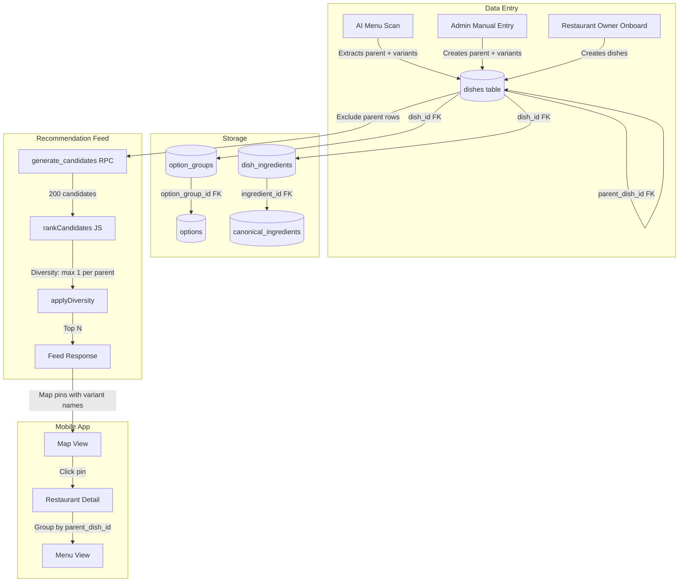
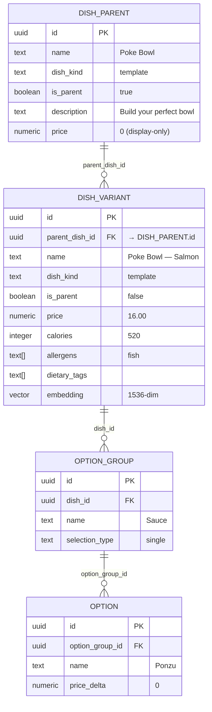

# Detailed Design: Universal Dish Structure

## 1. Overview

The current restaurant/menu/dish/ingredient data model is not universal enough to represent the wide variety of dish patterns found across restaurants (configurable dishes, buffets, combos, build-your-own, etc.). This design introduces a **parent-child variant model** using a primary dimension approach, where the most dietary/taste-significant choice (usually protein) becomes separate dish rows, while secondary choices remain as option_group metadata.

### Core Principle

One unified pattern — **parent + primary-dimension variants** — handles all complex dish types:

| Dish Type | Primary Dimension | Parent | Variants |
|-----------|------------------|--------|----------|
| Standard | None | N/A | N/A (single row) |
| Customizable | None | N/A | Option_groups for add-ons |
| Template/Matrix | Protein/main ingredient | "Poke Bowl" | "— Salmon", "— Tofu", etc. |
| Build-Your-Own | Main protein/base | "Burrito Bowl" | "— Chicken", "— Veggie", etc. |
| Size/Quantity | None | N/A | Size as option_group |
| Combo | Main dish | "Lunch Combo" | "— Chicken Burger", "— Fish Burger" |
| Buffet/Experience | Dietary profile | "Sushi Buffet" | "— Seafood", "— Vegan Options" |
| Group/Family | Same as underlying type | N/A | `serves` field for group filter |

## 2. Detailed Requirements

### 2.1 Dish Structure Requirements

- **R1**: Every dish pattern (standard, customizable, template, build-your-own, combo, experience, etc.) must be representable in a single unified data model.
- **R2**: Configurable dishes must resolve their primary dimension (the choice most affecting dietary/allergen/taste profile) into separate dish rows (variants).
- **R3**: Secondary dimensions (sauce, size, toppings, extras) must remain as option_group metadata on variant rows.
- **R4**: Variants must be grouped under a parent dish via `parent_dish_id` FK for menu display.
- **R5**: Parent dish rows must be display-only containers — excluded from the recommendation feed.
- **R6**: Each variant row must be a full dish with its own price, calories, allergens, dietary_tags, embedding, and protein_families.
- **R7**: The `dish_kind` enum must be expanded to cover all patterns: `'standard' | 'template' | 'experience' | 'combo'`.

### 2.2 Recommendation & Feed Requirements

- **R8**: The feed's `generate_candidates()` must exclude parent dishes (display-only).
- **R9**: Diversity cap must be extended: max 1 variant per `parent_dish_id` in feed results, in addition to existing max 3 per restaurant.
- **R10**: All hard filters (allergens, diet, protein families, religious restrictions) must work correctly at the variant level.
- **R11**: Price filter must use the variant's exact price (not parent's).
- **R12**: Each variant must have its own embedding for preference vector similarity.
- **R13**: Map pin must show variant name and exact price (e.g., "Poke Bowl — Salmon · $16").

### 2.3 Menu & Availability Requirements

- **R14**: Menus must support time-based availability using existing `available_start_time`, `available_end_time`, `available_days` fields.
- **R15**: A new `schedule_type` field on menus must distinguish `'regular' | 'daily' | 'rotating'` for the Daily Menu filter feature.
- **R16**: `generate_candidates()` must filter by menu time availability based on current time.
- **R17**: The mobile app must support a "Daily Menu" filter that shows only dishes from `schedule_type = 'daily'` menus.

### 2.4 Group/Family Meal Requirements

- **R18**: Dishes must have a `serves` integer field (default 1) indicating how many people the dish feeds.
- **R19**: `price_per_person` must be a computed value (price / serves).
- **R20**: A new daily filter "Group / Family Meals" must filter for dishes with `serves >= 2`.
- **R21**: Map pins for group meals must show per-person price: "Family Feast · $45 ($11.25/person)".

### 2.5 Data Entry Requirements

- **R22**: AI menu extraction (GPT-4o Vision) must detect primary dimension patterns (e.g., "choose your protein") and generate parent + variant rows.
- **R23**: Admin UI must support creating parent dishes with variants.
- **R24**: Admin UI must provide "Copy options from another dish" tooling for option_group duplication.
- **R25**: Restaurant owner onboarding must support the new dish kinds without adding complexity for simple restaurants.

## 3. Architecture Overview

### 3.1 Data Flow



### 3.2 Parent-Child Dish Relationship



## 4. Schema Changes

### 4.1 dishes Table — New/Modified Columns

```sql
-- New columns
ALTER TABLE public.dishes
  ADD COLUMN parent_dish_id uuid
    REFERENCES public.dishes(id) ON DELETE CASCADE,
  ADD COLUMN is_parent boolean NOT NULL DEFAULT false,
  ADD COLUMN serves integer NOT NULL DEFAULT 1
    CHECK (serves >= 1),
  ADD COLUMN price_per_person numeric
    GENERATED ALWAYS AS (
      CASE WHEN serves > 0 THEN ROUND(price / serves, 2) ELSE price END
    ) STORED;

-- Expand dish_kind enum
ALTER TABLE public.dishes
  DROP CONSTRAINT dishes_dish_kind_check,
  ADD CONSTRAINT dishes_dish_kind_check
    CHECK (dish_kind = ANY (ARRAY[
      'standard'::text,
      'template'::text,
      'experience'::text,
      'combo'::text
    ]));

-- Index for parent-child lookups
CREATE INDEX idx_dishes_parent_dish_id ON public.dishes(parent_dish_id)
  WHERE parent_dish_id IS NOT NULL;

-- Index for feed: exclude parents quickly
CREATE INDEX idx_dishes_is_parent ON public.dishes(is_parent)
  WHERE is_parent = false;

-- Constraint: parent dishes must have is_parent = true
-- (enforced by application logic, not DB constraint, due to chicken-and-egg on insert)
```

#### Column Semantics

| Column | Type | Default | Purpose |
|--------|------|---------|---------|
| `parent_dish_id` | uuid FK → dishes | NULL | Links variant to its parent. NULL = standalone or parent dish. |
| `is_parent` | boolean | false | true = display-only container, excluded from feed. |
| `serves` | integer | 1 | Number of people this dish feeds. Used for group/family filter. |
| `price_per_person` | numeric | computed | `price / serves`, stored generated column. |

#### Rules

| Dish Role | `parent_dish_id` | `is_parent` | In Feed? | Has Embedding? |
|-----------|-----------------|-------------|----------|----------------|
| Standalone dish | NULL | false | Yes | Yes |
| Parent (display-only) | NULL | true | **No** | No |
| Variant | → parent's id | false | Yes | Yes |

### 4.2 menus Table — New Column

```sql
-- Add schedule type for daily/rotating menu feature
ALTER TABLE public.menus
  ADD COLUMN schedule_type text NOT NULL DEFAULT 'regular'::text
    CHECK (schedule_type = ANY (ARRAY[
      'regular'::text,
      'daily'::text,
      'rotating'::text
    ]));
```

**Note:** The existing `menu_type` field (`'food' | 'drink'`) is a different concern (content type) and remains unchanged. `schedule_type` is about availability pattern.

### 4.3 No Changes Required

| Table | Why unchanged |
|-------|---------------|
| `restaurants` | Structure is fine as-is. `restaurant_type` enum is sufficient. |
| `menu_categories` | No changes needed. Categories organize dishes within menus. |
| `option_groups` | Per-dish duplication as decided. Schema already supports dish_id FK. |
| `options` | No changes needed. |
| `canonical_ingredients` | No changes needed. |
| `ingredient_aliases` | No changes needed. |
| `dish_ingredients` | Works with variants — each variant links to its own ingredients. |
| `dish_categories` | No changes needed. |
| `dish_analytics` | Each variant gets its own analytics row (it's a dish). |

### 4.4 Complete Dish Table After Changes

```sql
CREATE TABLE public.dishes (
  -- Identity
  id uuid NOT NULL DEFAULT uuid_generate_v4(),
  restaurant_id uuid,
  menu_category_id uuid,
  dish_category_id uuid,

  -- Parent-child variant relationship (NEW)
  parent_dish_id uuid REFERENCES public.dishes(id) ON DELETE CASCADE,
  is_parent boolean NOT NULL DEFAULT false,

  -- Core fields
  name text NOT NULL DEFAULT ''::text,
  description text,
  price numeric NOT NULL DEFAULT 0,
  calories integer,
  dietary_tags text[] DEFAULT ARRAY[]::text[],
  allergens text[] DEFAULT ARRAY[]::text[],
  spice_level text DEFAULT 'none'::text,
  image_url text,
  is_available boolean DEFAULT true,

  -- Serving (NEW)
  serves integer NOT NULL DEFAULT 1 CHECK (serves >= 1),
  price_per_person numeric GENERATED ALWAYS AS (
    CASE WHEN serves > 0 THEN ROUND(price / serves, 2) ELSE price END
  ) STORED,

  -- Display
  description_visibility text NOT NULL DEFAULT 'menu'::text,
  ingredients_visibility text NOT NULL DEFAULT 'detail'::text,
  dish_kind text NOT NULL DEFAULT 'standard'::text,  -- EXPANDED: + 'combo'
  display_price_prefix text NOT NULL DEFAULT 'exact'::text,

  -- Enrichment / AI
  enrichment_status text NOT NULL DEFAULT 'none'::text,
  enrichment_source text NOT NULL DEFAULT 'none'::text,
  enrichment_confidence text,
  enrichment_payload jsonb,
  embedding_input text,
  embedding vector(1536),

  -- Derived (trigger-computed)
  protein_families text[] DEFAULT '{}'::text[],
  protein_canonical_names text[] DEFAULT '{}'::text[],

  -- Timestamps
  created_at timestamptz DEFAULT now(),
  updated_at timestamptz DEFAULT now(),

  -- Constraints
  CONSTRAINT dishes_pkey PRIMARY KEY (id),
  CONSTRAINT dishes_parent_dish_id_fkey FOREIGN KEY (parent_dish_id) REFERENCES public.dishes(id) ON DELETE CASCADE,
  CONSTRAINT dishes_restaurant_id_fkey FOREIGN KEY (restaurant_id) REFERENCES public.restaurants(id),
  CONSTRAINT dishes_menu_id_fkey FOREIGN KEY (menu_category_id) REFERENCES public.menu_categories(id),
  CONSTRAINT dishes_dish_category_id_fkey FOREIGN KEY (dish_category_id) REFERENCES public.dish_categories(id),
  CONSTRAINT dishes_dish_kind_check CHECK (dish_kind = ANY (ARRAY['standard','template','experience','combo'])),
  CONSTRAINT dishes_serves_check CHECK (serves >= 1)
);
```

## 5. Components and Interfaces

### 5.1 Updated TypeScript Types (Web Portal)

```typescript
// types/restaurant.ts — updated

export type DishKind = 'standard' | 'template' | 'experience' | 'combo';

export type ScheduleType = 'regular' | 'daily' | 'rotating';

export interface Dish {
  id?: string;
  menu_id?: string;
  dish_category_id?: string | null;

  // Parent-child variant relationship (NEW)
  parent_dish_id?: string | null;
  is_parent?: boolean;

  name: string;
  description?: string;
  price: number;
  calories?: number;
  dietary_tags: string[];
  allergens: string[];
  spice_level?: 'none' | 'mild' | 'hot' | null;
  photo_url?: string;
  is_available?: boolean;

  // Serving (NEW)
  serves?: number;            // default 1
  price_per_person?: number;  // computed: price / serves

  description_visibility?: 'menu' | 'detail';
  ingredients_visibility?: 'menu' | 'detail' | 'none';
  dish_kind?: DishKind;
  display_price_prefix?: DisplayPricePrefix;
  option_groups?: OptionGroup[];
  selectedIngredients?: SelectedIngredient[];

  // UI-only: variant children (for menu display grouping)
  variants?: Dish[];
}

export interface Menu {
  id: string;
  name: string;
  description?: string;
  category?: string;
  menu_type?: 'food' | 'drink';
  schedule_type?: ScheduleType;  // NEW
  is_active: boolean;
  display_order: number;
  available_start_time?: string | null;  // Expose existing fields
  available_end_time?: string | null;
  available_days?: string[] | null;
  dishes: Dish[];
}
```

### 5.2 Updated Mobile Types

```typescript
// lib/supabase.ts — updated compound query shapes

export interface DishWithVariants extends Dish {
  parent_dish: Dish | null;       // If this is a variant, link to parent
  variants: Array<Dish & {        // If this is a parent, its variant children
    option_groups?: OptionGroup[];
  }>;
}

export interface RestaurantWithMenus extends Restaurant {
  menus: Array<
    Menu & {
      menu_categories: Array<
        MenuCategory & {
          dishes: Array<Dish & {
            option_groups?: OptionGroup[];
            variants?: Array<Dish & { option_groups?: OptionGroup[] }>;
          }>;
        }
      >;
    }
  >;
}
```

### 5.3 Feed Request — New Filter Fields

```typescript
// In feed edge function request interface
interface FeedFilters {
  // ... existing filters ...

  // NEW: Daily menu filter
  scheduleType?: 'daily' | 'rotating';  // null = all menus

  // NEW: Group/family meals filter
  groupMeals?: boolean;  // true = serves >= 2

  // NEW: Time-based filtering (auto-populated from client time)
  currentTime?: string;       // HH:MM format
  currentDayOfWeek?: string;  // 'mon' | 'tue' | ... | 'sun'
}
```

## 6. Data Models by Dish Pattern

### 6.1 Standard (Fixed Item)

**Example:** Grilled Salmon — $22

```
dishes:
  { name: "Grilled Salmon", price: 22, dish_kind: "standard",
    is_parent: false, parent_dish_id: null, serves: 1 }
```

No parent, no variants. Existing behavior unchanged.

### 6.2 Template / Build-Your-Own (Primary Dimension = Protein)

**Example:** Poke Bowl — choose protein, sauce, size

```
dishes:
  { name: "Poke Bowl", price: 0, dish_kind: "template",
    is_parent: true, description: "Build your perfect bowl" }

  { name: "Poke Bowl — Salmon", price: 16, dish_kind: "template",
    is_parent: false, parent_dish_id: <parent_id>,
    allergens: ["fish"], dietary_tags: [], protein_families: ["fish"],
    calories: 520 }

  { name: "Poke Bowl — Tofu", price: 12, dish_kind: "template",
    is_parent: false, parent_dish_id: <parent_id>,
    allergens: [], dietary_tags: ["vegan","vegetarian"],
    protein_families: [], calories: 420 }

option_groups (on each variant):
  { name: "Sauce", selection_type: "single",
    options: [{ name: "Ponzu", price_delta: 0 },
              { name: "Spicy Mayo", price_delta: 0 }] }
  { name: "Size", selection_type: "single",
    options: [{ name: "Regular", price_delta: 0 },
              { name: "Large", price_delta: 3 }] }
```

### 6.3 Combo (Primary Dimension = Main Dish)

**Example:** Lunch Combo — pick main + side + drink

```
dishes:
  { name: "Lunch Combo", price: 0, dish_kind: "combo",
    is_parent: true, description: "Main + side + drink" }

  { name: "Lunch Combo — Chicken Burger", price: 12, dish_kind: "combo",
    is_parent: false, parent_dish_id: <parent_id>,
    calories: 950, allergens: [] }

  { name: "Lunch Combo — Fish Burger", price: 13, dish_kind: "combo",
    is_parent: false, parent_dish_id: <parent_id>,
    calories: 880, allergens: ["fish"] }

option_groups (on each variant):
  { name: "Side", selection_type: "single", min_selections: 1,
    options: [{ name: "Fries", price_delta: 0 },
              { name: "Salad", price_delta: 0 }] }
  { name: "Drink", selection_type: "single", min_selections: 1,
    options: [{ name: "Coke", price_delta: 0 },
              { name: "Juice", price_delta: 1 }] }
```

**Note:** Standalone "Chicken Burger · $9" also exists as a separate dish in the "Burgers" category. These are genuinely different products.

### 6.4 Buffet / Experience (Primary Dimension = Dietary Profile)

**Example:** Sushi Buffet — $25/person

```
dishes:
  { name: "Sushi Buffet", price: 0, dish_kind: "experience",
    is_parent: true, description: "All-you-can-eat sushi" }

  { name: "Sushi Buffet — Seafood Selection", price: 25,
    dish_kind: "experience", is_parent: false, parent_dish_id: <parent_id>,
    display_price_prefix: "per_person",
    allergens: ["fish","shellfish"], dietary_tags: ["pescatarian"],
    protein_families: ["fish","shellfish"] }

  { name: "Sushi Buffet — Vegan Options", price: 25,
    dish_kind: "experience", is_parent: false, parent_dish_id: <parent_id>,
    display_price_prefix: "per_person",
    allergens: [], dietary_tags: ["vegan","vegetarian"],
    protein_families: [] }
```

### 6.5 Group / Family Meal

**Example:** Family Feast (serves 4) — $45

```
dishes:
  { name: "Family Feast", price: 45, dish_kind: "standard",
    is_parent: false, serves: 4,
    description: "4 tacos + rice + beans + salsa" }
    -- price_per_person auto-computed: 11.25
```

If configurable (pick mains), uses combo pattern with `serves` on each variant.

### 6.6 Size-Only Variant

**Example:** Pizza Margherita — S/M/L

```
dishes:
  { name: "Pizza Margherita", price: 12, dish_kind: "standard",
    is_parent: false, display_price_prefix: "from" }

option_groups:
  { name: "Size", selection_type: "single", min_selections: 1,
    options: [{ name: "Small", price_delta: 0 },
              { name: "Medium", price_delta: 3 },
              { name: "Large", price_delta: 6 }] }
```

No parent/variant — size doesn't change dietary profile. Single row with `display_price_prefix: 'from'`.

### 6.7 Daily Menu

```
menus:
  { name: "Daily Specials", menu_type: "food", schedule_type: "daily",
    available_start_time: "11:00", available_end_time: "15:00",
    available_days: ["mon","tue","wed","thu","fri"] }
```

Dishes under this menu are standard dish rows. The `schedule_type: 'daily'` enables the Daily Menu filter.

## 7. Feed / Recommendation Changes

### 7.1 generate_candidates() — Updated SQL

Key changes to the existing RPC:

```sql
-- Add to WHERE clause:

-- Exclude parent dishes (display-only)
AND d.is_parent = false

-- Time-based menu availability (new)
AND (
  m.available_start_time IS NULL
  OR (
    p_current_time >= m.available_start_time
    AND p_current_time <= m.available_end_time
  )
)
AND (
  m.available_days IS NULL
  OR p_current_day = ANY(m.available_days)
)

-- Daily menu filter (new)
AND (
  p_schedule_type IS NULL
  OR m.schedule_type = p_schedule_type
)

-- Group meals filter (new)
AND (
  p_group_meals IS NULL
  OR (p_group_meals = true AND d.serves >= 2)
)
```

New parameters:
```sql
p_current_time TIME DEFAULT NULL,
p_current_day TEXT DEFAULT NULL,
p_schedule_type TEXT DEFAULT NULL,
p_group_meals BOOLEAN DEFAULT NULL
```

### 7.2 applyDiversity() — Updated JS

```typescript
function applyDiversity(
  dishes: Candidate[],
  maxPerRestaurant: number,    // existing: 3
  maxPerParentDish: number     // NEW: 1
): Candidate[] {
  const restaurantCount: Record<string, number> = {};
  const parentDishCount: Record<string, number> = {};
  const result: Candidate[] = [];

  for (const dish of dishes) {
    const rId = dish.restaurant_id;
    const pId = dish.parent_dish_id ?? dish.id; // standalone dishes use own id

    restaurantCount[rId] = (restaurantCount[rId] ?? 0) + 1;
    if (restaurantCount[rId] > maxPerRestaurant) continue;

    // Only apply parent cap for actual variants (has parent_dish_id)
    if (dish.parent_dish_id) {
      parentDishCount[pId] = (parentDishCount[pId] ?? 0) + 1;
      if (parentDishCount[pId] > maxPerParentDish) continue;
    }

    result.push(dish);
  }
  return result;
}
```

### 7.3 Map Pin Display

```typescript
function formatPinLabel(dish: Candidate): { label: string; price: string } {
  const label = dish.name; // Already includes variant: "Poke Bowl — Salmon"

  let price: string;
  if (dish.serves > 1) {
    // Group meal: show total + per-person
    price = `$${dish.price} ($${dish.price_per_person}/person)`;
  } else if (dish.display_price_prefix === 'per_person') {
    price = `$${dish.price}/person`;
  } else if (dish.display_price_prefix === 'from') {
    price = `from $${dish.price}`;
  } else {
    price = `$${dish.price}`;
  }

  return { label, price };
}
```

### 7.4 Embedding Input for Variants

The existing `buildEmbeddingInput()` function in `enrich-dish` already concatenates dish name + description + ingredients + option names. For variants:

- **"Poke Bowl — Salmon"** → embedding input: `"Poke Bowl — Salmon; template; salmon, rice, nori; Ponzu, Soy, Spicy Mayo, Regular, Large"`
- **"Poke Bowl — Tofu"** → embedding input: `"Poke Bowl — Tofu; template; tofu, rice, nori; Ponzu, Soy, Spicy Mayo, Regular, Large"`

These produce meaningfully different embeddings because the dish name and ingredients differ.

**Parent dishes (`is_parent: true`) should be skipped** by the enrichment pipeline — they don't need embeddings.

## 8. Mobile App — Menu View

### 8.1 Restaurant Detail Query

```typescript
// Updated query to load parent-child structure
const { data } = await supabase
  .from('restaurants')
  .select(`
    *,
    menus (
      *, 
      menu_categories (
        *,
        dishes (
          *,
          option_groups ( *, options (*) )
        )
      )
    )
  `)
  .eq('id', restaurantId)
  .single();
```

The query stays the same — it loads all dishes including parents and variants. The **grouping happens client-side**.

### 8.2 Client-Side Grouping Logic

```typescript
function groupDishesForDisplay(dishes: Dish[]): DisplayDish[] {
  const parentMap = new Map<string, Dish>();
  const variantMap = new Map<string, Dish[]>();
  const standalone: Dish[] = [];

  for (const dish of dishes) {
    if (dish.is_parent) {
      parentMap.set(dish.id, dish);
      if (!variantMap.has(dish.id)) variantMap.set(dish.id, []);
    } else if (dish.parent_dish_id) {
      const variants = variantMap.get(dish.parent_dish_id) ?? [];
      variants.push(dish);
      variantMap.set(dish.parent_dish_id, variants);
    } else {
      standalone.push(dish);
    }
  }

  const result: DisplayDish[] = [];

  // Add standalone dishes
  for (const dish of standalone) {
    result.push({ type: 'standalone', dish });
  }

  // Add parent + variants groups
  for (const [parentId, parent] of parentMap) {
    const variants = variantMap.get(parentId) ?? [];
    result.push({
      type: 'group',
      parent,
      variants: variants.sort((a, b) => a.price - b.price),
    });
  }

  return result;
}
```

### 8.3 Menu View Rendering

```
── Bowls ─────────────────────────────────
  Poke Bowl                               ← parent (header)
  "Build your perfect bowl"
    Salmon .................... $16        ← variant
    Tuna ...................... $14        ← variant
    Chicken ................... $13        ← variant
    Tofu ...................... $12        ← variant
      Sauce: Ponzu | Soy | Spicy Mayo    ← option_group
      Size: Regular | Large (+$3)        ← option_group

  Açaí Bowl .................. $11        ← standalone

── Combo Meals ───────────────────────────
  Lunch Combo                             ← parent
  "Main + side + drink"
    Chicken Burger ............ $12       ← variant
    Fish Burger ............... $13       ← variant
    Veggie Burger ............. $11       ← variant
      Side: Fries | Salad | Soup         ← option_group
      Drink: Coke | Sprite | Water       ← option_group

── Family Meals ──────────────────────────
  Family Feast (serves 4) .... $45       ← standalone, serves > 1
    $11.25/person
    Includes: 4 tacos + rice + beans
```

## 9. Data Entry Flows

### 9.1 AI Menu Extraction — Updated GPT Prompt

The system prompt for menu-scan must be updated to detect primary dimension patterns:

```
When you encounter dishes with selectable options (e.g., "Choose your protein:", 
"Pick your base:", "Available in: Chicken / Beef / Veggie"):

1. Identify the PRIMARY DIMENSION — the choice that most changes the dish 
   (usually protein or main ingredient).
2. Output a PARENT dish with is_parent: true and price: 0.
3. Output VARIANT dishes for each primary dimension option, each with:
   - name: "{Parent Name} — {Option}" (e.g., "Poke Bowl — Salmon")
   - parent_dish_id: reference to parent
   - price: variant-specific price
   - raw_ingredients: ingredients specific to this variant
4. Secondary choices (sauce, size, toppings) go as option_groups on each variant.
5. For combo meals, the primary dimension is the main dish choice.
6. For buffets, create 2-3 variants by dietary profile (seafood, meat, vegan).
```

### 9.2 Admin UI — Parent + Variant Creation

The admin panel's dish creation form needs a mode selector:

1. **Standard dish** — current form, unchanged
2. **Dish with variants** — creates parent + N variant rows:
   - Enter parent name, description, dish_kind
   - Add variants: name suffix, price, calories
   - Shared option_groups created on each variant (with "Copy options" button)
3. **Combo** — same as variant form but with `dish_kind: 'combo'`

### 9.3 Restaurant Owner Onboarding

For simple restaurants (90%+ of cases), the flow is unchanged — they create standard dishes. The variant/combo/experience patterns are advanced features accessible to admins and AI extraction.

## 10. Migration Strategy

### 10.1 Schema Migration

```sql
-- Migration: add_universal_dish_structure

-- 1. Add new columns
ALTER TABLE public.dishes
  ADD COLUMN IF NOT EXISTS parent_dish_id uuid,
  ADD COLUMN IF NOT EXISTS is_parent boolean NOT NULL DEFAULT false,
  ADD COLUMN IF NOT EXISTS serves integer NOT NULL DEFAULT 1;

-- 2. Add generated column
ALTER TABLE public.dishes
  ADD COLUMN IF NOT EXISTS price_per_person numeric
    GENERATED ALWAYS AS (
      CASE WHEN serves > 0 THEN ROUND(price / serves, 2) ELSE price END
    ) STORED;

-- 3. Add FK constraint
ALTER TABLE public.dishes
  ADD CONSTRAINT dishes_parent_dish_id_fkey
    FOREIGN KEY (parent_dish_id) REFERENCES public.dishes(id) ON DELETE CASCADE;

-- 4. Expand dish_kind check
ALTER TABLE public.dishes
  DROP CONSTRAINT IF EXISTS dishes_dish_kind_check,
  ADD CONSTRAINT dishes_dish_kind_check
    CHECK (dish_kind = ANY (ARRAY['standard','template','experience','combo']));

-- 5. Add serves check
ALTER TABLE public.dishes
  ADD CONSTRAINT dishes_serves_check CHECK (serves >= 1);

-- 6. Add indexes
CREATE INDEX IF NOT EXISTS idx_dishes_parent_dish_id
  ON public.dishes(parent_dish_id) WHERE parent_dish_id IS NOT NULL;
CREATE INDEX IF NOT EXISTS idx_dishes_is_parent
  ON public.dishes(is_parent) WHERE is_parent = false;

-- 7. Add schedule_type to menus
ALTER TABLE public.menus
  ADD COLUMN IF NOT EXISTS schedule_type text NOT NULL DEFAULT 'regular'::text;
ALTER TABLE public.menus
  ADD CONSTRAINT menus_schedule_type_check
    CHECK (schedule_type = ANY (ARRAY['regular','daily','rotating']));

-- 8. Update generate_candidates() function
-- (see Section 7.1 for full updated SQL)
```

### 10.2 Data Migration

Existing data is **fully compatible** — no data migration needed:
- All current dishes get `parent_dish_id: NULL, is_parent: false, serves: 1` by default
- These defaults mean every existing dish is a standalone dish (current behavior)
- Existing `dish_kind` values ('standard', 'template', 'experience') remain valid
- New patterns only apply to newly created dishes

### 10.3 Type Regeneration

After migration:
```bash
supabase gen types typescript --project-id <id> > packages/database/src/types.ts
```

This auto-updates the `Tables<'dishes'>` type with new columns.

## 11. Error Handling

| Scenario | Handling |
|----------|----------|
| Parent dish with no variants | Warn admin during creation. Parent without variants is hidden from feed and useless in menu view. |
| Variant without parent | Application prevents this. If `parent_dish_id` references a non-parent dish, display as standalone. |
| Circular parent reference | FK constraint prevents (dish can't be its own parent). Multi-level nesting not supported (variant of a variant). |
| `is_parent: true` in feed | `generate_candidates()` WHERE clause excludes. Defensive check in `rankCandidates()` as fallback. |
| Parent deleted | `ON DELETE CASCADE` removes all variants. Admin UI warns before deletion. |
| Serves = 0 | CHECK constraint `serves >= 1` prevents. |
| Variant with different `dish_kind` than parent | Application enforces consistency during creation. Not a DB constraint to allow flexibility. |

## 12. Testing Strategy

### 12.1 Database Tests
- Migration applies cleanly on empty DB and on DB with existing data
- `parent_dish_id` FK constraint works (cascade delete, null for standalone)
- `is_parent` filter correctly excludes parents from feed queries
- `serves` CHECK constraint rejects 0 and negative values
- `price_per_person` generated column computes correctly
- `schedule_type` CHECK constraint works
- `generate_candidates()` with new parameters returns correct results

### 12.2 Feed / Recommendation Tests
- Parent dishes never appear in feed results
- Variants appear with correct price, allergens, dietary_tags
- Diversity cap: max 1 variant per parent_dish_id
- Time-based filtering: dishes from inactive menus excluded
- Daily menu filter: only `schedule_type = 'daily'` dishes returned
- Group meals filter: only `serves >= 2` dishes returned
- Price filter uses variant price (not parent price)
- All existing filters (allergens, diet, protein, spice) work on variants

### 12.3 Mobile App Tests
- Menu view groups dishes by parent_dish_id correctly
- Standalone dishes display normally
- Parent + variants display as grouped entries
- Price per person shown for serves > 1
- Option groups display on variants (sauce, size)
- Map pin shows variant name and price

### 12.4 Data Entry Tests
- AI menu scan detects "choose your protein" and creates parent + variants
- Admin can create parent dish with variants
- Admin can add/remove variants from existing parent
- "Copy options" copies option_groups between dishes
- Deleting parent cascades to variants
- Embedding pipeline skips parent dishes
- Each variant gets its own embedding

## 13. Appendices

### A. Technology Choices

| Decision | Choice | Rationale |
|----------|--------|-----------|
| Variant storage | Separate dish rows | Enables per-variant filtering, pricing, embeddings, recommendation |
| Parent-child link | `parent_dish_id` FK on same table | Simple self-referential FK, no new tables |
| Price per person | Generated stored column | Always consistent, no manual maintenance, queryable |
| Menu schedule type | Separate field from menu_type | `menu_type` (food/drink) and `schedule_type` (regular/daily/rotating) are orthogonal concerns |
| Diversity cap | JS-level in applyDiversity() | Existing pattern, easy to add parent-level cap |

### B. Research Findings Summary

| Topic | Key Finding | Impact on Design |
|-------|-------------|-----------------|
| Variant explosion | Full cartesian = 3.7x rows, unsustainable. Primary dimension = 1.56x, manageable. | Primary dimension approach chosen |
| Buffet allergen problem | Single-row buffet breaks all allergy filters | Buffet uses dietary-profile variants |
| Combo price filtering | Combo must be its own entity for price filter to surface deals | Combo = parent + main-dish variants |
| Shared option_groups | 6% storage savings not worth model complexity | Per-dish duplication + copy UI |
| Time availability | `menus` table already has time fields | No schema change needed, just use in feed query |
| Group meals | `serves` integer is sufficient | Dropped `serving_style` to minimize restaurant owner complexity |

### C. Alternative Approaches Considered

1. **Separate `dish_variants` table** — Rejected: adds a join, duplicates dish columns, harder to query. Self-referential FK on dishes is simpler.
2. **JSONB variants column on parent** — Rejected: can't query/filter/embed individual variants. Breaks the recommendation engine.
3. **Graph-based dish composition** — Rejected: over-engineered for this use case. Parent-child is sufficient depth.
4. **Full cartesian variant expansion** — Rejected: 3.7x row explosion, near-duplicate embeddings, diversity cap breaks.
5. **Dietary-significant merging** — Rejected: "Poke Bowl — Fish" is vague, complex logic, marginal savings.

### D. Primary Dimension Guidelines by Dish Kind

| dish_kind | Primary Dimension | How to Identify | Example |
|-----------|------------------|-----------------|---------|
| template | Protein / main ingredient | The choice that changes allergens and dietary tags most | Poke Bowl → protein |
| combo | Main dish in the bundle | The choice that defines what you're eating | Lunch Combo → burger type |
| experience | Dietary profile of what you'd eat | Group available items by dietary category | Sushi Buffet → seafood / meat / vegan |
| standard | None (no variants) | Single fixed dish | Steak |

For ambiguous cases (no clear primary dimension):
1. Pick the choice that most changes allergens/dietary tags
2. If tied, pick the choice that most changes flavor/taste profile
3. If still unclear, treat as standard dish with option_groups only
