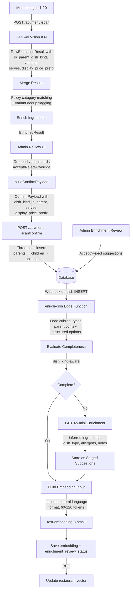

# Detailed Design: Menu Ingestion & Enrichment Improvements

## 1. Overview

This initiative improves the restaurant menu scanning, dish pattern detection, and enrichment pipeline. The primary goal is enabling the menu-scan flow to create template, combo, and experience dishes (not just standard), while also improving embedding quality, merge logic, completeness evaluation, and AI suggestion utilization.

**Core problem:** GPT-4o Vision already extracts `is_parent`, `dish_kind`, and `variants[]` from menu images, but this data is silently discarded because TypeScript types throughout the pipeline omit these fields. The DB schema (migration 073) fully supports parent-child variants, but no UI can manage them.

**Approach:** Wire existing extraction data through the full pipeline, overhaul the GPT prompt to cover all dish patterns, add a hybrid review UI (AI proposes, admin confirms/overrides), improve enrichment embedding quality, and add staged AI suggestion approval.

---

## 2. Detailed Requirements

### 2.1 Pipeline Wiring (Deliverable 1)
- Add `is_parent`, `dish_kind`, `variants[]`, `serves`, `display_price_prefix` to all TypeScript types: `RawExtractedDish`, `EnrichedDish`, `EditableDish`, `ConfirmDish`
- Preserve these fields through merge → enrich → review → confirm → DB
- No field should be silently dropped at any stage

### 2.2 GPT-4o Vision Prompt Overhaul (Deliverable 2)
- Switch from `json_object` to Structured Outputs (`json_schema` with `strict: true`)
- Move JSON schema from prompt text to `response_format` parameter
- Add pattern detection as a prioritized decision tree covering all universal dish patterns
- Extract new fields: `serves` (integer), `display_price_prefix` (enum)
- Add 2-3 few-shot examples (standard dish, template with variants, combo)
- Add multi-page context note to prompt
- Keep "if unsure, default to standard" fallback

### 2.3 Multi-Page Merge Improvements (Deliverable 3)
- Implement 3-layer fuzzy category matching: normalization → synonym map → string similarity
- Flag duplicate dish names with different prices as potential variants (not silently dropped)
- Assign page-indexed placeholders for null categories instead of merging all nulls
- Preserve `is_parent`, `dish_kind`, `variants` through merge

### 2.4 Menu-Scan Review UI (Deliverable 4)
- Display AI-proposed variant groups as indented card clusters
- Accept/Reject/Edit button trio per group with keyboard shortcuts (A/R/E)
- Batch toolbar: "Accept all high-confidence", multi-select, filters
- dish_kind dropdown per dish for overrides
- "Ungroup" button to break apart wrong groupings
- "Group as variants" multi-select for manually grouping dishes AI missed
- Progressive disclosure for AI reasoning
- Show original menu image alongside extracted data
- Confidence badge per group/dish

### 2.5 Confirm Endpoint Update (Deliverable 5)
- Accept `dish_kind`, `is_parent`, `parent_dish_id`, `serves`, `display_price_prefix` in ConfirmPayload
- Insert parent dishes first, then children with `parent_dish_id`
- Leverage existing `restaurantService.ts` three-pass insertion logic

### 2.6 Enrichment: Better Embeddings (Deliverable 6)
- Increase description from 120 to 300 chars
- Switch to labeled natural-language format:
  ```
  {name}. {inferred_dish_type}, {cuisine_types}.
  {description (300 chars)}.
  Ingredients: {allIngredients}.
  Options: {structured option groups} (if template/experience).
  ```
- Load restaurant `cuisine_types` and include in embedding input
- For child variants: fetch parent name + ingredients, prepend to embedding
- Include `enrichment_payload.notes` in embedding input when available
- Target 60-120 tokens per dish

### 2.7 Enrichment: Smarter Completeness (Deliverable 7)
- Replace hardcoded threshold with weighted scoring:
  - `complete`: ≥3 ingredients, OR description ≥100 chars + ≥1 ingredient
  - Template/experience dishes: `complete` if ≥3 option names exist (regardless of ingredient count)
  - `partial`: 1-2 ingredients, or description only, or options only
  - `sparse`: no ingredients, no description, no options
- dish_kind-aware: template completeness comes from option groups, not ingredients

### 2.8 Enrichment: Staged AI Suggestions (Deliverable 8)
- Extend `enrichment_payload` to include `inferred_dish_category`, `inferred_allergens`
- Add `enrichment_review_status` column: `'pending_review'` | `'accepted'` | `'rejected'` | `null`
- Admin UI surface (separate from menu-scan review): list dishes with pending suggestions
- Accept → write inferred ingredients to `dish_ingredients`, recompute allergens, assign `dish_category_id`
- Reject → mark as `'rejected'`, don't re-suggest

### 2.9 Add 'combo' to DISH_KINDS (Deliverable 9)
- Add combo entry to `DISH_KINDS` array in `constants.ts`
- Ensure all UI dropdowns that use this array show combo as an option

### 2.10 Onboarding Minor Additions (Deliverable 10)
- Add `serves` number input to DishFormDialog
- Add `display_price_prefix` dropdown to DishFormDialog
- Wire through to `submitRestaurantProfile()` and DB

### 2.11 Expand DIETARY_HINT_MAP (Deliverable 11)
- Add emoji variants: 🌿 (vegetarian), 🌱 (vegan), 🅥/Ⓥ
- Add regional spellings: "Végétarien", "Végétalien", "Senza glutine", "Sin lácteos"
- Add common abbreviations: "egg-free", "soy-free", "soyfree", "eggfree", "paleo", "keto", "low-sodium"
- Handle punctuation variants: "GF*", "(V)", "[VG]", "V."
- Normalize input before lookup: strip brackets, asterisks, periods

---

## 3. Architecture Overview



### Key Architecture Changes

| Component | Current | New |
|-----------|---------|-----|
| GPT-4o Vision | `json_object` mode, schema in prompt | Structured Outputs (`json_schema`, `strict: true`) |
| Type pipeline | Fields missing from 5 interfaces | All interfaces include dish pattern fields |
| Merge | Exact category name match, drop duplicates | 3-layer fuzzy match, flag variants |
| Review UI | Flat dish list, no grouping | Indented card clusters with accept/reject/edit |
| Confirm | Flat dish insert, no dish_kind | Three-pass insert (parents → children → options) |
| Embedding input | Semicolons, 120 chars, ~20-40 tokens | Labeled NL, 300 chars, 60-120 tokens |
| Completeness | Hardcoded ≥3 ingredients | Weighted by dish_kind + description + options |
| AI suggestions | Stored but unused | Staged for admin review with accept/reject UI |

---

## 4. Components and Interfaces

### 4.1 Updated TypeScript Types

#### `RawExtractedDish` (menu-scan.ts)
```typescript
export interface RawExtractedDish {
  name: string;
  price: number | null;
  description: string | null;
  raw_ingredients: string[] | null;
  dietary_hints: string[];
  spice_level: 0 | 1 | 3 | null;
  calories: number | null;
  confidence: number;
  // NEW fields
  is_parent: boolean;
  dish_kind: 'standard' | 'template' | 'combo' | 'experience';
  serves: number | null;
  display_price_prefix: 'exact' | 'from' | 'per_person' | 'market_price' | 'ask_server';
  variants: RawExtractedDish[] | null;
}
```

#### `EnrichedDish` (menu-scan.ts)
```typescript
export interface EnrichedDish extends RawExtractedDish {
  matched_ingredients: MatchedIngredient[];
  mapped_dietary_tags: string[];
  // variants inherited from RawExtractedDish, enriched recursively
}
```

#### `EditableDish` (menu-scan.ts)
```typescript
export interface EditableDish {
  _id: string;
  name: string;
  price: string;
  description: string;
  dietary_tags: string[];
  spice_level: 'none' | 'mild' | 'hot' | null;
  calories: number | null;
  dish_category_id: string | null;
  confidence: number;
  ingredients: EditableIngredient[];
  suggested_allergens?: string[];
  // NEW fields
  dish_kind: 'standard' | 'template' | 'combo' | 'experience';
  is_parent: boolean;
  serves: number | null;
  display_price_prefix: 'exact' | 'from' | 'per_person' | 'market_price' | 'ask_server';
  variant_ids: string[];        // _ids of child dishes in same category
  parent_id: string | null;     // _id of parent dish (for UI grouping)
  group_status: 'ai_proposed' | 'accepted' | 'rejected' | 'manual';
}
```

#### `ConfirmDish` (menu-scan.ts)
```typescript
export interface ConfirmDish {
  name: string;
  price: number;
  description?: string;
  dietary_tags: string[];
  spice_level?: 'none' | 'mild' | 'hot' | null;
  calories?: number | null;
  dish_category_id?: string | null;
  canonical_ingredient_ids: string[];
  option_groups?: ConfirmOptionGroup[];
  // NEW fields
  dish_kind: 'standard' | 'template' | 'combo' | 'experience';
  is_parent: boolean;
  serves: number;
  display_price_prefix: 'exact' | 'from' | 'per_person' | 'market_price' | 'ask_server';
  variant_dishes?: ConfirmDish[];  // nested children for parent dishes
}
```

### 4.2 GPT-4o Vision Schema (Zod)

```typescript
import { z } from 'zod';

const DishSchema: z.ZodType = z.object({
  name: z.string(),
  price: z.number().nullable(),
  description: z.string().nullable(),
  raw_ingredients: z.array(z.string()).nullable(),
  dietary_hints: z.array(z.string()),
  spice_level: z.union([z.literal(0), z.literal(1), z.literal(3), z.null()]),
  calories: z.number().nullable(),
  confidence: z.number(),
  is_parent: z.boolean(),
  dish_kind: z.enum(['standard', 'template', 'combo', 'experience']),
  serves: z.number().nullable(),
  display_price_prefix: z.enum(['exact', 'from', 'per_person', 'market_price', 'ask_server']),
  variants: z.array(z.lazy(() => DishSchema)).nullable(),
});

const MenuExtractionSchema = z.object({
  menus: z.array(z.object({
    name: z.string().nullable(),
    menu_type: z.enum(['food', 'drink']),
    categories: z.array(z.object({
      name: z.string().nullable(),
      dishes: z.array(DishSchema),
    })),
  })),
});
```

### 4.3 Merge Function Updates

```typescript
// New: 3-layer category matching
function matchCategory(
  incoming: string | null,
  existing: string[],
  pageIndex: number
): { matched: string | null; isNew: boolean } {
  const normalized = normalizeCategory(incoming);

  // Layer 1: Exact normalized match
  const exactMatch = existing.find(e => normalizeCategory(e) === normalized);
  if (exactMatch) return { matched: exactMatch, isNew: false };

  // Layer 2: Synonym map
  const canonical = CATEGORY_SYNONYMS[normalized];
  if (canonical) {
    const synMatch = existing.find(e =>
      CATEGORY_SYNONYMS[normalizeCategory(e)] === canonical
    );
    if (synMatch) return { matched: synMatch, isNew: false };
  }

  // Layer 3: String similarity (Jaro-Winkler > 0.85)
  const bestMatch = findBestMatch(normalized, existing.map(normalizeCategory));
  if (bestMatch.score > 0.85) {
    return { matched: existing[bestMatch.index], isNew: false };
  }

  // Null handling: page-indexed placeholder
  if (!incoming) {
    return { matched: `Uncategorized (page ${pageIndex + 1})`, isNew: true };
  }

  return { matched: incoming, isNew: true };
}

// New: Variant detection on duplicate names
function handleDuplicateDish(
  existing: RawExtractedDish,
  incoming: RawExtractedDish
): 'skip' | 'flag_variant' {
  if (existing.price !== incoming.price && existing.price != null && incoming.price != null) {
    return 'flag_variant'; // Different prices → potential size/variant
  }
  return 'skip'; // Same price → true duplicate
}
```

### 4.4 Review UI Component Structure

```
MenuScanPage (existing, modified)
├── BatchToolbar (NEW)
│   ├── "Accept all high-confidence" button
│   ├── "Accept selected" / "Reject selected"
│   ├── Filter: by confidence, dish_kind, has_grouping
│   └── Progress counter: "14 of 37 groups reviewed"
│
├── MenuPanel (existing, modified per menu)
│   └── CategorySection (existing, modified per category)
│       ├── DishGroupCard (NEW — for parent + variants)
│       │   ├── ParentDishHeader
│       │   │   ├── dish_kind badge
│       │   │   ├── confidence badge
│       │   │   └── Accept / Reject / Edit buttons (A/R/E keys)
│       │   ├── VariantDishRow[] (indented, left-border)
│       │   │   └── name, price, dietary tags, ingredients
│       │   └── GroupEditMode (expanded on Edit click)
│       │       ├── Drag-and-drop reorder variants
│       │       ├── Ungroup checkbox per variant
│       │       ├── dish_kind dropdown
│       │       ├── "Add dish to group" typeahead
│       │       └── Save / Cancel
│       │
│       ├── StandaloneDishCard (existing, modified)
│       │   ├── dish_kind dropdown (NEW)
│       │   ├── serves input (NEW)
│       │   ├── display_price_prefix dropdown (NEW)
│       │   └── "Group as variant of..." typeahead (NEW)
│       │
│       └── FlaggedDuplicateCard (NEW — from merge variant detection)
│           ├── "Same name, different price — potential variants?"
│           └── "Group together" / "Keep separate" buttons
```

### 4.5 Confirm Endpoint Changes

```typescript
// confirm/route.ts — Updated insertion logic

// Phase 1: Separate parents from standalone + child dishes
const parentDishes = allDishes.filter(d => d.is_parent);
const childDishes = allDishes.filter(d => !d.is_parent && d.variant_dishes === undefined);

// Phase 2: Insert parents first
const parentInserts = parentDishes.map(d => ({
  ...baseDishFields(d),
  is_parent: true,
  dish_kind: d.dish_kind,
  serves: d.serves,
  display_price_prefix: d.display_price_prefix,
  price: 0, // display-only
}));
const insertedParents = await supabase.from('dishes').insert(parentInserts).select('id');

// Phase 3: Insert children with parent_dish_id
for (let i = 0; i < parentDishes.length; i++) {
  const parentId = insertedParents[i].id;
  const variants = parentDishes[i].variant_dishes ?? [];
  const variantInserts = variants.map(v => ({
    ...baseDishFields(v),
    parent_dish_id: parentId,
    is_parent: false,
    dish_kind: v.dish_kind,
    serves: v.serves,
    display_price_prefix: v.display_price_prefix,
  }));
  await supabase.from('dishes').insert(variantInserts);
}

// Phase 4: Insert standalone dishes (no parent, not a parent)
// Phase 5: Insert ingredients, option groups as before
```

### 4.6 Enrichment Changes

#### Updated `buildEmbeddingInput`
```typescript
function buildEmbeddingInput(params: {
  name: string;
  description: string | null;
  dishKind: string;
  ingredientNames: string[];
  optionGroups: { groupName: string; optionNames: string[] }[]; // structured
  enrichmentPayload: EnrichmentPayload | null;
  completeness: Completeness;
  cuisineTypes: string[];       // NEW: from restaurant
  parentName: string | null;    // NEW: for child variants
  parentIngredients: string[];  // NEW: for child variants
}): string {
  const parts: string[] = [];

  // Parent context for variants
  if (parentName) {
    parts.push(`${parentName} — ${name}`);
  } else {
    parts.push(name);
  }

  // Dish type + cuisine
  const dishType = enrichmentPayload?.inferred_dish_type ?? (dishKind !== 'standard' ? dishKind : null);
  const cuisineStr = cuisineTypes.length > 0 ? cuisineTypes.join(', ') : null;
  if (dishType || cuisineStr) {
    parts.push([dishType, cuisineStr].filter(Boolean).join(', '));
  }

  // Description (300 chars, up from 120)
  if (description) parts.push(description.slice(0, 300));

  // AI notes (cuisine/preparation context)
  if (enrichmentPayload?.notes) parts.push(enrichmentPayload.notes);

  // Ingredients (DB + parent + AI supplemental)
  const allIngredients = [
    ...parentIngredients,
    ...ingredientNames,
    ...(completeness !== 'complete'
      ? (enrichmentPayload?.inferred_ingredients ?? []).slice(0, Math.max(0, 3 - ingredientNames.length))
      : []),
  ];
  if (allIngredients.length > 0) parts.push(`Ingredients: ${allIngredients.join(', ')}`);

  // Structured options (grouped, not flat)
  if (optionGroups.length > 0) {
    const optStr = optionGroups
      .slice(0, 5) // max 5 groups
      .map(g => `${g.groupName}: ${g.optionNames.slice(0, 8).join(', ')}`)
      .join('. ');
    parts.push(optStr);
  }

  return parts.join('. ');
}
```

#### Updated `evaluateCompleteness`
```typescript
function evaluateCompleteness(
  ingredientNames: string[],
  hasDescription: boolean,
  descriptionLength: number,
  dishKind: string,
  optionCount: number,
): Completeness {
  // Template/experience: completeness comes from options, not ingredients
  if ((dishKind === 'template' || dishKind === 'experience') && optionCount >= 3) {
    return 'complete';
  }

  // Combo: complete if parent has children (handled by caller skipping parents)
  if (dishKind === 'combo' && optionCount >= 2) {
    return 'complete';
  }

  // Standard: ingredient-based with description boost
  if (ingredientNames.length >= 3) return 'complete';
  if (ingredientNames.length >= 1 && descriptionLength >= 100) return 'complete';
  if (ingredientNames.length > 0 || hasDescription) return 'partial';
  return 'sparse';
}
```

#### Extended `EnrichmentPayload`
```typescript
interface EnrichmentPayload {
  inferred_ingredients: string[];
  inferred_dish_type: string;
  notes: string | null;
  // NEW fields
  inferred_allergens?: string[];
  inferred_dish_category?: string;
  model: string;
  prompt_tokens: number;
  completion_tokens: number;
}
```

---

## 5. Data Models

### 5.1 Database Changes

#### `dishes` table — No new columns needed
All required columns already exist from migration 073:
- `is_parent` boolean
- `parent_dish_id` uuid FK
- `dish_kind` text (CHECK: standard, template, experience, combo)
- `serves` integer (default 1)
- `price_per_person` numeric (GENERATED)
- `display_price_prefix` text (CHECK: exact, from, per_person, market_price, ask_server)
- `enrichment_payload` jsonb
- `enrichment_status` text
- `enrichment_source` text
- `enrichment_confidence` text

#### `dishes` table — One new column
```sql
ALTER TABLE dishes ADD COLUMN enrichment_review_status text
  CHECK (enrichment_review_status IS NULL OR enrichment_review_status = ANY(
    ARRAY['pending_review', 'accepted', 'rejected']
  ));
```

### 5.2 Updated `enrichment_payload` JSONB Structure
```json
{
  "inferred_ingredients": ["chicken", "rice", "avocado"],
  "inferred_dish_type": "grain bowl",
  "notes": "Hawaiian-style poke bowl with Japanese influences",
  "inferred_allergens": ["fish", "soy", "sesame"],
  "inferred_dish_category": "Bowl",
  "model": "gpt-4o-mini",
  "prompt_tokens": 82,
  "completion_tokens": 45
}
```

### 5.3 Category Synonym Map
```typescript
const CATEGORY_SYNONYMS: Record<string, string> = {
  // English canonical → aliases mapped here
  'appetizers': 'appetizers',
  'starters': 'appetizers',
  'entradas': 'appetizers',
  'aperitivos': 'appetizers',
  'botanas': 'appetizers',

  'main courses': 'main courses',
  'mains': 'main courses',
  'platos principales': 'main courses',
  'platos fuertes': 'main courses',
  'entrees': 'main courses',

  'desserts': 'desserts',
  'postres': 'desserts',
  'dulces': 'desserts',
  'sweets': 'desserts',

  'beverages': 'beverages',
  'drinks': 'beverages',
  'bebidas': 'beverages',
  'refrescos': 'beverages',

  'sides': 'sides',
  'accompaniments': 'sides',
  'guarniciones': 'sides',
  'acompañamientos': 'sides',

  'soups': 'soups',
  'sopas': 'soups',

  'salads': 'salads',
  'ensaladas': 'salads',

  // ~40 total entries covering 95% of real menus
};
```

### 5.4 Expanded DIETARY_HINT_MAP
```typescript
const DIETARY_HINT_MAP: Record<string, string> = {
  // Existing entries preserved...
  vegetarian: 'vegetarian',
  vegetariano: 'vegetarian',
  vegetariana: 'vegetarian',
  v: 'vegetarian',
  vegan: 'vegan',
  vegano: 'vegan',
  vegana: 'vegan',
  vg: 'vegan',
  'gluten-free': 'gluten_free',
  'gluten free': 'gluten_free',
  gluten_free: 'gluten_free',
  'sin gluten': 'gluten_free',
  gf: 'gluten_free',
  halal: 'halal',
  kosher: 'kosher',
  k: 'kosher',
  'dairy-free': 'dairy_free',
  'dairy free': 'dairy_free',
  dairy_free: 'dairy_free',
  'sin lactosa': 'dairy_free',
  'nut-free': 'nut_free',
  'nut free': 'nut_free',
  nut_free: 'nut_free',
  organic: 'organic',
  'orgánico': 'organic',
  organico: 'organic',

  // NEW: Regional spellings
  'végétarien': 'vegetarian',
  'végétarienne': 'vegetarian',
  'végétalien': 'vegan',
  'végétalienne': 'vegan',
  'senza glutine': 'gluten_free',
  'sin lácteos': 'dairy_free',
  'sans gluten': 'gluten_free',
  'sans lactose': 'dairy_free',

  // NEW: Common abbreviations
  'egg-free': 'egg_free',
  'eggfree': 'egg_free',
  'egg free': 'egg_free',
  'soy-free': 'soy_free',
  'soyfree': 'soy_free',
  'soy free': 'soy_free',
  'paleo': 'paleo',
  'keto': 'keto',
  'low-sodium': 'low_sodium',
  'low sodium': 'low_sodium',
  'pescatarian': 'pescatarian',
  'pescetarian': 'pescatarian',

  // NEW: Emoji variants
  '🌿': 'vegetarian',
  '🌱': 'vegan',
  '♻️': 'organic',
};

// Pre-processing: strip brackets, asterisks, periods before lookup
function normalizeDietaryHint(hint: string): string {
  return hint
    .replace(/[[\]().*]/g, '')
    .trim()
    .toLowerCase();
}
```

---

## 6. Error Handling

### 6.1 GPT-4o Vision Extraction
- **Structured Outputs eliminates JSON repair**: `strict: true` guarantees schema compliance. Remove `repairTruncatedJson()`.
- **Truncation**: If `finish_reason === 'length'`, log warning and flag in scan job result. Surface to admin: "Large menu — some dishes may be missing."
- **Image upload failures**: Continue extraction (images are for audit only). Log which images failed.

### 6.2 Merge
- **Fuzzy match false positives**: If two categories merge incorrectly, admin can split them in review UI. Log all merge decisions for debugging.
- **Flagged variants**: Potential variants (same name, different price) are surfaced to admin, never auto-merged.

### 6.3 Confirm Endpoint
- **Parent insertion failure**: If parent fails, skip its children (don't create orphans). Add to error list.
- **Partial failure reporting**: Return `{ status: 'completed_with_warnings', dishes_saved, dishes_failed, errors[] }` instead of binary completed/failed.
- **Option group failures**: Log but continue (existing behavior). Include in warnings.

### 6.4 Enrichment
- **AI enrichment failure**: Continue without AI data. Set `enrichment_source: 'none'`, confidence: 'low'.
- **Embedding API failure**: Set `enrichment_status: 'failed'`. Existing retry via next webhook trigger.
- **Parent context loading failure**: Proceed without parent context. Log warning.
- **Staged suggestions**: If payload parsing fails, set `enrichment_review_status: null` (no suggestions to review).

---

## 7. Testing Strategy

### 7.1 Type Pipeline Tests
- Unit test: `RawExtractedDish` with all new fields parses correctly
- Unit test: `toEditableMenus()` preserves is_parent, dish_kind, variants, serves, display_price_prefix
- Unit test: `buildConfirmPayload()` correctly nests variant_dishes under parents

### 7.2 GPT-4o Vision Integration Tests
- Test with sample menu images covering each dish pattern
- Verify Structured Outputs schema compliance (no JSON repair needed)
- Verify new fields extracted: serves, display_price_prefix for market price / family dishes
- Test multi-page merge with fuzzy categories

### 7.3 Merge Logic Tests
- Unit test: normalizeCategory() handles accents, case, punctuation
- Unit test: synonym map matches cross-language categories
- Unit test: string similarity threshold (0.85) catches typos but not false positives
- Unit test: duplicate dish with different price → flagged, not dropped
- Unit test: null categories get page-indexed placeholders

### 7.4 Review UI Tests
- Component test: DishGroupCard renders parent + indented variants
- Component test: Accept/Reject/Edit buttons update group_status
- Component test: dish_kind dropdown changes propagate to state
- Component test: "Ungroup" removes variant from parent
- Component test: "Group as variants" creates new parent-child relationship
- Component test: Batch "Accept all" processes all ai_proposed groups

### 7.5 Confirm Endpoint Tests
- Integration test: Parent dishes inserted before children
- Integration test: Children have correct parent_dish_id
- Integration test: dish_kind, serves, display_price_prefix persisted to DB
- Integration test: Partial failure returns completed_with_warnings
- Integration test: Option groups created for template dishes

### 7.6 Enrichment Tests
- Unit test: evaluateCompleteness with dish_kind weighting
- Unit test: template dish with 5 options = complete (even with 0 ingredients)
- Unit test: standard dish with description ≥100 chars + 1 ingredient = complete
- Unit test: buildEmbeddingInput includes cuisine, parent context, AI notes
- Unit test: buildEmbeddingInput output is 60-120 tokens
- Integration test: child variant embedding includes parent name + ingredients
- Integration test: enrichment_review_status set to 'pending_review' when AI suggests data

### 7.7 Dietary Hint Map Tests
- Unit test: all new entries resolve correctly
- Unit test: normalizeDietaryHint strips brackets, asterisks, periods
- Unit test: emoji hints map correctly

---

## 8. Appendices

### 8.1 Technology Choices

| Decision | Choice | Rationale |
|----------|--------|-----------|
| GPT-4o response format | Structured Outputs (`json_schema`) | 100% schema compliance vs ~40% with `json_object`. Eliminates JSON repair. |
| Fuzzy matching library | `string-similarity` | Zero deps, simple API, fast. Jaro-Winkler > 0.85 threshold. |
| Category matching strategy | 3-layer: normalize → synonym → string similarity | Deterministic for known categories, graceful fallback for novel ones. <1ms. |
| Embedding input format | Labeled natural-language hybrid | Research shows labeled format outperforms bare semicolons for text-embedding-3-small. |
| AI suggestion model | Staged approval (not auto-apply) | User requirement: full human control over data quality. |
| Review UI interaction | Accept/Reject/Edit trio + keyboard shortcuts + batch | Based on data labeling tool patterns (Prodigy, Label Studio). Scales to 100+ dishes. |

### 8.2 Research Findings Summary

- **GPT-4o Vision**: Structured Outputs mode scores 100% schema compliance. Decision tree format for pattern rules outperforms prose. 2-3 few-shot examples is optimal.
- **Embeddings**: Sweet spot is 60-120 tokens. Labeled format > semicolons. Ingredients are strongest signal. Child variants need parent context. 300 chars description > 120 chars.
- **Fuzzy matching**: Synonym map covers 95% of categories. String similarity fallback catches the rest. No API calls needed. <1ms performance.
- **Review UI**: Indented card clusters with keyboard shortcuts (Prodigy pattern). Batch accept for high-confidence. Undo toast, not confirmation dialogs. Progressive disclosure for AI reasoning.

### 8.3 Alternative Approaches Considered

| Alternative | Why Rejected |
|-------------|-------------|
| Multi-image GPT call for merge | 10-20x cost, output token ceiling, single point of failure |
| Admin-only manual variant creation | 6-8h implementation vs 4-5h for hybrid; high cognitive load |
| Auto-apply AI suggestions | User requires staged approval for data quality control |
| Shared DishEditor component | Two flows have diverged; premature extraction. Deferred. |
| Embedding-based category matching | Overkill for ~50 canonical categories; API call adds latency |
| Two-pass extraction (Vision → GPT-4o-mini) | Unnecessary — Vision already classifies patterns; adding GPT-4o-mini is redundant cost |

### 8.4 Files Affected

| File | Changes |
|------|---------|
| `apps/web-portal/lib/menu-scan.ts` | Type updates, merge rewrite, dietary map expansion, toEditableMenus update |
| `apps/web-portal/app/api/menu-scan/route.ts` | Structured Outputs, prompt overhaul, multi-page note |
| `apps/web-portal/app/api/menu-scan/confirm/route.ts` | Three-pass insert, new fields, completed_with_warnings |
| `apps/web-portal/app/admin/menu-scan/page.tsx` | DishGroupCard, BatchToolbar, accept/reject/edit, keyboard shortcuts |
| `apps/web-portal/lib/constants.ts` | Add 'combo' to DISH_KINDS |
| `infra/supabase/functions/enrich-dish/index.ts` | buildEmbeddingInput rewrite, completeness rewrite, extended payload |
| `apps/web-portal/app/onboard/menu/page.tsx` | Add serves + display_price_prefix fields |
| `infra/supabase/migrations/074_enrichment_review_status.sql` | New enrichment_review_status column |
