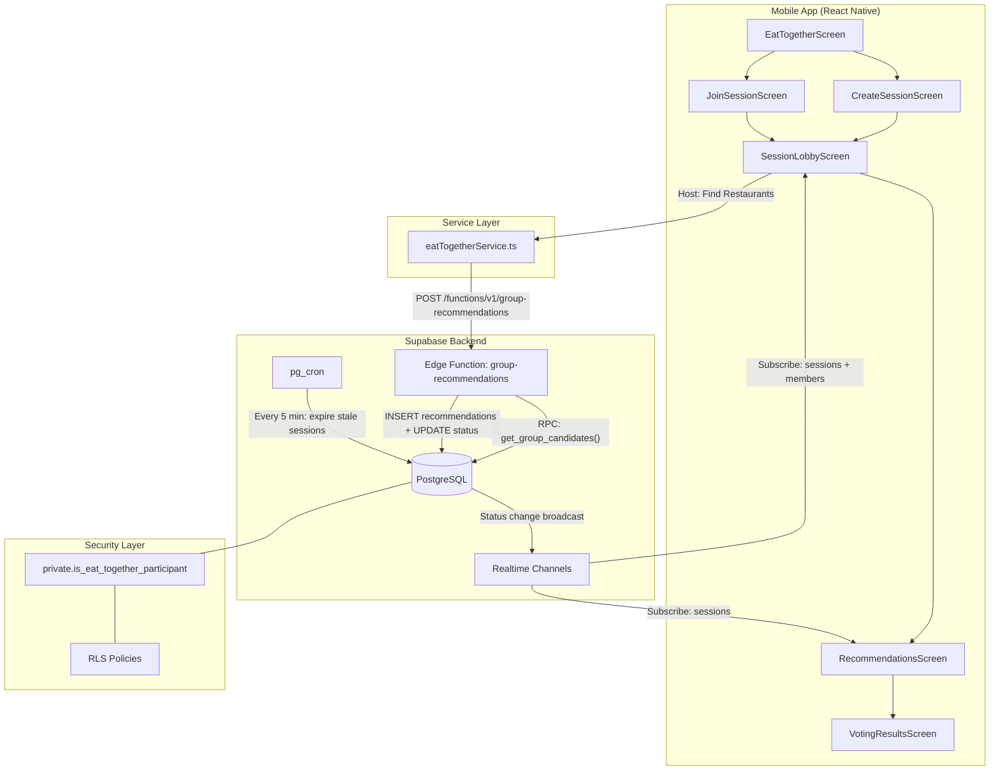
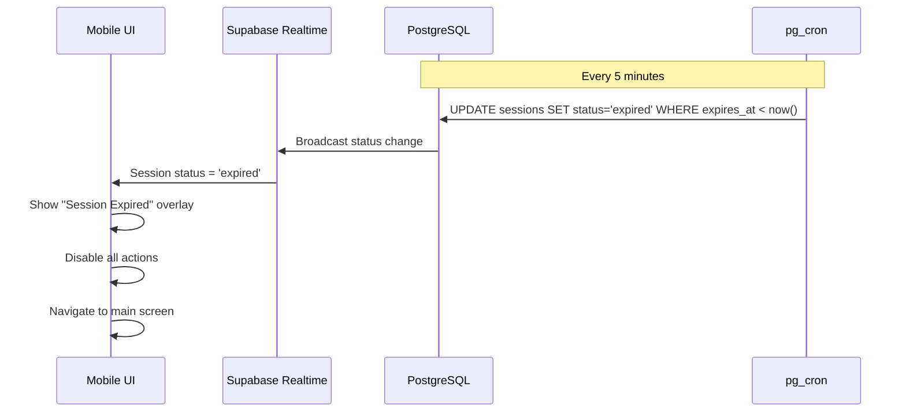
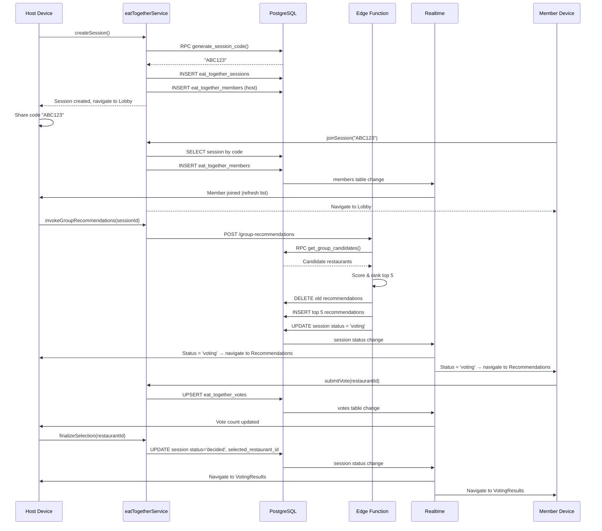

# Detailed Design: Fix Eat Together Feature

## Overview

The "Eat Together" feature allows users to create group dining sessions, invite friends via a 6-character code, generate restaurant recommendations based on the group's combined dietary preferences and location, vote on the options, and decide on a restaurant together.

The feature is ~60% implemented but has critical bugs preventing end-to-end use. This design covers fixing all critical issues, tightening security, adding session expiry enforcement, and polishing the UX with proper error handling and loading states.

## Detailed Requirements

*(Consolidated from idea-honing.md)*

1. **Scope**: Full polish — fix critical bugs, secondary issues, and UX improvements
2. **RLS Strategy**: Security definer function (`is_eat_together_participant`) to break recursion while properly scoping data access
3. **Session Code Generation**: Database RPC (`generate_session_code`) with collision-retry loop
4. **Edge Function Trigger**: Host-initiated "Find Restaurants" button in the lobby
5. **Session Expiry**: UI countdown timer + backend enforcement via pg_cron + auto-status transition
6. **QR Scanning**: Deferred — keep "Coming Soon" placeholder
7. **Testing**: Unit tests for new RPCs + manual multi-user E2E
8. **Migrations**: Single migration file (075) with all DB changes
9. **Error Messages**: Specific and actionable, surfacing conflict analysis from edge function

## Architecture Overview



## Components and Interfaces

### 1. Database Migration (075)

Single migration file containing four sections:

#### 1.1 Security Definer Function

```sql
-- Private schema for internal functions (not API-exposed)
CREATE SCHEMA IF NOT EXISTS private;

CREATE OR REPLACE FUNCTION private.is_eat_together_participant(p_session_id UUID)
RETURNS BOOLEAN
LANGUAGE plpgsql
SECURITY DEFINER
SET search_path = ''
AS $$
BEGIN
  RETURN EXISTS (
    SELECT 1 FROM public.eat_together_members
    WHERE session_id = p_session_id
      AND user_id = (SELECT auth.uid())
      AND left_at IS NULL
  );
END;
$$;
```

#### 1.2 RLS Policy Fixes

All `eat_together_*` tables get scoped SELECT policies using the security definer function:

**eat_together_sessions:**
```sql
-- DROP existing SELECT policy
-- New: Host OR active member can view
CREATE POLICY "Users can view sessions they participate in"
  ON public.eat_together_sessions FOR SELECT
  USING (
    auth.uid() = host_id
    OR (SELECT private.is_eat_together_participant(id))
  );
```

**eat_together_members:**
```sql
-- DROP existing SELECT policy (USING true)
-- New: Only participants in the same session can view members
CREATE POLICY "Participants can view session members"
  ON public.eat_together_members FOR SELECT
  USING (
    auth.uid() = user_id
    OR (SELECT private.is_eat_together_participant(session_id))
  );
```

**eat_together_recommendations:**
```sql
-- DROP existing SELECT policy (USING true)
-- New: Only session participants can view recommendations
CREATE POLICY "Participants can view session recommendations"
  ON public.eat_together_recommendations FOR SELECT
  USING (
    (SELECT private.is_eat_together_participant(session_id))
  );
```

**eat_together_votes:**
```sql
-- DROP existing SELECT policy (USING true)
-- New: Only session participants can view votes
CREATE POLICY "Participants can view session votes"
  ON public.eat_together_votes FOR SELECT
  USING (
    (SELECT private.is_eat_together_participant(session_id))
  );
```

Note: INSERT/UPDATE policies remain unchanged — they already use `auth.uid()` checks correctly.

#### 1.3 Missing RPC Functions

**generate_session_code():**
```sql
CREATE OR REPLACE FUNCTION public.generate_session_code()
RETURNS TEXT
LANGUAGE plpgsql
SECURITY DEFINER
SET search_path = ''
AS $$
DECLARE
  code TEXT;
  code_exists BOOLEAN;
BEGIN
  LOOP
    code := upper(substr(md5(random()::text), 1, 6));
    SELECT EXISTS (
      SELECT 1 FROM public.eat_together_sessions
      WHERE session_code = code
    ) INTO code_exists;
    EXIT WHEN NOT code_exists;
  END LOOP;
  RETURN code;
END;
$$;
```

**get_vote_results():**
```sql
CREATE OR REPLACE FUNCTION public.get_vote_results(p_session_id UUID)
RETURNS TABLE (
  restaurant_id UUID,
  restaurant_name TEXT,
  restaurant_address TEXT,
  cuisine_types TEXT[],
  vote_count BIGINT,
  voters TEXT[]
)
LANGUAGE plpgsql
SECURITY DEFINER
SET search_path = ''
AS $$
BEGIN
  -- Verify caller is a participant
  IF NOT private.is_eat_together_participant(p_session_id) THEN
    RAISE EXCEPTION 'Not a participant of this session';
  END IF;

  RETURN QUERY
  SELECT
    v.restaurant_id,
    r.name AS restaurant_name,
    r.address AS restaurant_address,
    r.cuisine_types,
    COUNT(*)::BIGINT AS vote_count,
    ARRAY_AGG(u.profile_name)::TEXT[] AS voters
  FROM public.eat_together_votes v
  JOIN public.restaurants r ON r.id = v.restaurant_id
  JOIN public.users u ON u.id = v.user_id
  WHERE v.session_id = p_session_id
  GROUP BY v.restaurant_id, r.name, r.address, r.cuisine_types
  ORDER BY vote_count DESC;
END;
$$;
```

#### 1.4 Session Expiry Enforcement

```sql
-- Cron job: expire stale sessions every 5 minutes
SELECT cron.schedule(
  'expire-eat-together-sessions',
  '*/5 * * * *',
  $$
    UPDATE public.eat_together_sessions
    SET status = 'expired', closed_at = now()
    WHERE status NOT IN ('decided', 'cancelled', 'expired')
      AND expires_at < now()
  $$
);
```

### 2. Service Layer Changes (eatTogetherService.ts)

#### 2.1 New Function: invokeGroupRecommendations()

```typescript
async invokeGroupRecommendations(
  sessionId: string,
  locationMode: string = 'midpoint',
  radiusKm: number = 5
): Promise<{ recommendations: Recommendation[]; metadata: any; conflicts?: string[] }> {
  const { data, error } = await supabase.functions.invoke('group-recommendations', {
    body: { sessionId, locationMode, radiusKm }
  });
  if (error) throw error;
  return data;
}
```

#### 2.2 New Function: updateSessionStatus()

```typescript
async updateSessionStatus(
  sessionId: string,
  status: SessionStatus
): Promise<void> {
  const { error } = await supabase
    .from('eat_together_sessions')
    .update({ status })
    .eq('id', sessionId);
  if (error) throw error;
}
```

#### 2.3 New Function: finalizeSelection()

```typescript
async finalizeSelection(
  sessionId: string,
  restaurantId: string
): Promise<void> {
  const { error } = await supabase
    .from('eat_together_sessions')
    .update({
      status: 'decided',
      selected_restaurant_id: restaurantId,
      closed_at: new Date().toISOString()
    })
    .eq('id', sessionId);
  if (error) throw error;
}
```

### 3. Frontend Screen Changes

#### 3.1 Navigation Types Fix

Update `MainStackParamList` in `navigation.ts`:
```typescript
SessionLobby: { sessionId: string; isHost: boolean };
```

Update `CreateSessionScreen` and `JoinSessionScreen` to pass `isHost` param when navigating.

#### 3.2 SessionLobbyScreen Overhaul

**Edge function wiring:**
```typescript
const handleGenerateRecommendations = async () => {
  if (members.length < 2) {
    Alert.alert(t('sessionLobby.notEnoughMembers'));
    return;
  }
  setGenerating(true);
  try {
    const result = await eatTogetherService.invokeGroupRecommendations(
      sessionId, locationMode
    );
    if (result.recommendations.length === 0) {
      // Show conflict-specific error
      Alert.alert(
        t('sessionLobby.noRestaurantsTitle'),
        result.conflicts?.join('\n') || t('sessionLobby.noRestaurantsMessage')
      );
    }
    // Session status auto-transitions to 'voting' via edge function
    // Realtime subscription handles navigation
  } catch (error) {
    Alert.alert(t('sessionLobby.recommendationFailed'), error.message);
  } finally {
    setGenerating(false);
  }
};
```

**Expiry countdown timer:**
```typescript
const [timeRemaining, setTimeRemaining] = useState<number>(0);

useEffect(() => {
  if (!session?.expires_at) return;
  const interval = setInterval(() => {
    const remaining = new Date(session.expires_at).getTime() - Date.now();
    if (remaining <= 0) {
      setTimeRemaining(0);
      clearInterval(interval);
      // Show expired overlay
    } else {
      setTimeRemaining(remaining);
    }
  }, 1000);
  return () => clearInterval(interval);
}, [session?.expires_at]);
```

**Realtime cleanup:**
```typescript
useEffect(() => {
  const subscription = setupRealtimeSubscription();
  return () => {
    if (subscription) subscription.unsubscribe();
  };
}, [sessionId]);
```

#### 3.3 RecommendationsScreen Fixes

- Fix `user_id` type safety (remove `as string` cast)
- Add realtime subscription cleanup
- Validate `selected_restaurant_id` exists before navigating to VotingResults
- Add loading spinner during vote submission
- Show vote confirmation feedback

#### 3.4 VotingResultsScreen Fixes

- Fix `openMaps()` — fetch full restaurant data including location, or remove the function if location isn't available in the vote results query
- Add null check for `selected_restaurant_id`
- Add loading state for initial data fetch

#### 3.5 CreateSessionScreen Fixes

- Remove non-null assertion on `user`
- Handle `updateMemberLocation()` errors
- Pass `isHost: true` when navigating to SessionLobby

#### 3.6 JoinSessionScreen Fixes

- Pass `isHost: false` when navigating to SessionLobby
- i18n for "QR Scanner Coming Soon" string

### 4. Expiry System



**UI countdown component** displays in the lobby and voting screens header. Format: `HH:MM:SS` remaining. Changes color when < 10 minutes remaining (warning). When timer reaches zero, shows overlay regardless of whether cron has run yet.

## Data Models

No new tables required. Changes to existing:

### Modified RLS Policies
See Section 1.2 above — all four `eat_together_*` tables get scoped SELECT policies.

### New Functions
| Function | Schema | Returns | Security |
|----------|--------|---------|----------|
| `is_eat_together_participant(UUID)` | private | BOOLEAN | DEFINER |
| `generate_session_code()` | public | TEXT | DEFINER |
| `get_vote_results(UUID)` | public | TABLE | DEFINER |

### New Cron Job
| Name | Schedule | Action |
|------|----------|--------|
| `expire-eat-together-sessions` | `*/5 * * * *` | Expire stale sessions |

## Error Handling

### Error Messages (Specific & Actionable)

| Scenario | Message |
|----------|---------|
| Invalid session code | "Invalid session code. Check the code and try again." |
| Session expired | "This session has expired. Ask the host to create a new one." |
| Session not found | "Session not found. It may have been cancelled." |
| No dietary matches | "No restaurants match everyone's dietary needs. Try expanding the search radius." |
| All-vegan conflict | "All-vegan filter is active — limited restaurant options in this area." |
| 4+ allergens | "{count} allergens must be avoided — this narrows options significantly." |
| Halal + Kosher | "Both halal and kosher are required — this is an extremely rare combination." |
| Already joined | "You've already joined this session." |
| < 2 members | "At least 2 members are needed to generate recommendations." |
| Location missing | "Location data is required. Please enable location sharing." |
| Vote failed | "Failed to submit your vote. Please try again." |
| Network error | "Connection lost. Reconnecting..." |

### Loading States

| Action | Loading Indicator |
|--------|-------------------|
| Joining session | Button spinner + "Joining..." |
| Generating recommendations | Full-screen spinner + "Finding restaurants for your group..." |
| Submitting vote | Button spinner + disable button |
| Loading vote results | Skeleton/placeholder cards |
| Updating location | Subtle indicator in header |

## Testing Strategy

### Unit Tests (Automated)

**RPC Functions:**
- `generate_session_code()`: Returns 6-char uppercase alphanumeric; two calls produce different codes
- `get_vote_results()`: Correct aggregation; ordering by vote count; rejects non-participants
- `is_eat_together_participant()`: Returns true for active member; false for left member; false for non-member

**Service Layer:**
- `invokeGroupRecommendations()`: Correctly calls edge function with params; handles success and error responses
- `updateSessionStatus()`: Correctly updates status
- `finalizeSelection()`: Correctly sets restaurant and status

### Manual E2E Test Plan

1. **Happy path**: Create session → share code → friend joins → host generates recommendations → both vote → results displayed
2. **Non-host access**: Verify non-host can see session, members, recommendations, votes
3. **Expiry**: Create session, wait for timer to approach zero (or manually set short expiry), verify expired overlay
4. **Error states**: Invalid code, expired session, < 2 members generate, no dietary matches
5. **Realtime**: Verify member list updates live, status transitions propagate, vote counts update
6. **Edge cases**: Host leaves, member leaves mid-vote, session cancelled, multiple rapid votes

## Appendices

### A. Technology Choices

| Choice | Rationale |
|--------|-----------|
| `SECURITY DEFINER` function | Standard Supabase pattern for breaking RLS recursion. Recommended by official docs. |
| Private schema | Prevents function from being exposed via API. Supabase best practice. |
| `(SELECT ...)` wrapping in policies | Enables initPlan caching — 99%+ performance improvement per Supabase docs. |
| pg_cron for expiry | Native Supabase integration. Simpler than database triggers or external cron. |
| Single migration | Changes are interdependent — partial deployment would leave broken state. |

### B. Research Findings Summary

1. **RLS Recursion**: Caused by cross-table references in SELECT policies. Security definer breaks the cycle by bypassing RLS internally.
2. **Edge Function**: Fully implemented with correct scoring algorithm. Only needs frontend wiring.
3. **Frontend**: 13+ issues across 5 screens. Most critical: missing edge function call, missing navigation params, no realtime cleanup.
4. **ALGORITHM.md**: Describes V1 system, doesn't match V2 code. Should be updated separately.

### C. Alternative Approaches Considered

1. **RLS via subquery with recursion guard** — Rejected: PostgreSQL has no clean built-in RLS recursion guard.
2. **Client-side session code generation** — Rejected: Server-side is more secure and matches existing service call.
3. **Auto-triggered recommendations** — Rejected: Host should control timing; no reliable way to know when "everyone" has joined.
4. **Separate migrations** — Rejected: Changes are interdependent; single migration is safer.
5. **Full RLS integration tests** — Deferred: Significant infrastructure investment. Manual E2E is faster for this fix effort.

### D. Sequence Diagram: Full Happy Path


