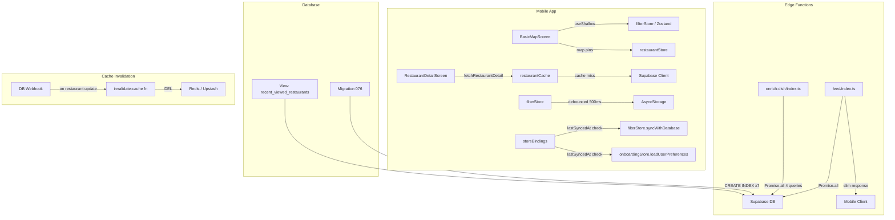

# Detailed Design — Performance Optimizations

## Project: 2026-04-08-implement-performance-optimizations
## Date: 2026-04-08

---

## Overview

This document covers the implementation design for the performance optimizations identified in the 2026-04-07 investigation across the eatMe platform. The changes span four layers: PostgreSQL database (indexes), Supabase Edge Functions (enrich-dish, feed), React Native mobile app (screens, stores, services), and the image loading pipeline.

**Out of scope:** `nearby-restaurants` Edge Function (any changes), two-tier feed cache key restructuring.

**Platform:** React Native + Expo (mobile), Supabase Edge Functions (Deno/TypeScript), PostgreSQL (Supabase).

---

## Detailed Requirements

### Sprint 1 — Quick Wins

**R1. Database Indexes**
Add 6 missing composite indexes and 1 composite partial index for RLS:
- `favorites(user_id, subject_type)`
- `user_dish_interactions(user_id, interaction_type)`
- `eat_together_members(session_id, left_at)`
- `session_views(user_id, entity_type)`
- `dish_ingredients(dish_id)`
- `eat_together_votes(session_id)`
- `eat_together_members(session_id, user_id) WHERE left_at IS NULL` (partial, for RLS)

Delivered as a single numbered migration file.

**R2. RestaurantDetailScreen — Explicit Column Select**
Replace all `*` wildcards in the nested Supabase query at `RestaurantDetailScreen.tsx:96-115` with explicit column lists, excluding: `embedding`, `embedding_input`, `enrichment_payload`, `restaurant_vector`, `location_point`. Target payload reduction: 1-2 MB → 50-100 KB.

**R3. enrich-dish — Parallelize Sequential Queries**
Wrap the 4 independent sequential `await` calls at `enrich-dish/index.ts:357-405` in a single `Promise.all`. The parent dish lookup is conditional — resolve to `{ data: null }` when `dish.parent_dish_id` is null.

**R4. feed Edge Function — Slim Response + Favorites Join**
- Slim the dish response at `feed/index.ts:673-695`: remove `allergens`, `dietary_tags`, `is_available`, `dish_kind` from default output; omit `flagged_ingredients` when empty.
- Merge the sequential favorites cuisine lookup (line 473-484) into the existing `Promise.all` using a Supabase join: `favorites!inner(subject_id, restaurants!inner(cuisine_types))`.

**R5. BasicMapScreen — useShallow Selectors**
Replace the three bare Zustand selectors at `BasicMapScreen.tsx:126-128` with `useShallow`-wrapped equivalents for `daily` and `permanent` objects. Import `useShallow` from `zustand/react/shallow`.

**R6. Explicit Selects in Services**
Replace `.select('*')` with explicit column lists in:
- `eatTogetherService.ts` (lines 127, 146, 185, 399, 529) — `eat_together_sessions` and `eat_together_members`
- `dishPhotoService.ts` (line 136) — `dish_photos`

**R7. filterStore — Debounce saveFilters()**
Add a 500 ms debounce to the `saveFilters()` call inside `filterStore.ts`. All existing setters call `saveFilters()` — the debounce is applied at the `saveFilters` function level so no individual setter needs changing.

---

### Sprint 2 — Caching & Network

**R8. expo-image — Full Migration**
Install `expo-image` via `npx expo install expo-image`. Replace every `import { Image } from 'react-native'` across all mobile screens and components with `import { Image } from 'expo-image'`. Verify `source` prop compatibility (static assets may need `require()` wrapping).

**R9. Client-Side Restaurant Cache**
Extend `restaurantStore` (or create a dedicated slice) with:
- `restaurantCache: Map<string, { data: RestaurantDetail; fetchedAt: number }>`
- `fetchRestaurantDetail(id)` action: returns cached data if age < 5 minutes, otherwise fetches from Supabase and updates cache
- Update `RestaurantDetailScreen` to call `fetchRestaurantDetail` instead of querying Supabase directly
- Cache uses the same explicit column select defined in R2

**R10. User Preferences Sync Debounce**
Add `lastSyncedAt: number | null` to both `filterStore` and `onboardingStore` (persisted via AsyncStorage). In `storeBindings.ts`, skip `syncWithDatabase` / `loadUserPreferences` if the last sync was less than 30 minutes ago. Always force-sync after explicit preference saves.

---

### Sprint 3 — Architecture

**R11. viewHistoryService — Combined Query**
Create a PostgreSQL view `recent_viewed_restaurants` joining `session_views` to `restaurants` for `entity_type = 'restaurant'`. Update `viewHistoryService.ts` to query the view in a single call instead of two sequential queries.

**R12. FlatList getItemLayout in ViewedHistoryScreen**
Add `getItemLayout` and `removeClippedSubviews` to the FlatList in `ViewedHistoryScreen.tsx:112-118`. Define a `ITEM_HEIGHT` constant derived from the existing item style.

**R13. Per-Category Lazy Loading in RestaurantDetailScreen**
Load only the active/first category's dishes on initial render. Fetch additional categories lazily when the user navigates to them. Requires a state machine for per-category loading status and a category-scoped Supabase query.

**R14. Edge Function Response Compression**
Add gzip compression to the `feed` Edge Function response using Deno's `CompressionStream`. Set `Content-Encoding: gzip` response header. Apply only when the response body exceeds a size threshold (e.g., 10 KB).

**R15. Cache Invalidation Webhook**
Add a Supabase database webhook (or pg_net trigger) on `restaurants`, `menus`, and `dishes` UPDATE events that calls a new `invalidate-cache` Edge Function. The function deletes relevant Redis keys: `restaurant:{id}`, `restaurant:cuisines:{id}`.

---

## Architecture Overview



---

## Components and Interfaces

### restaurantStore — Cache Extension

```typescript
interface RestaurantCacheEntry {
  data: RestaurantDetail;  // uses the explicit-column select shape from R2
  fetchedAt: number;       // Date.now() timestamp
}

interface RestaurantStoreState {
  // existing fields...
  restaurantCache: Map<string, RestaurantCacheEntry>;
  fetchRestaurantDetail: (id: string) => Promise<RestaurantDetail>;
  invalidateCacheEntry: (id: string) => void;
}

const CACHE_TTL_MS = 5 * 60 * 1000; // 5 minutes
```

### filterStore — Debounce

```typescript
// Single change: wrap saveFilters body with debounce
const debouncedSave = debounce(() => {
  // existing AsyncStorage write logic
}, 500);

saveFilters: () => debouncedSave(),
```

### filterStore + onboardingStore — lastSyncedAt

```typescript
interface FilterStoreState {
  // existing fields...
  lastSyncedAt: number | null;
}

// storeBindings.ts
const SYNC_TTL_MS = 30 * 60 * 1000; // 30 minutes
const now = Date.now();
const lastSync = useFilterStore.getState().lastSyncedAt;
if (!lastSync || now - lastSync > SYNC_TTL_MS) {
  await useFilterStore.getState().syncWithDatabase(userId);
}
```

### recent_viewed_restaurants View

```sql
CREATE VIEW recent_viewed_restaurants AS
SELECT
  sv.user_id,
  sv.viewed_at,
  r.id,
  r.name,
  r.cuisine_types,
  r.image_url,
  r.address,
  r.rating
FROM session_views sv
JOIN restaurants r ON r.id::text = sv.entity_id
WHERE sv.entity_type = 'restaurant';
```

### invalidate-cache Edge Function

```typescript
// Input: { restaurantId: string }
// Deletes: restaurant:{id}, restaurant:cuisines:{id}
// Returns: { deleted: string[] }
```

---

## Data Models

No new tables or columns are introduced. Changes:
- **New indexes** (migration 076): 7 indexes on existing columns
- **New view** (migration 076 or 077): `recent_viewed_restaurants`
- **restaurantCache** in Zustand: in-memory Map, not persisted to AsyncStorage (intentional — fresh on app restart)
- **lastSyncedAt** in filterStore + onboardingStore: persisted to AsyncStorage alongside existing state

---

## Error Handling

| Change | Error scenario | Handling |
|--------|---------------|----------|
| Restaurant cache (R9) | Fetch fails on cache miss | Propagate error to screen as today; don't poison cache |
| enrich-dish Promise.all (R3) | One of 4 queries fails | Wrap in try/catch; log individual failure; return partial result or rethrow |
| feed favorites join (R4) | Join returns unexpected shape | Fall back to existing two-query pattern with a try/catch |
| Compression (R14) | CompressionStream not available | Detect support; fall back to uncompressed response |
| Cache invalidation webhook (R15) | Redis delete fails | Log and continue; stale data self-heals after TTL |
| lastSyncedAt (R10) | AsyncStorage read fails | Default to null → force sync (safe fallback) |

---

## Testing Strategy

Each step is tested as part of implementation (no separate testing steps).

| Change | Test approach |
|--------|--------------|
| DB indexes (R1) | `EXPLAIN ANALYZE` before/after on affected queries; confirm Index Scan in plan |
| RestaurantDetail select (R2) | Snapshot test on network response shape; assert no `embedding` field |
| enrich-dish Promise.all (R3) | Unit test: mock Supabase client, assert all 4 queries called, verify output unchanged |
| feed slim + join (R4) | Integration test: call feed endpoint, assert response shape; assert `allergens` absent |
| useShallow (R5) | React Native Testing Library: render BasicMapScreen, toggle filter, assert render count = 1 |
| Explicit selects (R6) | Integration test: call eat_together flows, verify no missing fields in UI |
| filterStore debounce (R7) | Unit test: call setDailyPriceRange 10 times rapidly, assert AsyncStorage called once |
| expo-image (R8) | Visual regression: screenshot comparison across affected screens |
| Restaurant cache (R9) | Unit test: call fetchRestaurantDetail twice, assert Supabase called once; verify staleness reset after 5 min |
| Sync debounce (R10) | Unit test: simulate auth event twice within 30 min, assert syncWithDatabase called once |
| viewHistoryService (R11) | Integration test: assert single DB query, correct results returned |
| FlatList (R12) | Snapshot test: assert getItemLayout prop present |
| Lazy loading (R13) | Integration test: initial render loads only first category; tab switch triggers fetch |
| Compression (R14) | Integration test: assert Content-Encoding: gzip header; decompress and verify payload |
| Invalidation webhook (R15) | Integration test: update restaurant, assert Redis keys deleted |

---

## Appendices

### A. Technology Choices

| Choice | Rationale |
|--------|-----------|
| `expo-image` over `react-native-fast-image` | First-party Expo SDK, uses SDWebImage (iOS) / Glide (Android), no native linking steps |
| Zustand Map for restaurant cache | Fits existing state management patterns; avoids new dependency (TanStack Query) |
| Debounce via closure in filterStore | No new utility library needed; standard pattern |
| DB view for viewHistoryService | Avoids application-level join logic; reusable |
| pg_net webhook for cache invalidation | Native to Supabase; no additional infrastructure |

### B. Research Findings Summary

All findings sourced from `.agents/planning/2026-04-07-optimize-performance/findings/`.

Top-impact items addressed in this plan:
1. RestaurantDetail vector column payload (Critical → R2, R9)
2. enrich-dish sequential queries (High → R3)
3. Missing DB indexes (High → R1)
4. No image caching (High → R8)
5. BasicMapScreen re-renders (High → R5)
6. Feed unnecessary fields (High → R4)
7. RLS overhead on eat_together (High → R1 partial index)
8. Over-fetching with `select('*')` (Medium → R6)

### C. Alternative Approaches Considered

| Alternative | Why not chosen |
|-------------|----------------|
| TanStack Query for restaurant cache | Would be an isolated island; defer to future app-wide adoption |
| Two-tier feed cache | Deferred — complexity not justified without baseline hit-rate measurement |
| Hash-based feed cache key | Doesn't address root cause (near-zero hit rate from soft filters) |
| Debounce slider setters only | Inconsistent; global debounce on saveFilters() is simpler and more complete |
| nearby-restaurants changes | Out of scope per user decision |
