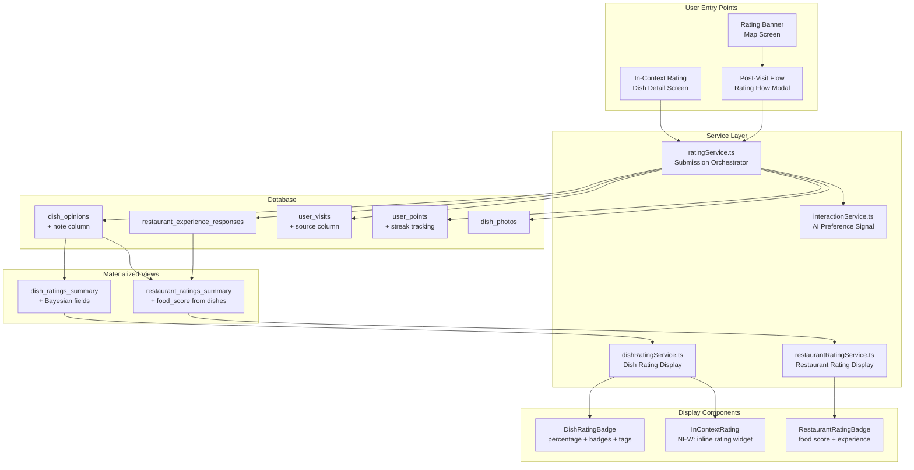
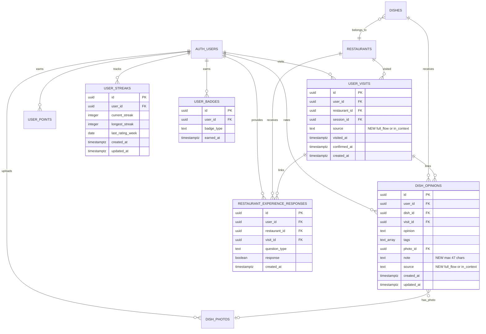

# Detailed Design: EatMe Rating System Redesign

## Overview

This document describes the redesign of EatMe's rating system. The core rating model (3-tier liked/okay/disliked for dishes, yes/no experience questions for restaurants) is preserved — it is validated by industry convergence (Netflix, DoorDash Zesty). The redesign focuses on:

1. **Adding in-context dish rating** — rate a dish directly from its detail screen in 1-2 taps
2. **Dual-path rating flow** — quick in-context path (primary) + optional full post-visit flow
3. **Rotten Tomatoes-style display** — percentage + count + tier badges + tags (unique in food space)
4. **Bayesian restaurant food scores** — derived from aggregated dish ratings
5. **Refined gamification** — quality-weighted points, "Trusted Taster" badge, streak mechanics
6. **AI recommendation foundation** — ratings + tags + behavior feed a hybrid recommender

The existing database schema is largely preserved. Changes are additive: new columns, updated materialized views, new UI entry points.

---

## Detailed Requirements

### From Requirements Clarification (idea-honing.md)

| # | Requirement | Decision |
|---|------------|----------|
| R1 | Core rating model | Keep 3-tier (liked/okay/disliked) for dishes |
| R2 | Primary goal | User discovery — help users decide "should I order this?" |
| R3 | Restaurant ratings | Hybrid — food score derived from dish ratings (Bayesian avg) + separate experience questions |
| R4 | Rating friction | Dual-path: 1-tap in-context (primary) + full post-visit flow (optional) |
| R5 | Text reviews | No text on dish opinions — structured tags only |
| R6 | Short notes | Optional 47-char note in full post-visit flow only |
| R7 | Rating display | Percentage + count + tier badges + tags (Rotten Tomatoes model) |
| R8 | AI integration | Ratings feed both public scores and personal recommendations |
| R9 | Gamification | Keep and refine: quality-weighted points, "Trusted Taster" badge, streaks |
| R10 | Migration | Big bang with data migration — existing data fully compatible |

### Functional Requirements

**FR1 — In-Context Dish Rating**
- Users can rate a dish directly from the dish detail view (inside RestaurantDetailScreen)
- "Tried it?" button appears on each dish card
- Tapping opens a compact inline rating UI: liked/okay/disliked → optional tags → done
- No photo upload, no notes — minimal friction path
- Must create a `user_visit` if none exists for this session + restaurant
- Must work without going through the full rating flow

**FR2 — Full Post-Visit Rating Flow (Enhanced)**
- Keep the existing multi-step flow: select restaurant → select dishes → rate each → restaurant question → complete
- Add optional 47-character note field per dish (in full flow only)
- Keep photo upload per dish
- Keep restaurant experience questions (service, clean, wait time, recommend, value)
- Keep points calculation and display

**FR3 — Rating Display — Dishes**
- Map pins: color-coded dot (green ≥80%, amber 60-79%, hidden <60%)
- Dish cards: `85% 👍 (47) · Great flavor · Good value`
- Dish detail: full distribution (liked/okay/disliked percentages), all tags with counts, user photos
- Tier badges: special icon for ≥90% with 20+ ratings ("Top Rated"), neutral badge for ≥75%

**FR4 — Rating Display — Restaurants**
- Food score: Bayesian average of all dish like-percentages, displayed as percentage
- Experience scores: per-question yes-percentages (service, clean, wait time, value)
- Overall score: weighted combination (food 60%, experience 40%)
- Display: `Food: 87% 👍 · Service: 92% · Clean: 88%`

**FR5 — Bayesian Averaging**
- Restaurant food score uses Bayesian average: `(C × m + Σ(dish_like_pct)) / (C + n)`
- C = global average like-percentage across all dishes
- m = prior weight (tunable, start with 10)
- n = number of rated dishes at the restaurant
- Prevents restaurants with few ratings from having extreme scores

**FR6 — Gamification Refinements**
- Points: 10/dish rating, 5/tags, 20/photo (increased from 15 — update both `PointsEarned` type comment and `awardPoints()` hardcoded value in `ratingService.ts`), 5/restaurant question, 20/first visit bonus
- Streak bonuses: 15 pts (3-week milestone), 30 pts (7-week), 50 pts (14-week)
- "Trusted Taster" badge: earned after 20+ tagged ratings over 3+ months; checked client-side after each rating submission
- Streaks: track consecutive weeks with at least 1 rating; award bonus at 3, 7, 14 week milestones
- No public leaderboard

**FR7 — AI Preference Input**
- On dish rating submission, record interaction for liked/okay → positive signal only
- `disliked` is deliberately NOT recorded as a preference vector signal (existing behavior preserved): disliking a dish reflects execution quality at a specific restaurant, not category preference. Disliked dishes continue to be excluded from the feed via `generate_candidates`
- Tags feed content-based filtering (user who selects "value" + "portion" → different profile than "presentation" + "flavor")
- Session view data (implicit signal) + explicit ratings + tag preferences → hybrid recommender input

### Non-Functional Requirements

**NFR1 — Performance**
- In-context rating submission: < 500ms perceived latency (optimistic UI update)
- Batch dish rating fetch: existing pattern, no regression
- Materialized view refresh: < 5s for incremental update

**NFR2 — Data Integrity**
- Upsert behavior preserved: same user + dish + visit = update, not duplicate
- In-context ratings without a visit create an "in-context" visit record
- Points awarded atomically with rating (non-fatal failure acceptable)

**NFR3 — Backward Compatibility**
- All existing dish_opinions, restaurant_experience_responses, user_visits, user_points data remains valid
- Existing aggregated views continue to work during migration
- No breaking changes to the feed/discovery edge functions

---

## Architecture Overview



---

## Components and Interfaces

### New Component: InContextRating

A compact inline widget that appears on dish cards in the RestaurantDetailScreen.

```typescript
// New file: apps/mobile/src/components/rating/InContextRating.tsx

interface InContextRatingProps {
  dishId: string;
  dishName: string;
  restaurantId: string;
  onRated: (opinion: DishOpinion, tags: DishTag[]) => void;
}

// States:
// 1. Collapsed: "Tried it?" button
// 2. Expanded: Three opinion buttons (👍 😐 👎)
// 3. Tags (optional): Shows relevant tags based on opinion
// 4. Done: Animated checkmark, collapses back

// Flow: tap "Tried it?" → select opinion (1 tap) → optional tags (0-1 tap) → auto-submit
// Total: 2-3 taps, < 5 seconds
//
// Tag behavior: show positive tags for 'liked', negative tags for 'disliked',
// NO tags for 'okay' (matches current behavior, keeps friction minimal)
//
// Already-rated state: if user has a prior rating for this dish (any visit),
// display their existing opinion highlighted. Allow tapping a different opinion
// to update — creates a new in-context visit + opinion row.
```

### Modified Component: RateDishScreen

Add optional 47-character note field (full flow only).

```typescript
// Modified: apps/mobile/src/components/rating/RateDishScreen.tsx

interface RateDishScreenProps {
  dish: RecentlyViewedDish;
  currentIndex: number;
  totalDishes: number;
  onSubmit: (rating: DishRatingInput) => void;
  onBack: () => void;
  onAddPhoto: () => Promise<string | undefined>;
  // No new props needed — note is internal state
}

// Changes:
// - Add "+ Add a note" expandable text input (47 char limit)
// - Note is part of DishRatingInput (new optional field)
```

### Modified Component: DishRatingBadge

Update to show tier badges and improved layout.

```typescript
// Modified: apps/mobile/src/components/DishRatingBadge.tsx

interface DishRatingBadgeProps {
  likePercentage: number | null;
  totalRatings: number;
  topTags: string[];
  maxTags?: number;        // Default: 2
  showBadge?: boolean;     // Default: true — show tier badge if qualified
  compact?: boolean;       // Default: false — for map pin mode
}

// Badge logic:
// - "🔥" icon if likePercentage >= 90 AND totalRatings >= 20
// - No badge below 75% or below 5 ratings
// Display: "🔥 85% 👍 (47) · Great flavor · Good value"
//
// CHANGE: Minimum display threshold raised from totalRatings > 0 to totalRatings >= 3
// (cold-start constraint — don't show misleading scores from 1-2 ratings)
```

### Modified Component: RestaurantRatingBadge

Update to show Bayesian food score derived from dish ratings.

```typescript
// Modified: apps/mobile/src/components/RestaurantRatingBadge.tsx

interface RestaurantRatingBadgeProps {
  rating: RestaurantRating | null;
  showBreakdown?: boolean;
}

// RestaurantRating type updated to include:
// - foodScore: number (Bayesian avg of dish ratings)
// - totalDishRatings: number
// - servicePercentage, cleanlinessPercentage, waitTimePercentage, valuePercentage
// Display: "Food: 87% 👍 (124 dish ratings) · Service: 92% · Clean: 88%"
```

### Modified Service: ratingService.ts

Add in-context rating path.

```typescript
// New function:
async function submitInContextRating(
  userId: string,
  restaurantId: string,
  dishId: string,
  dishName: string,
  opinion: DishOpinion,
  tags: DishTag[],
  sessionId: string | null
): Promise<{ success: boolean; error?: string }>
// 1. Find or create user_visit with source='in_context':
//    - Query: SELECT id FROM user_visits WHERE user_id=X AND restaurant_id=Y AND source='in_context'
//      AND visited_at > now() - interval '24 hours' LIMIT 1
//    - If found: reuse that visit_id (same-day re-rating updates the opinion via upsert)
//    - If not found: INSERT new user_visit with source='in_context'
// 2. Upsert dish_opinion (onConflict: user_id, dish_id, visit_id)
// 3. Record interaction (liked/okay only → positive signal; disliked is NOT recorded per FR7)
// 4. Award points (10 for rating + 5 if tags provided)
// 5. Optimistic: return success immediately, award points async

// Modified function signature:
interface DishRatingInput {
  dishId: string;
  dishName: string;
  opinion: DishOpinion;
  tags: DishTag[];
  photoUri?: string;
  note?: string;  // NEW: max 47 chars, full flow only
}
```

### Modified Service: dishRatingService.ts

Update to support tier badges and new display format.

```typescript
// Updated interface:
export interface DishRating {
  dishId: string;
  likePercentage: number | null;
  okayPercentage: number | null;   // NEW
  dislikePercentage: number | null; // NEW
  totalRatings: number;
  topTags: string[];
  recentNotes: string[];           // NEW: last 3 notes (47 chars each)
}

// New function:
function getRatingTier(likePercentage: number | null, totalRatings: number): 'top' | 'good' | 'neutral' | 'none'
// 'top': >= 90% AND >= 20 ratings
// 'good': >= 75% AND >= 5 ratings
// 'neutral': >= 60%
// 'none': below thresholds or insufficient data

// Updated function:
function formatRatingText(likePercentage: number | null, totalRatings: number): string | null
// Returns: "85% 👍 (47)" instead of "85% ❤️ 47"
```

### Modified Service: restaurantRatingService.ts

Add Bayesian food score computation.

```typescript
// Updated interface:
export interface RestaurantRating {
  restaurantId: string;
  foodScore: number;              // NEW: Bayesian avg of dish like-percentages
  totalDishRatings: number;       // NEW: total dish ratings across all dishes
  servicePercentage: number;
  cleanlinessPercentage: number;
  waitTimePercentage: number;
  valuePercentage: number;
  wouldRecommendPercentage: number;
  overallPercentage: number;      // CHANGED: weighted (food 60%, experience 40%)
  totalExperienceResponses: number;
}
```

---

## Data Models

### Schema Changes

#### 1. Add `note` and `source` columns to `dish_opinions`

```sql
ALTER TABLE public.dish_opinions
  ADD COLUMN note text CHECK (char_length(note) <= 47),
  ADD COLUMN source text DEFAULT 'full_flow' CHECK (source IN ('full_flow', 'in_context'));
```

#### 2. Add `source` column to `user_visits`

```sql
ALTER TABLE public.user_visits
  ADD COLUMN source text DEFAULT 'full_flow' CHECK (source IN ('full_flow', 'in_context'));
```

> **Migration note:** The existing `restaurant_ratings_summary` materialized view is referenced
> as a `referencedRelation` by FK constraints on multiple tables (dishes, eat_together_*,
> menus, user_visits, etc.). The migration must DROP and re-CREATE the view in a single
> transaction. All downstream queries will continue to work because the view retains the
> `restaurant_id` column that FKs reference.

#### 3. Add streak tracking to `user_points` or new table

```sql
CREATE TABLE public.user_streaks (
  id uuid PRIMARY KEY DEFAULT gen_random_uuid(),
  user_id uuid NOT NULL REFERENCES auth.users(id),
  current_streak integer DEFAULT 0,
  longest_streak integer DEFAULT 0,
  last_rating_week date,  -- ISO week start date
  created_at timestamptz DEFAULT now(),
  updated_at timestamptz DEFAULT now(),
  UNIQUE(user_id)
);
```

#### 4. Add `trusted_taster` badge tracking

```sql
CREATE TABLE public.user_badges (
  id uuid PRIMARY KEY DEFAULT gen_random_uuid(),
  user_id uuid NOT NULL REFERENCES auth.users(id),
  badge_type text NOT NULL CHECK (badge_type IN ('trusted_taster')),
  earned_at timestamptz DEFAULT now(),
  UNIQUE(user_id, badge_type)
);

-- RLS policies for new tables (Supabase enables RLS by default)
ALTER TABLE public.user_streaks ENABLE ROW LEVEL SECURITY;
CREATE POLICY "Users can read own streaks" ON user_streaks FOR SELECT USING (auth.uid() = user_id);
CREATE POLICY "Users can update own streaks" ON user_streaks FOR UPDATE USING (auth.uid() = user_id);
CREATE POLICY "Service can insert streaks" ON user_streaks FOR INSERT WITH CHECK (auth.uid() = user_id);

ALTER TABLE public.user_badges ENABLE ROW LEVEL SECURITY;
CREATE POLICY "Users can read own badges" ON user_badges FOR SELECT USING (auth.uid() = user_id);
CREATE POLICY "Users can insert own badges" ON user_badges FOR INSERT WITH CHECK (auth.uid() = user_id);
```

#### 5. Update `dish_ratings_summary` materialized view

```sql
DROP MATERIALIZED VIEW IF EXISTS public.dish_ratings_summary;

CREATE MATERIALIZED VIEW public.dish_ratings_summary AS
SELECT
  do_agg.dish_id,
  do_agg.total_ratings,
  do_agg.like_percentage,
  do_agg.okay_percentage,
  do_agg.dislike_percentage,
  do_agg.liked_count,
  do_agg.okay_count,
  do_agg.disliked_count,
  tag_agg.top_tags,
  note_agg.recent_notes
FROM (
  -- Core aggregation
  SELECT
    dish_id,
    COUNT(*) AS total_ratings,
    COUNT(*) FILTER (WHERE opinion = 'liked') AS liked_count,
    COUNT(*) FILTER (WHERE opinion = 'okay') AS okay_count,
    COUNT(*) FILTER (WHERE opinion = 'disliked') AS disliked_count,
    ROUND(100.0 * COUNT(*) FILTER (WHERE opinion = 'liked') / NULLIF(COUNT(*), 0), 1) AS like_percentage,
    ROUND(100.0 * COUNT(*) FILTER (WHERE opinion = 'okay') / NULLIF(COUNT(*), 0), 1) AS okay_percentage,
    ROUND(100.0 * COUNT(*) FILTER (WHERE opinion = 'disliked') / NULLIF(COUNT(*), 0), 1) AS dislike_percentage
  FROM dish_opinions
  GROUP BY dish_id
) do_agg
LEFT JOIN LATERAL (
  -- Top tags by frequency (up to 5)
  SELECT ARRAY_AGG(tag ORDER BY cnt DESC) AS top_tags
  FROM (
    SELECT UNNEST(tags) AS tag, COUNT(*) AS cnt
    FROM dish_opinions
    WHERE dish_id = do_agg.dish_id
    GROUP BY tag
    ORDER BY cnt DESC
    LIMIT 5
  ) t
) tag_agg ON true
LEFT JOIN LATERAL (
  -- Recent notes (last 3 non-null)
  SELECT ARRAY_AGG(note ORDER BY created_at DESC) AS recent_notes
  FROM (
    SELECT note, created_at
    FROM dish_opinions
    WHERE dish_id = do_agg.dish_id AND note IS NOT NULL
    ORDER BY created_at DESC
    LIMIT 3
  ) n
) note_agg ON true;

CREATE UNIQUE INDEX ON dish_ratings_summary (dish_id);
```

#### 6. Update `restaurant_ratings_summary` materialized view

> **Breaking change:** The existing `food_score` column is derived from experience questions
> (0-1 scale). The new `food_score` is a Bayesian average of dish like-percentages (0-100 scale).
> The `restaurantRatingService.ts` currently applies `Math.round((data.food_score || 0.5) * 100)`
> — this must be updated to use the new value directly (it's already a percentage).
> The old experience-based "food" signal is not lost — it was never a separate question type;
> it was derived from `would_recommend`. The new view explicitly separates dish-based food
> quality from experience-based signals.

```sql
DROP MATERIALIZED VIEW IF EXISTS public.restaurant_ratings_summary;

CREATE MATERIALIZED VIEW public.restaurant_ratings_summary AS
WITH dish_scores AS (
  -- Per-dish like percentages for restaurants
  SELECT
    d.restaurant_id,
    drs.like_percentage,
    drs.total_ratings
  FROM dish_ratings_summary drs
  JOIN dishes d ON d.id = drs.dish_id
  WHERE drs.total_ratings >= 1
),
bayesian AS (
  -- Bayesian average: (C * m + sum(scores)) / (C + n)
  -- C = global avg, m = prior weight (10)
  SELECT
    ds.restaurant_id,
    ROUND(
      (10 * (SELECT AVG(like_percentage) FROM dish_ratings_summary) + SUM(ds.like_percentage))
      / (10 + COUNT(*))
    , 1) AS food_score,
    SUM(ds.total_ratings) AS total_dish_ratings
  FROM dish_scores ds
  GROUP BY ds.restaurant_id
),
experience AS (
  SELECT
    restaurant_id,
    ROUND(100.0 * AVG(CASE WHEN response THEN 1 ELSE 0 END), 1) AS overall_experience,
    ROUND(100.0 * AVG(CASE WHEN question_type = 'service_friendly' AND response THEN 1
                            WHEN question_type = 'service_friendly' THEN 0 END), 1) AS service_pct,
    ROUND(100.0 * AVG(CASE WHEN question_type = 'clean' AND response THEN 1
                            WHEN question_type = 'clean' THEN 0 END), 1) AS cleanliness_pct,
    ROUND(100.0 * AVG(CASE WHEN question_type = 'wait_time_reasonable' AND response THEN 1
                            WHEN question_type = 'wait_time_reasonable' THEN 0 END), 1) AS wait_time_pct,
    ROUND(100.0 * AVG(CASE WHEN question_type = 'good_value' AND response THEN 1
                            WHEN question_type = 'good_value' THEN 0 END), 1) AS value_pct,
    ROUND(100.0 * AVG(CASE WHEN question_type = 'would_recommend' AND response THEN 1
                            WHEN question_type = 'would_recommend' THEN 0 END), 1) AS would_recommend_pct,
    COUNT(*) AS total_experience_responses
  FROM restaurant_experience_responses
  GROUP BY restaurant_id
)
SELECT
  COALESCE(b.restaurant_id, e.restaurant_id) AS restaurant_id,
  b.food_score,
  b.total_dish_ratings,
  e.service_pct AS service_percentage,
  e.cleanliness_pct AS cleanliness_percentage,
  e.wait_time_pct AS wait_time_percentage,
  e.value_pct AS value_percentage,
  e.would_recommend_pct AS would_recommend_percentage,
  e.total_experience_responses,
  -- Overall: food 60%, experience 40%
  ROUND(COALESCE(b.food_score, 0) * 0.6 + COALESCE(e.overall_experience, 0) * 0.4, 1) AS overall_percentage
FROM bayesian b
FULL OUTER JOIN experience e ON b.restaurant_id = e.restaurant_id;

CREATE UNIQUE INDEX ON restaurant_ratings_summary (restaurant_id);
```

### Entity Relationship Diagram



---

## Error Handling

### In-Context Rating Path

| Step | Failure Mode | Handling |
|------|-------------|----------|
| Find/create visit | DB error | Show toast "Rating failed, try again"; don't persist opinion |
| Upsert opinion | Constraint violation | Treat as update (upsert handles this) |
| Record interaction | Duplicate/network error | Non-fatal; silently ignored |
| Award points | DB error | Non-fatal; rating still persisted |

**Optimistic UI**: The in-context widget immediately shows a success animation after the user taps their opinion. If the backend call fails, revert the UI and show an error toast. This keeps perceived latency under 100ms.

### Full Flow Path

Unchanged from current behavior:
- Visit creation failure → abort entire submission
- Photo upload failure → continue without photo
- Restaurant feedback failure → non-fatal warning
- Points failure → non-fatal warning

### Materialized View Refresh

- Refresh triggered on insert/update to `dish_opinions` or `restaurant_experience_responses`
- **Order matters:** `dish_ratings_summary` MUST be refreshed BEFORE `restaurant_ratings_summary`
  (the restaurant view's Bayesian CTE queries `dish_ratings_summary`)
- The existing `refresh_materialized_views()` RPC must be updated to enforce this order
- Migration DROP order: `restaurant_ratings_summary` first, then `dish_ratings_summary`
  (reverse dependency order)
- Migration CREATE order: `dish_ratings_summary` first, then `restaurant_ratings_summary`
- If refresh fails, stale data is served (eventually consistent)
- Fallback: scheduled refresh every 5 minutes via pg_cron

---

## Testing Strategy

### Unit Tests

1. **Bayesian average calculation** — verify formula with edge cases (0 ratings, 1 rating, many ratings)
2. **Rating tier logic** — verify 'top'/'good'/'neutral'/'none' thresholds
3. **Points calculation** — verify updated point values (20 for photo)
4. **Streak calculation** — verify week detection, increment, bonus thresholds
5. **Note character limit** — verify 47-char enforcement
6. **formatRatingText** — verify new format "85% 👍 (47)"

### Integration Tests

1. **In-context rating flow** — submit rating from dish detail, verify DB state
2. **Full flow with note** — submit full rating with 47-char note, verify persisted
3. **Bayesian view accuracy** — insert ratings, refresh view, verify computed scores
4. **Restaurant food score** — rate dishes at restaurant, verify aggregated food score
5. **Streak tracking** — simulate weekly ratings, verify streak increments and bonuses
6. **Trusted Taster badge** — simulate 20+ tagged ratings over 3 months, verify badge awarded

### E2E Tests

1. **Quick rate a dish** — navigate to restaurant → tap dish → "Tried it?" → select opinion → verify badge updates
2. **Full post-visit flow** — trigger from banner → complete all steps with note → verify points
3. **Rating display** — rate a dish → navigate away → return → verify percentage, count, tags, tier badge shown correctly
4. **Restaurant score** — rate multiple dishes → check restaurant detail shows Bayesian food score

---

## Appendices

### A. Technology Choices

| Decision | Choice | Rationale |
|----------|--------|-----------|
| Rating scale | 3-tier (liked/okay/disliked) | Validated by Netflix and DoorDash Zesty convergence; avoids J-shaped 5-star inflation |
| Display format | Percentage + count | Rotten Tomatoes model; no food competitor uses this — differentiator |
| Restaurant food score | Bayesian average | Prevents extreme scores from low-count restaurants |
| Aggregation | PostgreSQL materialized views | Already in use; incremental refresh keeps reads fast |
| Note limit | 47 characters | Derived from reference example "the carbonara was great but skip the tiramisu" |

### B. Research Findings Summary

- **Netflix**: 200% more engagement switching from 5-star to binary; evolved to 3-tier in 2022
- **DoorDash Zesty**: launched with 3-tier ("Loved this!", "Kinda mid", "Not for me")
- **70% of users** prefer higher review count over higher average score
- **67% of users** abandon rating flows after 15 seconds of friction
- **No major food app** shows dish-level percentage ratings to consumers — EatMe's approach is unique
- **Bayesian averaging** prevents a restaurant with 1 perfect dish from outranking one with 200 solid ratings
- **Gamification**: Google Local Guides shows volume increases but quality risks; reward quality over quantity

### C. Alternative Approaches Considered

| Alternative | Why Rejected |
|------------|-------------|
| 5-star scale | J-shaped distribution, rating inflation, every competitor uses it, higher cognitive load |
| Binary only (no "okay") | Loses the "meh" signal — a genuinely useful data point for recommendations |
| Full text reviews | 98% of users don't write them; dramatically reduces completion rates |
| Restaurant-only ratings (no dish level) | EatMe's differentiator IS dish-level discovery |
| No gamification | Participation drops significantly without incentives; 70% of users rate when asked + incentivized |
| Public leaderboard | Incentivizes gaming and low-quality ratings; research warns against this |

### D. Key Constraints and Limitations

1. **Cold start**: New dishes have no ratings — display nothing rather than misleading low-count percentages. Show ratings only when totalRatings >= 3.
2. **Materialized view lag**: Views are eventually consistent. A user who just rated may not see their rating reflected immediately. Mitigate with optimistic UI updates.
3. **In-context visit tracking**: When a user rates in-context (not through the full flow), we auto-create a visit with `source='in_context'`. This visit may not have session tracking data.
4. **47-char note limit**: Very short by design. This is a feature, not a limitation — it encourages concise, useful notes and keeps the UI clean.
5. **Bayesian prior weight (m=10)**: This is a tunable parameter. Start with 10 and adjust based on real data distribution. Too high → all restaurants converge to the global mean; too low → small samples dominate.
6. **Type consolidation needed**: `DishRatingStats` (in `types/rating.ts:148-155`) and `DishRating` (in `dishRatingService.ts:10-15`) are two separate interfaces for the same concept. Consolidate into a single `DishRating` interface in `dishRatingService.ts` and remove `DishRatingStats`, or update both to match. Check all consumers before removing.
7. **i18n strings required**: The app supports EN, ES, PL. New localization keys needed:
   - `rating.inContext.triedIt` — "Tried it?" button label
   - `rating.inContext.ratedSuccess` — confirmation text after in-context rating
   - `rating.rateDish.addNote` — "+ Add a note" placeholder
   - `rating.rateDish.noteCharLimit` — character counter text
   - `rating.streak.weekStreak` — "You've rated dishes {{count}} weeks in a row!"
   - `rating.streak.bonus` — streak bonus messages for 3, 7, 14 week thresholds
   - `rating.badge.trustedTaster` — "Trusted Taster" badge display text
   - `rating.badge.earned` — "Badge earned!" notification
