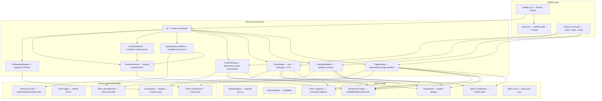

# Detailed Design — Web Portal UX/UI Redesign

## Overview

This document describes the comprehensive UX/UI redesign of the EatMe web portal (`eatMe_v1/apps/web-portal/`). The portal serves two user roles — **Admin** and **Restaurant Owner** — and is built on Next.js 16, React 19, shadcn/ui, and Tailwind CSS 4.

The redesign focuses on modernizing visual presentation, improving layout organization, standardizing component patterns, and fixing usability issues — all without changing routing structure, database schema, or adding new features.

---

## Detailed Requirements

### UX Pain Points to Fix
1. No onboarding progress indicator — users don't know which step they're on
2. Inconsistent error/loading states across pages
3. Destructive actions (delete menu/dish) lack confirmation dialogs
4. Non-functional placeholder features visible in UI (Quick Actions, "Coming Soon" nav items)
5. Draft (localStorage) vs. database data creates user confusion about save state
6. No pagination for tables — will break at scale

### Modernization
- Loading skeletons instead of generic spinners
- Smooth transitions/animations for dialogs and state changes
- Better visual hierarchy — reduce excessive warning banners
- Consistent spacing (standardize card padding, border colors)
- Proper empty states with icons and CTAs
- Keep existing orange brand palette, refine usage

### Organization (Layout + Code)
- Add breadcrumbs/progress stepper to onboarding
- Standardize page layouts (max-widths, header patterns)
- Extract oversized components (DishFormDialog 1,354 lines, BasicInfoPage 1,027 lines)
- Create shared form components (OperatingHoursEditor, CuisineSelector, RestaurantForm)
- Standardize error handling patterns
- Move hardcoded values to shared constants

### Navigation
- Admin: Clean sidebar — remove "Coming Soon" items, reduce security banners to 1
- Restaurant Owner: Add persistent breadcrumbs for multi-step flows
- No route restructuring

### Accessibility (Practical)
- aria-labels on icon-only buttons
- Text labels alongside color-coded status badges
- Replace emoji semantics with Lucide icons + text
- Dialog focus trapping
- Labels on map and time inputs

### Scope
- **In:** Both dashboards, auth pages, onboarding flow, restaurant edit, admin CRUD pages (including restaurant menus page), shared components, global theming
- **Out (light touch):** Menu Scan workflow, OAuth callback, API routes, DB schema, new features

---

## Architecture Overview



---

## Components and Interfaces

### 1. Design Tokens & Constants

#### 1.1 globals.css Refinements

Standardize the spacing and color tokens that are currently inconsistent:

```css
/* Standardized spacing tokens for cards */
--card-padding: 1.5rem;        /* replaces mixed p-3/p-4/p-6 */
--card-padding-compact: 1rem;  /* for dense contexts like table cells */
--section-gap: 1.5rem;         /* replaces mixed space-y-4/space-y-6 */

/* Standardized border */
--border-color: var(--border);  /* single source, replaces gray-200/gray-300 mix */
```

#### 1.2 Shared Constants File (`lib/ui-constants.ts`)

Extract hardcoded values scattered across components:

```typescript
// Ingredient family color map (currently hardcoded in Ingredients page)
export const INGREDIENT_FAMILY_COLORS: Record<string, { bg: string; text: string }> = {
  fish: { bg: "bg-blue-100", text: "text-blue-800" },
  shellfish: { bg: "bg-cyan-100", text: "text-cyan-800" },
  meat: { bg: "bg-red-100", text: "text-red-800" },
  dairy: { bg: "bg-yellow-100", text: "text-yellow-800" },
  // ... all 20+ families
};

// Dietary tag color map (currently hardcoded in DietaryTagBadges)
// Note: includes border class to match existing usage pattern in DietaryTagBadges
export const DIETARY_TAG_COLORS: Record<string, string> = {
  diet: "bg-green-100 text-green-800 border-green-200",
  religious: "bg-purple-100 text-purple-800 border-purple-200",
  health: "bg-blue-100 text-blue-800 border-blue-200",
  lifestyle: "bg-orange-100 text-orange-800 border-orange-200",
};

// Spice level config
export const SPICE_LEVELS = { ... };

// Status badge variants
export const STATUS_VARIANTS = {
  active: { icon: "CheckCircle", bg: "bg-green-100", text: "text-green-800", label: "Active" },
  suspended: { icon: "Ban", bg: "bg-red-100", text: "text-red-800", label: "Suspended" },
  pending: { icon: "Clock", bg: "bg-yellow-100", text: "text-yellow-800", label: "Pending" },
};
```

### 2. New Shared Components

#### 2.1 `PageHeader` Component

Standardizes the inconsistent page headers across admin and owner pages.

```typescript
interface PageHeaderProps {
  title: string;
  description?: string;
  backHref?: string;          // shows back arrow if provided
  breadcrumbs?: { label: string; href?: string }[];
  actions?: React.ReactNode;  // right-aligned buttons
  badge?: { label: string; variant: "default" | "success" | "warning" | "destructive" };
}
```

Replaces the ad-hoc header patterns in every page (some use `<h1>` with inline flex, some use Card headers, some use bare divs).

#### 2.2 `LoadingSkeleton` Component

Replaces all generic spinner-based loading states.

**Prerequisite:** Install shadcn Skeleton primitive first — `npx shadcn@latest add skeleton` (not currently installed).

```typescript
interface LoadingSkeletonProps {
  variant: "card" | "table" | "form" | "stats" | "page";
  count?: number;  // number of skeleton items
}
```

Variants:
- **card**: Rounded rectangle with header line + 2-3 body lines
- **table**: Header row + N body rows with column shimmer
- **form**: Label + input pairs stacked vertically
- **stats**: 3-column grid of metric cards with number placeholders
- **page**: Full page skeleton combining header + content area

Uses shadcn `Skeleton` component internally, composed into layout-appropriate shapes.

#### 2.3 `EmptyState` Component

Replaces blank areas and bare "No items" text.

```typescript
interface EmptyStateProps {
  icon: LucideIcon;
  title: string;
  description: string;
  action?: { label: string; onClick: () => void } | { label: string; href: string };
}
```

Centered layout with muted icon (48px), title, description, and optional CTA button. Used in: empty restaurant lists, empty menus, empty ingredient results, empty dish lists.

#### 2.4 `ConfirmDialog` Component

Wraps shadcn `AlertDialog` for destructive actions.

```typescript
interface ConfirmDialogProps {
  open: boolean;
  onOpenChange: (open: boolean) => void;
  title: string;
  description: string;
  confirmLabel?: string;       // default: "Delete"
  confirmVariant?: "destructive" | "default";
  onConfirm: () => void;
  loading?: boolean;
}
```

Replaces: 8 `window.confirm()` / `confirm()` calls across 3 admin files (RestaurantTable ×3, Ingredients page ×2, admin menus page ×3). Also adds confirmation to 2 unconfirmed delete actions in onboarding menu (menu deletion + dish deletion fire directly with no confirmation). Note: dish-categories already uses AlertDialog correctly — reference pattern.

#### 2.5 `OnboardingStepper` Component

Progress indicator for the 3-step onboarding flow.

```typescript
interface OnboardingStepperProps {
  currentStep: 1 | 2 | 3;
  steps: { label: string; description: string; href: string }[];
}
```

Horizontal stepper with:
- Numbered circles (filled for complete, outlined+highlighted for current, muted for future)
- Step labels below circles
- Connecting lines between steps (colored for progress)
- Clickable completed steps for navigation back

Placed in a shared onboarding layout wrapper above page content.

#### 2.6 `OperatingHoursEditor` Component

Extracted from both the onboarding BasicInfo page and the admin Restaurant Edit/New forms where it's duplicated.

```typescript
interface OperatingHoursEditorProps {
  value: Record<string, { open: string; close: string; closed: boolean }>;
  onChange: (hours: Record<string, { open: string; close: string; closed: boolean }>) => void;
}
```

Features:
- Quick-fill buttons (All days, Weekdays, Weekends)
- Compact day rows with day label, closed toggle, time inputs
- Time inputs with proper aria-labels
- Responsive: stacks on mobile
- Currently duplicated between `/app/onboard/basic-info/page.tsx` and `/app/admin/restaurants/[id]/edit/page.tsx`

#### 2.7 `CuisineSelector` Component

Extracted from BasicInfo and admin restaurant forms.

```typescript
interface CuisineSelectorProps {
  selected: string[];
  onChange: (cuisines: string[]) => void;
  maxDisplay?: number;
}
```

Features:
- Grid of cuisine options with toggle behavior
- Selected cuisines as removable badges above grid
- Search/filter within grid
- Popular vs. All toggle

#### 2.8 `RestaurantForm` Component

Shared form component for **admin new + admin edit pages only**, replacing duplicated form code.

**Note:** This component does NOT serve the restaurant owner edit page or onboarding BasicInfo — those forms have fundamentally different field sets and data persistence (owner edit has only 5 fields + hours with direct Supabase save; onboarding uses localStorage with auto-save). The owner edit page and onboarding BasicInfo reuse the extracted sub-components (OperatingHoursEditor, CuisineSelector) but keep their own form orchestrators.

```typescript
interface RestaurantFormProps {
  mode: "create" | "edit";
  initialData?: Partial<Restaurant>;
  onSubmit: (data: RestaurantFormData) => Promise<void>;
  onCancel: () => void;
}
```

Composed of:
- Basic info section (name, type, description)
- CuisineSelector
- LocationPicker with loading state
- Contact info (phone, website)
- Service options (checkboxes)
- Payment methods (radio group)
- OperatingHoursEditor
- Submit/Cancel footer

Currently the code in `/app/admin/restaurants/new/page.tsx` (779 lines) and `/app/admin/restaurants/[id]/edit/page.tsx` (831 lines) has ~70% overlap — this component eliminates that duplication.

### 3. Refactored Existing Components

#### 3.1 DishFormDialog Decomposition

The current **1,354-line** monolith is split into focused sub-components:

```
DishFormDialog (orchestrator — form provider, mode switching, submission)
├── DishBasicFields (name, description, price prefix, price, calories, portion)
├── DishCategorySelect (category dropdown with async fetch from Supabase)
├── DishDietarySection (dietary tags checkboxes + allergens checkboxes + vegan→vegetarian logic)
├── DishIngredientSection (IngredientAutocomplete + auto-calculated allergens/dietary badges)
├── DishSpiceLevel (spice level radio group with icons)
├── DishOptionsSection (option groups for template/combo/experience dish types)
├── DishVisibilityFields (description_visibility, ingredients_visibility toggles)
├── DishPhotoField (photo URL input — future: upload UI)
└── DishKindSelector (standard/template/experience/combo with conditional sections)
```

Key architectural decisions:
- Each sub-component uses React Hook Form's `useFormContext` — no prop drilling
- The orchestrator (`DishFormDialog`) retains the `FormProvider`, mode detection (wizard vs. DB), and submission logic
- `DishKindSelector` controls which optional sections are visible (option groups only shown for template/combo)
- `DishIngredientSection` manages the ingredient state separately and syncs calculated allergens/dietary tags back to form
- The dual wizard/DB code paths remain in the orchestrator but are simplified into a `submitHandler` factory

#### 3.2 IngredientAutocomplete Improvements

- Add loading skeleton for initial suggestion fetch
- Show inline error if search API fails (not silent)
- Add `aria-label` and `role="combobox"` for accessibility
- Debounce extracted to shared utility

#### 3.3 LocationPicker Improvements

- Add visible loading state while map initializes
- Show toast if geolocation denied (instead of silent fallback to New York)
- Add `aria-label` to map container
- Throttle reverse geocoding calls (max 1 per second)
- Remove console.log statements

#### 3.4 AllergenWarnings & DietaryTagBadges

- **AllergenWarnings.tsx** — Already uses Lucide `AlertTriangle` icon correctly. No emoji replacement needed. No changes required.
- **DietaryTagBadges.tsx** — No emojis present. Only change: migrate hardcoded `getCategoryColor` map to use `DIETARY_TAG_COLORS` from `lib/ui-constants.ts`.
- Add `title` attributes with full allergen/tag names to both components.

**Note:** The actual emoji usage (⚠️, 🌱, 🥬, 🍽️, 🥤) is in other components: `DishCard.tsx`, `IngredientAutocomplete.tsx`, `DishFormDialog.tsx` sub-components (after decomposition), `InlineIngredientSearch.tsx`, and `AddIngredientPanel.tsx`. These are addressed in the accessibility pass.

#### 3.5 ProtectedRoute

- Show redirect message instead of blank page on auth failure
- Add error boundary for auth state errors

#### 3.6 Auth Page Icons

- Replace inline SVGs (147+ lines of Google/Facebook icons) with extracted icon components in `components/icons/OAuthIcons.tsx`

### 4. Page-Level Changes

#### 4.1 Admin Mode

**AdminSidebar:**
- Remove "Coming Soon" items (Users, Settings) with their `opacity-50 cursor-not-allowed` styling
- Reduce security warning panel — single line "Actions are logged" instead of 5-bullet panel
- Keep navigation: Dashboard, Restaurants, Ingredients, Dish Categories, Menu Scan, Audit Logs

**AdminHeader:**
- No significant changes — current design is clean and functional

**Admin Dashboard (`/admin/page.tsx`):**
- Replace spinner loading with `LoadingSkeleton variant="stats"`
- Reduce security reminders section from 5 bullets to 1 concise banner
- Remove or reduce the "System Status: Secure" banner (low information value)
- Keep stats cards and quick action links

**Restaurant List (`/admin/restaurants/page.tsx`):**
- Add pagination (10/25/50 per page selector + page navigation)
- Replace `window.confirm()` delete with `ConfirmDialog`
- Add `LoadingSkeleton variant="table"` for initial load
- Add `EmptyState` when no restaurants match filters
- Use `PageHeader` component

**Restaurant Detail (`/admin/restaurants/[id]/page.tsx`):**
- Use `PageHeader` with breadcrumbs: Admin > Restaurants > {name}
- No major layout changes — current 2/3 + 1/3 grid is effective

**Restaurant Edit/New (`/admin/restaurants/[id]/edit/` and `/admin/restaurants/new/`):**
- Replace with shared `RestaurantForm` component
- Pages become thin wrappers: fetch data, pass to form, handle submit

**Ingredients (`/admin/ingredients/page.tsx`):**
- Replace raw HTML modal overlays with shadcn `Dialog` component
- Use `PageHeader` component
- Add `EmptyState` for empty tables
- Add pagination for large ingredient lists
- Standardize checkbox styling to match shadcn pattern

**Admin Restaurant Menus (`/admin/restaurants/[id]/menus/page.tsx`):**
- Replace 3 `confirm()` calls (lines 248, 331, 363) with `ConfirmDialog` (delete confirmations)
- Use `PageHeader` with breadcrumbs: Admin > Restaurants > {name} > Menus
- Add `EmptyState` for empty menus/categories

**Dish Categories (`/admin/dish-categories/page.tsx`):**
- Use `PageHeader` component
- Add `EmptyState` for empty category lists
- **No ConfirmDialog changes needed** — this page already uses shadcn AlertDialog correctly for both delete and status toggle (lines 427-449). This serves as the reference pattern for ConfirmDialog replacements in other pages.

**Menu Scan (light touch):**
- Standardize card borders/spacing to match design tokens
- Add upload progress indicator for multi-page PDFs
- No workflow changes

**Audit Logs (`/admin/audit/page.tsx` — new file):**
- Create a simple "Coming Soon" page using `EmptyState` component
- Icon: `FileText`, Title: "Audit Logs Coming Soon", Description: "Action logging is active. The audit viewer is under development."

#### 4.2 Restaurant Owner Mode

**Dashboard (`/app/page.tsx`):**
- Remove non-functional Quick Actions cards (Download Template, Settings)
- Replace spinner with `LoadingSkeleton variant="card"`
- Clarify "last saved" label — show "Draft saved locally" vs. "Saved to database" with distinct styling
- Use `PageHeader` component

**Auth Pages (`/app/auth/login/` and `/app/auth/signup/`):**
- Replace inline SVGs with `OAuthIcons` components
- Add real-time validation (email format on login, password strength visual indicator on signup)
- Disable OAuth buttons during loading with spinner
- Standardize error display
- **Note:** "Forgot Password" is out of scope — no password reset functionality exists in the codebase (no route, no `resetPasswordForEmail()` call). Adding it is new feature work.

**Onboarding Layout (new: `/app/onboard/layout.tsx`):**
- Wrap all onboarding steps with `OnboardingStepper` component
- Steps: 1. Basic Info → 2. Menu → 3. Review & Submit
- Persistent across all onboarding pages

**Onboarding Basic Info (`/app/onboard/basic-info/page.tsx`):**

The current **1,027-line** page needs significant decomposition:

```
BasicInfoPage (orchestrator — form provider, auto-save, data loading)
├── BasicInfoFields (name, type, description — simple inputs)
├── CuisineSelector (extracted shared component)
├── LocationSection (LocationPicker + address fields + coordinate display)
├── ContactFields (phone, website)
├── ServiceOptionsSection (delivery, takeout, dine-in, reservations checkboxes + service speed)
├── PaymentMethodsSection (payment method radio/checkbox group)
├── OperatingHoursEditor (extracted shared component)
└── AutoSaveIndicator (shows "Draft saved" with timestamp, fades after 3s)
```

- Auto-save logic stays in orchestrator (uses refs to avoid re-renders)
- Three data loading scenarios (server-side, no user, localStorage) simplified into a `useRestaurantDraft` hook
- Add `LoadingSkeleton` for LocationPicker while it dynamically imports

**Onboarding Menu (`/app/onboard/menu/page.tsx`):**
- Add `ConfirmDialog` for menu deletion — currently `handleDeleteMenu` (line 180) fires immediately with only a toast
- Add `ConfirmDialog` for dish deletion — currently `handleDeleteDish` (line 237) fires immediately with only a toast
- Improve tab overflow for many menus (horizontal scroll with fade indicators)
- Add `EmptyState` for menus with no dishes

**Onboarding Review (`/app/onboard/review/page.tsx`):**
- Add summary stats at top (total menus, total dishes, cuisine count)
- Remove 2-second redirect delay after success — redirect immediately
- Add visual checkmarks for completed sections
- Improve edit button prominence (use filled variant instead of outline)

**Restaurant Edit (`/app/restaurant/edit/page.tsx`):**
- Keep as separate form (only 5 fields + hours — too different from admin's 16+ fields to share `RestaurantForm`)
- Use `OperatingHoursEditor` shared component (replaces inline hours UI)
- Add inline field-level validation errors
- Add unsaved changes warning on navigation away via `beforeunload` event
- Add `PageHeader` with breadcrumb: Dashboard > Edit Restaurant

---

## Data Models

No database schema changes. All changes are UI-only.

**New TypeScript types needed:**

```typescript
// lib/ui-constants.ts
interface ColorVariant {
  bg: string;
  text: string;
}

interface StatusConfig {
  icon: string;
  bg: string;
  text: string;
  label: string;
}

// For pagination
interface PaginationState {
  page: number;
  pageSize: number;
  total: number;
}
```

---

## Error Handling

### Standardized Pattern

All pages should follow this consistent error handling approach:

1. **Form validation errors** → Inline field-level messages (red text below input, using React Hook Form's `formState.errors`)
2. **API/network errors** → Toast notification via Sonner (destructive variant) with retry suggestion
3. **Auth errors** → Redirect to login with return URL
4. **Loading states** → `LoadingSkeleton` appropriate to the content type
5. **Empty states** → `EmptyState` component with contextual CTA

### Current Inconsistencies to Fix

| Page | Current | Target |
|------|---------|--------|
| Login/Signup | Alert component in page | Keep (appropriate for auth) |
| Admin Restaurant Table | `window.confirm()` ×3 | `ConfirmDialog` |
| Admin Ingredients | `confirm()` ×2 + raw HTML modals | `ConfirmDialog` + shadcn `Dialog` |
| Admin Restaurant Menus | `confirm()` ×3 | `ConfirmDialog` |
| Admin Dish Categories | AlertDialog (already correct) | No changes needed (reference pattern) |
| Onboarding Menu | No confirmation for delete (fires directly with toast) | Add `ConfirmDialog` for menu/dish deletion |
| Onboarding BasicInfo | Silent console.error | Toast + retry |
| DishFormDialog | Toast only | Inline field errors + toast for API |
| LocationPicker | Silent fallback | Toast explaining geolocation denial |
| Restaurant Edit | Toast only | Inline field errors + toast for API |

---

## Prerequisites — shadcn Components & Tooling to Install

The following must be installed before implementation begins:

```bash
# shadcn components not yet in the project
npx shadcn@latest add skeleton      # for LoadingSkeleton
npx shadcn@latest add pagination    # for table pagination

# Test infrastructure (no test setup currently exists)
npm install -D vitest @testing-library/react @testing-library/jest-dom @vitejs/plugin-react jsdom
```

A `vitest.config.ts` must be created and a `test` script added to `package.json`.

---

## Testing Strategy

### Test Infrastructure Setup

**No test infrastructure currently exists** — zero test files, no vitest/jest config, no test dependencies. This must be set up as a foundational step before any component work begins.

### Component Tests (Vitest + React Testing Library)

1. **New shared components** — PageHeader, LoadingSkeleton, EmptyState, ConfirmDialog, OnboardingStepper
2. **Extracted components** — OperatingHoursEditor, CuisineSelector, RestaurantForm
3. **Refactored DishFormDialog** sub-components — DishBasicFields, DishCategorySelect, DishDietarySection
4. **Form validation** — test Zod schemas for restaurant forms, dish forms

### Smoke Tests

- Admin dashboard renders with skeleton → loaded state
- Restaurant list renders with pagination controls
- Onboarding stepper shows correct active step
- Empty states render correctly when no data

### No E2E Tests

E2E test infrastructure not in place. Out of scope for this iteration.

---

## Appendices

### A. Technology Choices

| Choice | Rationale |
|--------|-----------|
| Keep shadcn/ui | Already in use, 33 components installed, consistent with Next.js ecosystem |
| Keep Tailwind CSS 4 | Already configured, CSS variables defined, no reason to switch |
| Add Vitest | Lightweight, fast, native ESM support, good React Testing Library integration |
| No Framer Motion | Tailwind CSS transitions sufficient for the animations needed (dialog open/close, skeleton shimmer) |
| No separate design system package | Single app, no shared consumers, in-place improvement is simpler |

### B. Existing Solutions Leveraged

- shadcn `AlertDialog` (already installed) → used for `ConfirmDialog` wrapper
- shadcn `Skeleton` (**to install**) → used inside `LoadingSkeleton` compositions
- shadcn `Pagination` (**to install**) → used for table pagination in admin pages
- shadcn `Dialog` (already installed) → replaces raw HTML modals in Ingredients page
- React Hook Form `useFormContext` → enables DishFormDialog decomposition without prop drilling
- Sonner toast → already the standard for notifications, keep as-is

### C. Alternative Approaches Considered

1. **Full routing restructure** — Rejected. Current `/admin/*` and `/onboard/*` patterns are logical and well-organized.
2. **State management library (Zustand/Jotai)** — Rejected. Current AuthContext + React Hook Form is sufficient. Adding global state for UI would be over-engineering.
3. **Dark mode in this iteration** — Rejected. CSS variables exist but every component uses hardcoded light classes. Would touch every file for little UX value relative to the other improvements.
4. **Full Menu Scan redesign** — Rejected. Most complex page, separate project. Light touch styling only.
5. **Storybook for component documentation** — Rejected. Single app, small team. Component tests provide better value.

### D. Key Constraints and Limitations

- No database schema changes — all improvements are frontend-only
- Menu Scan workflow is too complex for a UX pass — light touch only
- No new feature implementation (audit log viewer, user management, settings)
- Must maintain existing localStorage draft system (removing it would break in-progress onboarding for active users)
- Auth flow unchanged — Supabase PKCE + OAuth integration is stable
