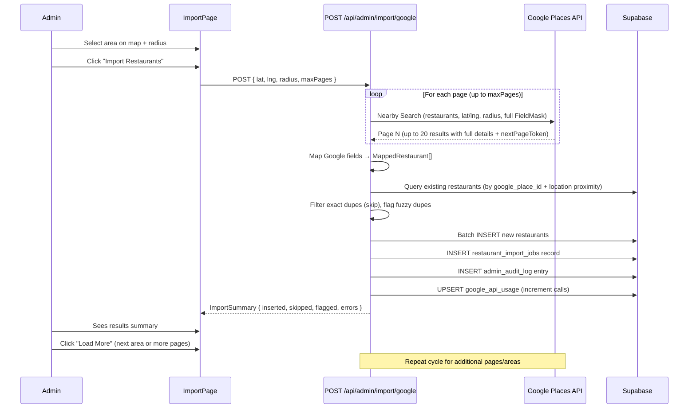
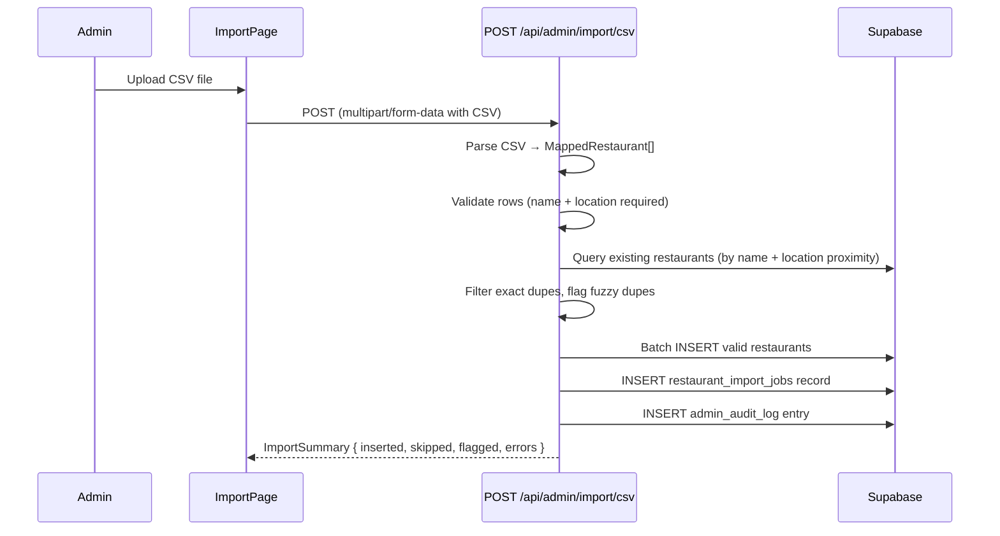

# Detailed Design: Admin Restaurant Data Ingestion

## Overview

This document describes a new admin data ingestion system for the eatMe web portal that enables fast, reliable bulk import of restaurant data. The system uses Google Places API to fetch restaurant metadata for a target area (starting with Mexico) and integrates with the existing GPT-4o menu scanner for dish extraction. A secondary CSV upload path supports importing from non-Google sources.

The primary goal is to replace the current one-at-a-time manual restaurant creation flow with a system that can ingest hundreds of restaurants in minutes, while maintaining data quality through post-import flagging and review.

---

## Detailed Requirements

### Data Sourcing (Q1, Q2)
- **Primary source:** Google Places API (New) for restaurant metadata (name, address, coordinates, phone, website, hours, cuisine types, service options)
- **Menu/dish source:** Existing GPT-4o menu scanner (admin uploads photos per restaurant)
- **Secondary source:** CSV file upload for non-Google data (spreadsheets, partner lists, etc.)
- **Target market:** Mexico (Mexico City, Guadalajara, Monterrey initially)

### Google Places Integration (Q3, Q4, Q14)
- New admin page at `/admin/restaurants/import` with map-based area selection
- Admin picks location + radius → system queries Google Places API → results inserted into DB immediately
- Field mapping from Google Places to our schema (see Data Models section)
- Cost controls: Enterprise Plus tier field mask ($40/1K), max 200 restaurants per search, monthly usage tracking. First 1,000 Enterprise-tier calls/month are free.

### Import Behavior (Q6, Q7, Q9, Q10)
- **No blocking review step** — all fetched restaurants are inserted immediately in a single API call (search + insert combined)
- **Warning flags** computed at query time and shown in admin panel for restaurants needing attention (missing data, duplicates, no menu)
- Partial success: individual API failures or validation errors don't block the batch
- Validation minimum: `name` + `location` (lat/lng) required (always provided by Google). Defaults: `country_code` = "MX", `restaurant_type` = "restaurant"
- Exact `google_place_id` duplicates are silently skipped (not re-inserted)
- Fuzzy name + proximity duplicates are inserted but flagged with `possible_duplicate` warning

### Deduplication (Q5, Q8)
- New `google_place_id` column (nullable, unique) on `restaurants` table
- Exact match on `google_place_id` for re-imports → silently skipped during insert
- Fuzzy name + proximity (200m) match against existing records without a place ID → inserted but flagged
- Deduplication runs inside the insert path, not as a separate preview step

### Menu Scanning Integration (Q11)
- "Scan Menu" action on imported restaurants links to existing `/admin/menu-scan?restaurant_id=xxx`
- Menu-scan page updated to accept `restaurant_id` query parameter for pre-selection

### CSV Upload (Q12)
- Secondary import method at same `/admin/restaurants/import` page (tab: "Google Places" | "CSV Upload")
- Same insert-immediately behavior: CSV is parsed, validated, and inserted in one call
- Results page shows what was imported + flags (same as Google import)
- CSV columns match the Google import field set

### Audit Trail (Q13)
- One `admin_audit_log` entry per import job
- New `restaurant_import_jobs` table for detailed tracking

---

## Architecture Overview

```mermaid
graph TB
    subgraph Admin Portal
        ImportPage["/admin/restaurants/import"]
        RestaurantList["/admin/restaurants"]
        MenuScan["/admin/menu-scan"]
    end

    subgraph API Routes
        ImportGoogleAPI["POST /api/admin/import/google"]
        ImportCsvAPI["POST /api/admin/import/csv"]
    end

    subgraph External
        GoogleAPI["Google Places API"]
    end

    subgraph Database
        Restaurants["restaurants table"]
        ImportJobs["restaurant_import_jobs table"]
        AuditLog["admin_audit_log table"]
        ApiUsage["google_api_usage table"]
    end

    ImportPage -->|area search + import| ImportGoogleAPI
    ImportGoogleAPI -->|Nearby Search + Place Details| GoogleAPI
    GoogleAPI -->|results| ImportGoogleAPI
    ImportGoogleAPI -->|dedup + batch insert| Restaurants
    ImportGoogleAPI -->|job record| ImportJobs
    ImportGoogleAPI -->|audit entry| AuditLog
    ImportGoogleAPI -->|track calls| ApiUsage
    ImportGoogleAPI -->|import summary| ImportPage
    ImportPage -->|CSV file| ImportCsvAPI
    ImportCsvAPI -->|parse + dedup + batch insert| Restaurants
    ImportCsvAPI -->|job record| ImportJobs
    ImportCsvAPI -->|audit entry| AuditLog
    ImportCsvAPI -->|import summary| ImportPage
    RestaurantList -->|warning icons (computed at query time)| Restaurants
    RestaurantList -->|scan menu link| MenuScan
```

### Data Flow — Google Import



### Data Flow — CSV Import



---

## Components and Interfaces

### New Files

#### API Routes

**`app/api/admin/import/google/route.ts`** — Google Places search + insert (single call)
```typescript
// POST /api/admin/import/google
interface GoogleImportRequest {
  lat: number;
  lng: number;
  radius: number;           // meters, default 5000, max 50000
  maxPages?: number;         // default 1, max 10 (20 restaurants per page)
  textQuery?: string;        // optional: "tacos in Roma Norte" — uses Text Search instead of Nearby Search
}

interface ImportSummary {
  jobId: string;
  source: 'google_places' | 'csv';
  inserted: number;
  skipped: number;           // exact google_place_id duplicates
  flagged: number;           // restaurants inserted but with warnings
  errors: ImportError[];     // rows that failed validation or DB insert
  restaurants: ImportedRestaurantSummary[]; // brief info per imported restaurant
  apiCallsUsed: number;
  estimatedCostUsd: number;
}

interface ImportedRestaurantSummary {
  id: string;               // DB uuid
  name: string;
  address: string;
  warnings: WarningFlag[];
  skipped: boolean;
  skipReason?: string;
}
```

**`app/api/admin/import/csv/route.ts`** — CSV upload + parse + insert (single call)
```typescript
// POST /api/admin/import/csv (multipart/form-data)
// Returns ImportSummary (same shape as Google import)
```

#### UI Components

**`app/admin/restaurants/import/page.tsx`** — Main import page with two tabs
- Tab 1: "Google Places" — map area selector + "Import Restaurants" button + results summary
- Tab 2: "CSV Upload" — file drop zone + "Upload & Import" button + results summary

**`components/admin/ImportAreaSelector.tsx`** — Map-based area selection
- Reuses Leaflet map (same as `LocationPicker`)
- Click to place center pin, draggable radius circle
- City name search input as alternative (forward geocode via Nominatim)
- Displays radius in km, adjustable via slider or input
- Optional text query input for targeted search (e.g., "tacos in Roma Norte")

**`components/admin/ImportResultsTable.tsx`** — Post-import results display
- Shows each restaurant from the import: name, address, status (imported / skipped / error), warnings
- Color-coded rows: green (clean import), amber (imported with warnings), grey (skipped duplicate), red (error)
- "Scan Menu" action button per imported restaurant
- Sortable by status to surface flagged items first

**`components/admin/ImportSummaryCard.tsx`** — Summary stats card
- Shows: X imported, Y flagged, Z skipped, W errors, API cost
- Displayed above the results table after import completes

**`components/admin/RestaurantWarningBadge.tsx`** — Warning icon component
- Amber triangle icon with tooltip listing what's missing
- Used in `RestaurantTable` (restaurant list page) and `ImportResultsTable`

#### Library / Service Files

**`lib/google-places.ts`** — Google Places API client
```typescript
// Nearby Search — default for map-pin + radius area queries
// Returns full details directly via FieldMask (no separate Place Details calls needed)
async function nearbySearchRestaurants(
  lat: number, lng: number, radiusMeters: number, pageToken?: string
): Promise<{ places: GooglePlace[]; nextPageToken: string | null }>

// Text Search — for targeted keyword queries ("tacos in Roma Norte")
// Also returns full details via FieldMask
async function textSearchRestaurants(
  query: string, lat: number, lng: number, radiusMeters: number, pageToken?: string
): Promise<{ places: GooglePlace[]; nextPageToken: string | null }>

// Mapping functions
function mapGooglePlaceToRestaurant(
  place: GooglePlace
): MappedRestaurant

function inferCuisineFromGoogleTypes(
  types: string[]
): string[]

function mapGoogleHoursToOpenHours(
  periods: GoogleOpeningHoursPeriod[]
): Record<string, { open: string; close: string }>

function mapAddressComponents(
  components: GoogleAddressComponent[]
): { city?: string; state?: string; postal_code?: string; country_code: string; neighbourhood?: string }

// Cost tracking
async function getMonthlyApiUsage(supabase: SupabaseClient): Promise<{ calls: number; estimatedCost: number }>
async function incrementApiUsage(supabase: SupabaseClient, calls: number): Promise<void>
```

**`lib/import-service.ts`** — Shared import logic for both Google and CSV paths
```typescript
// Core import function used by both API routes
async function importRestaurants(
  restaurants: MappedRestaurant[],
  source: 'google_places' | 'csv',
  adminId: string,
  adminEmail: string,
  supabase: SupabaseClient
): Promise<ImportSummary>
// Internally:
// 1. Validate each restaurant via validateImportedRestaurant()
// 2. Run deduplicateRestaurants() to split into toInsert/toSkip/toFlag
// 3. Build DB rows — set `location` as `{ lat, lng }` jsonb (DO NOT set `location_point`,
//    the DB auto-computes it from `location` via the DEFAULT expression)
// 4. Batch INSERT into `restaurants` table via supabase.from('restaurants').insert(rows)
// 5. Create `restaurant_import_jobs` record
// 6. Write `admin_audit_log` entry:
//    { admin_id, admin_email, action: 'bulk_import', resource_type: 'restaurants',
//      resource_id: jobId, new_data: { source, total_inserted, total_skipped, total_flagged } }
// 7. Return ImportSummary

// Deduplication — runs inside importRestaurants before insert
async function deduplicateRestaurants(
  incoming: MappedRestaurant[],
  supabase: SupabaseClient
): Promise<{ toInsert: MappedRestaurant[]; toSkip: SkippedRestaurant[]; toFlag: MappedRestaurant[] }>

// Warning flag computation — used by restaurant list page at query time
function computeWarningFlags(restaurant: RestaurantRow, dishCount: number): WarningFlag[]
```

**`lib/import-validation.ts`** — Validation for both import paths
```typescript
function validateImportedRestaurant(r: MappedRestaurant): ValidationResult
// Checks: name present, lat/lng valid numbers and in range, restaurant_type in allowed enum,
// country_code valid, cuisine_types are from known list (warn if not), hours format valid
```

**`lib/csv-import.ts`** — CSV parsing and mapping
```typescript
function parseCsvToRestaurants(csvText: string): ParseResult<MappedRestaurant[]>
function generateCsvTemplate(): string
// Uses papaparse for parsing. Maps CSV columns to MappedRestaurant.
// Hours columns (mon_hours..sun_hours) parsed as "HH:MM-HH:MM" or "closed".
// cuisine_types column parsed as semicolon-separated list.
```

### Modified Files

**`components/admin/AdminSidebar.tsx`**
- Add new nav item: "Import" → `/admin/restaurants/import` (icon: `Download` from lucide-react)
- Position: after "Restaurants" item

**`components/admin/RestaurantTable.tsx`**
- Add warning badge in the "Status" column (alongside Active/Suspended badge)
- Warning badge shows `RestaurantWarningBadge` when `computeWarningFlags()` returns non-empty
- New filter option: "Show flagged only" checkbox
- Add "Scan Menu" icon button in actions column (navigates to `/admin/menu-scan?restaurant_id=xxx`)

**`app/admin/restaurants/page.tsx`**
- Fetch dish counts per restaurant (LEFT JOIN or subquery) to support `missing_menu` flag computation
- Pass dish counts to `RestaurantTable` for warning flag calculation
- Add "Flagged only" filter state

**`app/admin/menu-scan/page.tsx`**
- Add `useSearchParams()` hook to read `restaurant_id` query parameter
- On mount: if `restaurant_id` is present, fetch that restaurant and set as `selectedRestaurant`
- Rest of the flow unchanged

**`infra/supabase/migrations/080_restaurant_import.sql`**
- Add `google_place_id` column to `restaurants`
- Create `restaurant_import_jobs` table
- Create `google_api_usage` table
- Add RLS policies

---

## Data Models

### New Database Objects

#### Migration: `080_restaurant_import.sql`

```sql
-- 1. Add google_place_id to restaurants
ALTER TABLE public.restaurants
  ADD COLUMN google_place_id text;

ALTER TABLE public.restaurants
  ADD CONSTRAINT restaurants_google_place_id_key UNIQUE (google_place_id);

CREATE INDEX idx_restaurants_google_place_id
  ON public.restaurants (google_place_id)
  WHERE google_place_id IS NOT NULL;

-- 2. Restaurant import jobs table
CREATE TABLE public.restaurant_import_jobs (
  id uuid PRIMARY KEY DEFAULT gen_random_uuid(),
  admin_id uuid NOT NULL REFERENCES auth.users(id),
  admin_email text NOT NULL,
  source text NOT NULL CHECK (source IN ('google_places', 'csv')),
  status text NOT NULL DEFAULT 'completed'
    CHECK (status IN ('processing', 'completed', 'failed')),
  search_params jsonb,              -- { lat, lng, radius, maxPages } or { filename }
  total_fetched integer DEFAULT 0,
  total_inserted integer DEFAULT 0,
  total_skipped integer DEFAULT 0,
  total_flagged integer DEFAULT 0,
  errors jsonb DEFAULT '[]'::jsonb, -- [{ index, field, message }]
  restaurant_ids uuid[] DEFAULT '{}', -- IDs of inserted restaurants
  api_calls_used integer DEFAULT 0,
  estimated_cost_usd numeric DEFAULT 0,
  created_at timestamptz DEFAULT now(),
  completed_at timestamptz
);

-- RLS: only admins can read/write import jobs (accessed via service role in API routes)
ALTER TABLE public.restaurant_import_jobs ENABLE ROW LEVEL SECURITY;

-- 3. Google API usage tracking
CREATE TABLE public.google_api_usage (
  id uuid PRIMARY KEY DEFAULT gen_random_uuid(),
  month text NOT NULL,              -- "2026-04" format
  api_calls integer DEFAULT 0,
  estimated_cost_usd numeric DEFAULT 0,
  updated_at timestamptz DEFAULT now(),
  UNIQUE (month)
);

-- RLS: admin-only access (accessed via service role in API routes)
ALTER TABLE public.google_api_usage ENABLE ROW LEVEL SECURITY;

-- Note: Both tables are accessed exclusively through server-side API routes
-- using the service role key (supabase-server.ts), so no per-user RLS policies
-- are needed. RLS is enabled to prevent accidental anonymous/authenticated access.
```

### Warning Flags — Computed at Query Time

Warning flags are **not stored** in the database. They are computed at query time when the restaurant list is loaded, based on the current state of the restaurant record and its related data. This ensures flags are always fresh (e.g., a `missing_menu` flag disappears as soon as dishes are added).

```typescript
// lib/import-service.ts

type WarningFlag =
  | 'missing_cuisine'      // cuisine_types is empty array
  | 'missing_hours'        // open_hours is empty or null
  | 'missing_contact'      // both phone and website are null/empty
  | 'missing_menu'         // no dishes linked to this restaurant
  | 'possible_duplicate';  // fuzzy name + proximity match exists (checked at import time, stored in import job)

function computeWarningFlags(
  restaurant: RestaurantRow,
  dishCount: number
): WarningFlag[] {
  const flags: WarningFlag[] = [];
  if (!restaurant.cuisine_types?.length) flags.push('missing_cuisine');
  if (!restaurant.open_hours || Object.keys(restaurant.open_hours).length === 0) flags.push('missing_hours');
  if (!restaurant.phone && !restaurant.website) flags.push('missing_contact');
  if (dishCount === 0) flags.push('missing_menu');
  return flags;
}
```

**Restaurant list page query** to support flag computation:
```sql
SELECT r.*,
  (SELECT COUNT(*) FROM dishes d WHERE d.restaurant_id = r.id) AS dish_count
FROM restaurants r
ORDER BY r.created_at DESC;
```

Note: `possible_duplicate` is determined at import time and stored in the `restaurant_import_jobs.errors` jsonb. It is not re-computed at query time (too expensive for every list load).

### TypeScript Types

```typescript
// Shared import types — lib/import-types.ts

interface MappedRestaurant {
  // From Google Places or CSV
  name: string;
  address: string;
  latitude: number;
  longitude: number;
  phone?: string;
  website?: string;
  restaurant_type: string;
  cuisine_types: string[];
  country_code: string;
  city?: string;
  state?: string;
  postal_code?: string;
  neighbourhood?: string;
  open_hours?: Record<string, { open: string; close: string }>;
  delivery_available?: boolean;
  takeout_available?: boolean;
  dine_in_available?: boolean;
  accepts_reservations?: boolean;
  payment_methods?: string;
  google_place_id?: string;
}

type WarningFlag =
  | 'missing_cuisine'
  | 'missing_hours'
  | 'missing_contact'
  | 'missing_menu'
  | 'possible_duplicate';

interface ImportSummary {
  jobId: string;
  source: 'google_places' | 'csv';
  inserted: number;
  skipped: number;
  flagged: number;
  errors: ImportError[];
  restaurants: ImportedRestaurantSummary[];
  apiCallsUsed: number;
  estimatedCostUsd: number;
}

interface ImportedRestaurantSummary {
  id: string;
  name: string;
  address: string;
  warnings: WarningFlag[];
  skipped: boolean;
  skipReason?: string;
}

interface ImportError {
  index: number;
  field?: string;
  message: string;
}

interface SkippedRestaurant {
  name: string;
  google_place_id?: string;
  reason: 'exact_duplicate' | 'validation_error';
  existingId?: string;
}
```

### Google Places API Field Mask

Nearby Search (New) and Text Search (New) return all requested fields directly via the `X-Goog-FieldMask` header — **no separate Place Details calls are needed**. The billing tier is determined by the highest-tier field requested.

**SKU Tier breakdown (post-March 2025 pricing):**
- **Essentials:** `id`, `displayName`, `formattedAddress`, `location`, `types`, `primaryType`, `addressComponents`
- **Enterprise ($35/1K, 1,000 free/month):** `regularOpeningHours`, `nationalPhoneNumber`, `websiteUri`
- **Enterprise Plus ($40/1K):** `dineIn`, `delivery`, `takeout`, `reservable`

We request Enterprise Plus fields to get service options — the incremental cost is negligible at our volume:

```typescript
const FIELD_MASK = [
  // Essentials tier
  'places.id',                        // Google place ID
  'places.displayName',               // Restaurant name
  'places.formattedAddress',          // Full address string
  'places.location',                  // lat/lng
  'places.types',                     // Place types (for cuisine inference)
  'places.primaryType',               // Primary type
  'places.addressComponents',         // Structured address parts
  // Enterprise tier
  'places.regularOpeningHours',       // Hours
  'places.nationalPhoneNumber',       // Phone
  'places.websiteUri',                // Website
  // Enterprise Plus tier
  'places.dineIn',                    // Service options
  'places.delivery',
  'places.takeout',
  'places.reservable',
].join(',');
```

### Google Type → Cuisine Mapping

```typescript
const GOOGLE_TYPE_TO_CUISINE: Record<string, string> = {
  'mexican_restaurant': 'Mexican',
  'italian_restaurant': 'Italian',
  'chinese_restaurant': 'Chinese',
  'japanese_restaurant': 'Japanese',
  'thai_restaurant': 'Thai',
  'indian_restaurant': 'Indian',
  'french_restaurant': 'French',
  'korean_restaurant': 'Korean',
  'vietnamese_restaurant': 'Vietnamese',
  'greek_restaurant': 'Greek',
  'turkish_restaurant': 'Turkish',
  'lebanese_restaurant': 'Lebanese',
  'spanish_restaurant': 'Spanish',
  'brazilian_restaurant': 'Brazilian',
  'american_restaurant': 'American',
  'mediterranean_restaurant': 'Mediterranean',
  'seafood_restaurant': 'Seafood',
  'steak_house': 'Steakhouse',
  'sushi_restaurant': 'Sushi',
  'pizza_restaurant': 'Pizza',
  'hamburger_restaurant': 'American',
  'barbecue_restaurant': 'BBQ',
  'vegan_restaurant': 'Vegan',
  'vegetarian_restaurant': 'Vegetarian',
  'ramen_restaurant': 'Japanese',
  'breakfast_restaurant': 'Breakfast',
  'brunch_restaurant': 'Brunch',
  'cafe': 'Cafe',
  'bakery': 'Bakery',
  'ice_cream_shop': 'Desserts',
  // Fallback: if no matching type found, cuisine_types left empty → flagged as missing_cuisine warning
};
```

### Google Type → Restaurant Type Mapping

```typescript
const GOOGLE_TYPE_TO_RESTAURANT_TYPE: Record<string, string> = {
  'restaurant': 'restaurant',
  'cafe': 'cafe',
  'coffee_shop': 'cafe',
  'bakery': 'bakery',
  'bar': 'restaurant',
  'pub': 'restaurant',
  'meal_takeaway': 'restaurant',
  'fast_food_restaurant': 'self_service',
  'food_court': 'self_service',
  // Default: 'restaurant'
};
```

### Google Hours → Open Hours Conversion

```typescript
// Google Places regularOpeningHours.periods[] format:
// { open: { day: 0-6, hour: 9, minute: 0 }, close: { day: 0-6, hour: 21, minute: 0 } }
// day: 0=Sunday, 1=Monday, ..., 6=Saturday

// Our DB format (open_hours jsonb):
// { monday: { open: "09:00", close: "21:00" }, tuesday: { ... }, ... }
// Days with no entry are considered closed.

const GOOGLE_DAY_TO_KEY = [
  'sunday', 'monday', 'tuesday', 'wednesday',
  'thursday', 'friday', 'saturday'
];

// Edge cases to handle:
// - 24h restaurants: Google returns open.hour=0, close.hour=0 on next day → store as "00:00-23:59"
// - Overnight hours: close.day != open.day (e.g., Fri open 18:00, close Sat 02:00) → store close as "02:00" on open day
// - Multiple periods per day (e.g., lunch 11-14, dinner 18-22): merge into single range using earliest open + latest close
// - Missing hours: regularOpeningHours is null → open_hours stored as empty {} → flagged as missing_hours
```

### CSV Template

```csv
name,address,latitude,longitude,phone,website,restaurant_type,cuisine_types,country_code,city,state,postal_code,mon_hours,tue_hours,wed_hours,thu_hours,fri_hours,sat_hours,sun_hours
Taquería El Paisa,Av Insurgentes Sur 1234 CDMX,19.3910,-99.1670,+525512345678,https://example.com,restaurant,Mexican,MX,Mexico City,CDMX,06600,08:00-22:00,08:00-22:00,08:00-22:00,08:00-22:00,08:00-23:00,09:00-23:00,09:00-20:00
Café Oaxaca,Calle 5 de Mayo 45,17.0614,-96.7258,,,,Mexican;Cafe,MX,Oaxaca,Oaxaca,68000,,,,,,,
```

---

## Error Handling

### Google Places API Errors
| Error | Handling |
|-------|----------|
| 429 Rate Limit | Exponential backoff, retry up to 3 times. UI shows "rate limited, retrying..." |
| 400 Invalid Request | Log error, report in ImportSummary.errors, continue with other pages |
| 403 Quota Exceeded | Stop search immediately, return partial results with warning and monthly usage stats |
| Network timeout | Retry once, then report page as error, continue with remaining pages |
| Empty results | Return ImportSummary with inserted=0 and message "No restaurants found in this area" |

### Import / Insert Errors
| Error | Handling |
|-------|----------|
| Missing required field (name or location) | Skip row, report in errors array with field name |
| Duplicate `google_place_id` (UNIQUE constraint violation) | Silently skip, increment `skipped` count, include in restaurants[] with `skipped: true` |
| Fuzzy duplicate detected (name + proximity) | Insert anyway, add `possible_duplicate` to warnings, increment `flagged` count |
| Individual DB insert failure | Log error, skip row, continue with remaining rows |
| Supabase connection failure | Abort batch, return error with count of already-inserted rows |
| Invalid `restaurant_type` or `country_code` | Apply default ("restaurant" / "MX"), log warning |

### CSV Parse Errors
| Error | Handling |
|-------|----------|
| Invalid CSV structure (can't parse) | Reject file, return error message |
| Missing required columns (`name`) | Reject file, list missing columns |
| Invalid field value (e.g., lat > 90) | Skip row, report in errors array |
| Empty file or header only | Return error "CSV file contains no data rows" |
| Encoding issues | Attempt UTF-8 first, fall back to Latin-1 (common for Mexican data), warn if ambiguous |

---

## Testing Strategy

### Unit Tests (Vitest)

**`lib/google-places.test.ts`**
- `mapGooglePlaceToRestaurant()` — correct field mapping for complete Google data, sparse data (missing hours, phone), and edge cases
- `inferCuisineFromGoogleTypes()` — all known type mappings, multiple types yielding multiple cuisines, unknown types returning empty array
- `mapGoogleHoursToOpenHours()` — standard hours, overnight hours (close after midnight), 24h restaurants, missing hours (null), multiple periods per day
- `mapAddressComponents()` — Mexican addresses (delegación, colonia, estado), missing components, unusual structures
- `nearbySearchRestaurants()` — mock fetch, verify correct URL + headers + field mask, handle pagination token
- `getPlaceDetails()` — mock fetch, verify batch behavior, handle partial failures

**`lib/import-service.test.ts`**
- `importRestaurants()` — full flow with mock Supabase: inserts valid rows, skips exact dupes, flags fuzzy dupes, creates job record and audit entry
- `deduplicateRestaurants()` — exact place_id match, fuzzy name within 200m, fuzzy name beyond 200m (no match), no existing data
- `computeWarningFlags()` — all individual flags, combined flags, restaurant with no flags (clean)

**`lib/import-validation.test.ts`**
- `validateImportedRestaurant()` — valid data, missing name, missing location, invalid lat/lng (out of range, NaN), invalid restaurant_type (falls back to default), empty cuisine_types (valid but flagged)

**`lib/csv-import.test.ts`**
- `parseCsvToRestaurants()` — valid CSV, missing optional columns (graceful defaults), missing required column (error), empty rows skipped, special characters in names (accents, ñ), semicolon-separated cuisine types
- Hours parsing: valid "HH:MM-HH:MM", "closed", empty (null), invalid format (error)
- Encoding: UTF-8 with BOM, Latin-1 encoded file

### Integration Tests

**`app/api/admin/import/google/route.test.ts`**
- Auth verification (reject non-admin, reject unauthenticated)
- Successful import flow (mock Google API + real Supabase test client)
- Pagination: multiple pages fetched and inserted
- Deduplication: re-import same area, verify skips
- API usage tracking: counter incremented correctly
- Partial failure: one Google Place Details call fails, rest succeed

**`app/api/admin/import/csv/route.test.ts`**
- Auth verification
- Valid CSV upload → correct InsertSummary
- Invalid CSV → error response
- Deduplication against existing DB records
- Job record and audit log creation

### Component Tests

**`components/admin/ImportAreaSelector.test.tsx`**
- Map renders with default center
- Click on map sets center pin
- Radius slider updates circle
- City search input triggers Nominatim geocode and centers map

**`components/admin/ImportResultsTable.test.tsx`**
- Renders rows with correct status colors (green/amber/grey/red)
- "Scan Menu" button present for imported restaurants
- Skipped rows show skip reason
- Warning badges show correct tooltip text

**`components/admin/RestaurantWarningBadge.test.tsx`**
- Renders amber triangle for each warning type
- Tooltip lists all active flags
- Not rendered when no flags

**`components/admin/RestaurantTable.test.tsx` (modified)**
- Warning badge appears for restaurants with flags
- "Flagged only" filter works correctly
- "Scan Menu" action button navigates to correct URL

---

## Appendices

### A. Technology Choices

| Choice | Rationale |
|--------|-----------|
| Google Places API (REST, no SDK) | No `@googlemaps/places` package needed. REST calls via `fetch()` in API routes are simpler, avoid SDK dependency, and give full control over field masking and cost. |
| Nearby Search (default) + Text Search (optional) | Nearby Search is purpose-built for "restaurants within radius of lat/lng" — more precise than Text Search for area queries. Text Search available as option for keyword queries like "tacos in Roma Norte". Both return full details via FieldMask — no separate Place Details calls needed. |
| Enterprise Plus tier (not Enterprise) | Requesting `dineIn`, `delivery`, `takeout`, `reservable` pushes from Enterprise ($35/1K) to Enterprise Plus ($40/1K). Worth the ~$0.38 difference per 1,500 restaurants to get real service option data instead of defaulting. |
| `papaparse` for CSV parsing | Most popular CSV parser for JS. Handles edge cases (quoted fields, encoding, BOM). Lightweight. |
| Leaflet for area selection | Already in project (`leaflet: ^1.9.4`). Reuse `LocationPicker` patterns. No Google Maps JS SDK needed. |
| New `restaurant_import_jobs` table | Follows existing `menu_scan_jobs` pattern. Separate from audit log for detailed tracking. |
| Server-side Google API calls only | API key stays server-side (API routes only). No client-side exposure. Accessed via `GOOGLE_PLACES_API_KEY` env var (must be added to `.env.local` for dev and deployment environment for production). |
| Warning flags computed at query time | Always fresh — no stale flags after admin edits a restaurant. Avoids maintaining a separate flags column. Cost: one subquery per restaurant list load (dish count). |

### B. Research Findings Summary

- **Google Places API** provides the best restaurant metadata quality globally, with good Mexico coverage. Post-March 2025 pricing uses per-SKU free tiers (1,000 free Enterprise calls/month) instead of the old $200/mo credit.
- **Google Places Nearby Search (New)** is the correct endpoint for area-based queries (lat/lng + radius). Text Search is for keyword-based queries. Both return full details via FieldMask — no separate Place Details calls needed, which dramatically reduces cost (~$1 per 500 restaurants vs ~$18 with the two-step approach).
- **Google Maps menu data** (`businessMenus`) has poor coverage in Mexico — most restaurants haven't opted in. Not viable as primary menu source.
- **Google Photos API** provides no type/category filtering — cannot programmatically extract menu photos vs food photos vs interior photos.
- **Existing GPT-4o scanner** already handles Spanish menus well (translation, dietary mapping for "vegetariano", "sin gluten", etc.) — best option for dish extraction.
- **Delivery platform scraping** (Rappi, Uber Eats) has structured menu data but violates platform ToS — ruled out.
- **OpenStreetMap** is free but incomplete in Mexico — not reliable as primary source.
- Mexico's top food delivery platforms by usage: Uber Eats (38.2%), DiDi Food (29.1%), Rappi (21.3%).

### C. Alternative Approaches Considered

1. **Delivery platform scraping as primary** — Better menu data but ToS grey area. Rejected for legal risk.
2. **OpenStreetMap as primary** — Free but data quality too variable in Mexico. Could supplement Google data in future.
3. **Manual-only with better forms** — Quick-add form improvement. Doesn't solve scale problem. Included as CSV secondary path.
4. **Full preview/approval gate before import** — Slows down ingestion. Replaced with post-import flagging per user preference.
5. **Combined restaurant + menu import** — Too complex for single CSV. Decoupled into two phases.
6. **Google Places SDK (`@googlemaps/places`)** — Adds dependency for no benefit. REST calls via `fetch()` are simpler and give full control.
7. **Stored warning flags column** — Would go stale when admin edits a restaurant. Computed-at-query-time is always accurate.

### D. Cost Projections

Nearby Search (New) returns full details via FieldMask — no separate Place Details calls needed. Billed per search request at Enterprise Plus rate ($40/1K). First 1,000 Enterprise-tier calls/month are free (Enterprise Plus free limits TBC — assume no free tier for conservative estimate).

| Scenario | API Calls (search only) | Est. Cost (Enterprise Plus $40/1K) | Notes |
|----------|------------------------|-----------------------------------|-------|
| Seed 1 city (500 restaurants) | ~25 calls | **$1.00** | Well under any free limit |
| Seed 3 cities (1,500 restaurants) | ~75 calls | **$3.00** | Likely covered by free tier |
| Seed 10 cities (5,000 restaurants) | ~250 calls | **$10.00** | |
| Seed 50 cities (25,000 restaurants) | ~1,250 calls | **$50.00** | |
| Monthly refresh (re-check 5,000) | ~250 calls | **$10.00** | |

All scenarios are extremely affordable. Even seeding 50 cities costs only $50/month — an order of magnitude cheaper than the old two-step (search + details) approach.
