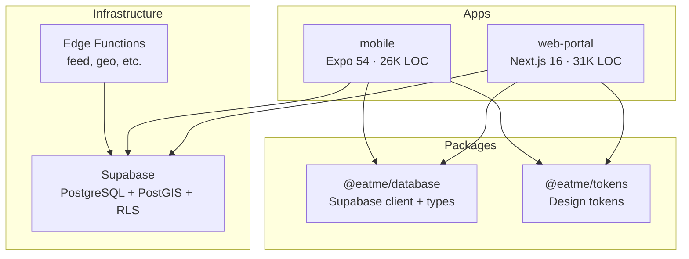
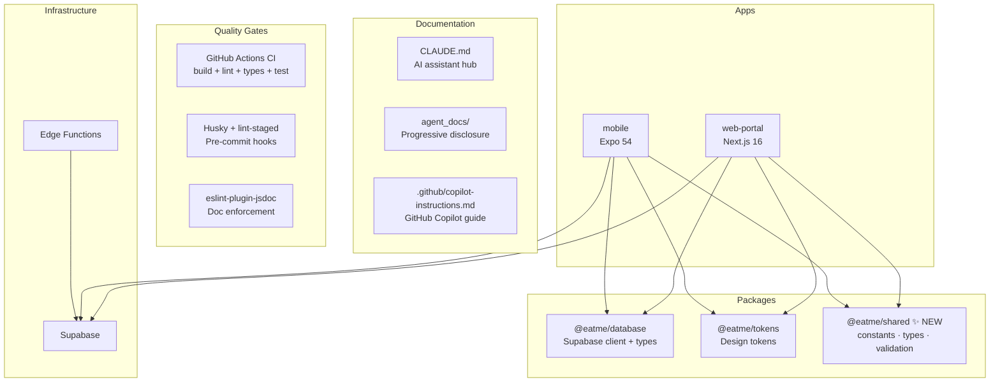
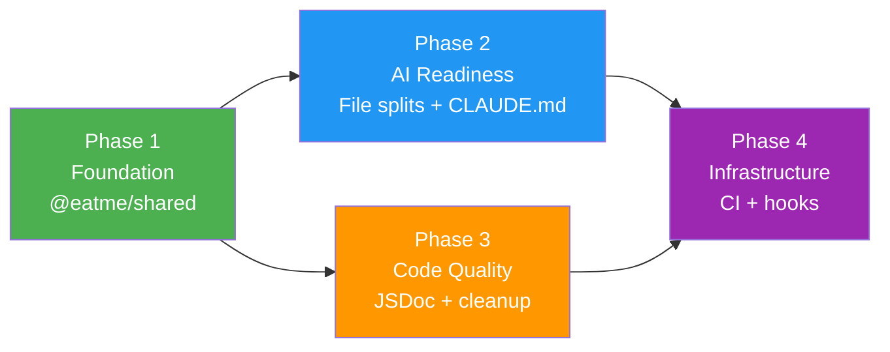
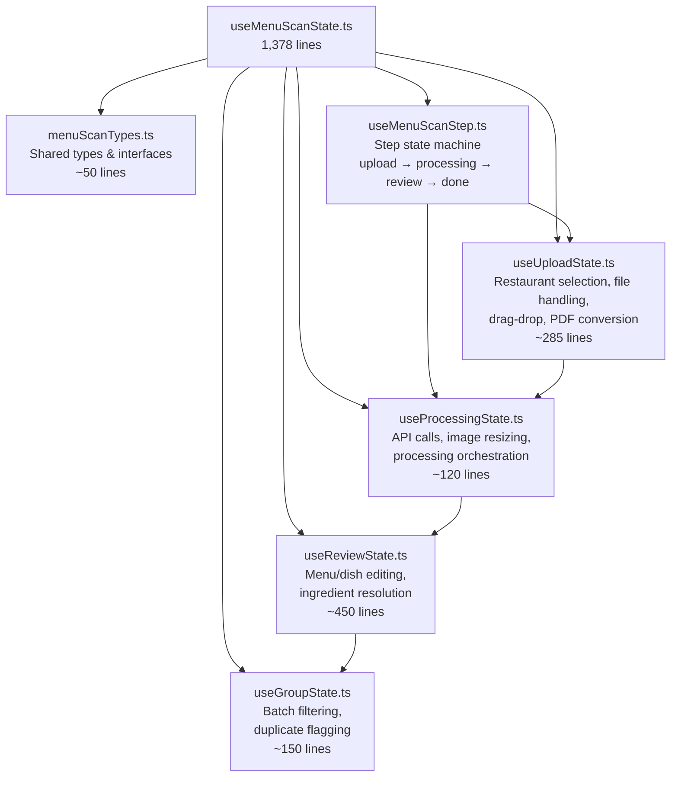
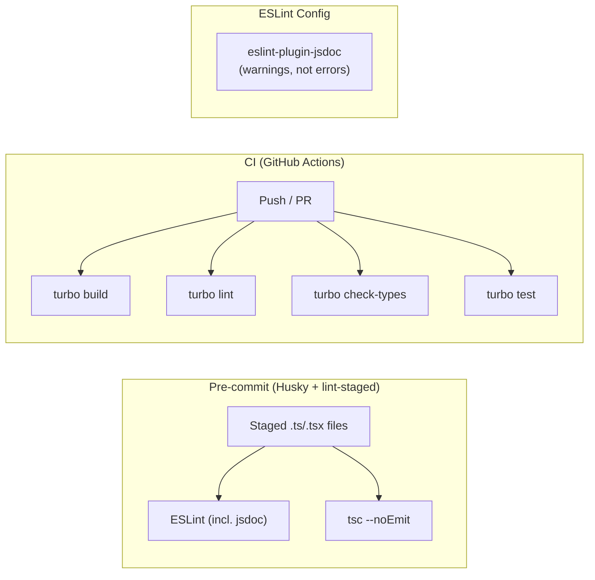

# Detailed Design: eatMe Codebase Refactor

## 1. Overview

This document describes a comprehensive refactoring of the eatMe monorepo (~68K LOC across 358 files) to improve code quality, AI-friendliness, comment coverage, and developer productivity while reducing lines of code. The refactor is structured as four independent, incrementally shippable phases — each delivering measurable value without blocking the others.

**Goals:**
1. Eliminate ~800 LOC of duplication by extracting shared constants, types, and validation into a new `@eatme/shared` package
2. Expand the AI-ready surface by splitting 4 oversized files (1,000+ lines each) into focused, composable modules
3. Raise JSDoc coverage from 49 annotations to comprehensive coverage on all exports
4. Reduce ~1,750 LOC through deduplication, dead code removal, and style factory simplification
5. Establish automated quality gates (CI, pre-commit hooks, linting)
6. Create CLAUDE.md with progressive disclosure for AI-assisted development

**Non-goals:**
- Feature changes or new functionality
- Database schema modifications
- Mobile test suite (deferred to future initiative)
- Migration to different frameworks or libraries

---

## 2. Detailed Requirements

### 2.1 Code Quality
- **R1:** Create `@eatme/shared` package with constants, types, and validation schemas currently duplicated between web portal and mobile
- **R2:** Merge divergent constant lists (mobile has 4 extra cuisines: "Asian", "Comfort Food", "Fine Dining", "International") into a single canonical source
- **R3:** Remove all manually-synced code (identified by "Keep in sync" comments)
- **R4:** Centralize form validation schemas (currently in `apps/web-portal/lib/validation.ts`, 161 lines) into shared validation module. Note: some components also define local Zod schemas (e.g., `RestaurantForm.tsx`) — these should consolidate into the shared module too
- **R5:** Remove dead code: console.log statements (5+ instances), commented-out code, unused dependencies (`baseline-browser-mapping`)

### 2.2 AI Friendliness
- **R6:** Create concise CLAUDE.md (<100 lines) at project root with progressive disclosure via `agent_docs/` directory. Also update `.github/copilot-instructions.md` which has stale references (nonexistent packages, wrong Next.js version, outdated test status)
- **R7:** Split `useMenuScanState.ts` (1,378 lines) into 5-6 focused hooks
- **R8:** Split `MenuScanReview.tsx` (1,265 lines) into 6-7 focused components
- **R9:** Split `RestaurantDetailScreen.tsx` (1,003 lines) into 8-9 focused modules
- **R10:** Restructure `common.ts` (1,202 lines) into ~10 style modules with systematic factory composition
- **R11:** Maintain barrel export compatibility so no external imports break

### 2.3 Comment Coverage
- **R12:** Add JSDoc (`@param`, `@returns`, `@throws`) to all exported functions across all packages
- **R13:** Document all magic numbers with rationale (filter store price defaults, scoring weights, error codes)
- **R14:** Add module-level doc comments explaining purpose to all source files
- **R15:** Follow existing good patterns: `packages/database/src/client.ts` (WHY explanations), `apps/mobile/src/services/ratingService.ts` (full JSDoc)
- **R16:** Add `eslint-plugin-jsdoc` as warnings (not errors) for incremental adoption

### 2.4 LOC Reduction
- **R17:** ~800 LOC savings from shared package extraction (deduplication)
- **R18:** ~600 LOC savings from mobile style factory simplification
- **R19:** ~200 LOC savings from verbose pattern cleanup (optional chaining, nullish coalescing, destructuring)
- **R20:** ~100 LOC savings from test mock consolidation into shared utilities
- **R21:** ~50 LOC savings from dead code and console.log removal

### 2.5 Developer Productivity
- **R22:** Add `test` task to `turbo.json` pipeline (currently only has `build`, `lint`, `check-types`, `dev` — no test task despite web-portal having `"test": "vitest"` in its scripts)
- **R23:** Create GitHub Actions CI workflow running build + lint + check-types + test
- **R24:** Add pre-commit hooks via Husky + lint-staged
- **R25:** Configure `eslint-plugin-jsdoc` in ESLint config for both apps

---

## 3. Architecture Overview

### 3.1 Current Monorepo Structure



### 3.2 Target Monorepo Structure (Post-Refactor)



### 3.3 Phase Dependency Flow



Phases 2 and 3 can run in parallel after Phase 1 completes. Phase 4 depends on both.

---

## 4. Components and Interfaces

### 4.1 New Package: `@eatme/shared`

```
packages/shared/
├── package.json
├── tsconfig.json
├── src/
│   ├── index.ts                     # Re-exports everything
│   ├── constants/
│   │   ├── index.ts                 # Barrel export
│   │   ├── cuisine.ts               # POPULAR_CUISINES, CUISINES/ALL_CUISINES (canonical merged list)
│   │   ├── dietary.ts               # DIETARY_TAGS, ALLERGENS, RELIGIOUS_REQUIREMENTS
│   │   ├── menu.ts                  # MENU_CATEGORIES, DISH_KINDS, SELECTION_TYPES, OPTION_PRESETS
│   │   ├── pricing.ts               # PRICE_RANGES, SPICE_LEVELS, DISPLAY_PRICE_PREFIXES
│   │   ├── restaurant.ts            # RESTAURANT_TYPES, PAYMENT_METHOD_OPTIONS, SERVICE_SPEED_OPTIONS, COUNTRIES
│   │   ├── calendar.ts              # DAYS_OF_WEEK, DayKey type
│   │   └── wizard.ts                # WIZARD_STEPS (web portal onboarding wizard)
│   ├── types/
│   │   ├── index.ts                 # Barrel export
│   │   └── restaurant.ts            # Location, SelectedIngredient, DishKind, ScheduleType, DisplayPricePrefix,
│   │                                # Option, OptionGroup, OperatingHours, DishCategory, Dish, Menu,
│   │                                # RestaurantType, RestaurantBasicInfo, PaymentMethods,
│   │                                # RestaurantOperations, RestaurantData, WizardStep, FormProgress
│   └── validation/
│       ├── index.ts                 # Barrel export
│       └── restaurant.ts            # basicInfoSchema, operationsSchema, dishSchema, menuSchema, restaurantDataSchema (Zod, 161 lines)
```

**package.json:**
```json
{
  "name": "@eatme/shared",
  "version": "0.0.1",
  "main": "./src/index.ts",
  "types": "./src/index.ts",
  "peerDependencies": {
    "zod": "^3.0.0"
  },
  "peerDependenciesMeta": {
    "zod": { "optional": true }
  }
}
```

**Integration points:**
- Add `"@eatme/shared": "workspace:*"` to both apps' `package.json`
- Add `"@eatme/shared"` to `next.config.ts` `transpilePackages` array (currently only has `@eatme/database`)
- No changes needed to `pnpm-workspace.yaml` — it already includes `packages/*` which will pick up `packages/shared/`
- Update all imports from local constants/types to `@eatme/shared`
- Remove local copies: `apps/web-portal/lib/constants.ts` (372 lines), `apps/web-portal/types/restaurant.ts`, `apps/mobile/src/constants/index.ts`
- Keep `apps/mobile/src/constants/icons.ts` — it contains platform-specific emoji/icon mappings that belong in the mobile app, not the shared package

### 4.2 File Splitting: useMenuScanState.ts → 6 hooks

**Context:** The `menu-scan/components/` directory already has separate component files for each step (`MenuScanUpload.tsx`, `MenuScanProcessing.tsx`, `MenuScanDone.tsx`, `MenuScanReview.tsx`). The single `useMenuScanState.ts` hook serves all of them — splitting it aligns hooks with their consuming components.



New hooks go in `app/admin/menu-scan/hooks/`. Names avoid `useMenuScan*` prefix collision with existing component filenames in `components/`.

Each hook is self-contained with its own types, state, and callbacks. A coordinator hook (`useMenuScan.ts`) composes them and exposes the unified API to the page component.

### 4.3 File Splitting: MenuScanReview.tsx → 7 components

```
app/admin/menu-scan/components/
├── MenuScanReview.tsx          # Slim orchestrator (~100 lines)
├── ReviewHeader.tsx            # Title, dish count, Re-scan/Save buttons (~40 lines)
├── ReviewLeftPanel.tsx         # Images + Details tab container (~140 lines)
├── ImageCarousel.tsx           # Image preview, pagination (~90 lines)
├── RestaurantDetailsForm.tsx   # Address, city, location picker (~90 lines)
├── MenuExtractionList.tsx      # Menu/category/dish rendering (~450 lines)
├── DishEditPanel.tsx           # Expanded dish details, ingredients (~300 lines)
└── ImageZoomLightbox.tsx       # Full-screen image viewer (~60 lines)
```

### 4.4 File Splitting: RestaurantDetailScreen.tsx → 9 modules

```
mobile/src/screens/restaurant-detail/
├── index.tsx                   # Re-export (barrel)
├── RestaurantDetailScreen.tsx  # Slim orchestrator (~120 lines)
├── useRestaurantDetail.ts      # All state, loading, rating, favorites (~200 lines)
├── RestaurantMetadata.ts       # Helper fns: getCurrentDayHours, getPaymentNote (~40 lines)
├── DishGrouping.ts             # groupDishesByParent logic (~50 lines)
├── DishFiltering.ts            # sortDishesByFilter, classifyDish (~30 lines)
├── RestaurantHeader.tsx        # Name, info, favorite toggle, actions (~150 lines)
├── RestaurantHourSection.tsx   # Hours display with expandable state (~100 lines)
├── MenuCategorySection.tsx     # Category tabs, lazy-loaded dishes (~200 lines)
├── DishCard.tsx                # Individual dish display (~100 lines)
└── DishDetailModal.tsx         # Selected dish expanded view (~150 lines)
```

**Barrel export update:** `apps/mobile/src/screens/index.ts` continues to export `RestaurantDetailScreen` from the new subdirectory — no external import changes needed.

### 4.5 File Restructuring: common.ts → focused style modules

**Context:** `mobile/src/styles/` already has a well-structured barrel export (`index.ts`, 67 lines) that re-exports from `common.ts`, `theme.ts`, `filters.ts`, `map.ts`, `navigation.ts`, and `restaurantDetail.ts`. It also maintains a backward-compatible `commonStyles` object. The refactor targets only `common.ts` (1,202 lines), preserving the existing barrel API.

```
mobile/src/styles/
├── index.ts              # EXISTING — update imports, keep backward-compatible commonStyles object
├── theme.ts              # EXISTING — unchanged
├── filters.ts            # EXISTING — unchanged
├── map.ts                # EXISTING — unchanged
├── navigation.ts         # EXISTING — unchanged
├── restaurantDetail.ts   # EXISTING — unchanged
├── factories.ts          # NEW — createFlex, createPadding, createBorder, createText, createShadow (~80 lines)
├── atomic.ts             # NEW — atomic style definitions using factories (~40 lines)
├── bases.ts              # NEW — modalBase, filterBase, buttonBase patterns (~120 lines)
├── containers.ts         # NEW — screen, section, row, center containers (~40 lines)
├── typography.ts         # NEW — text hierarchy: h1-h3, body, small, link, error (~60 lines)
├── buttons.ts            # NEW — button variants including icon buttons (~50 lines)
├── forms.ts              # NEW — form fields, inputs, settings items (~80 lines)
├── cards.ts              # NEW — card containers, elevated, headers (~30 lines)
├── modals.ts             # NEW — modal-specific styles (~150 lines)
└── spacing.ts            # NEW — margin/padding utilities (~60 lines)
```

**Consolidation:** Split `common.ts` into 10 focused modules. Target ~600 LOC reduction (R18) through: (1) systematic factory composition replacing duplicated property sets in `modalBase`, `filterBase`, etc., (2) elimination of redundant style definitions across the 16 original StyleSheet exports, and (3) removal of dead/unused styles identified during the split. Update `index.ts` barrel imports from `./common` to the new modules while keeping the same exported API.

### 4.6 CLAUDE.md + Agent Docs

```
/CLAUDE.md                              # <100 lines, concise hub
/agent_docs/
├── architecture.md                     # Monorepo structure, data flow, package relationships
├── commands.md                         # Build, test, lint, deploy commands
├── conventions.md                      # Naming, error handling, state management patterns
├── database.md                         # Schema overview, RLS, migrations, PostGIS
└── terminology.md                      # Domain terms: dish categories, rating system, etc.
```

**Note:** The project already has extensive documentation in `docs/project/` (11 foundation docs + 8 workflows). `agent_docs/` should reference and link to these rather than duplicating. For example, `agent_docs/database.md` can summarize key points and link to `docs/project/06-database-schema.md` for full details.

**CLAUDE.md structure:**
1. Project overview (1 paragraph)
2. Tech stack (bullet list)
3. Key commands (build, test, lint, dev)
4. Architecture pointers (links to agent_docs/)
5. Common pitfalls (top 5, one line each)
6. Terminology (link to agent_docs/terminology.md)

**Relationship to copilot-instructions.md:** Both reference `agent_docs/` for shared details. CLAUDE.md is optimized for Claude Code's auto-loading. copilot-instructions.md remains GitHub Copilot-specific.

**Note:** copilot-instructions.md needs updating as part of this refactor — it contains stale references:
- References `packages/ui` and `packages/typescript-config` and `packages/eslint-config` which don't exist (only `packages/database` and `packages/tokens` exist)
- States "Next.js 14" but the actual version is 16.0.3
- Says "No automated test suite yet" but 49 test files exist in web-portal
- Lists `packages/database` as "Planned Supabase client" but it's already implemented and consumed
- Dated "February 16, 2026" — needs refresh to reflect current state and the new `@eatme/shared` package

### 4.7 Quality Gates



---

## 5. Data Models

No data model changes are required. This refactor is purely structural — all Supabase schemas, RLS policies, and database types remain unchanged.

**Type migration only:** Domain types (e.g., `Restaurant`, `Dish`, `OperatingHours`, `Option`, `OptionGroup`) move from app-local definitions to `@eatme/shared/types/restaurant.ts`. The interfaces themselves don't change — only their import paths.

**Validation schemas:** Zod schemas move from `apps/web-portal/lib/validation.ts` to `@eatme/shared/validation/restaurant.ts`. Schema definitions remain identical.

---

## 6. Error Handling

No changes to error handling patterns. The existing convention is well-established and consistent:

```typescript
try {
  const { data, error } = await supabaseAction();
  if (error) {
    console.error('[Context] Action failed:', error);
    toast.error('User-friendly message');
    throw error;
  }
} catch (error) {
  console.error('[Context] Unexpected error:', error);
  return { error: error as Error };
}
```

**One cleanup:** Remove stray `console.log` statements (not `console.error`) that are debugging artifacts, not intentional error handling. Identified locations:
- `apps/web-portal/app/api/ingredients/route.ts`
- `apps/web-portal/app/api/menu-scan/route.ts` (multiple)
- `apps/web-portal/app/admin/menu-scan/hooks/useMenuScanState.ts` (lines ~398, 421, 429)

---

## 7. Testing Strategy

### 7.1 Regression Safety During Refactor

**Web portal (49 existing test files):**
- Run full Vitest suite after each phase
- Tests serve as regression safety net during file splitting and import changes
- Extract shared test utilities (`createMockSupabase`, `createMockToast`) to reduce ~100 LOC of mock duplication

**Mobile (zero tests):**
- Manual smoke testing after each phase:
  - App launches without crash
  - Restaurant list loads
  - Map renders with markers
  - Filter system works
  - Restaurant detail screen renders
- Document smoke test checklist in PR descriptions

### 7.2 New Test Infrastructure

**Phase 1 (during refactor):**
- Add `"test": {}` task to `turbo.json` pipeline with proper caching
- Ensure web portal tests run via `turbo test`

**Phase 4 (post-refactor):**
- GitHub Actions CI runs `turbo test` on every PR
- Pre-commit hooks run lint + type-check on staged files
- `eslint-plugin-jsdoc` warns on undocumented exports

### 7.3 Verification Per Phase

| Phase | Verification |
|-------|-------------|
| Phase 1 (Foundation) | `turbo build && turbo lint && turbo check-types` + web portal tests pass + both apps compile |
| Phase 2 (AI Readiness) | Same as Phase 1 + manual verification that split components render identically |
| Phase 3 (Code Quality) | Same as Phase 1 + JSDoc coverage check + no behavior changes |
| Phase 4 (Infrastructure) | CI pipeline runs green on PR + pre-commit hooks fire correctly |

---

## 8. Appendices

### A. Technology Choices

| Decision | Choice | Rationale |
|----------|--------|-----------|
| New package name | `@eatme/shared` | Single responsibility — `@eatme/database` is scoped to Supabase. Constants/types/validation are domain concerns, not database concerns. |
| Zod as optional peer dep | `peerDependenciesMeta.zod.optional: true` | Mobile may not need validation schemas initially. Keeps the package lightweight for constant/type-only consumers. |
| `eslint-plugin-jsdoc` severity | Warnings, not errors | Incremental adoption without blocking development. Can escalate to errors after baseline coverage is achieved. |
| Pre-commit tool | Husky + lint-staged | Industry standard for monorepos. lint-staged runs only on staged files for speed. |
| CI platform | GitHub Actions | Already on GitHub. Zero additional tooling required. |
| CLAUDE.md approach | Progressive disclosure | Industry best practice (HumanLayer, Dometrain). CLAUDE.md stays concise (<100 lines), detailed docs live in `agent_docs/`. |

### B. Research Findings Summary

**AI-Friendly Code (CodeScene, Stack Overflow, Addy Osmani):**
- AI agents perform best on Code Health 9.5+/10
- Tacit knowledge must be made explicit — agents can't absorb context implicitly
- Spec-first development with small iterative chunks
- Quality gates at three levels: continuous, pre-commit, pre-PR

**CLAUDE.md Best Practices (HumanLayer, Dometrain):**
- Under 200 lines (ideally <100)
- "Never send an LLM to do a linter's job"
- Progressive disclosure via separate doc files
- Include: overview, stack, commands, architecture, terminology, pitfalls

**Refactoring (FreeCodeCamp, Graphite, CodeScene):**
- Incremental over big-bang — small changes reduce bug risk
- Developers spend 42% of time on technical debt without regular refactoring
- 30-50% time savings when using AI tools for refactoring

**TypeScript Monorepo (Robin Wieruch, ts.dev, Kodus):**
- Explicit return types on shared package functions
- Named types/interfaces for complex types
- `no-unsafe-*` and `no-floating-promises` ESLint rules
- JSDoc on all exports with `@param`, `@returns`

### C. Alternative Approaches Considered

| Alternative | Why Rejected |
|-------------|-------------|
| Extend `@eatme/database` instead of new package | Violates single responsibility. Database is scoped to Supabase client/types. |
| Big-bang single PR | Too risky. Oversized PRs are hard to review and debug. Industry consensus favors incremental delivery. |
| Replace copilot-instructions.md with CLAUDE.md | Different tools read different files. Both are valuable. Shared content goes in `agent_docs/`. |
| Add mobile test suite now | Too large a scope addition. Mobile has zero test infrastructure. Deferring to a dedicated initiative. |
| Use `any` elimination as Phase 1 | Already tracked in `docs/f007-eliminate-any-types-plan.md`. Not blocked by this refactor. |
| Migrate to Biome (instead of ESLint+Prettier) | Unnecessary churn. ESLint+Prettier are working well. Biome migration is orthogonal to this refactor. |

### D. Risk Assessment

| Risk | Likelihood | Impact | Mitigation |
|------|-----------|--------|------------|
| Import breakage from shared package extraction | Low | Medium | Barrel exports maintained. `turbo build` catches immediately. |
| Behavioral regression from file splitting | Low | High | Existing web portal tests + manual mobile smoke test. |
| `next.config.ts` transpilePackages missed | Low | High | Checklist item in Phase 1 implementation. |
| Style regressions from common.ts restructure | Medium | Medium | Visual comparison before/after on key screens. |
| JSDoc warnings flood during lint | Low | Low | Configured as warnings, not errors. Won't block development. |
| Merge conflicts if done in parallel with feature work | Medium | Medium | Each phase is a focused, short-lived branch. Merge to main between phases. |
