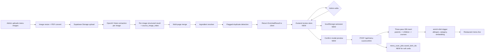
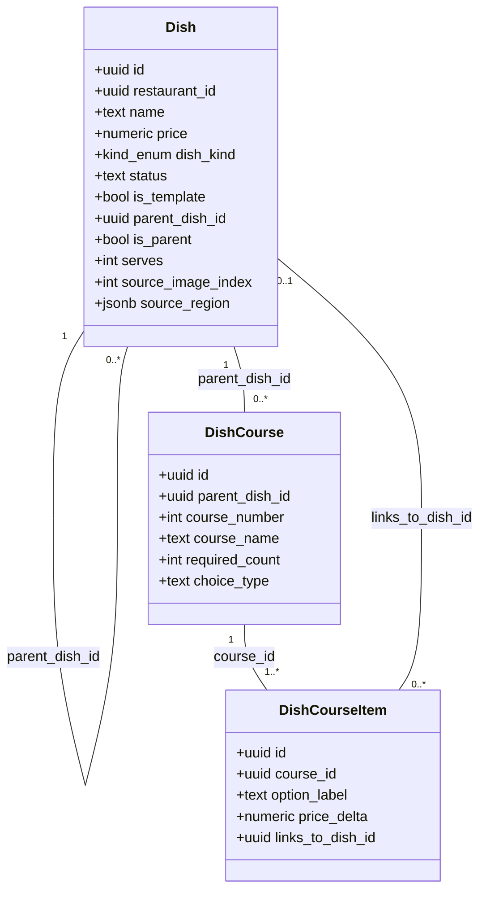
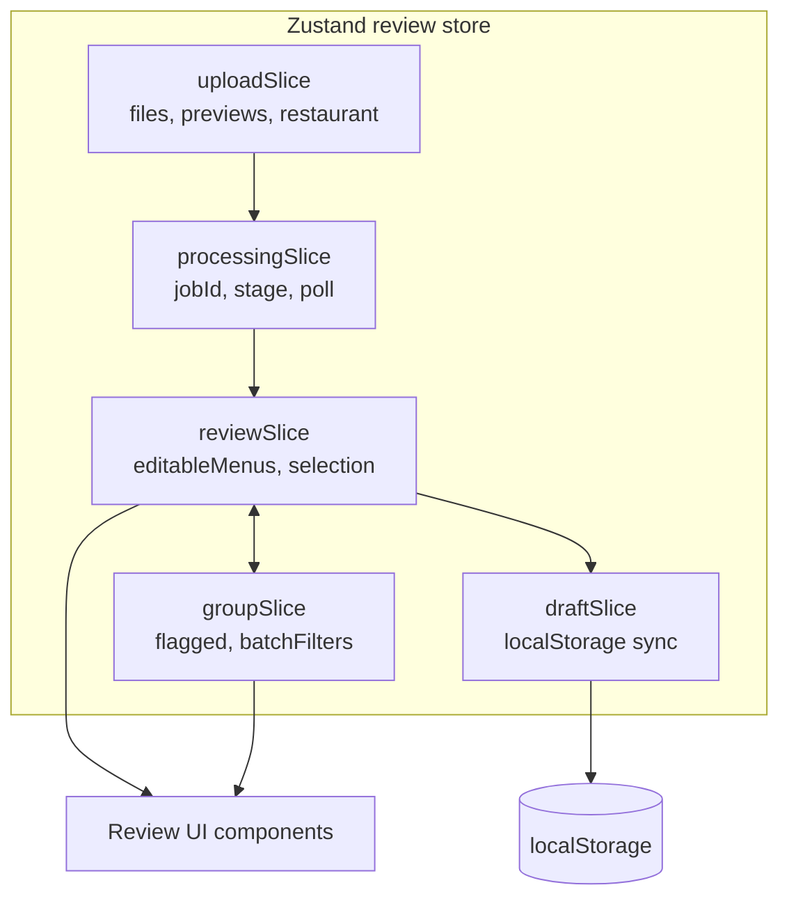
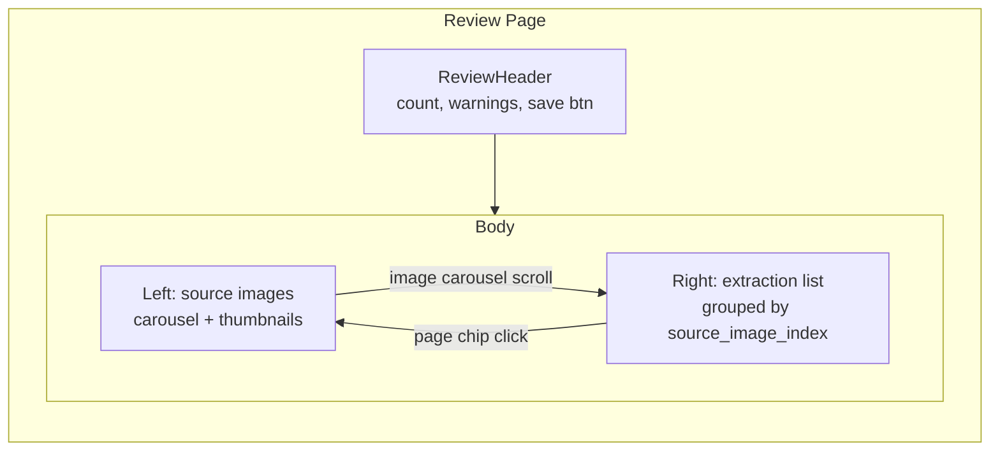

# Detailed Design — Dish Ingestion & Menu-Scan Review Rework

_Version: 1.0 — 2026-04-22_

## 1. Overview

EatMe's menu ingestion pipeline (AI Vision → enrichment → admin review → DB commit) works end-to-end, but two structural problems limit its effectiveness:

1. **The dish `kind` taxonomy conflates three different concepts** — composition shape, publishing state, and interactive format — into a single 4-value enum (`standard | template | experience | combo`). The result: real-world menus like prix-fixe, tasting menus, family-style platters, buffets, and beverage bottle/glass structures can't be represented cleanly.

2. **The admin review page has grown organically into a dense, prop-drilled surface** with overlapping modals, no draft persistence, no image-to-dish linkage, and no save-preview or undo. Admins lose work on refresh and struggle to verify AI output against source menus.

This design addresses both. We redesign the data model (new 5-kind enum, new course-menu tables, orthogonal `status` + `is_template` fields) and rebuild the review-page's state layer + interactive surfaces around the new model. The upload and processing stages are left intact — they aren't pain points.

### Outcomes

- Admins can review a 50-dish multi-page menu without losing work to a refresh, verify each dish against its source image, edit course menus without workarounds, and save with confidence (preview + soft undo).
- AI extracts into the 5-kind enum with a confidence-driven review flag for low-confidence dishes.
- Migration is reversible for auto-renames; `experience` rows are triaged once by admins into `course_menu` or `buffet`.
- Mobile continues to ship; unknown kind values degrade gracefully (no badge).

---

## 2. Detailed Requirements

Consolidated from `idea-honing.md`. See that doc for the dialogue that produced each decision.

### 2.1 — Scope

- **In:** dish ingestion pipeline (AI extraction, enrichment, confirm), menu-scan admin review page.
- **Out:** restaurant ingestion improvements, mobile/narrow-viewport responsive (web-portal is laptop-only), kids menu, happy-hour pricing, seasonal/date-ranged availability, daypart categorization, region-level source-image linkage, full merge-preview UI, cross-device draft, full audit-log history, full keyboard-first flow, ingredient-entry flag flip, category/shared/location/rotating-menu modeling.

### 2.2 — Kind taxonomy (Approach D hybrid)

- **New enum:** `standard | bundle | configurable | course_menu | buffet` (5 values, composition shape only).
- **Renames:** `combo → bundle`, `template → configurable` (plus auto-set `is_template = true`).
- **Split:** `experience → course_menu | buffet`, requires one-time admin triage.
- **New columns on `dishes`:**
  - `status text NOT NULL DEFAULT 'published'` — CHECK (`'published' | 'draft' | 'archived'`)
  - `is_template boolean NOT NULL DEFAULT false` — reusable shell; excluded from feed; cloneable.

### 2.3 — Course menu modeling (Option 2 medium-weight)

Two new tables:

- **`dish_courses`** — `(id uuid PK, parent_dish_id uuid FK → dishes, course_number int, course_name text, required_count int DEFAULT 1, choice_type text CHECK ('fixed' | 'one_of'))`
- **`dish_course_items`** — `(id uuid PK, course_id uuid FK → dish_courses, option_label text, price_delta numeric DEFAULT 0, links_to_dish_id uuid FK → dishes NULLABLE)`

A `course_menu` dish is a parent with an ordered list of courses. Each course offers one or more items. `choice_type='fixed'` for single-item courses (admin picks it); `choice_type='one_of'` for prix-fixe with per-course choice.

### 2.4 — Review UI rework (Approach C hybrid)

- Keep the step-based flow (upload, processing, review, done).
- Keep upload + processing code intact.
- Replace the review-step state layer (prop-drilling → Zustand).
- Redesign the right-panel surfaces (`MenuExtractionList`, `DishEditPanel`, `DishGroupCard`) around the new 5-kind + course-menu model.
- Ship as a coordinated single PR (no feature flag per Q9.2).

### 2.5 — Source-image linkage (page-level now)

- Every extracted dish carries `source_image_index: int`.
- Reserve a nullable `source_region jsonb` column for future region-level work; not wired this cycle.
- Review UI renders dishes grouped by source image (with a collapsible thumbnail per group), and every dish chip is clickable → left-panel carousel jumps to that image.

### 2.6 — Save safety

- **Draft:** `localStorage` autosave per `job_id`, restore on return, cleared after successful save.
- **Preview:** confirm modal with summary (insert N, update M, accept K flagged duplicates).
- **Undo:** soft undo within 15 minutes of save — deletes the inserted dishes. Implemented via `menu_scan_jobs.saved_dish_ids jsonb` column populated on confirm and cleared after TTL.

### 2.7 — AI extraction improvements

- Zod + OpenAI `json_schema` with `strict: true` — verify in place; tighten to new 5-kind enum and course structures.
- Confidence threshold: `< 0.7` flags dish with "needs review". Batch toolbar filters by flag. Confirm-modal warns if flagged dishes exist untouched.
- Multi-page merge logic: leave as-is (not on pain list).

### 2.8 — Remaining review-UX polish

- **Flagged duplicates:** show "why flagged" (name similarity %, description match, shared category) + side-by-side new vs. existing dish.
- **Keyboard shortcuts:** `E` expand/collapse all, `N` next flagged, `Cmd/Ctrl+S` save, `A/R` accept/reject group focus.
- **Actionable warnings:** each warning clickable → scrolls to target dish, offers "fix with default" where available.
- **Ingredient-entry flag:** stays `OFF`; new UI has clean extension points for when it flips.

### 2.9 — Mobile (RN) coordination

- Add new kind values to the badge map in `DishPhotoModal.tsx` (`bundle`, `configurable`, `course_menu`, `buffet`).
- Fallback: unknown kind → no badge (no crash).
- Release within 1–2 weeks of web ship.

### 2.10 — Testing

- **Primary target:** hooks / Zustand slices / reducers — tested thoroughly.
- **Secondary:** components via render smoke tests.
- No full integration test coverage target; trust hook tests for correctness.

---

## 3. Architecture Overview

### 3.1 End-to-end ingestion pipeline



### 3.2 Kind & orthogonal fields model



### 3.3 Review page state (Zustand)



### 3.4 Review UI layout (desktop/laptop)



---

## 4. Components and Interfaces

### 4.1 Database migrations

One migration (`114_ingestion_rework.sql` — name indicative) that performs:

1. **Add new columns:**
   ```sql
   ALTER TABLE dishes
     ADD COLUMN status text NOT NULL DEFAULT 'published'
       CHECK (status IN ('published','draft','archived')),
     ADD COLUMN is_template boolean NOT NULL DEFAULT false,
     ADD COLUMN source_image_index int,
     ADD COLUMN source_region jsonb;  -- reserved, not wired this cycle
   ```

2. **Relax `dish_kind` CHECK** to accept both old and new values temporarily:
   ```sql
   ALTER TABLE dishes DROP CONSTRAINT dishes_dish_kind_check;
   ALTER TABLE dishes ADD CONSTRAINT dishes_dish_kind_check
     CHECK (dish_kind IN ('standard','template','experience','combo',
                          'bundle','configurable','course_menu','buffet'));
   ```

3. **Auto-rename data:**
   ```sql
   UPDATE dishes SET dish_kind = 'bundle' WHERE dish_kind = 'combo';
   UPDATE dishes
     SET dish_kind = 'configurable', is_template = true
     WHERE dish_kind = 'template';
   ```
   (Rows with `dish_kind='standard'` are untouched.)

4. **New tables:**
   ```sql
   CREATE TABLE dish_courses (
     id uuid PRIMARY KEY DEFAULT gen_random_uuid(),
     parent_dish_id uuid NOT NULL REFERENCES dishes(id) ON DELETE CASCADE,
     course_number int NOT NULL CHECK (course_number >= 1),
     course_name text,
     required_count int NOT NULL DEFAULT 1,
     choice_type text NOT NULL CHECK (choice_type IN ('fixed','one_of')),
     created_at timestamptz DEFAULT now(),
     UNIQUE (parent_dish_id, course_number)
   );

   CREATE TABLE dish_course_items (
     id uuid PRIMARY KEY DEFAULT gen_random_uuid(),
     course_id uuid NOT NULL REFERENCES dish_courses(id) ON DELETE CASCADE,
     option_label text NOT NULL,
     price_delta numeric NOT NULL DEFAULT 0,
     links_to_dish_id uuid REFERENCES dishes(id) ON DELETE SET NULL,
     sort_order int NOT NULL DEFAULT 0,
     created_at timestamptz DEFAULT now()
   );

   CREATE INDEX idx_dish_courses_parent ON dish_courses (parent_dish_id, course_number);
   CREATE INDEX idx_dish_course_items_course ON dish_course_items (course_id, sort_order);
   ```

5. **RLS policies:** inherit the `owner_id`-based policies from the parent `dishes` table (owner-via-parent).

6. **`menu_scan_jobs` extensions:**
   ```sql
   ALTER TABLE menu_scan_jobs
     ADD COLUMN saved_dish_ids jsonb,
     ADD COLUMN saved_at timestamptz;
   ```

A **second follow-up migration** (once admin triage screen has run) tightens the CHECK:

```sql
ALTER TABLE dishes DROP CONSTRAINT dishes_dish_kind_check;
ALTER TABLE dishes ADD CONSTRAINT dishes_dish_kind_check
  CHECK (dish_kind IN ('standard','bundle','configurable','course_menu','buffet'));
```

This runs only after zero rows remain with `dish_kind='experience'` or `'template'` or `'combo'`.

### 4.2 Shared types (`packages/shared`)

```ts
// packages/shared/src/types/restaurant.ts
export const DISH_KINDS = ['standard','bundle','configurable','course_menu','buffet'] as const;
export type DishKind = typeof DISH_KINDS[number];

export const DISH_STATUSES = ['published','draft','archived'] as const;
export type DishStatus = typeof DISH_STATUSES[number];

export interface DishCourse {
  id: string;
  parent_dish_id: string;
  course_number: number;
  course_name: string | null;
  required_count: number;
  choice_type: 'fixed' | 'one_of';
}

export interface DishCourseItem {
  id: string;
  course_id: string;
  option_label: string;
  price_delta: number;
  links_to_dish_id: string | null;
  sort_order: number;
}
```

```ts
// packages/shared/src/constants/menu.ts
export const DISH_KIND_META = {
  standard:     { label: 'Standard',     description: 'Single fixed dish',                icon: '🍽️' },
  bundle:       { label: 'Bundle',       description: 'N items together at one price',    icon: '🎁' },
  configurable: { label: 'Configurable', description: 'Customer selects from slots',      icon: '🔧' },
  course_menu:  { label: 'Course Menu',  description: 'Multi-course sequenced',           icon: '🍷' },
  buffet:       { label: 'Buffet',       description: 'Flat-rate unlimited access',       icon: '🍱' },
} as const;
```

### 4.3 AI extraction (`apps/web-portal/app/api/menu-scan/route.ts`)

Prompt updates:

- Replace the 4-value kind decision tree with the new 5-value decision tree.
- Add structured emission of `dish_courses` for `course_menu` kind (array of `{course_number, course_name, choice_type, items: [{option_label, price_delta}]}`).
- Emit `source_image_index` automatically from caller context (the API already iterates per image — propagate `pageIndex` into each dish).
- Emit `confidence` as today; the threshold (`< 0.7` → flag) is applied client-side after extraction.

Zod schema (response_format):

```ts
const DishExtractionSchema = z.object({
  name: z.string(),
  description: z.string().nullable(),
  price: z.number().nullable(),
  dish_kind: z.enum(['standard','bundle','configurable','course_menu','buffet']),
  is_parent: z.boolean(),
  serves: z.number().int().nullable(),
  display_price_prefix: z.enum(['exact','from','per_person','market_price','ask_server']),
  confidence: z.number().min(0).max(1),
  courses: z.array(z.object({
    course_number: z.number().int().min(1),
    course_name: z.string().nullable(),
    choice_type: z.enum(['fixed','one_of']),
    items: z.array(z.object({
      option_label: z.string(),
      price_delta: z.number().default(0),
    })),
  })).optional(),
  // existing fields (dietary_tags, ingredients, etc.) unchanged
});
```

OpenAI call uses `response_format: { type: 'json_schema', json_schema: { strict: true, schema: ... } }`.

### 4.4 Confirm endpoint (`apps/web-portal/app/api/menu-scan/confirm/route.ts`)

Three-pass insert extended:

1. Pass 1: insert menus + categories.
2. Pass 2: insert parent dishes (with `is_parent=true`).
3. Pass 3: insert child dishes (with `parent_dish_id`), then `dish_courses` rows (for `course_menu` parents), then `dish_course_items` (optionally linking `links_to_dish_id` to sibling dishes just inserted).
4. Pass 4: insert `dish_ingredients` as today.

New: on success, set `menu_scan_jobs.saved_dish_ids = [<inserted dish UUIDs>]`, `saved_at = now()`. Enables soft-undo.

### 4.5 Soft-undo endpoint (`apps/web-portal/app/api/menu-scan/undo/route.ts`, NEW)

```
POST /api/menu-scan/undo
body: { job_id: string }
```

Behavior:
- Load `menu_scan_jobs` by `job_id`, verify `saved_at` is within 15 minutes.
- Delete all dishes in `saved_dish_ids` (CASCADE deletes `dish_courses`, `dish_course_items`, `dish_ingredients`).
- Clear `saved_dish_ids` and `saved_at`.
- **Reset `menu_scan_jobs.status` from `'completed'` back to `'needs_review'`** so the admin can resume editing the same job from the draft payload (which is intentionally preserved on undo — the draft cookie is re-hydratable).
- Return `{ undone: N }`.

Post-undo UX: admin lands back in the review step with their pre-save state intact. If the localStorage draft was cleared on save, we rehydrate from `menu_scan_jobs.result` (the original extraction) as a fallback — admin loses their edits but keeps the extraction.

### 4.6 Zustand review store (`apps/web-portal/app/admin/menu-scan/store/`)

File layout:

- `store/index.ts` — combines slices with `zustand.create`.
- `store/uploadSlice.ts` — files, previews, restaurant selection, PDF conversion state.
- `store/processingSlice.ts` — job ID, polling, staged progress.
- `store/reviewSlice.ts` — `editableMenus`, expand state, updaters (`updateDish`, `addVariant`, `setKind`, course editors).
- `store/groupSlice.ts` — flagged duplicates, batch filters, selection.
- `store/draftSlice.ts` — localStorage sync (debounced write, read-on-mount, clear-after-save). **Draft payload is versioned**: `{ version: 2, editableMenus, groupState, timestamp }`. On load, a draft with a mismatched or missing `version` is **discarded** (toast: "Draft incompatible with this version — starting fresh"). Version increments whenever the `EditableDish` shape, kind enum, or slice contract changes.
- `store/selectors.ts` — memoized derived state (dishes grouped by `source_image_index`, confidence-flagged count, etc.).

Each slice exports typed actions. Components call selectors; no prop-drilling.

### 4.7 New/redesigned review components

Naming convention: components rewritten against Zustand get the suffix `V2`. Components whose behavior is unchanged but read from the store instead of props do **not** get renamed — the rename indicates a real rewrite, not a plumbing change.

New component tree (right panel):

```
ReviewPage
├── ReviewHeader (count, warnings, save button, keyboard shortcut help)
├── SplitLayout
│   ├── LeftPanel (images or restaurant-details tab)
│   │   ├── ImageCarousel (behavior unchanged; adds store-subscribed "scroll to page N" action)
│   │   ├── ImageZoomLightbox (unchanged)
│   │   └── RestaurantDetailsFormPanel (unchanged)
│   └── RightPanel
│       ├── BatchToolbar (confidence/kind/group filters, keyboard shortcut hints)
│       ├── PageGroupedList (NEW; groups by source_image_index)
│       │   └── for each image group:
│       │       ├── PageHeader (thumbnail, dish count)
│       │       └── DishItem (per dish)
│       │           ├── DishRow (name/price/kind chip/page chip/confidence badge)
│       │           └── DishEditPanelV2 (expanded; rewritten)
│       │               ├── KindSelectorV2 (5 kinds + tooltip; rewritten)
│       │               ├── PriceField (conditional on kind; visible for all except pure course_menu parents)
│       │               ├── CourseEditor (NEW; only when kind=course_menu)
│       │               ├── VariantEditor (rewritten; when is_parent=true and kind in [standard, bundle, configurable])
│       │               └── IngredientSlot (extension point; empty until flag flips)
│       └── FlaggedDuplicatePanel (why-flagged breakdown + side-by-side)
├── SavePreviewModal
└── UndoToast
```

**Key new components:**

- **`PageGroupedList`** — groups dishes by `source_image_index`; each group is collapsible; page chip on every dish; virtualization via `react-window` for >50-dish menus.
- **`KindSelectorV2`** — dropdown with icon + label + description tooltip; explicit "this will change: is_parent, price_prefix" warning on change (no more silent combo price hiding).
- **`CourseEditor`** — see below for the full UX spec.
- **`SavePreviewModal`** — renders the confirm-modal summary (insert/update/accept counts; list of dishes flagged by confidence < 0.7 still untouched, blocking save or requiring explicit override).
- **`UndoToast`** — shown for 15 minutes after save; one click → POST `/api/menu-scan/undo`.

#### CourseEditor UX specification

Layout: a vertically stacked list of courses, each rendered as a collapsible card.

Per course card:
- **Header:** `[drag handle] Course N — [course_name input: placeholder "Starter"] [choice type: fixed | one_of]  [delete course ×]`
- **Body (always visible when expanded):**
  - If `choice_type = 'fixed'`: a single option_label input (no +/− buttons). `required_count` hidden (always 1).
  - If `choice_type = 'one_of'`: a list of items, each row: `[drag handle] [option_label input] [price_delta input (currency, optional)] [× delete]`. `[+ Add item]` button at bottom. `required_count` optional numeric input (default 1) for "choose N of these".
- Reorder: drag handle on course card reorders courses (updates `course_number`). Drag handle on item row reorders within the course (updates `sort_order`).
- Validation (client-side): course_name can be empty; at least one item per `one_of` course; `required_count ≤ item count`.

Below the course list:
- `[+ Add course]` button — appends a new course at `course_number = max + 1` with `choice_type='one_of'` and one blank item.

Store actions exposed by `reviewSlice`:
- `addCourse(dishId)`, `removeCourse(dishId, courseIdx)`, `reorderCourses(dishId, fromIdx, toIdx)`
- `updateCourseField(dishId, courseIdx, field, value)` — for name/choice_type/required_count
- `addCourseItem(dishId, courseIdx)`, `removeCourseItem(dishId, courseIdx, itemIdx)`, `reorderCourseItems(dishId, courseIdx, fromIdx, toIdx)`
- `updateCourseItem(dishId, courseIdx, itemIdx, field, value)` — for option_label/price_delta

Empty state: when an admin changes a dish to `kind=course_menu` for the first time, auto-create one blank `one_of` course so the admin isn't staring at an empty panel.

### 4.8 Keyboard shortcuts

Global to the review step:

| Key | Action |
|---|---|
| `E` | Toggle expand/collapse for all dishes |
| `N` | Focus next confidence-flagged or warning-attached dish |
| `Cmd/Ctrl + S` | Open SavePreviewModal |
| `A` / `R` | Accept / reject the currently focused group |
| `Escape` | Collapse current dish |

Implementation: one `useKeyboardShortcuts()` hook subscribed at the review page root, reads/writes Zustand.

**Focus scoping:** shortcuts must NOT fire while the user is typing in an input. The hook checks `document.activeElement` on each keydown and bails if the tag is `INPUT`, `TEXTAREA`, `SELECT`, or the element has `contenteditable`. Exception: `Cmd/Ctrl+S` fires unconditionally (admins expect "save" to work from any focus). Exception handling uses `event.preventDefault()` to stop the browser's native save dialog.

### 4.9 Mobile (React Native) updates

`apps/mobile/src/components/DishPhotoModal.tsx`:

```tsx
const KIND_BADGE: Record<string, string> = {
  configurable: '  🔧',
  course_menu:  '  🍷',
  buffet:       '  🍱',
  bundle:       '  🎁',
  // 'standard' intentionally no badge
};
// ...
{KIND_BADGE[dishKind] ?? ''}
```

Fallback for unknown values: empty string (no badge).

### 4.10 Admin triage UI for legacy `experience` rows

One-time admin page at `/admin/dishes/experience-triage`:

- Lists all dishes where `dish_kind='experience'` (or `'template'` or `'combo'` if the auto-migration hasn't run yet — defensive).
- Per-row radio: `course_menu` / `buffet`.
- Bulk "auto-classify by description keywords" button as a convenience (e.g., "tasting" → `course_menu`, "AYCE"/"buffet"/"all you can eat" → `buffet`).
- Save button writes the choices; redirects when zero rows remain.
- **Each reclassification writes one row to `admin_audit_log`** with `action='dish_kind_triage'`, `entity_id=dish.id`, `before={dish_kind:'experience'}`, `after={dish_kind:'course_menu'|'buffet'}`, `actor_id=current admin`. Preserves provenance of the split decision.

Gated behind admin role; hidden from navigation after zero-row state.

### 4.11 Confidence-flag wiring

- Extraction: AI emits `confidence ∈ [0, 1]` per dish (no change).
- Review store: a selector `flaggedDishes = editableMenus.flatMap(m => m.categories.flatMap(c => c.dishes)).filter(d => d.confidence < 0.7)`.
- UI: red "needs review" pill next to dish name, "jump to next flagged" via `N` key, batch-filter toggle, SavePreviewModal warning line if untouched.

"Touched" = admin has opened the edit panel or modified any field. Touched dishes drop the flag visually but retain the numeric `confidence` field for analytics.

**Threshold is config, not constant.** Exposed via `NEXT_PUBLIC_MENU_SCAN_CONFIDENCE_THRESHOLD` (env-driven, default `0.7`). Read once at store init. Selector code reads the config value — no magic number in components. This allows tuning post-launch without a redeploy cadence.

### 4.12 `enrich-dish` Supabase function update

`infra/supabase/functions/enrich-dish/index.ts` contains kind-aware completeness logic branching on old literals (`'template'`, `'experience'`, `'combo'`). These branches go dead after migration. Required updates:

- Replace `dishKind === 'template' || dishKind === 'experience'` with `dishKind === 'configurable' || dishKind === 'course_menu' || dishKind === 'buffet'` — the "completeness via option count" path now applies to all composite kinds.
- Replace `dishKind === 'combo'` with `dishKind === 'bundle'` in the combo completeness branch.
- Add `dishKind === 'course_menu'`: completeness requires `dish_courses.length >= 2` AND each course has `>= 1` item.
- Add `dishKind === 'buffet'`: completeness requires `price > 0` (flat rate) AND optional description.
- `inferred_dish_type` payload defaults: update the null-if-standard check (line 250) — still "null if standard" but now recognize new kinds in the meta-description text.

Deployment: the function redeploys via the same PR as the web-portal and migration. No separate release train.

### 4.13 Feed / recommendation compatibility

Two RPCs return `dish_kind` in their payload: `generate_candidates()` (used by feed) and the candidate lookup in `infra/supabase/functions/feed/index.ts`. Neither branches on specific values today, so returning new values is safe. **One required update:**

- `generate_candidates()` currently filters `WHERE is_parent = false`. It **must also filter `is_template = false`** so template dishes never enter the consumer feed. Add in the same migration (`114_ingestion_rework.sql`):
  ```sql
  CREATE OR REPLACE FUNCTION generate_candidates(...) ...
    WHERE d.is_parent = false
      AND d.is_template = false
      AND ... -- existing filters
  ```
  (full function body copied from the latest migration, e.g. `111_primary_protein_user_prefs_and_feed.sql`, with the new filter added — same pattern used by all prior RPC updates).

Mobile consumes `dish_kind` only cosmetically; new values fall through the badge map to no badge. No mobile filter changes.

### 4.14 Legacy data & in-flight compatibility

Three transient states exist at deploy time that the new code must tolerate without crashing:

1. **localStorage drafts from old UI.** Any draft written before this release has no `version` field. Handled by §4.6 draftSlice — unversioned drafts are discarded on load with a toast. Acceptable UX: admin was mid-review and must restart, but the extraction result itself is still in `menu_scan_jobs` so no data is lost.

2. **`menu_scan_jobs` rows in `needs_review` status with old-kind extraction results.** The stored `result` blob contains dishes with `dish_kind ∈ {standard, template, experience, combo}`. When the new UI hydrates one of these jobs:
   - A **normalizer** runs at load time (in `reviewSlice.hydrateFromJob`) that applies the same renames the DB migration applies: `combo → bundle`, `template → configurable` + `is_template=true`, and `experience → configurable` (defensive fallback; admin will manually re-classify to `course_menu` or `buffet` in the review UI).
   - After normalization the job behaves as if freshly extracted; save writes new-kind rows.
   - Warning banner: "This job was extracted before the Kind update; please re-verify each dish."

3. **DB rows with old kinds during the migration window.** Between the relax-CHECK migration and the tighten-CHECK migration, both old and new values coexist. Code paths that read dishes from the DB (feed RPC, enrich-dish, confirm endpoint) must tolerate both sets. `enrich-dish` update (§4.12) handles this during the transition by including both old and new values in kind-switch branches until the tighten migration fires.

### 4.15 Confidence threshold as configuration

As noted in §4.11, the `0.7` confidence threshold is **not a constant**. Store it in:

- `apps/web-portal/.env.local` / deployment env: `NEXT_PUBLIC_MENU_SCAN_CONFIDENCE_THRESHOLD=0.7`
- `apps/web-portal/lib/featureFlags.ts` (or a new `apps/web-portal/lib/menuScanConfig.ts`) exports a typed getter with a 0.7 default.
- Imported by the `reviewSlice` selector for flagged dishes and by `SavePreviewModal` for the untouched-flagged warning.

No admin-facing UI for tuning this cycle. Adjust via env var + redeploy only.

---

## 5. Data Models

See section 4.1 for migration SQL and 4.2 for TypeScript types. Summary table of DB changes:

| Table | Change |
|---|---|
| `dishes` | Add: `status`, `is_template`, `source_image_index`, `source_region`. Migrate: `combo→bundle`, `template→configurable (is_template=true)`. Relax then tighten CHECK on `dish_kind`. |
| `dish_courses` | NEW |
| `dish_course_items` | NEW |
| `menu_scan_jobs` | Add: `saved_dish_ids`, `saved_at` |

RLS: new tables inherit owner policy via parent dish join. Migration tests include a negative-auth case (non-owner cannot insert/update/delete).

---

## 6. Error Handling

### 6.1 AI extraction errors

- Vision call fails → job status = `failed`, stored error surfaced in upload UI; admin can retry.
- Vision returns malformed JSON → `json_schema + strict: true` minimizes this; catch residual with Zod parse; on parse fail, fall back to treating the dish extraction as incomplete (confidence=0, `needs_review`), never crash the job.
- Missing `courses` field on a `course_menu` kind → downgrade that dish to `configurable` + confidence flag; admin triages in review.

### 6.2 Confirm endpoint errors

- Partial insert failure → rollback the entire job transaction; return the specific error; `saved_dish_ids` remains null; UI keeps the draft.
- `dish_course_items.links_to_dish_id` references a dish not yet inserted → resolve inside the same transaction using a two-map pass (ID remap).

### 6.3 Save-safety error paths

- localStorage full → fall back to in-memory; warn user via toast that drafts won't persist refreshes.
- Undo after 15-min window → return 409 Conflict with explicit "window expired" message; UI shows toast.
- Undo on a job whose dishes have been edited in another surface (rare) → best-effort delete; report which IDs couldn't be deleted.

### 6.4 Migration errors

- Auto-rename fails mid-way → the transaction rolls back; manual investigation required before retry. Migration is idempotent (UPDATE is safe on re-run).
- Tightened CHECK added while `experience` rows remain → the migration itself errors; admin must complete triage first. Guard the tightened CHECK behind a row-count assertion:

  ```sql
  DO $$
  DECLARE n int;
  BEGIN
    SELECT count(*) INTO n FROM dishes
      WHERE dish_kind NOT IN ('standard','bundle','configurable','course_menu','buffet');
    IF n > 0 THEN RAISE EXCEPTION 'Refusing to tighten CHECK: % rows still in legacy kinds', n;
    END IF;
  END$$;
  ```

See also §4.14 for in-flight data compatibility concerns (stale localStorage drafts and `needs_review` jobs with old-kind results) that span the migration window.

---

## 7. Testing Strategy

Target: hook/reducer coverage thorough; component coverage via render smoke tests.

### 7.1 Unit tests

- **Zustand slices:** one test file per slice. Exercise every action; assert state before/after. Test slice composition (setting kind auto-updates is_parent and display_price_prefix; combo-to-configurable toggles don't silently drop price).
- **Selectors:** `flaggedDishes`, `dishesByImageIndex`, `confirmSummary`. Pure functions; test with sample menu fixtures.
- **Migration helpers:** TypeScript helpers that convert between new and legacy shapes during the migration window.

### 7.2 Component smoke tests

- Each new component renders with a minimal prop set; no exception.
- `KindSelectorV2` opens dropdown and dispatches expected store action.
- `CourseEditor` adds/removes a course; item reorder triggers the right store action.
- `SavePreviewModal` renders counts correctly; blocks save when untouched flagged dishes exist unless override checkbox is set.

### 7.3 Integration tests (light)

- One end-to-end Vitest test that simulates: extraction result → store hydration → edit → confirm payload shape. No real DB.
- API-route tests for `/api/menu-scan/confirm` (three-pass insert w/ course data) and `/api/menu-scan/undo` (happy path + expired window).

### 7.4 Test fixture migration

The existing test suite contains hardcoded old-kind literals that will fail type-check after the enum narrows:

- `apps/web-portal/test/menu-scan-components.test.tsx:238` — `dish_kind: 'standard' as const` (safe: 'standard' still valid).
- `apps/web-portal/test/DishFormDialog.test.tsx:94` — `dish_kind: 'standard'` (safe).
- `apps/web-portal/app/admin/menu-scan/hooks/useGroupState.ts:109` — `dish_kind: 'standard' as const` (safe).
- **Anywhere** a test fixture uses `'template'`, `'experience'`, or `'combo'` — **must update** to `'configurable' + is_template=true`, `'course_menu'` / `'buffet'`, or `'bundle'` respectively.
- Zod extraction tests that assert the enum shape — update to new 5 values.

**Required action in the implementation plan:** a single commit that runs a grep sweep (`'template'|'experience'|'combo'` in kind contexts) across all test files and fixture files and updates them in one pass. Type-check must pass before proceeding with the main rewrite.

Fixture data includes: `restaurantStore.ts` selects (mobile — returns strings unfiltered, no change needed), extraction result mocks, and any DB seed files.

### 7.5 Manual verification checklist (before ship)

- [ ] Load a multi-page menu, refresh tab, verify draft restored.
- [ ] Change a dish to `course_menu`, add 3 courses with `one_of` choice, save, verify in DB.
- [ ] Low-confidence dish blocks save until touched (or overridden).
- [ ] Keyboard shortcuts all fire.
- [ ] Flagged duplicate shows breakdown + side-by-side.
- [ ] Soft-undo within 15 min deletes inserted rows; after 15 min rejects.
- [ ] Mobile app still renders old + new kind values without crashing.
- [ ] All pre-existing `experience` rows triaged.

---

## 8. Appendices

### 8.1 Technology choices

| Decision | Chosen | Alternatives | Rationale |
|---|---|---|---|
| State layer | Zustand | React Context + useReducer, React Query | Matches mobile; tiny bundle; slice pattern fits existing hook decomposition; testable without mounting. |
| Kind redesign approach | D (Hybrid) | A (additive), B (full restructure), C (flag sprawl) | A leaves conflations; B is higher-risk with marginal extra benefit; C accumulates boolean drift. D un-conflates the two worst cases without a full rebuild. |
| Course modeling | Option 2 (two new tables) | Option 1 (overload option_groups), Option 3 (full sequencing graph) | Option 1 rots (string items, no inheritance). Option 3 over-engineers for Q2 scope. Option 2 is the smallest faithful model with clean extension path. |
| Source-image linkage | Page-level now + reserve region field | Region-level from AI | Page-level is deterministic and ships in hours; region-level depends on variable Vision coord quality and needs fallback. Reserve the field; upgrade later if needed. |
| Save safety | localStorage + confirm modal + soft undo (b/b/b) | Server drafts, full diff, audit-log revert | Middle path matches need and team size. |
| Feature flag for rollout | None (single PR) | Env flag, per-admin flag | User choice Q9.2; implies coordinated PR. |
| Mobile timing | Lagging 1–2 weeks | Same PR, next natural release | Low coupling; tolerant unknowns; avoids blocking. |

### 8.2 Research findings summary

Detailed in `research/historical-context.md`, `research/menu-scan-review-page.md`, `research/ingestion-data-model.md`, `research/menu-taxonomies-external.md`, `research/user-taxonomy-proposal.md`.

Key inputs that shaped this design:

- **Industry pattern (`research/menu-taxonomies-external.md`):** Schema.org, Toast, Square, DoorDash all use `Section → Item → Modifier Groups → Modifiers`; no first-class "kind" enum. Variation via composition. This reinforces the small-enum + orthogonal-axes philosophy.
- **Prior plan (`research/historical-context.md`):** The 2026-04-06 menu-ingestion-enrichment plan claimed significant review-UI work shipped. Current code shows partial landing. This plan absorbs its intent (structured outputs, AI-proposed variants, confidence handling) and completes what was missed.
- **Current architecture (`research/menu-scan-review-page.md`):** ~96-prop drilling into `MenuScanReview`; hooks untested; silent combo price-hiding; no source linkage; no persistence. These directly drive the rework choices.
- **Data coupling (`research/ingestion-data-model.md`):** Mobile uses `dish_kind` cosmetically only (2 emoji badges). Feed RPC returns kind but doesn't branch. Low coupling = safe to redesign.

### 8.3 Alternatives considered

- **Full review-page rebuild (Approach B, Q5)** — rejected: upload+processing aren't pain points; bigger blast radius with no clear wins.
- **Add orthogonal flags instead of rename (Approach C, Q4)** — rejected: preserves the `template`-as-kind conflation and accumulates drift-prone booleans.
- **Region-level source linkage (Option B, Q7)** — deferred: Vision coord quality is variable; needs fallback work; ROI unclear until page-level linkage is in production.
- **6th kind for "interactive dining" (Q4 option b)** — rejected: "interactive" is a UX trait not a composition shape; maps cleanly to `configurable` / `buffet` / `bundle` depending on pricing.
- **Category-level / shared add-ons / time-based pricing** — deferred per Q2: real needs but off-cycle.

---

## 9. Open questions for implementation phase

These are not requirements gaps — they are judgment calls best made during coding with real code in front of you. Recording them so they aren't missed.

1. **Course-item linking (`links_to_dish_id`)** — when AI extracts a tasting menu, should the "Salmon" item in Course 2 auto-link to an existing Salmon dish in the same restaurant's menu? Default: no (leave null; admin can link later). Revisit after first real tasting-menu extraction.
2. **`display_price_prefix` for `buffet`** — defaults to `per_person`; admin can override. Consider a `'flat_rate'` option if `per_person` feels wrong for "$35 adult, $20 child" buffets. Decide on first real case.
3. **Virtualization threshold for `PageGroupedList`** — start enabling `react-window` only for menus with >50 dishes; below that, plain rendering for simplicity.
4. **Admin triage "auto-classify"** — test keyword heuristics with actual production data before enabling as the default.

_(Prior item "Feed exclusion of `is_template=true`" promoted to required; see §4.13.)_
