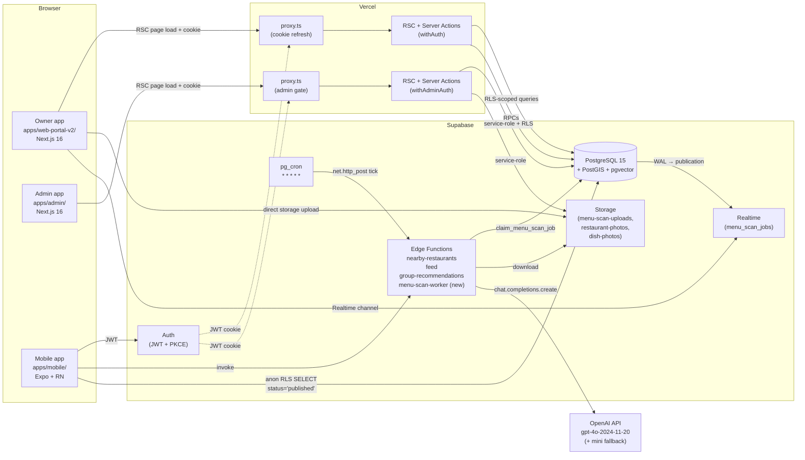

# EatMe Web Portal v2 — Detailed Design

> Authoritative design spec for the v2 rebuild. Written 2026-04-23.
> Describes **what** the system is and **why** it is shaped this way. Exact implementation
> steps (file-by-file, commit-by-commit) are the plan phase's job, not this doc's.
> Standalone: a reader with zero project context should be able to finish this document
> and understand the v2 architecture without opening the research files.

---

## 1. Overview

EatMe is a food-discovery platform that connects consumers (mobile app) with restaurants
(web portal). Consumers browse and filter dishes on a map; restaurant owners onboard their
business, manage menus, and publish their restaurant to the consumer feed. The platform is
backed by Supabase (PostgreSQL + PostGIS + pgvector + Storage + Edge Functions + Auth +
Realtime) and lives in a pnpm + Turborepo monorepo.

v1 of the web portal ships today at `apps/web-portal/` and works, but its foundations are
cracked in ways that get more expensive every week. Submit is not transactional — partial
failures leave orphan restaurants and opaque client state. Onboarding drafts live in
`localStorage` and drift from the database after reloads. The menu-scan confirm path is
not idempotent — retries duplicate dishes. Admin authorization is enforced ad hoc on each
`/api/admin/*` handler. The `DishFormDialog` hosts five implicit modes. Zod runs only on
the client — the server trusts whatever shape it receives. The ingredient pipeline was
built but feature-flagged off and is now dead code in the UI. v2's purpose is not to add
features; it is to rebuild the app code around a small, sharp backend that makes these
failure modes impossible by construction.

The rebuild is **parallel and additive**. v2 lives at a new path — the owner-facing app is
`apps/web-portal-v2/` and a separate admin app is `apps/admin/`. The existing v1 portal
(`apps/web-portal/`) stays deployed and untouched until DNS cutover. The consumer mobile
app (`apps/mobile/`) receives six mechanical "defense-in-depth" filter patches across three
files and zero UX changes. Shared packages (`@eatme/shared`, `@eatme/database`,
`@eatme/tokens`) gain new exports but cannot rename or remove anything mobile already
imports. A new `@eatme/ui` package hosts shadcn/ui sources and the Tailwind v4 config so
both new apps share one design system without per-app duplication.

The backend gains five things and drops nothing. First, a `status text NOT NULL DEFAULT
'published'` column on `restaurants` and `menus` — matching the column `dishes` already has
since migration 114 — so the three content tables finally share one lifecycle vocabulary
(`draft | published | archived`). Second, the `menu_scan_jobs` table — which already
exists — gains `input jsonb`, `attempts int`, and `locked_until timestamptz` columns to
support an async worker pattern, plus an explicit RLS block and Realtime publication
membership it never had. Third, two Postgres functions: `publish_restaurant_draft(uuid)`
flips a whole restaurant draft to published atomically, and `confirm_menu_scan(uuid, jsonb,
text)` deduplicates on an idempotency key and bulk-inserts dishes from a scan result.
Fourth, the three consumer-facing Edge Functions (`nearby-restaurants`, `feed`,
`group-recommendations`) and the two RPCs (`generate_candidates`, `get_group_candidates`)
learn about `status='published'`. Fifth, RLS on `restaurants/menus/dishes` flips from
`USING (true)` to `USING (status = 'published')` for anon readers, while owners and admins
keep full access to their own rows via new owner-scoped SELECT policies.

The menu-scan system moves from a synchronous Next.js API route (which hangs Vercel on big
menus and has no retries) to a Supabase Edge Function + `pg_cron` worker pattern. The
client resizes images in the browser (via `browser-image-compression`, max 2048 px, JPEG
quality 0.85), uploads them directly to Supabase Storage, then inserts a `menu_scan_jobs`
row with `status='pending'`. `pg_cron` ticks every minute and fires `net.http_post` at a
new `menu-scan-worker` Edge Function, which atomically claims a job via
`FOR UPDATE SKIP LOCKED`, downloads the images from Storage, calls OpenAI GPT
(`gpt-4o-2024-11-20` pinned; `gpt-4o-mini` fallback) with Structured Outputs and Vision,
writes the result back into the job row, and lets Supabase Realtime push the state change
to the owner's browser. After the owner reviews and confirms, the client calls
`confirm_menu_scan` with a fresh idempotency key — the RPC dedups and performs a single
transactional bulk insert.

Authorization is the other centerpiece. Every Server Action and every Route Handler goes
through a small typed wrapper (`withAuth`, `withAdminAuth`, or explicitly `withPublic`) that
returns `ActionResult<T>`. The wrappers call `supabase.auth.getUser()` (the authoritative
remote check) and, for the admin wrapper, read `app_metadata.role === 'admin'` — never
`user_metadata`, which any authenticated user can self-mutate. A custom ESLint rule
`no-unwrapped-action` lives in the shared config and fails CI if any exported handler is
not wrapped. React Server Component pages use a DAL (`verifySession`, `verifyAdminSession`)
built on `cache()`-deduplicated `getClaims()` reads — local JWT verification for the fast
path, full `getUser()` for the wrapper's security gate. Next.js 16's new middleware-file
convention `proxy.ts` handles cookie refresh and optimistic redirects only; it is not a
security gate.

Each app lives in its own Next.js 16 project with its own `proxy.ts` (sharing a
`createAuthProxy` factory from `@eatme/shared`), its own `next.config.ts` declaring
`@eatme/shared`, `@eatme/database`, `@eatme/tokens`, `@eatme/ui` in `transpilePackages`,
its own Vercel project. The owner app stays under a strict bundle budget (≤ 250 KB gzipped
first-load); admin has no such budget and dynamic-imports its heavy dependencies
(`pdfjs-dist`, CSV parsing) at the admin-only routes. Both apps use react-hook-form +
Zod for client-side form UX, Server Actions for mutations (re-validating with the exact
same Zod schemas from `@eatme/shared`), TanStack Query only where client interactivity
earns it (menu-scan progress, admin list filters), and Supabase Realtime for live scan
status and publish-completion broadcasts.

Release is six phases (`0` Pre-flight → `1` Additive DB migrations → `2` Edge Function
patches → `3` Mobile filter patches → `4` RLS tightening, the one-way door → `5` v2 app
deploy). Phases 1 and 2 are no-ops for consumers because every existing row defaults to
`'published'`. Phase 3 (mobile) is the slowest to roll back — hours to days through app-store
review — and must be in production before Phase 4. Phase 4 is the only genuinely
irreversible step: once RLS filters on `status`, reverting the policies after v2 starts
creating drafts would briefly leak those drafts to anon readers. Phase 5 is a DNS-canary
deploy to a separate subdomain (e.g., `v2.portal.eatme.app`) with v1 still live; DNS
cutover is a separate ticket after a seven-day soak with zero P1 regressions.

**"Done" criteria** (verbatim from the rough-idea brief):

- A new restaurant owner can go from "signed up" to "first menu live on the consumer app"
  in **under 5 minutes** without help.
- Closing the browser mid-onboarding and reopening 3 days later just resumes — no data
  loss, no weird merged state.
- A menu scan with 15 dish images completes (or fails clearly) within **90 seconds**, and
  a retry never duplicates.
- An admin can find any restaurant by name in under **3 seconds**.
- Every API route has an auth wrapper. CI fails if a new route is added without one.
- Owner bundle size is under **250 KB gzip** on first load. Admin can be larger.
- Playwright covers: signup → onboard → menu scan → publish → re-edit. If those break,
  deploys block.
- **Zero consumer-app regressions** — verified by running the mobile app against staging
  post-RLS-flip.
- **Drafts are never visible to the consumer app**, ever — verified by an automated test
  that creates a draft and queries the consumer-side endpoints.

---

## 2. Detailed Requirements

### 2.1 Functional — Owner app (`apps/web-portal-v2/`)

**Auth.** Sign-up and sign-in via email/password and OAuth (Google, Facebook). Email
confirmation is optional per product policy. After sign-up, the user is routed to
`/onboard` if they have no restaurants; otherwise to `/restaurant/[id]`. Sign-in supports
a `?redirect=` query param so deep links resume after auth (v1 silently dropped it; v2
Playwright covers it). Every mutation path is wrapped in `withAuth`. `app_metadata.role`
is never inspected in the owner app — it is admin-only; the owner app does not expose any
admin UI.

**Onboard.** One restaurant per owner (for v2.0; multi-user-per-restaurant teams are
deferred). Creating a restaurant writes the row to the DB immediately with
`status='draft'` — the DB is the source of truth. `localStorage` is not used for draft
state. If the owner closes the tab and comes back three days later on a different device,
the app reads their draft restaurant and resumes exactly where they left off. The onboard
flow is a stepper UI overlay on the same edit form a long-time owner uses; there is no
separate "onboarding-only" codebase. Steps: **Basic info → Location → Operating hours →
Cuisines & service options → Photos → (optional) First menu** via menu scan or blank menu.
The **Publish** button is disabled until required fields are filled; clicking it calls the
`publish_restaurant_draft(uuid)` RPC which atomically flips the restaurant and all its
menus and dishes from `draft` to `published`.

**Menus.** A restaurant has one or more menus (e.g., "Lunch", "Dinner", "Drinks"). Each
menu holds categories; each category holds dishes. Every menu and dish is independently
creatable in `draft` state and only made visible to consumers on publish. Dishes support
all five `dish_kind` values from the existing enum (`standard`, `bundle`, `configurable`,
`course_menu`, `buffet`) with `is_template` orthogonal to kind. The owner-facing dish form
surfaces `primary_protein` as the only classification field; `allergens`, `dietary_tags`,
and `dish_ingredients` remain in the DB and continue to feed mobile for legacy dishes but
are hidden in the v2 UI (known accepted gap; see §2.7).

**Menu scan.** The killer feature. Owner uploads one or more photos of a physical menu (or
a PDF). The browser compresses each image to ≤ 2048 px / JPEG q0.85 (≤ ~2 MB) and uploads
directly to Supabase Storage (`menu-scan-uploads` bucket, RLS-scoped by owner). The client
inserts a `menu_scan_jobs` row with `status='pending'` and `input.images: [{bucket, path,
page}]`. `pg_cron` ticks every minute; the `menu-scan-worker` Edge Function claims the
job, downloads the images, calls OpenAI GPT-4o with Vision + Structured Outputs, writes
the extracted dishes into `menu_scan_jobs.result_json`, and updates `status` to
`needs_review`. Supabase Realtime pushes the update to the owner's browser. The owner
reviews the extracted dishes (confidence badges, sort-low-first, bulk accept-above-N%),
edits any fields, **assigns each dish to a menu category** (picking from the restaurant's
existing categories on that menu, or creating a new category inline — the AI extractor does
not emit owner-specific category IDs, so assignment is the owner's step), and confirms. The
client calls `confirm_menu_scan(job_id, payload, idempotency_key)` which dedups on the
idempotency key, then in a single transaction inserts all dishes with `status='draft'`
linked to the right restaurant and category, and updates the job row to `completed` with
`saved_dish_ids` populated. On network failure, the retry uses the same
idempotency key — never duplicates. On AI failure, `attempts` increments; after three
attempts the job is marked `failed` and the owner sees a clear "Scan failed, retry?" UI.

**Publish.** A single `publish_restaurant_draft(restaurant_id uuid)` call is the only way
a restaurant transitions from `draft` to `published`. The RPC runs in a single transaction:
it flips `restaurants.status`, all child `menus.status`, and all grandchild `dishes.status`
in one go, gated on `owner_id = auth.uid() OR public.is_admin()`. If any part fails, the
whole transaction rolls back; the owner sees a typed error and can retry. After publish,
`updateTag('restaurant-${id}')` gives the next RSC render read-your-writes semantics; a
Supabase Realtime broadcast tells any other signed-in session (same user, different tab)
to refresh its state.

**Edit anything later.** The same form the owner used during onboarding is the form they
use six months later to tweak hours. No "onboarding mode" shell; just the form, plus or
minus the stepper overlay. Edits to a published restaurant are saved immediately; no
separate "save draft" button. The owner can explicitly "Unpublish" a restaurant (moves it
back to `draft`) or "Archive" it (moves it to `archived`, read-only).

**Photos.** Hero image on restaurant, plus photos per dish. Same browser-side resize
pipeline as menu scan (different bucket: `restaurant-photos`, `dish-photos`). Images are
served directly from Supabase Storage with `next/image` and `images.remotePatterns` for
`*.supabase.co`.

**Profile.** Email, display name, preferred language. Password change and OAuth-link
management. No billing, no team management.

### 2.2 Functional — Admin app (`apps/admin/`)

**Restaurant browse + management.** A paginated table of all restaurants with
search-by-name (< 3 s target), filter by status (`draft | published | archived`), filter by
admin suspension (`is_active = false`), filter by city/country. Click a row → full edit
view with all owner fields plus admin-only fields: `is_active` toggle (with required
suspension reason), `suspended_at`/`suspended_by` audit trail, raw-DB inspector panel.
Admin can impersonate for troubleshooting (writes a row to `admin_audit_log`).

**Menu scan power tool.** Same Supabase-backed async job system as the owner tool, plus:
batch upload (scan multiple menus at once), raw prompt/response inspector, per-dish
confidence + "mark flagged" toggle, replay a job with a different model. Uses the same
`menu_scan_jobs` table.

**Bulk imports.** CSV (paste or upload) and Google Places. Dedup via `google_place_id`
(already added in migration 080). Warning flags computed at query time
(`missing_cuisine`, `missing_hours`, `missing_contact`, `missing_menu`, `possible_duplicate`).
No blocking review step — rows insert immediately, flag for post-import review. `pdfjs-dist`
(for menu PDFs dropped into bulk imports) and the CSV parser are dynamic-imported only on
the import route so they never load on any other admin page.

**Audit logs.** Read-only view of `admin_audit_log` rows, filterable by actor and date.
Every admin mutation writes a row.

**Admin auth.** All mutation entry points wrapped in `withAdminAuth`. All RSC pages behind
`verifyAdminSession()` in `apps/admin/src/lib/auth/dal.ts`. Role check reads only
`app_metadata.role === 'admin'` (never `user_metadata`, which the user can self-mutate).
The `admin_audit_log` table (pre-existing — see `supabase/migrations/database_schema.sql`
line 4 and FK fixes in migrations 084, 087) captures every admin mutation for compliance.
Admin app's `proxy.ts` matcher is `/((?!_next/static|_next/image|favicon.ico|login).*)`,
and for obvious non-admins it optimistically redirects to `/login?forbidden=1` so they
don't see a loading shell. **The proxy is a UX affordance, not the security gate** — the
authoritative deny is `withAdminAuth` on actions + `verifyAdminSession()` on pages + RLS
at the DB. If the proxy is disabled or misconfigured, the app still correctly denies access;
only the UX degrades.

### 2.3 Backend additions

**Schema (all additive, no drops, no renames):**

- `restaurants.status` and `menus.status` — `text NOT NULL DEFAULT 'published' CHECK (status IN ('draft','published','archived'))`. Indexes on `(status)`.
- `menu_scan_jobs` gets `input jsonb`, `attempts int NOT NULL DEFAULT 0`, `locked_until timestamptz`. The existing status CHECK (`processing | needs_review | completed | failed`, default `'processing'`) is extended to include `'pending'` and the default flipped to `'pending'` so newly-inserted rows land in the queue state. Legacy columns (`image_filenames`, `image_storage_paths`, `result_json`, `extraction_model`, etc.) stay. `created_by` is adopted as the canonical owner reference — no rename to `owner_id`.
- `menu_scan_jobs` RLS enabled with explicit owner-only SELECT/INSERT/UPDATE policies keyed on `created_by = auth.uid()` OR ownership of the referenced restaurant.
- `menu_scan_jobs` added to the `supabase_realtime` publication.
- New side-table `menu_scan_confirmations` stores idempotency records for `confirm_menu_scan` (primary key on `(job_id, idempotency_key)`).

**Storage buckets (prerequisite for Phase 5):** `menu-scan-uploads`, `restaurant-photos`,
and `dish-photos` must exist with owner-scoped RLS. Buckets are not currently
migration-tracked (dashboard-toggled historically); v2 creates them via a small
Phase 1 migration (`116a_storage_buckets.sql`) that inserts to `storage.buckets` and attaches
the appropriate policies. Plan phase decides exact policy text.

**Postgres functions (new):**

- `publish_restaurant_draft(p_restaurant_id uuid) RETURNS void` — transactional flip of
  restaurant + menus + dishes from `draft` to `published`, gated on owner or admin.
- `confirm_menu_scan(p_job_id uuid, p_payload jsonb, p_idempotency_key text) RETURNS jsonb`
  — idempotent bulk insert of extracted dishes from a scan.
- `claim_menu_scan_job(p_lock_seconds int) RETURNS menu_scan_jobs` — worker claim via
  `FOR UPDATE SKIP LOCKED`.
- `complete_menu_scan_job(p_id uuid, p_result jsonb) RETURNS void` — worker write-back.
- `fail_menu_scan_job(p_id uuid, p_error text, p_max_attempts int) RETURNS void` — attempts
  increment + status transition to `failed` after max.

**Postgres functions (modified via `CREATE OR REPLACE`, same signature):**

- `generate_candidates(...)` — add `r.status='published' AND m.status='published' AND d.status='published'` to the WHERE clause. Keeps `is_parent=false`, `is_template=false`, `is_available=true` from migration 114.
- `get_group_candidates(...)` — same treatment. Opportunity to also add `d.is_template=false` which is missing today; flagged as a pre-existing bug, out of v2 scope per brief but worth a follow-up ticket.

**Edge Function patches:**

- `nearby-restaurants` — top-level `.eq('status', 'published')` + nested status filters.
  Zero-menu restaurants must not silently drop; see §3.1 narrative and §8.4.
- `feed` — auxiliary query at line 694 adds `.eq('status', 'published')`; main path is
  covered by the SQL patch to `generate_candidates`.
- `group-recommendations` — no Edge Function code change; covered by the SQL patch to
  `get_group_candidates`.

**Edge Function (new):**

- `menu-scan-worker` — invoked by `pg_cron`. Claims a job, downloads images from Storage,
  calls OpenAI, writes back.

**RLS tightening (Phase 4, the one-way door):**

- `restaurants`, `menus`, `dishes`: drop the `USING (true)` public-read policy, replace
  with two SELECT policies per table: one for anon/any-user keyed on `status='published'`,
  one for owner/admin keyed on `owner_id = auth.uid() OR public.is_admin()`.

### 2.4 Compatibility constraints

- **No tables or columns get dropped, ever.** The ingredient pipeline tables
  (`ingredients`, `ingredient_concepts`, `ingredient_variants`, `ingredient_aliases_v2`,
  `dish_ingredients`, `canonical_ingredient_allergens`) and `dishes.allergens` /
  `dishes.dietary_tags` remain. Existing data, triggers, and mobile render paths keep
  working.
- **All v2-bundled mobile patches are minimal and mechanical** — six filter additions
  across three files (`apps/mobile/src/stores/restaurantStore.ts:126,159,269,312`,
  `apps/mobile/src/hooks/useDish.ts:41`, `apps/mobile/src/screens/BasicMapScreen.tsx:491`).
  No UX changes, no feature work. (Note: the rough-idea mentioned only `restaurantStore.ts`
  — it undercounts by `useDish.ts` and `BasicMapScreen.tsx`. Research confirmed.)
- **`@eatme/shared` and `@eatme/database` may add new exports** but cannot rename, remove,
  or reshape anything mobile already imports. Mobile currently imports `POPULAR_CUISINES`,
  `ALL_CUISINES`, `PRIMARY_PROTEINS` from `@eatme/shared` and `getMobileClient`, `Tables<>`
  from `@eatme/database`. These three export symbols are frozen-for-shape.
- **Existing v1-created data continues to render correctly in mobile** with no migration
  required for those rows. Mobile's `dish.allergens ?? []` coalesce already tolerates
  `null` legacy values.
- **The consumer mobile app is never broken between v2's DB migration deploy and its app
  deploy.** Every migration in Phase 1 is a no-op for consumers because default values
  make pre-existing behavior tautological. Phase 4 is the first phase with
  consumer-observable behavior, and by then mobile has shipped its defense-in-depth
  filters plus the Edge Functions already filter.

### 2.5 Non-functional

| Dimension | Target | Notes |
|---|---|---|
| Owner first-load bundle | **≤ 250 KB gzip** | Admin-only libs (pdfjs, CSV parser) dynamic-imported from admin app only — never pulled into owner bundle. |
| Owner time-to-publish (fresh signup) | **< 5 minutes** | Measured end-to-end in Playwright. |
| Menu-scan wall-time (15-image menu) | **< 90 seconds** | Edge Function + pg_cron; OpenAI call pinned to `gpt-4o-2024-11-20`. |
| Admin restaurant search | **< 3 seconds** | Postgres full-text + index on `restaurants.name`; v2 adds as part of admin build. |
| Auth wrapper coverage | **100 %** | Custom ESLint rule `no-unwrapped-action` fails CI on missing wrapper. |
| Consumer draft visibility | **0 %** | Automated test creates draft, hits every consumer endpoint + mobile-shape query, asserts absence. |
| Playwright gold paths | **4 suites, green on every deploy** | signup + onboard + scan + publish + admin-bulk-import. |
| v1 compat regressions | **0** | Release safety tests + mobile-staging smoke. |

### 2.6 Explicit out-of-scope

- **Ingredient pipeline UI** in the owner portal (picker, allergen editing, AI ingredient
  extraction). DB tables remain populated for legacy dishes; new v2 dishes have empty
  `allergens` and `dietary_tags`. Deferred to a follow-up project.
- **Payments / billing.**
- **Analytics dashboards for owners.**
- **Multi-user-per-restaurant teams.** One owner per restaurant for v2.0.
- **Mobile UX changes** or redesigns. Six mechanical filter patches only.
- **Schema rewrites** — consolidating dish variants, rethinking option groups, etc.
- **Cache Components / `use cache`** — skipped for v2.0. Default dynamic rendering keeps
  the draft/published mental model simple.
- **React Compiler** — skipped for v2.0. Reconsider after a perf baseline.
- **Shared UI package migration for v1** — `packages/ui/` is new for v2; v1 keeps its
  local copies until sunset.

### 2.7 Known accepted gaps

New dishes created in v2 will not have `allergens` / `dietary_tags` / `dish_ingredients`
populated. In the consumer mobile app, those dishes:

- Do not show vegan/vegetarian emoji badges.
- Do not match dietary or allergen filters (may be hidden if a consumer has filters set).
- Do not appear in "Ingredients to Avoid" matching.

Legacy v1-created dishes are unaffected — their ingredient rows are preserved and the
existing allergen/dietary trigger continues to populate those columns. The follow-up
ingredient project closes this gap for v2-born dishes.

Write `allergens: []` and `dietary_tags: []` on v2 dish inserts, not `null`. This matches
the `@eatme/shared` non-nullable type contract and the Zod validator's
`z.array(z.string())`, renders identically on mobile (which coalesces `?? []`), and keeps
the data model 2-valued instead of 3-valued.

---

## 3. Architecture Overview

### 3.1 System diagram



The diagram shows three clients and one backend. The two Next.js apps sit in front of
Vercel's edge (`proxy.ts` handles cookie refresh and optimistic redirects; the actual
authorization gate is the `withAuth`/`withAdminAuth` wrappers on Server Actions and Route
Handlers, not the proxy). The owner app never talks to Edge Functions — it reaches the
database directly via RSC-side queries and RPCs wrapped by authorization. The admin app
uses the same pattern but with a service-role client inside `withAdminAuth` for
admin-privileged operations. The mobile app retains its existing dual access path: direct
Supabase queries (protected by RLS) for read-heavy flows, and Edge Function invocations
(`nearby-restaurants`, `feed`, `group-recommendations`) for multi-table aggregations. The
new `menu-scan-worker` Edge Function is only ever called by `pg_cron` — it is not a public
endpoint. OpenAI is reached only from the worker (never directly from any client). Storage
is reached directly from the browser (RLS-scoped buckets) for uploads and from the worker
(service-role) for downloads. Supabase Auth issues JWT cookies consumed by both Next.js
apps' proxies and by the mobile app.

### 3.2 Data flow for menu scan

```mermaid
sequenceDiagram
    participant B as Owner browser
    participant S as Supabase Storage
    participant DB as Postgres
    participant C as pg_cron
    participant W as menu-scan-worker<br/>(Edge Function)
    participant AI as OpenAI GPT-4o
    participant RT as Supabase Realtime

    B->>B: browser-image-compression<br/>(max 2048 px, JPEG 0.85)
    B->>S: upload(path, compressed)<br/>(RLS: owner_id = auth.uid())
    S-->>B: { bucket, path }
    B->>DB: INSERT menu_scan_jobs (status='pending',<br/>input: { images: [{bucket,path,page}] })
    DB-->>RT: postgres_changes INSERT
    RT-->>B: job created (jobId)
    Note over C: every 60 s tick<br/>(sole worker trigger)
    C->>W: pg_net.http_post
    W->>DB: SELECT claim_menu_scan_job(p_lock_seconds=180)<br/>(FOR UPDATE SKIP LOCKED; attempts++)
    DB-->>W: job row
    W->>S: download each image (service-role)
    S-->>W: image bytes
    W->>AI: chat.completions.create<br/>(Structured Outputs,<br/>gpt-4o-2024-11-20, temp 0.1)
    AI-->>W: extracted dishes JSON
    alt Success
        W->>DB: complete_menu_scan_job(id, result_json)<br/>(status='needs_review')
        DB-->>RT: postgres_changes UPDATE
        RT-->>B: result ready
        B->>B: owner reviews, edits, clicks Confirm
        B->>DB: confirm_menu_scan(job_id, payload,<br/>idempotency_key)
        DB-->>B: { confirmed: true, inserted_dish_ids: [...] }
    else Failure (3rd attempt)
        W->>DB: fail_menu_scan_job(id, error, max=3)<br/>(status='failed')
        DB-->>RT: postgres_changes UPDATE
        RT-->>B: scan failed UI
    end
```

The flow starts client-side: the owner drops images into the uploader, the browser
compresses them off the main thread via a Web Worker, and uploads them directly to
Supabase Storage using the bucket's RLS policy. The image bytes never traverse an Edge
Function's request body, so the 10 MB Edge Function body cap is a non-issue. A
`menu_scan_jobs` row is inserted with `input: { images: [...] }`. **The worker is
triggered only by `pg_cron`** — every minute, via `pg_net.http_post()` to the Edge
Function's internal URL. There is intentionally no browser-side trigger: the worker needs
service-role (to claim jobs + read Storage) that the browser cannot hold, and exposing the
function as a public trigger would let anonymous callers spin up work. Up-to-60 s latency
from insert to claim is the accepted trade-off; if UX ever needs snappier feedback, tighten
the cron cadence (e.g., to 15 s) — no architectural change required. The Edge Function
calls `claim_menu_scan_job`, which atomically picks the oldest `pending` job (or a
`processing` job whose `locked_until` has passed, to rescue stuck work) using
`FOR UPDATE SKIP LOCKED` so concurrent workers never double-claim.
The worker downloads the images via service-role Storage access, calls OpenAI with Vision +
Structured Outputs, and writes the result back into the job row. Supabase Realtime pushes
the row UPDATE to the owner's subscribed channel, and TanStack Query's `setQueryData`
updates the UI without a fetch. After review, the owner confirms; `confirm_menu_scan`
deduplicates on the idempotency key and performs all dish inserts in one transaction. A
network-dropped confirm retried with the same key is a no-op.

### 3.3 Data flow for publish

```mermaid
sequenceDiagram
    participant B as Owner browser
    participant SA as Server Action<br/>(withAuth)
    participant DB as Postgres
    participant RT as Supabase Realtime
    participant RSC as RSC render

    B->>SA: publishRestaurant({ id })
    SA->>SA: withAuth → ctx.userId
    SA->>DB: SELECT publish_restaurant_draft(id)<br/>(SECURITY DEFINER; owner check inside)
    Note over DB: BEGIN<br/>UPDATE restaurants SET status='published' WHERE id=... AND (owner_id=auth.uid() OR is_admin())<br/>UPDATE menus SET status='published' WHERE restaurant_id=...<br/>UPDATE dishes SET status='published' WHERE restaurant_id=...<br/>COMMIT
    alt Transaction succeeds
        DB-->>SA: void
        SA->>SA: updateTag('restaurant-${id}')<br/>+ updateTag('restaurant-list')
        SA-->>B: { ok: true }
        DB-->>RT: postgres_changes UPDATE on restaurants
        RT-->>B: restaurant.published event<br/>(second tab / device)
        B->>RSC: re-render (read-your-writes)
        RSC-->>B: published state
    else Transaction fails
        DB-->>SA: PG error
        SA-->>B: { ok: false, formError: 'PUBLISH_FAILED' }
        Note over DB: automatic ROLLBACK<br/>— no partial state
    end
```

Publishing is the cleanest transactional path in the system. The owner clicks the Publish
button; the `publishRestaurant` Server Action is wrapped in `withAuth` so the caller is
guaranteed to be authenticated. The action calls a single Postgres RPC,
`publish_restaurant_draft(uuid)`, which runs `SECURITY DEFINER` (so it can bypass the
owner-scoped RLS for the multi-row update) but checks `owner_id = auth.uid() OR
public.is_admin()` as its first statement. The transaction flips `restaurants.status`,
then cascades to every `menus.status` and every `dishes.status` for that restaurant in one
go. If any UPDATE fails — e.g., a CHECK violation because someone's client-side form got
past validation — the whole transaction rolls back; no partial state is ever observable.
On success, the Server Action calls Next.js 16's `updateTag()` (which has
read-your-writes semantics inside Server Actions per the 16.0 release) so the next RSC
render for this path sees the published state without a round-trip. Supabase Realtime
broadcasts the change via its `postgres_changes` feed, so any other tab or device the
owner has signed in on refreshes automatically. If the transaction fails, the action
returns a typed error the client maps to a form-level error message.

---

## 4. Components and Interfaces

### 4.1 Owner app (`apps/web-portal-v2/`)

**Next.js 16 App Router layout.** Route groups organize auth, marketing, and the app
shell without affecting URLs. Every parallel-route slot (if any are introduced) has
`default.tsx` to satisfy the new Next 16 requirement.

```
apps/web-portal-v2/
├── proxy.ts                          # cookie refresh + optimistic redirects
├── next.config.ts                    # transpilePackages, images.remotePatterns
├── app/
│   ├── layout.tsx                    # RSC root
│   ├── page.tsx                      # marketing landing
│   ├── loading.tsx
│   ├── error.tsx                     # 'use client'
│   ├── not-found.tsx
│   ├── (auth)/
│   │   ├── signin/page.tsx
│   │   └── signup/page.tsx
│   ├── (app)/                        # signed-in shell
│   │   ├── layout.tsx                # calls verifySession(); sidebar + topbar
│   │   ├── onboard/
│   │   │   ├── layout.tsx            # stepper overlay
│   │   │   └── page.tsx
│   │   ├── restaurant/[id]/
│   │   │   ├── page.tsx              # basic info edit
│   │   │   ├── menu/page.tsx         # menus + dishes
│   │   │   ├── menu-scan/page.tsx    # async scan UI
│   │   │   ├── menu-scan/[jobId]/page.tsx
│   │   │   ├── settings/page.tsx
│   │   │   └── actions/              # colocated Server Actions
│   │   │       ├── restaurant.ts
│   │   │       ├── menu.ts
│   │   │       └── scan.ts
│   │   └── profile/page.tsx
│   └── api/
│       └── webhooks/
│           └── scan-complete/route.ts (optional, for external integrations)
└── src/
    ├── lib/
    │   ├── auth/
    │   │   ├── wrappers.ts           # withAuth, withAdminAuth, withPublic
    │   │   ├── route-wrappers.ts     # withAuthRoute, etc.
    │   │   └── dal.ts                # verifySession, verifyAdminSession
    │   ├── supabase/
    │   │   ├── server.ts             # createServerClient, createServerActionClient
    │   │   └── browser.ts            # createBrowserClient (client boundary)
    │   └── upload.ts                 # uploadMenuPage, uploadRestaurantPhoto
    └── components/                   # thin app-local wrappers; UI kit lives in @eatme/ui
```

**Routes** (top-level):

| Path | Type | Auth | Purpose |
|---|---|---|---|
| `/` | RSC | public | marketing landing |
| `/signin` | RSC + client form | public | email/password + OAuth |
| `/signup` | RSC + client form | public | email/password + OAuth |
| `/onboard` | RSC + stepper | withAuth | first restaurant creation |
| `/restaurant/[id]` | RSC + form | withAuth (owner-scoped) | basic info edit |
| `/restaurant/[id]/menu` | RSC + client edit | withAuth | menus, categories, dishes |
| `/restaurant/[id]/menu-scan` | RSC | withAuth | upload + job list |
| `/restaurant/[id]/menu-scan/[jobId]` | RSC + client review | withAuth | review + confirm scan |
| `/restaurant/[id]/settings` | RSC + form | withAuth | archive, unpublish |
| `/profile` | RSC + form | withAuth | email, password, OAuth links |

**Server Components vs Client Components.** Default to RSC. `'use client'` is added at the
leaf — the page is RSC; it imports a `<RestaurantForm />` that is client-side because it
owns react-hook-form state. Non-serializable props (functions, class instances) never
cross the boundary — only serializable values and Server Actions.

**Form pattern.** react-hook-form + Zod on the client for field-level UX; the identical
Zod schema (imported from `@eatme/shared/validation`) runs inside the Server Action as the
security gate. Client Zod is UX; server Zod is the gate. The Server Action returns
`ActionResult<T>`; the client unwinds `fieldErrors` into `form.setError(field, ...)` so
each field lights up exactly where the server says it failed.

**Auth.** `proxy.ts` at the app root handles cookie refresh via `@supabase/ssr`'s
`createServerClient`. `withAuth`/`withAdminAuth`/`withPublic` wrappers are mandatory on
every exported Server Action and every route handler — enforced by a custom ESLint rule
`no-unwrapped-action` in `packages/eslint-config-eatme`. CI fails if an unwrapped handler
is added. Page-level auth reads come from `verifySession()`/`verifyAdminSession()` in the
DAL, both wrapped in React `cache()` to dedupe across a single render.

**Bundle discipline.** No admin libs (`pdfjs-dist`, CSV parsing) — those live in the admin
app only. Seldom-used panels (restaurant settings, archive dialog) are dynamic-imported
via `next/dynamic` to keep the first-paint bundle lean. Target first-load gzip ≤ 250 KB;
measured in CI via `@vercel/analytics`-style bundle-size report.

### 4.2 Admin app (`apps/admin/`)

Separate Next.js 16 project; same `packages/ui/` package, same `@eatme/shared` exports,
same `@eatme/database` client factories. Different Vercel project, different domain (e.g.,
`admin.eatme.app`).

```
apps/admin/
├── proxy.ts                          # same shape as owner proxy, matcher includes admin role check
├── next.config.ts
├── app/
│   ├── layout.tsx
│   ├── (auth)/signin/page.tsx
│   ├── (admin)/
│   │   ├── layout.tsx                # verifyAdminSession()
│   │   ├── restaurants/
│   │   │   ├── page.tsx              # DataTable
│   │   │   └── [id]/page.tsx
│   │   ├── menu-scan/
│   │   │   ├── page.tsx              # batch upload + job queue
│   │   │   └── [jobId]/page.tsx      # raw prompt/response inspector
│   │   ├── imports/
│   │   │   ├── page.tsx              # pdfjs + csv parser (dynamic)
│   │   │   └── actions.ts
│   │   └── audit/page.tsx            # admin_audit_log view
│   └── api/
│       └── admin/
│           └── import-csv/route.ts   # withAdminAuthRoute
└── src/lib/...
```

**Routes** (top-level):

| Path | Type | Auth | Purpose |
|---|---|---|---|
| `/signin` | RSC | public | admin login |
| `/restaurants` | RSC + DataTable | withAdminAuth | browse |
| `/restaurants/[id]` | RSC + form | withAdminAuth | full edit + admin fields |
| `/menu-scan` | RSC + upload | withAdminAuth | batch scans |
| `/imports` | RSC + upload | withAdminAuth | CSV + Google Places |
| `/audit` | RSC | withAdminAuth | audit log viewer |

**Auth.** `proxy.ts` redirects non-admins to `/signin?forbidden=1` for all non-public
paths. The role check reads `app_metadata.role === 'admin'`; the proxy also refreshes
cookies the same way the owner proxy does. `withAdminAuth` wraps every Server Action;
`withAdminAuthRoute` wraps every Route Handler.

**Admin-only libs.** `pdfjs-dist` and the CSV parser (`papaparse` or similar) are
dynamic-imported inside `app/(admin)/imports/page.tsx` — they never land in the initial
admin bundle.

### 4.3 Shared packages

**`@eatme/shared`** — additions only. New exports:

| Symbol | Kind | Purpose |
|---|---|---|
| `RestaurantStatus` | type | `'draft' \| 'published' \| 'archived'` |
| `MenuStatus` | type | alias of `RestaurantStatus` |
| `MenuScanJobStatus` | type | `'pending' \| 'processing' \| 'needs_review' \| 'completed' \| 'failed'` |
| `isDiscoverable(r)` | fn | `r.is_active && r.status === 'published'` — used by both apps |
| `isAdmin(user)` | fn | `user.app_metadata?.role === 'admin'` — the only admin check path |
| `publishPayloadSchema` | Zod | `z.object({ restaurant_id: z.string().uuid() })` |
| `confirmMenuScanPayloadSchema` | Zod | payload shape for the confirm RPC |
| `menuScanJobInputSchema` | Zod | input JSONB shape for the worker |
| `createAuthProxy({...})` | fn | factory for per-app `proxy.ts` |

No renames. No removals. The existing 40+ exports from `constants/`, `validation/`,
`logic/protein.ts`, `types/restaurant.ts` are frozen-for-shape. `DishKind` is already the
narrow 5-value union post-migration-115; v2 inherits it.

**`@eatme/database`** — factory module split. Mobile's `getMobileClient(url, key, storage)`
stays exactly as-is; the new web factories live in a separate entry point `@eatme/database/web`
so nothing mobile imports is reshaped.

```ts
// packages/database/src/web.ts  (new; web-only)
export function createBrowserClient(url, anonKey): SupabaseClient<Database>;
export function createServerClient(url, anonKey, cookieStore): SupabaseClient<Database>;
export function createServerActionClient(url, anonKey, cookieStore): SupabaseClient<Database>;
```

Each app wraps these with a thin per-app helper that closes over Next.js' `cookies()` /
`process.env.NEXT_PUBLIC_*` (the env-var read is app-local because Next.js replaces
`process.env.NEXT_PUBLIC_*` at build time against literal keys — the same pattern
`getMobileClient` already uses for Metro compatibility).

**`@eatme/tokens`** — no change expected. Existing `colors`, `typography`, `spacing`,
`borderRadius`, `shadows`, `layout`, `theme` exports keep their shapes. Both apps import
`tokens.css` via `@eatme/ui/styles/globals.css`.

**`@eatme/ui`** — NEW. Hosts shadcn components, Tailwind v4 config, PostCSS entry. Both
apps depend on it.

```
packages/ui/
├── components.json                   # shadcn config; sets @eatme/ui/components/ui/* alias
├── package.json
├── src/
│   ├── styles/
│   │   └── globals.css               # @import "tailwindcss"; @import "@eatme/tokens/tokens.css";
│   └── components/
│       ├── ui/                       # shadcn primitives (button, input, form, dialog, ...)
│       └── compose/                  # project-specific composites (PageHeader, DataTable, ...)
```

Both apps list `@eatme/shared`, `@eatme/database`, `@eatme/tokens`, `@eatme/ui` in their
`next.config.ts`'s `transpilePackages` so Turbopack handles the TypeScript sources without
a prebuild step.

### 4.4 Supabase Edge Functions

**New: `menu-scan-worker`.** Invoked **only** by `pg_cron` (every minute, via
`pg_net.http_post`). No browser-side invocation path exists — the worker needs service-role
credentials the browser cannot hold. Claims a job via `claim_menu_scan_job`, downloads
images from Storage using the service-role client, calls OpenAI GPT-4o with Vision and
Structured Outputs (Zod schema via `zodResponseFormat(MenuExtractionSchema,
'menu_extraction')`), and writes the result back via `complete_menu_scan_job`. Failures
increment `attempts`; after three attempts the job is marked `failed`. Bounds per tick:
`MAX_PER_TICK=3` claims, so a single cron tick can drain up to three pending jobs without
exceeding the 150 s idle cap. OpenAI model pinned to `gpt-4o-2024-11-20`; fallback to
`gpt-4o-mini` on 429 rate-limit or `attempts >= 2`.

**Prompt and response schema are v2-specific** (not a verbatim copy of v1's). v2 inherits
the *integration shape* from `2026-04-06-menu-ingestion-enrichment` but rewrites prompt
text and `MenuExtractionSchema` as follows:

- **Drop** allergen extraction, dietary-tag extraction, and ingredient extraction — v2 UI
  hides these fields and writes `[]`. Having the AI populate them wastes tokens and
  pollutes the `result_json`.
- **Pin** `dish_kind` output to the current 5-value enum
  (`standard | bundle | configurable | course_menu | buffet`) — the v1 prompt predates
  migration 114's rename; a legacy `combo` or `experience` from the model would fail
  `strict: true` and the job would go to `failed`.
- **Pin** `primary_protein` output to the 11-value list in
  `packages/shared/src/logic/protein.ts` (`PRIMARY_PROTEINS`).
- **Add** a per-dish `suggested_category_name` string (e.g., "Appetizers", "Mains",
  "Desserts") inferred from the menu layout. Not a category ID — the review UI maps
  suggestions to real `menu_category_id` values and offers a one-click
  "create category + assign" action. This closes the category-assignment gap §2.1 and §5.2
  surface during confirm.
- **Keep** `source_image_index` per dish (multi-page provenance) and per-field confidence
  (0–1 scalar the review UI uses for the sort-low-first + bulk-accept-above-N% affordances).
- **Do not emit** `is_template` — it is an owner decision, not something the AI can infer
  from a menu image. Default to `false` in `confirm_menu_scan`.
- **Do not emit** `calories` unless a strong reason emerges — v1 listed it as optional; v2
  starts without.

**Patched: `nearby-restaurants`.** Adds `.eq('status', 'published')` to the top-level
`restaurants` select. The nested `menus` / `dishes` selects also need status filtering,
but `menus!inner` is an INNER JOIN and would silently drop any restaurant with zero menus
(a normal mid-onboarding state). Two implementation options, decision deferred to the
plan phase: (a) keep the nested select as a LEFT embed and rely on RLS (post-Phase-4) to
enforce draft hiding at the DB layer; (b) `menus!inner` with the pre-flight audit in §8.4
confirming zero-menu restaurants is an empty set before deploying. Research recommends
(a) for safety — the zero-menu case is common in v2.

**Patched: `feed`.** Main path is covered by the SQL patch to `generate_candidates`
(migration 120). Auxiliary query at line 694 (`.from('restaurants').select('id,
open_hours').in('id', allRids)`) adds `.eq('status', 'published')` as defense-in-depth.

**Patched: `group-recommendations`.** No Edge Function code change. The SQL patch to
`get_group_candidates` (migration 120) handles the filter. Pre-existing missing filter on
`d.is_template = false` flagged for a follow-up ticket; not in v2 scope.

**Unchanged:** `enrich-dish`, `invalidate-cache`, `batch-update-preference-vectors`,
`update-preference-vector`. These either run service-role on specific IDs or don't touch
the three content tables.

### 4.5 Mobile patches (filter additions only)

Six sites across three files:

| File:line | Operation | Patch |
|---|---|---|
| `apps/mobile/src/stores/restaurantStore.ts:126` | restaurants + nested menus/dishes list | `.eq('status', 'published')` top-level; evaluate nested filter vs RLS-only |
| `apps/mobile/src/stores/restaurantStore.ts:159` | nearby dishes fetch | `.eq('status', 'published')` |
| `apps/mobile/src/stores/restaurantStore.ts:269` | single-restaurant detail | `.eq('status', 'published')` top-level |
| `apps/mobile/src/stores/restaurantStore.ts:312` | menu_categories with nested dishes | nested `.eq('dishes.status', 'published')` |
| `apps/mobile/src/hooks/useDish.ts:41` | single-dish fetch | `.eq('status', 'published')` |
| `apps/mobile/src/screens/BasicMapScreen.tsx:491` | recent-viewed restaurant dishes | `.eq('status', 'published')` |

No new features, no UX changes. Changelog line: "Defense-in-depth: explicit
`status='published'` filters on direct Supabase queries. No user-visible change." Ships
any time between Phase 1 and Phase 4; must be in production (EAS build + store publish,
not just submitted) before Phase 4.

---

## 5. Data Models

### 5.1 Schema additions (all additive)

Numbering continues from `115_tighten_dish_kind_check.sql` (landed; must be run in prod
before the v2 pack starts).

| # | Filename | Intent | Reversible? | Rollback cost |
|---|---|---|---|---|
| 116 | `116_add_status_to_restaurants.sql` | `ALTER TABLE restaurants ADD COLUMN status text NOT NULL DEFAULT 'published' CHECK (status IN ('draft','published','archived'))` + index on `(status)` | Yes | `DROP COLUMN` while no app writes drafts. Cheap. |
| 117 | `117_add_status_to_menus.sql` | Same pattern on `menus`. Index. | Yes | As above. |
| 118 | `118_extend_menu_scan_jobs.sql` | `ADD COLUMN input jsonb, attempts int NOT NULL DEFAULT 0, locked_until timestamptz`. **Drop + recreate the status CHECK constraint** to accept `pending | processing | needs_review | completed | failed` (current check is missing `'pending'`). **Flip the DEFAULT from `'processing'` to `'pending'`** so new rows land in the queue state. No rename of `created_by`; keep `result_json`. Indexes on `(status)` and partial on `(locked_until) WHERE status IN ('processing','pending')`. | Yes | `DROP COLUMN` + restore prior CHECK + restore prior default. One-way once v2 writes `input`. |
| 119 | `119_menu_scan_jobs_rls.sql` | `ENABLE ROW LEVEL SECURITY` + owner-only SELECT/INSERT/UPDATE policies (keyed on `created_by = auth.uid()` OR restaurant ownership OR `is_admin()`). No service-role policy needed — service role bypasses RLS. Also `ALTER PUBLICATION supabase_realtime ADD TABLE public.menu_scan_jobs`. | Yes but security-risky | `DISABLE RLS` re-opens the table to anon. Do not roll back lightly. |
| 120 | `120_publish_restaurant_draft.sql` | `CREATE OR REPLACE FUNCTION publish_restaurant_draft(uuid)`. Transactional update of restaurant + menus + dishes, gated on `owner_id = auth.uid() OR public.is_admin()`. `SECURITY DEFINER`, `REVOKE ALL FROM public`, `GRANT EXECUTE TO authenticated`. | Yes | `DROP FUNCTION` while no app depends. One-way when owner app invokes it. |
| 121 | `121_confirm_menu_scan.sql` | **First:** `CREATE TABLE menu_scan_confirmations (job_id uuid NOT NULL REFERENCES menu_scan_jobs(id) ON DELETE CASCADE, idempotency_key text NOT NULL, result jsonb NOT NULL, created_at timestamptz NOT NULL DEFAULT now(), PRIMARY KEY (job_id, idempotency_key))`. Enable RLS + owner-only SELECT policy (debugging aid; the function writes via SECURITY DEFINER). **Then:** `CREATE OR REPLACE FUNCTION confirm_menu_scan(uuid, jsonb, text)` using the side-table for idempotency. Bulk insert of dishes with `status='draft'`. `SECURITY DEFINER`. | Yes | Drop the function + drop `menu_scan_confirmations`. One-way on first invocation. |
| 122 | `122_generate_candidates_status.sql` | `CREATE OR REPLACE FUNCTION generate_candidates(...)` adding `AND r.status='published' AND (m.id IS NULL OR m.status='published') AND d.status='published'` to the WHERE clause. Same for `get_group_candidates`. | Yes | Re-run prior migration 114 / 088 body. Cheap. |
| 123 | `123_tighten_rls_public_read.sql` | **THE ONE-WAY DOOR.** Drop `USING (true)` SELECT on restaurants/menus/dishes. Replace with two SELECT policies per table: anon `USING (status = 'published')` and owner/admin `USING (owner_id = auth.uid() OR public.is_admin())`. | Reversible policy-wise, but once v2 is writing drafts, reverting re-leaks them. | Pre-written reverse migration stays in repo, not run in ordinary sequence. |

**Rollback legend.** "Reversible" = policies/columns can be dropped; no data loss.
"One-way door" = once dependent data exists, reverting would leak information or break
behavior. Migration 123 is the sole genuine one-way door in the pack.

### 5.2 Postgres function signatures

```sql
-- migration 120
CREATE OR REPLACE FUNCTION public.publish_restaurant_draft(p_restaurant_id uuid)
RETURNS void
LANGUAGE plpgsql
SECURITY DEFINER
SET search_path = public
AS $$
DECLARE
  v_owner_id uuid;
BEGIN
  -- Authorization: owner or admin only.
  SELECT owner_id INTO v_owner_id
    FROM public.restaurants
   WHERE id = p_restaurant_id;

  IF v_owner_id IS NULL THEN
    RAISE EXCEPTION 'Restaurant % not found', p_restaurant_id
      USING ERRCODE = 'NO_DATA_FOUND';
  END IF;

  IF v_owner_id <> auth.uid() AND NOT public.is_admin() THEN
    RAISE EXCEPTION 'Forbidden: not owner or admin'
      USING ERRCODE = 'insufficient_privilege';
  END IF;

  -- Atomic multi-table flip. Wrapped implicitly in the function's transaction.
  UPDATE public.restaurants
     SET status = 'published', updated_at = now()
   WHERE id = p_restaurant_id;

  UPDATE public.menus
     SET status = 'published', updated_at = now()
   WHERE restaurant_id = p_restaurant_id
     AND status = 'draft';

  UPDATE public.dishes
     SET status = 'published', updated_at = now()
   WHERE restaurant_id = p_restaurant_id
     AND status = 'draft';
END;
$$;

REVOKE ALL ON FUNCTION public.publish_restaurant_draft(uuid) FROM public;
GRANT EXECUTE ON FUNCTION public.publish_restaurant_draft(uuid) TO authenticated;
```

Every child row is flipped inside the same transaction. If any UPDATE fails (CHECK
violation, FK constraint, etc.), the whole transaction rolls back and no row changes —
the owner sees a typed error and can retry.

```sql
-- migration 121
CREATE OR REPLACE FUNCTION public.confirm_menu_scan(
  p_job_id            uuid,
  p_payload           jsonb,
  p_idempotency_key   text
)
RETURNS jsonb     -- { confirmed: boolean, inserted_dish_ids: uuid[] }
LANGUAGE plpgsql
SECURITY DEFINER
SET search_path = public
AS $$
DECLARE
  v_prior        jsonb;
  v_owner_id     uuid;
  v_restaurant   uuid;
  v_inserted_ids uuid[] := ARRAY[]::uuid[];
BEGIN
  -- Idempotency: if we already processed this (job_id, idempotency_key),
  -- return the previous result.
  SELECT result INTO v_prior
    FROM public.menu_scan_confirmations
   WHERE job_id = p_job_id AND idempotency_key = p_idempotency_key;

  IF v_prior IS NOT NULL THEN
    RETURN v_prior;
  END IF;

  -- Authorization: owner of the job or admin.
  SELECT mj.created_by, mj.restaurant_id
    INTO v_owner_id, v_restaurant
    FROM public.menu_scan_jobs mj
   WHERE mj.id = p_job_id;

  IF v_owner_id IS NULL OR
     (v_owner_id <> auth.uid() AND NOT public.is_admin()) THEN
    RAISE EXCEPTION 'Forbidden' USING ERRCODE = 'insufficient_privilege';
  END IF;

  -- Bulk insert dishes from payload. Each dish gets status='draft' initially
  -- (confirmed but not published until explicit Publish).
  WITH inserted AS (
    INSERT INTO public.dishes (
      restaurant_id, menu_category_id, name, description, price,
      dish_kind, primary_protein, is_template, status,
      allergens, dietary_tags   -- [] per §2.7
    )
    SELECT
      v_restaurant,
      (d->>'menu_category_id')::uuid,
      d->>'name',
      d->>'description',
      (d->>'price')::numeric,
      COALESCE(d->>'dish_kind', 'standard'),
      d->>'primary_protein',
      COALESCE((d->>'is_template')::boolean, false),
      'draft',
      ARRAY[]::text[],
      ARRAY[]::text[]
    FROM jsonb_array_elements(p_payload->'dishes') d
    RETURNING id
  )
  SELECT array_agg(id) INTO v_inserted_ids FROM inserted;

  -- Record idempotency + update job state.
  INSERT INTO public.menu_scan_confirmations (job_id, idempotency_key, result)
  VALUES (
    p_job_id, p_idempotency_key,
    jsonb_build_object('confirmed', true, 'inserted_dish_ids', v_inserted_ids)
  );

  UPDATE public.menu_scan_jobs
     SET status = 'completed',
         saved_dish_ids = to_jsonb(v_inserted_ids),
         saved_at = now(),
         updated_at = now()
   WHERE id = p_job_id;

  RETURN jsonb_build_object('confirmed', true, 'inserted_dish_ids', v_inserted_ids);
END;
$$;

REVOKE ALL ON FUNCTION public.confirm_menu_scan(uuid, jsonb, text) FROM public;
GRANT EXECUTE ON FUNCTION public.confirm_menu_scan(uuid, jsonb, text) TO authenticated;
```

Idempotency is guaranteed by the `menu_scan_confirmations` side-table with a UNIQUE
constraint on `(job_id, idempotency_key)`. Retried network-dropped confirms with the same
key return the original response; new confirms with a new key (e.g., owner edited and
re-submitted) perform a fresh insert.

Worker helpers from Memo B1 (`claim_menu_scan_job`, `complete_menu_scan_job`,
`fail_menu_scan_job`) are defined alongside; their bodies are in §3.2 of that memo and do
not change.

### 5.3 Job-worker state machine

```mermaid
stateDiagram-v2
    [*] --> pending: INSERT menu_scan_jobs
    pending --> processing: claim_menu_scan_job<br/>(FOR UPDATE SKIP LOCKED;<br/>attempts += 1)
    processing --> needs_review: complete_menu_scan_job<br/>(result_json written)
    processing --> pending: tick after locked_until<br/>(another worker reclaims)
    processing --> failed: fail_menu_scan_job<br/>(attempts >= 3)
    needs_review --> completed: confirm_menu_scan<br/>(saved_dish_ids set)
    needs_review --> failed: owner explicitly discards
    failed --> pending: owner clicks Retry<br/>(attempts reset to 0)
    completed --> [*]
    failed --> [*]
```



A job is born `pending`. The worker claims it via `claim_menu_scan_job`, which atomically
moves it to `processing` and sets `locked_until = now() + 180s`. If the worker crashes or
its Edge Function invocation times out without completing, the next tick finds the job
with `status='processing' AND locked_until < now()` and reclaims it. The `attempts`
counter persists across reclaim cycles. `completed` means the owner's dishes were saved;
`failed` means either the worker hit three attempts or the owner explicitly discarded the
scan.

### 5.4 RLS policy changes

| Table | Policy name | Phase | Old clause | New clause |
|---|---|---|---|---|
| `restaurants` | `"Public read restaurants"` | Phase 4 | `FOR SELECT USING (true)` | DROP |
| `restaurants` | `"Public read published restaurants"` | Phase 4 | — | `FOR SELECT USING (status = 'published')` |
| `restaurants` | `"Owners and admins read own restaurants"` | Phase 4 | — | `FOR SELECT USING (owner_id = auth.uid() OR public.is_admin())` |
| `restaurants` | `"Owners can insert/update/delete own restaurants"` | unchanged | `WITH CHECK (owner_id = auth.uid() OR is_admin())` | unchanged |
| `menus` | `"Public read menus"` | Phase 4 | `FOR SELECT USING (true)` | DROP |
| `menus` | `"Public read published menus"` | Phase 4 | — | `FOR SELECT USING (status = 'published' AND EXISTS (SELECT 1 FROM restaurants r WHERE r.id = menus.restaurant_id AND r.status = 'published'))` |
| `menus` | `"Owners and admins read own menus"` | Phase 4 | — | `FOR SELECT USING (public.is_admin() OR EXISTS (... restaurants.owner_id = auth.uid()))` |
| `menus` | `"Owners can write own menus"` | unchanged | `FOR ALL USING/WITH CHECK (... owner_id = auth.uid())` | unchanged |
| `dishes` | `"Public read dishes"` | Phase 4 | `FOR SELECT USING (true)` | DROP |
| `dishes` | `"Public read published dishes"` | Phase 4 | — | `FOR SELECT USING (status = 'published' AND EXISTS (... restaurants.status = 'published'))` |
| `dishes` | `"Owners and admins read own dishes"` | Phase 4 | — | `FOR SELECT USING (public.is_admin() OR EXISTS (... restaurants.owner_id = auth.uid()))` |
| `menu_scan_jobs` | `"Owner reads own menu_scan_jobs"` | Phase 1 | (table was not RLS-enabled via migrations) | `FOR SELECT USING (created_by = auth.uid() OR public.is_admin() OR EXISTS (... restaurants.owner_id = auth.uid()))` |
| `menu_scan_jobs` | `"Owner inserts own menu_scan_jobs"` | Phase 1 | — | `FOR INSERT WITH CHECK (same)` |
| `menu_scan_jobs` | `"Owner updates own menu_scan_jobs"` | Phase 1 | — | `FOR UPDATE USING (same)` |

Policies combine with OR — the anon-facing SELECT policy and the owner-facing SELECT
policy coexist, and owners/admins match both, so they keep full access to their own
drafts.

### 5.5 TypeScript type additions in `@eatme/shared`

```ts
// packages/shared/src/types/restaurant.ts — ADDITIONS
export type RestaurantStatus = 'draft' | 'published' | 'archived';
export type MenuStatus = RestaurantStatus;
export type MenuScanJobStatus =
  | 'pending'
  | 'processing'
  | 'needs_review'
  | 'completed'
  | 'failed';

// Existing DishStatus stays unchanged (same union shape).

// packages/shared/src/logic/discoverability.ts — NEW
export function isDiscoverable(r: {
  is_active: boolean;
  status: RestaurantStatus;
}): boolean {
  return r.is_active && r.status === 'published';
}

// packages/shared/src/logic/role.ts — NEW
export function isAdmin(user: { app_metadata?: { role?: string } }): boolean {
  return user?.app_metadata?.role === 'admin';
}

// packages/shared/src/validation/publish.ts — NEW
import { z } from 'zod';
export const publishPayloadSchema = z.object({
  restaurant_id: z.string().uuid(),
});
export type PublishPayload = z.infer<typeof publishPayloadSchema>;

// packages/shared/src/validation/menuScan.ts — NEW
export const menuScanJobInputSchema = z.object({
  images: z.array(
    z.object({
      bucket: z.string(),
      path: z.string(),
      page: z.number().int().min(1),
    }),
  ).min(1).max(20),
});
export type MenuScanJobInput = z.infer<typeof menuScanJobInputSchema>;

export const confirmMenuScanPayloadSchema = z.object({
  job_id: z.string().uuid(),
  idempotency_key: z.string().min(10),
  dishes: z.array(
    z.object({
      menu_category_id: z.string().uuid(),
      name: z.string().min(1),
      description: z.string().nullable().optional(),
      price: z.number().nonnegative(),
      dish_kind: z.enum(['standard', 'bundle', 'configurable', 'course_menu', 'buffet']),
      primary_protein: z.string(),
      is_template: z.boolean().default(false),
    }),
  ),
});
export type ConfirmMenuScanPayload = z.infer<typeof confirmMenuScanPayloadSchema>;
```

Every schema is imported by both the client (via `zodResolver`) and the Server Action
(via `.safeParse`) — same symbol, same shape. Drift is impossible.

---

## 6. Error Handling

**Transactional boundaries.** `publish_restaurant_draft` and `confirm_menu_scan` are
all-or-nothing at the DB. The wrapping Server Action catches Postgres errors, maps
recognized error codes (`insufficient_privilege` → `FORBIDDEN`, `NO_DATA_FOUND` →
`NOT_FOUND`, CHECK violations → `VALIDATION`) to typed `ActionResult` responses, and
returns everything else as `{ ok: false, formError: 'UNKNOWN_ERROR' }` with the underlying
message logged to structured server logs (not echoed to the client, to avoid leaking
details).

**Idempotency.** `confirm_menu_scan` dedups on `(job_id, idempotency_key)` via a UNIQUE
constraint. The client generates a fresh `crypto.randomUUID()` per user-initiated confirm
attempt. Network-dropped attempts retry with the same key and receive the original response
(the action is effectively a read on second invocation). If the owner edits the result and
confirms again, the client generates a new key — that's a fresh insert.

**Job retries.** The worker increments `attempts` on each `claim_menu_scan_job` call.
`fail_menu_scan_job(id, error, max=3)` flips status to `failed` only after the third
attempt; earlier failures reset the job to `pending` so the next tick picks it up. The
owner sees a clear "Scan failed after 3 attempts, retry?" UI; clicking Retry resets
`attempts` to 0 and re-queues the job.

**Auth wrapper error shape.** Wrappers return `{ ok: false, formError: 'UNAUTHENTICATED' | 'FORBIDDEN' }` for 401/403. Route Handlers additionally return `NextResponse.json(...,
{ status: 401 | 403 })`. The client maps `UNAUTHENTICATED` to a redirect to `/signin?redirect=...` and `FORBIDDEN` to an inline error banner.

**Zod validation errors.** Shape matches `z.ZodError.flatten().fieldErrors`:

```ts
{ ok: false, fieldErrors: Record<string, string[]> }
```

The client unwinds each entry via `form.setError(field, { type: 'server', message: messages[0] })`. For nested paths (e.g., `courses.0.name`), the flatten helper produces
dot-path keys that react-hook-form's `setError` accepts.

**Edge Function failures.** Supabase logs capture stdout/stderr for 7–30 days. The worker
never leaves a job stuck in `processing` past `locked_until` because the next tick
reclaims it. If OpenAI returns a `BadRequestError` (e.g., schema violation — very rare
with Structured Outputs + `strict: true`), the worker does not retry — `attempts` goes
straight to 3, job marked `failed`, admin dashboard flags the job for manual inspection.

**Realtime delivery failures.** A missed Realtime event never corrupts state because the
DB row is the source of truth; the client re-reads on mount and on tab-focus. TanStack
Query's `staleTime: 60_000` and tab-focus refetch cover the gap.

**RLS denial errors.** `supabase-js` surfaces RLS violations as empty-result responses,
not exceptions. Server-side paths assume a missing row means "not allowed or not found"
and return 404 to the client rather than leaking the distinction.

---

## 7. Testing Strategy

**Vitest unit tests.** One per Server Action, mocking the Supabase client at the module
level. Also: auth wrapper logic (happy/unauthenticated/forbidden paths), Zod schema parses
(positive + negative fixtures), the job-claim SQL via a scratch Supabase instance booted
from the Supabase CLI (`supabase start`), and `isDiscoverable` / `isAdmin` pure helpers.
Target coverage ≥ 80 % on `src/lib/` and `actions/`; pages and presentational components
are E2E-covered.

**Playwright E2E — golden paths.**

1. **Signup → onboard → first restaurant draft persists across page close.** Creates a
   fresh auth user, walks the stepper, closes the browser context mid-flow, re-opens,
   verifies the draft is still there.
2. **Menu scan upload → Realtime progress → confirm → dishes appear.** Uploads two
   fixture images, asserts the job transitions through `pending → processing → needs_review
   → completed`, confirms, asserts dishes are visible in the menu editor with
   `status='draft'`.
3. **Publish → verify Realtime event reaches a second browser session.** Two browser
   contexts, same user. Context A publishes; Context B receives the Realtime event and
   re-renders without a refresh.
4. **Admin bulk import (CSV happy path).** Admin session, uploads a 10-row CSV, asserts
   rows appear in the restaurant list with appropriate warning flags.

**Release-safety tests (CI-gated before Phase 4).**

- **"Draft never visible to consumer."** Creates a `status='draft'` restaurant + menu +
  dish via service-role client. Queries each consumer endpoint (`nearby-restaurants`,
  `feed`, `group-recommendations`) plus mobile-shape direct queries (`restaurants`,
  `dishes`, `menu_categories` with nested `dishes`). Asserts the draft is absent from
  every response. Positive control: flips status to `published`, asserts present.
- **Pre/post-Phase-4 parity.** Snapshot of a fixture restaurant's response shape across
  all consumer endpoints captured pre-deploy. Re-run post-deploy; diff must be empty
  modulo non-deterministic fields (`distance_m`, ordering of equidistant rows).
- **Mobile staging smoke** (manual or Maestro): launch staging mobile build against
  Phase-4 staging DB; open map, open restaurant, open dish, no crashes. Required gate
  for Phase 4 sign-off.

**Migration safety.** Every new migration has a rollback SQL file in the same directory
(`122_REVERSE_ONLY_*.sql` convention). A CI job applies the migration forward, runs the
rollback, and re-applies forward on a scratch DB. Catches migrations that are not
round-trippable at the schema level.

**Auth wrapper coverage — CI-gated.** `packages/eslint-config-eatme/no-unwrapped-action`
is a custom ESLint rule: every default or named export from `app/**/actions/*.ts` must be
a call-expression whose callee is `withAuth` / `withAdminAuth` / `withPublic`. Similar
rule for `app/**/route.ts` (`GET`/`POST`/etc. exports must wrap with `withAuthRoute` /
`withAdminAuthRoute` / `withPublicRoute`). CI runs `turbo lint`; a missing wrapper fails
the PR. Additionally, a standalone script (`scripts/check-auth-wrappers.ts`) walks the
tree and emits a human-readable report — useful in code review.

**Load test (optional, post-launch).** k6 script hitting the feed endpoint at 100 rps
against staging, asserting p95 < 200 ms. Not a launch gate; informs capacity planning.

---

## 8. Appendices

### 8.1 Technology choices (rationale per pick)

**Next.js 16.** Locked in the brief. App Router + Server Actions cuts the
"API-route-boilerplate + client-fetcher" pattern in half. The 16.0 rename of
`middleware.ts → proxy.ts` accidentally aligns with what v1 had (and incorrectly named);
Node-runtime default means `@supabase/ssr` works without polyfills. Async `params` /
`searchParams` / `cookies()` / `headers()` are a discipline nudge, not a blocker.
`updateTag()` gives read-your-writes semantics inside Server Actions — exactly what the
publish transition needs. Cache Components and React Compiler are both skipped for
v2.0: Cache Components would complicate the draft/published mental model, and React
Compiler without a measured baseline buys nothing but risk.

**React 19.** Effectively required by App Router in Next 16 (ships its own pinned canary).
`use` hook, `<Activity />`, and improved form-action ergonomics make the RHF + Server
Actions marriage cleaner. No major breaking changes from React 18 that affect v2.

**Supabase Edge Functions + pg_cron.** Locked in the brief. Cheapest path to "small sharp
worker" without pulling in Inngest or Trigger.dev. `pg_cron` + `pg_net` + `FOR UPDATE SKIP
LOCKED` is a boring, well-documented Postgres queue pattern. Cold start 50–300 ms is
dominated by the minute-tick interval; the worker is effectively always-warm.

**OpenAI GPT.** Locked in the brief. Inherits the v1 **integration pattern**
(`zodResponseFormat` + `strict: true` + Vision + temperature 0.1 + multi-page merge);
**rewrites the prompt text and response schema** for v2's data model. Schema drops allergen
/ dietary / ingredient extraction (v2 UI hides these), pins `dish_kind` to the 5-value
post-mig-115 enum, pins `primary_protein` to the 11-value list in `@eatme/shared`, and adds
per-dish category-name suggestions so the review UI can offer one-click "create category +
assign" actions. Pinning `gpt-4o-2024-11-20` insulates against silent behavior drift;
`gpt-4o-mini` fallback on 429 gives budget headroom.

**Raw Supabase client + generated types.** Locked in the brief. Drizzle / Kysely rejected:
the new Postgres functions do the heavy lifting (transactional, idempotent); the rest is
single-table CRUD where raw queries are fine and `Database` + `Tables<>` give full
type-safety. Extra dependency not justified.

**`browser-image-compression` for image resize.** Locked in the brief. 12 KB gzipped, Web
Worker off-main-thread, EXIF + HEIC handling built-in. Beats hand-rolled Canvas code by a
wide margin. Server-side Sharp rejected: it would fail against Supabase's 10 MB Edge
Function body cap for large phone photos, and paying for Vercel/Edge CPU time to re-encode
images that the browser can compress for free is a bad deal.

**TanStack Query.** Selectively, where client interactivity earns it: menu-scan progress
(Realtime + optimistic `setQueryData`), admin list filters (rapid sort/search/pagination
with URL-synced state), client-side mutation states. For RSC-rendered read-only data we
use `revalidatePath` / `updateTag` / `refresh()` — no `useQuery` at all. Prefetch +
`HydrationBoundary` on pages where both live.

**Vitest + Playwright.** Vitest already owns the unit test surface in v1's web-portal; v2
extends it to both new apps. Playwright replaces v1's zero E2E coverage with four gold
paths covering the flows owners and admins cannot afford to regress.

**`packages/ui/` shared shadcn.** Two apps, one design system. Shadcn's monorepo docs
explicitly describe this layout: one `components.json` per workspace, thin app configs
pointing at the shared package. Per-app duplication was rejected because it ensures drift;
a single Storybook future lives naturally inside `@eatme/ui`.

### 8.2 Research findings (summary)

| Topic | Where | Status |
|---|---|---|
| Two-app monorepo structure | nextjs-foundation §7 | **Locked.** |
| `proxy.ts` (not `middleware.ts`) + Node runtime | nextjs-foundation §1 | **Locked.** |
| `app_metadata.role` for admin; never `user_metadata` | nextjs-foundation §3, prior-work §4 | **Locked.** |
| Custom ESLint rule for wrapper enforcement | nextjs-foundation §3 | **Locked.** |
| `getUser()` in wrappers, `getClaims()` in DAL | nextjs-foundation §3 | **Locked** per brief. |
| DAL pattern with React `cache()` | nextjs-foundation §3 | **Locked.** |
| Three client factories in `@eatme/database/web` | nextjs-foundation §5 | **Locked.** |
| `@eatme/ui` shared shadcn + Tailwind | nextjs-foundation §7 | **Locked.** |
| Mobile 6-site filter patch list | frozen-surface §1 | **Locked.** |
| `restaurants.status` / `menus.status` do not exist today | frozen-surface §6 | **Locked** — v2 adds them additively. |
| `menu_scan_jobs` RLS is NOT enabled via migrations | frozen-surface §7 | **Locked** — v2 enables explicitly. |
| `menu_scan_jobs` not in `supabase_realtime` publication | frozen-surface §9 | **Locked** — v2 adds it. |
| `created_by` kept as owner reference; no rename to `owner_id` | frozen-surface §8 | **Locked.** |
| `is_active` vs `status` are orthogonal axes | frozen-surface §6 | **Locked** — UI surfaces both separately. |
| `menus!inner` risk in `nearby-restaurants` patch | release-safety §10 Risk 4 | **Decision deferred** — plan phase picks `!inner` (after zero-menu audit) or LEFT + RLS-only enforcement. |
| `pg_cron` 1-min tick + `net.http_post` to Edge Function | small-memos B1 | **Locked.** |
| `FOR UPDATE SKIP LOCKED` claim + `locked_until` + `attempts` | small-memos B1 | **Locked.** |
| OpenAI Structured Outputs + Vision integration pattern (inherit) + prompt/schema rewrite (v2-specific) | small-memos C1, design §4.4 | **Locked** — pattern inherited; text + schema rewritten to drop allergen/dietary/ingredient extraction, pin dish_kind/primary_protein to current enums, add per-dish category-name suggestions. |
| Pin `gpt-4o-2024-11-20`; fallback `gpt-4o-mini` | small-memos C1 | **Locked.** |
| `browser-image-compression` max 2048 px q0.85 | small-memos G1 | **Locked.** |
| Direct browser → Supabase Storage upload; worker reads from Storage | small-memos G1 | **Locked.** |
| Allergens / dietary_tags default `[]`, not `null` | small-memos G2 | **Locked.** |
| Drafts never visible test + parity test | release-safety §9 | **Locked** (bodies deferred to test-writing phase). |
| Idempotency via side-table `menu_scan_confirmations` for `confirm_menu_scan` | §5.1 mig 121, §5.2 | **Locked** — side-table. Cleaner than JSONB UNIQUE; no bloating of `menu_scan_jobs`. |
| Migration numbering may drift from `release-safety.md` grouping | §5.1 | **Deferred** — plan phase reconciles design-local numbering with the runbook's phase groupings. No semantic difference. |
| Storage buckets (`menu-scan-uploads`, `restaurant-photos`, `dish-photos`) migration-tracked | §2.3 | **Locked** — v2 creates them via `116a_storage_buckets.sql` (historically dashboard-toggled). |
| Admin rate limiting for menu-scan jobs | — | **Deferred post-launch** — at most `MAX_PER_TICK=3` claims globally per cron tick bounds system-wide throughput; per-owner caps are a post-launch addition if abuse surfaces. |
| Observability / dedicated APM | — | **Deferred post-launch** — v2 launches on Supabase dashboard logs (Edge Function stdout/stderr) + Vercel logs (Next.js). Sentry or similar is a follow-up. |
| Full mobile-frozen export inventory | `research/frozen-surface.md` §2–3 | **Locked** — full list lives in the research doc; §2.4 above names only the most-imported examples. |
| `get_group_candidates` missing `is_template=false` filter | frozen-surface §5.3, release-safety §10 Risk 2 | **Deferred** — flagged for follow-up ticket within 2 weeks of launch; not in v2 scope per brief. |
| Staged AI ingredient suggestions (`enrichment_payload`) | prior-work §6 | **Deferred** — table stays populated; UI not surfaced in v2. |

### 8.3 Alternatives considered

**Inngest / Trigger.dev for the job worker.** Rejected. Supabase Edge Functions + pg_cron
is already in the stack; adding a third-party scheduler means another secret to rotate,
another dashboard to check, and another vendor cost line. `FOR UPDATE SKIP LOCKED` in
Postgres is a battle-tested queue primitive — we don't need a managed workflow engine for
a two-stage (extract → confirm) pipeline.

**Claude Sonnet vs OpenAI GPT for menu scan.** Rejected as a v2.0 swap. The v1 Structured
Outputs / Vision integration is already tuned on GPT-4o (per the 2026-04-06
menu-ingestion-enrichment plan). A side-by-side spike on real menus was noted as a
follow-up but not a blocker. v2 inherits the GPT **integration pattern** (model, request
shape, Structured Outputs, temperature, Vision block format) but **rewrites the prompt
text and response schema** for v2's data model — see §4.4 and §8.1 for the deltas. Model
bake-off (GPT vs Claude vs Gemini) is a future engineering task, not a foundation
decision.

**Drizzle / Kysely.** Rejected. The new Postgres functions do the heavy lifting (publish,
confirm-scan, worker claim). Raw `supabase-js` calls with generated `Database` / `Tables<T>`
types cover the rest — single-table CRUD with full type inference. An extra query-builder
layer adds dependency weight and a second mental model for a problem v2 doesn't have.

**Single Next.js app with route groups vs two apps.** Rejected as single-app. Two apps
means separate bundles (owner bundle stays under 250 KB; admin loads `pdfjs` freely),
separate deploy cadences (admin can ship without blocking owner), separate middleware
matchers (admin role check is the top matcher, not an afterthought), and separate crash
blast radiuses. Shared `@eatme/ui` + `@eatme/shared` keep DRY at the level that actually
matters.

**Per-app shadcn copy vs `packages/ui/`.** Rejected as per-app. Per-app copies guarantee
drift over time; every shadcn update is a two-branch diff. One `packages/ui/` with each
app's `components.json` pointing into it is the shadcn-recommended monorepo layout.

**`getClaims()` everywhere vs split (`getUser()` in wrappers, `getClaims()` in DAL).**
Rejected as universal. `getClaims()` is a local JWT verification and is ~50 ms faster, but
it doesn't revalidate a compromised session that the auth server has since invalidated.
Wrappers are the security gate — they pay the round-trip for freshness. DAL reads are
called from every RSC page on every render; paying ~50 ms per RSC read is wasteful when
the wrapper has already authoritatively gated every mutation. Split is the right trade.

**Cache Components / React Compiler.** Deferred. Cache Components would require reasoning
about cached vs uncached in every draft/published-sensitive component — too much
cognitive load before we have a perf baseline. React Compiler is stable but the measured
benefit for an RSC-first app is small until we have memoized client components to
auto-optimize. Both are reconsiderable after v2 ships and we have real traces.

**Server-side Sharp for image resize.** Rejected. Images from phone cameras are 3–12 MB;
Supabase Edge Functions have a 10 MB request body cap. Even on Vercel Pro (50 MB) the cost
of Sharp CPU is nontrivial and buys nothing the browser can't do in ~1 s. Revisit only on
quality complaints (old-Android soft JPEGs, ICC profile normalization).

### 8.4 Release runbook summary

Six strict-order phases (full SQL + commands in `research/release-safety.md`).

**Phase 0 — Pre-flight audits (read-only).** Row-count audits against production: no
restaurants with `coalesce(status, 'published') <> 'published'`; no dishes with
`status <> 'published'`; no dish rows with NULL status. `is_active`/`suspended_*` inventory
noted. RLS policy snapshot captured for diff after Phase 1. `menu_scan_jobs` RLS state and
publication membership captured. Mobile in-flight build without Phase 3 patch = blocks
Phase 4 only. **Additional audit added by research (§10 Risk 4):** count active
restaurants with zero menus — if > 0, `nearby-restaurants` patch must use LEFT embed not
`menus!inner`. Rollback: N/A — audits only.

**Phase 1 — Additive migrations 116–121.** `status` columns on `restaurants`, `menus`.
`menu_scan_jobs` gets `input`, `attempts`, `locked_until` + RLS + publication membership.
New Postgres functions (`publish_restaurant_draft`, `confirm_menu_scan`,
`claim_menu_scan_job`, `complete_menu_scan_job`, `fail_menu_scan_job`). Rollback: `ALTER
TABLE DROP COLUMN` / `DROP FUNCTION` / `DISABLE ROW LEVEL SECURITY`. Cheap while no app
code is using the additions.

**Phase 2 — Edge Function patches + migration 122.** `nearby-restaurants` gains
`.eq('status', 'published')`; `feed`'s aux query patched; `generate_candidates` and
`get_group_candidates` gain status filters via SQL. All filters are tautological while
every row is `'published'`. Rollback: redeploy prior function source; pre-written reverse
migration for the RPCs.

**Phase 3 — Mobile patch deploy (floating within window).** Six `.eq('status', 'published')`
additions across `restaurantStore.ts:126,159,269,312`, `useDish.ts:41`,
`BasicMapScreen.tsx:491`. No UX change. Must ship in production (store-published) before
Phase 4. Rollback: EAS revert + store resubmission — **hours to days**, the slowest
rollback in the runbook.

**Phase 4 — RLS tightening, migration 123.** THE ONE-WAY DOOR. Drop `USING (true)` SELECT
on three tables; replace with published-only + owner-or-admin SELECT policies. Gate: re-run
Phase 0 audits; all must be 0. Rollback: pre-written reverse migration
(`123_REVERSE_ONLY_*.sql`) — fast at the SQL level, but once v2 is creating drafts, reverting
re-exposes them to anon. Treat Phase 4 + Phase 5 as the irreversible door.

**Phase 5 — v2 app deploy.** `apps/web-portal-v2/` deploys to a staging Vercel project,
then to production on a canary subdomain (e.g., `v2.portal.eatme.app`) while v1 stays live
at the current URL. `apps/admin/` deploys to its own Vercel project. DNS cutover is a
separate ticket after a seven-day soak with zero P1 regressions. Rollback: swap DNS back
to v1 — v2 drafts persist as DB rows but are inaccessible via v1 UI; no data loss.

**Hardest rollback:** Phase 3 (app store). Everything else is minutes. Plan for Phase 3
to be in production ≥ 48 hours before Phase 4.

_End of design._
