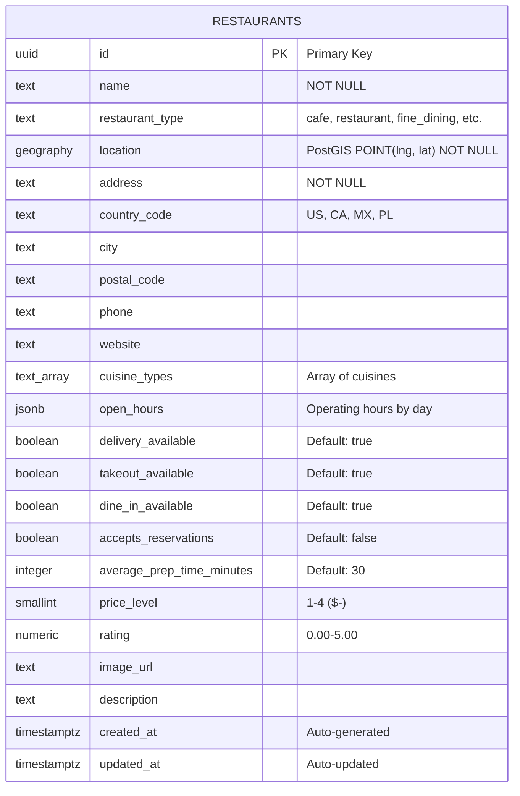
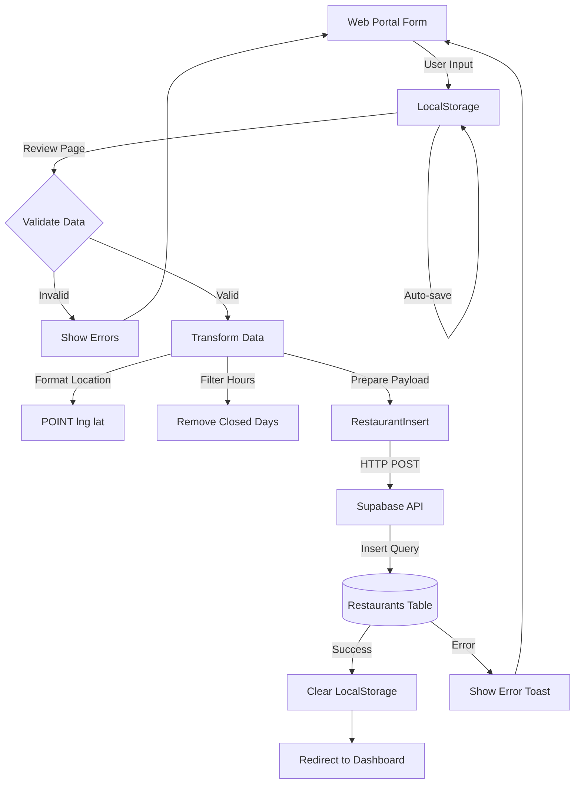
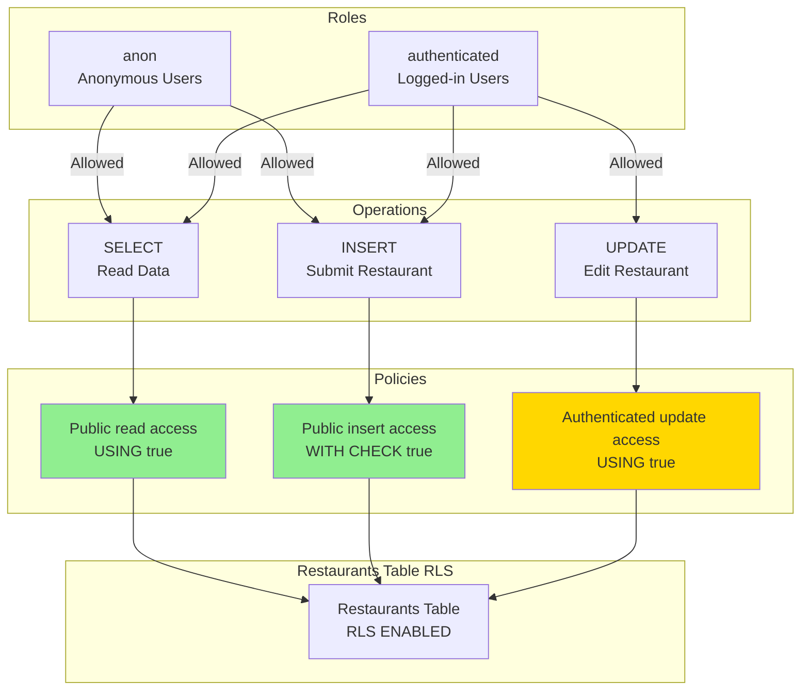
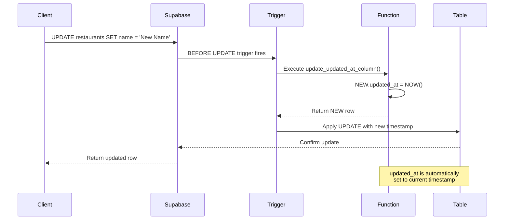
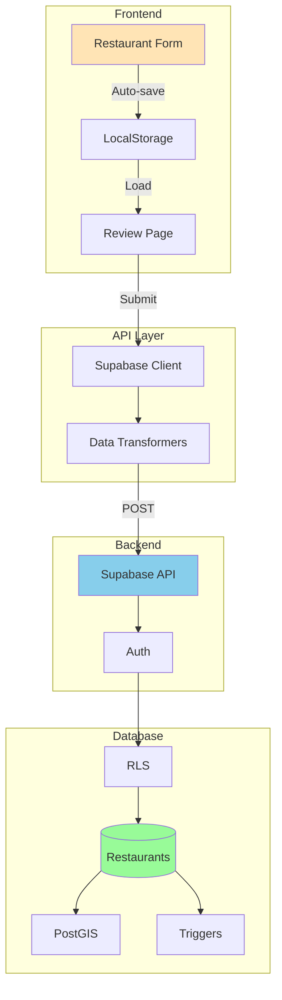

# Restaurant Schema Diagrams - Index

This document contains links to all database schema diagrams.

## 📊 All Diagrams in One File

**Main File**: [`restaurant-schema-diagram.md`](./restaurant-schema-diagram.md)

Contains all 8 diagrams with descriptions. Best viewed in:

- ✅ GitHub (auto-renders Mermaid)
- ✅ VS Code with "Markdown Preview Mermaid Support" extension
- ✅ Any Markdown viewer with Mermaid support

---

## 🎯 Individual Diagrams (Copy-Paste Ready)

### 1. Entity Relationship Diagram (ERD)

Shows complete table structure with all columns and data types.



---

### 2. Data Flow Diagram

Complete submission flow from form to database.



---

### 3. Data Transformation Flow

How portal data converts to Supabase format.

```mermaid
flowchart LR
    subgraph Portal["Web Portal Data"]
        A1[basicInfo.name]
        A2[basicInfo.location<br/>{lat lng}]
        A3[basicInfo.cuisines<br/>Array]
        A4[operations.operating_hours<br/>{day: {open close closed}}]
    end

    subgraph Transform["Transformation Layer"]
        B1[Direct Copy]
        B2[formatLocationForSupabase]
        B3[Array Passthrough]
        B4[formatOperatingHours]
    end

    subgraph Supabase["Supabase Format"]
        C1[name: TEXT]
        C2[location: GEOGRAPHY<br/>POINT lng lat]
        C3[cuisine_types: TEXT]
        C4[open_hours: JSONB<br/>{day: {open close}}]
    end

    A1 --> B1 --> C1
    A2 --> B2 --> C2
    A3 --> B3 --> C3
    A4 --> B4 --> C4
```

---

### 4. Row Level Security Policies

Permission flow for different user roles.



---

### 5. Trigger Workflow

Sequence diagram showing auto-update timestamp.



---

### 6. Complete System Architecture

End-to-end architecture from frontend to database.



---

## 📝 Quick Reference

| Diagram                 | Purpose                  | Best For                        |
| ----------------------- | ------------------------ | ------------------------------- |
| **ERD**                 | Complete table structure | Database design, documentation  |
| **Data Flow**           | Submission process       | Understanding user flow         |
| **Transformation**      | Data conversion          | Debugging data format issues    |
| **RLS Policies**        | Security permissions     | Understanding access control    |
| **Trigger Workflow**    | Auto-update mechanism    | Understanding database triggers |
| **System Architecture** | Full stack overview      | High-level understanding        |

---

## 🛠️ How to Use These Diagrams

### Option 1: View in GitHub

1. Push to GitHub
2. Open this file
3. Diagrams render automatically

### Option 2: VS Code

1. Install extension: "Markdown Preview Mermaid Support"
2. Open this file
3. Press `Ctrl+Shift+V` (or `Cmd+Shift+V` on Mac)
4. View rendered diagrams

### Option 3: Online Viewer

1. Go to https://mermaid.live
2. Copy one diagram at a time (including ```mermaid markers)
3. Paste into editor
4. View rendered diagram

### Option 4: Export Images

1. Use mermaid.live
2. Paste diagram
3. Click "Actions" → "Export" → "PNG/SVG"
4. Save image for presentations

---

## 📊 Schema Quick Stats

- **Columns**: 21 total (3 required, 18 optional)
- **Indexes**: 7 (1 GIST spatial, 1 GIN array, 5 BTREE)
- **RLS Policies**: 3 (SELECT, INSERT, UPDATE)
- **Triggers**: 1 (auto-update timestamp)
- **Extensions**: 2 (uuid-ossp, postgis)

---

## 🔗 Related Documentation

- [Quick Start Guide](./quick-start-supabase.md)
- [Integration Status](./supabase-integration-status.md)
- [Full Setup Guide](./supabase-setup.md)
- [Migration File](../infra/supabase/migrations/003_restaurant_portal_safe.sql)
