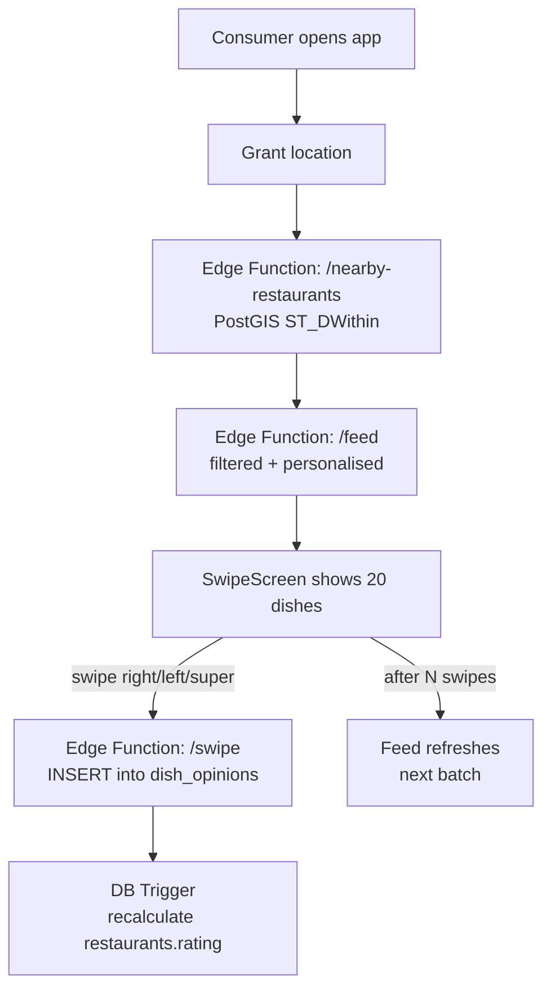
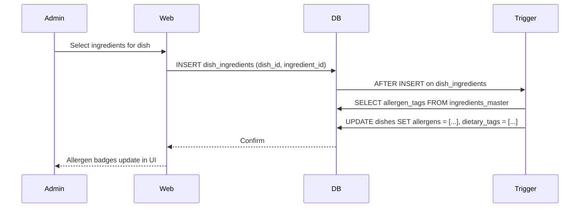
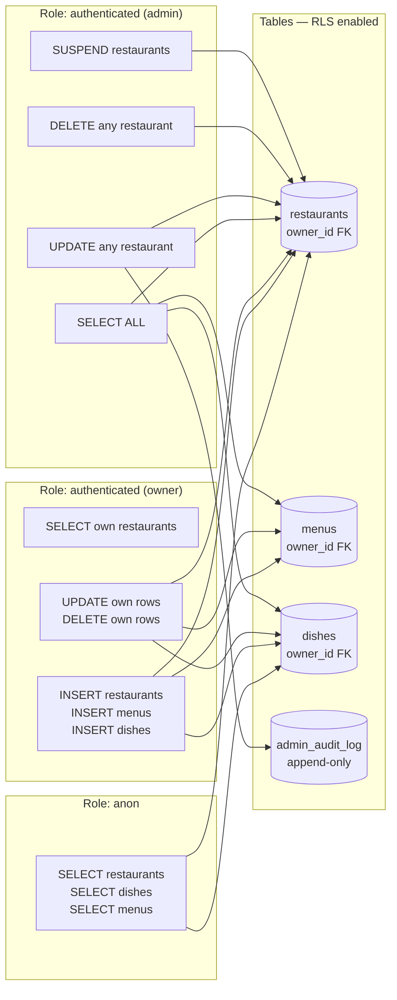

# EatMe — Diagrams Index

_Last updated: March 3, 2026_

> **Note:** The schema diagrams in `restaurant-schema-diagram.md` were written early in the project when only 3 tables existed. The authoritative, up-to-date schema is in **[schema-erd.md](./schema-erd.md)**, which covers all tables across 40 migrations.

---

## Current Architecture Diagrams

### System Architecture (March 2026)

```mermaid
graph TB
    subgraph "Web Portal (Next.js)"
        OWNER[Restaurant Owner]
        ONBOARD[Onboarding Wizard]
        ADMIN[Admin Dashboard]
        PORTAL_AUTH[Supabase Auth]
    end

    subgraph "Mobile App (React Native + Expo)"
        CONSUMER[Consumer]
        SWIPE[SwipeScreen]
        MAP[BasicMapScreen]
        EAT[EatTogetherScreen]
        MOBILE_AUTH[Supabase Auth ⏳]
    end

    subgraph "Supabase Edge Functions"
        FEED[/feed]
        NEARBY[/nearby-restaurants]
        SWIPE_FN[/swipe]
        GROUP[/group-recommendations]
    end

    subgraph "Supabase (PostgreSQL + PostGIS)"
        DB[(Database\n40 migrations)]
        STORAGE[(Storage\nmenu-scans, photos)]
        AUTH_SVC[Auth Service]
        RLS[Row Level Security]
    end

    OWNER --> ONBOARD --> DB
    OWNER --> ADMIN --> DB
    PORTAL_AUTH --> AUTH_SVC

    CONSUMER --> MAP --> NEARBY --> DB
    CONSUMER --> SWIPE --> FEED --> DB
    CONSUMER --> SWIPE_FN --> DB
    CONSUMER --> EAT --> GROUP --> DB

    DB --- RLS
    MOBILE_AUTH -.->|"⏳ not yet wired"| AUTH_SVC
```

---

### Data Flow: Restaurant Onboarding

```mermaid
flowchart TD
    A[Owner fills form\n/onboard/basic-info] -->|auto-save| B[(LocalStorage)]
    B --> C[/onboard/menu — add menus + dishes]
    C -->|auto-save| B
    B --> D[/onboard/review — final check]
    D -->|submit| E{Validate}
    E -->|invalid| F[Show errors]
    F --> A
    E -->|valid| G[Transform data\nPOINT lng lat\nfilter closed hours]
    G --> H[Supabase INSERT\nrestaurants + menus + dishes]
    H --> I{DB Triggers}
    I --> J[allergens + dietary_tags\nrecalculated]
    H -->|success| K[Clear LocalStorage\nRedirect /dashboard]
    H -->|error| L[Toast error\nKeep LocalStorage]
```

---

### Data Flow: Consumer Swipe Feed

```mermaid
flowchart TD
    A[Consumer opens app] --> B[Grant location]
    B --> C[Edge Function: /nearby-restaurants\nPostGIS ST_DWithin]
    C --> D[Edge Function: /feed\nfiltered + personalised]
    D --> E[SwipeScreen shows 20 dishes]
    E -->|swipe right/left/super| F[Edge Function: /swipe\nINSERT into dish_opinions]
    F --> G[DB Trigger\nrecalculate restaurants.rating]
    E -->|after N swipes| H[Feed refreshes\nnext batch]
```

---

### Ingredient & Allergen Trigger Flow

```mermaid
sequenceDiagram
    participant Admin
    participant Web
    participant DB
    participant Trigger

    Admin->>Web: Select ingredients for dish
    Web->>DB: INSERT dish_ingredients (dish_id, ingredient_id)
    DB->>Trigger: AFTER INSERT on dish_ingredients
    Trigger->>DB: SELECT allergen_tags FROM ingredients_master
    Trigger->>DB: UPDATE dishes SET allergens = [...], dietary_tags = [...]
    DB-->>Web: Confirm
    Web-->>Admin: Allergen badges update in UI
```

---

### RLS Security Model

```mermaid
flowchart LR
    subgraph "Role: anon"
        ANON_SEL[SELECT restaurants\nSELECT dishes\nSELECT menus]
    end

    subgraph "Role: authenticated (owner)"
        OWN_SEL[SELECT own restaurants]
        OWN_INS[INSERT restaurants\nINSERT menus\nINSERT dishes]
        OWN_UPD[UPDATE own rows\nDELETE own rows]
    end

    subgraph "Role: authenticated (admin)"
        ADM_SEL[SELECT ALL]
        ADM_UPD[UPDATE any restaurant]
        ADM_DEL[DELETE any restaurant]
        ADM_SUS[SUSPEND restaurants]
    end

    subgraph "Tables — RLS enabled"
        R[(restaurants\nowner_id FK)]
        M[(menus\nowner_id FK)]
        D[(dishes\nowner_id FK)]
        LOG[(admin_audit_log\nappend-only)]
    end

    ANON_SEL --> R
    ANON_SEL --> D
    OWN_INS --> R & M & D
    OWN_UPD --> R & M & D
    ADM_SEL --> R & M & D
    ADM_UPD --> R
    ADM_DEL --> R
    ADM_SUS --> R
    ADM_UPD --> LOG
```

---

## Legacy Diagrams

The file `restaurant-schema-diagram.md` contains 8 diagrams written in December 2025 when the schema had only 3 tables. It is kept for historical reference but should not be used for current development.

---

## 🔗 Related Documentation

- [schema-erd.md](./schema-erd.md) — **authoritative** current schema (all 40 migrations)
- [supabase-integration-status.md](./supabase-integration-status.md) — current integration state
- [EDGE_FUNCTIONS_ARCHITECTURE.md](./EDGE_FUNCTIONS_ARCHITECTURE.md) — Edge Function details
