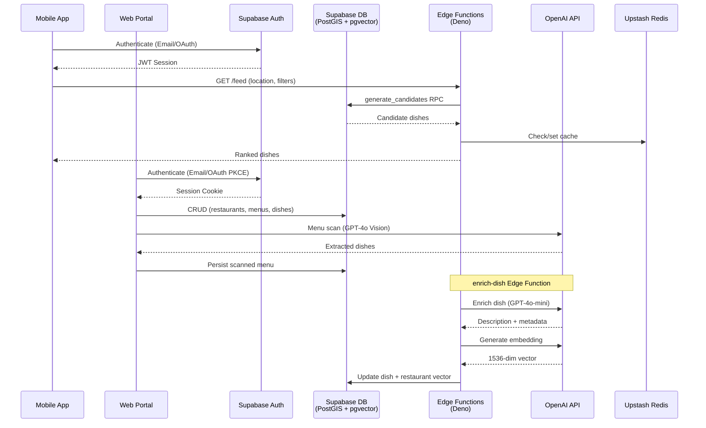

# Project Overview

## Table of Contents

- [What is EatMe](#what-is-eatme)
- [Value Proposition](#value-proposition)
- [Target Users](#target-users)
- [High-Level Architecture](#high-level-architecture)
- [Monorepo Structure](#monorepo-structure)
- [Key Concepts](#key-concepts)

---

## What is EatMe

EatMe is a food discovery platform that connects consumers with restaurants through personalized dish recommendations. Rather than browsing restaurant listings, users discover individual dishes tailored to their tastes, dietary needs, and location. Restaurant owners manage their digital presence through a dedicated web portal with AI-assisted menu digitization.

## Value Proposition

**For Consumers (Mobile App):**

- Personalized dish discovery based on learned taste preferences
- Dietary safety through allergen and restriction filtering
- Group dining coordination via Eat Together sessions
- Map-based browsing to find dishes nearby

**For Restaurant Owners (Web Portal):**

- Digital menu management with structured dish data
- AI-powered menu scanning and dish enrichment (descriptions, tags, embeddings)
- Analytics on dish visibility and engagement

<!-- TODO: detail analytics features currently implemented -->

## Target Users

| Role | Platform | Description |
|------|----------|-------------|
| Consumer | Mobile app | Discovers dishes, swipes preferences, joins group sessions |
| Restaurant Owner | Web portal | Manages restaurant profile, menus, and dishes |
| Admin | Web portal | Oversees platform data, reviews restaurants |

## High-Level Architecture



## Monorepo Structure

```
eatMe_v1/
├── apps/
│   ├── web-portal/        # Next.js 16 — restaurant owner + admin portal
│   └── mobile/            # React Native 0.81 + Expo 54 — consumer app
├── packages/
│   ├── database/          # Shared Supabase client + generated TypeScript types
│   └── tokens/            # Design tokens
├── infra/
│   ├── supabase/          # Migrations + edge functions
│   └── scripts/           # Batch maintenance scripts
├── docs/                  # Project documentation
├── turbo.json             # Turborepo pipeline config
├── pnpm-workspace.yaml    # pnpm workspace definitions
└── package.json           # Root package scripts
```

## Key Concepts

| Term | Definition |
|------|------------|
| **Canonical Ingredients** | A master ingredient list maintained in the database with pre-mapped allergen and dietary classifications. Dishes reference canonical ingredients to enable reliable filtering. |
| **Enrichment** | An AI pipeline (via the `enrich-dish` edge function) that takes a dish name and optional context, then generates a description, tags, metadata, and a 1536-dimensional embedding vector using OpenAI models. |
| **Preference Vectors** | 1536-dimensional embeddings (from `text-embedding-3-small`) representing a user's taste profile. Updated as the user swipes on dishes. Used for cosine-similarity ranking in feed generation. |
| **Eat Together Sessions** | Group dining coordination feature using Supabase Realtime. One user creates a session, invites others, and the system computes dish recommendations that satisfy all participants' preferences and dietary restrictions. |
| **Feed Generation** | The process of selecting and ranking dishes for a user. Combines PostGIS proximity queries, pgvector similarity search, and dietary/allergen filtering via the `generate_candidates` RPC. |
| **Menu Scan** | GPT-4o Vision-based extraction of dishes from uploaded menu images or PDFs in the web portal. Extracted dishes are mapped to structured data and persisted. |
