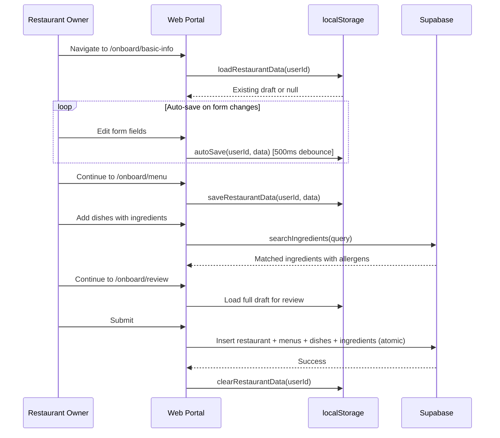
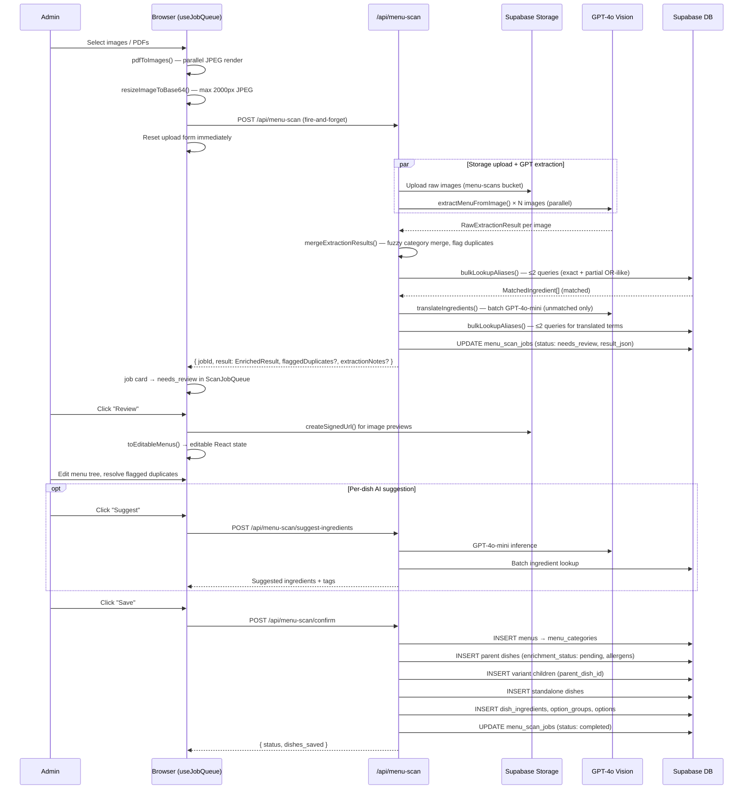

# Web Portal Technical Reference

Complete technical reference for the Next.js web portal (`apps/web-portal/`).

---

## Table of Contents

1. [Overview](#1-overview)
2. [App Router Structure](#2-app-router-structure)
3. [Authentication](#3-authentication)
4. [Components Reference](#4-components-reference)
5. [Services & Libraries](#5-services--libraries)
6. [API Routes Reference](#6-api-routes-reference)
7. [Form Validation](#7-form-validation)
8. [State Management](#8-state-management)
9. [Key Features Detail](#9-key-features-detail)

---

## 1. Overview

The web portal is the restaurant owner and admin interface for the EatMe platform. It provides restaurant onboarding, menu management, and administrative tools.

| Aspect | Detail |
|--------|--------|
| Framework | Next.js 16.0.3 (App Router) |
| UI Library | React 19.2.0 |
| Component Library | shadcn/ui (Radix primitives + Tailwind CSS) |
| Authentication | Supabase Auth with PKCE flow, cookie-based sessions |
| Database | Supabase (PostGIS, RLS) |
| Form Handling | React Hook Form + Zod validation |
| Map | Leaflet with Nominatim reverse geocoding |

---

## 2. App Router Structure

### Public Routes

| Route | File | Purpose |
|-------|------|---------|
| `/auth/login` | `app/auth/login/page.tsx` | Email/password + OAuth sign-in (Google, Facebook) |
| `/auth/signup` | `app/auth/signup/page.tsx` | Registration with restaurant name in user_metadata |
| `/auth/callback` | `app/auth/callback/route.ts` | OAuth PKCE callback handler -- exchanges `?code=` for cookie session |

### Protected Routes (Restaurant Owner)

| Route | File | Purpose |
|-------|------|---------|
| `/` | `app/page.tsx` | Dashboard -- restaurant summary, menu/dish counts, quick actions |
| `/onboard/basic-info` | `app/onboard/basic-info/page.tsx` | Restaurant identity, address, location picker, cuisines, hours, services |
| `/onboard/menu` | `app/onboard/menu/page.tsx` | Menu and dish management during onboarding |
| `/onboard/review` | `app/onboard/review/page.tsx` | Final review before submission |
| `/menu/manage` | `app/menu/manage/page.tsx` | Primary menu management UI (post-onboarding) |
| `/restaurant/edit` | `app/restaurant/edit/page.tsx` | Edit restaurant basic info and hours |

### Admin Routes

| Route | File | Purpose |
|-------|------|---------|
| `/admin` | `app/admin/page.tsx` | Dashboard with platform statistics |
| `/admin/restaurants` | `app/admin/restaurants/page.tsx` | List, search, and filter restaurants |
| `/admin/restaurants/[id]` | `app/admin/restaurants/[id]/page.tsx` | Restaurant detail view |
| `/admin/restaurants/[id]/edit` | `app/admin/restaurants/[id]/edit/page.tsx` | Edit restaurant |
| `/admin/restaurants/[id]/menus` | `app/admin/restaurants/[id]/menus/page.tsx` | Manage restaurant menus |
| `/admin/restaurants/new` | `app/admin/restaurants/new/page.tsx` | Create new restaurant |
| `/admin/ingredients` | `app/admin/ingredients/page.tsx` | Manage canonical ingredients and aliases |
| `/admin/dish-categories` | `app/admin/dish-categories/page.tsx` | Manage dish categories |
| `/admin/menu-scan` | `app/admin/menu-scan/page.tsx` | Review menu scan results |

Admin routes share a layout (`app/admin/layout.tsx`) that wraps all admin pages with `AdminSidebar` and `AdminHeader`.

---

## 3. Authentication

Authentication is implemented via `AuthContext` (`contexts/AuthContext.tsx`) which wraps the entire app through `AuthProvider`.

### Session Lifecycle

1. On mount, `supabase.auth.getSession()` hydrates the initial session state (covers hard-refreshes).
2. `onAuthStateChange` keeps the context in sync with Supabase token refreshes and OAuth callback events.
3. Stale form drafts older than 7 days are cleared on initial load via `clearIfStale()`.

### Auth Methods

| Method | Implementation |
|--------|---------------|
| Email/password sign-in | `signInWithPassword()` |
| Email/password sign-up | `signUp()` with `restaurant_name` in `user_metadata` |
| OAuth (Google, Facebook) | `signInWithOAuth()` with PKCE flow, redirects to `/auth/callback` |
| Sign out | `signOut()` -- clears localStorage draft before signing out |

### PKCE Flow

The browser client (`lib/supabase.ts`) uses `@supabase/ssr`'s `createBrowserClient` which stores the session in cookies (not localStorage) and uses PKCE flow by default. The server client (`lib/supabase-server.ts`) reads/writes cookies for server-side session verification.

### Role-Based Access

| Role | Source | Usage |
|------|--------|-------|
| `consumer` | Default | Mobile app users |
| `restaurant_owner` | Assigned on signup | Restaurant dashboard access |
| `admin` | `app_metadata.role` (service-role-only) | Admin panel access, verified via `verifyAdminRequest()` |

`app_metadata` is writable only by the service role, making it safe for access control decisions. `user_metadata` is user-editable and is never used for role checks.

### Middleware (`middleware.ts`)

Next.js edge middleware runs on every request (excluding static assets). Responsibilities:

1. **Session refresh** — calls `client.auth.getUser()` via `createMiddlewareClient()` on every request to refresh the Supabase access token cookie before it expires.
2. **Route protection** — unauthenticated requests to `/onboard/*`, `/menu/*`, and `/restaurant/*` are redirected to `/auth/login?redirect=<path>`.
3. **Admin protection** — unauthenticated or non-admin requests to `/admin/*` redirect to `/auth/login` or `/` respectively.
4. **Auth page redirect** — authenticated users hitting `/auth/login` or `/auth/signup` are redirected to `/`.
5. **Security headers** — applied globally: `X-Frame-Options: DENY`, `X-Content-Type-Options`, CSP (no `unsafe-eval`), `Referrer-Policy`, `Permissions-Policy`.

### ProtectedRoute and AdminRoute

| Component | File | Behaviour |
|-----------|------|-----------|
| `ProtectedRoute` | `components/ProtectedRoute.tsx` | Checks `useAuth()`. Redirects to `/auth/login` if no session. Shows spinner during load. |
| `AdminRoute` | `components/AdminRoute.tsx` | Checks `user.app_metadata.role === 'admin'`. Redirects to `/auth/login` if unauthenticated, to `/` if authenticated but not admin. |

Both components are client-side guards complementing the edge middleware (defence in depth).

---

## 4. Components Reference

| Component | File Path | Purpose |
|-----------|-----------|---------|
| `ProtectedRoute` | `components/ProtectedRoute.tsx` | Auth wrapper; redirects unauthenticated users to login |
| `AdminRoute` | `components/AdminRoute.tsx` | Admin auth wrapper; redirects to `/auth/login` if unauthenticated, to `/` if not admin |
| `DataTable` | `components/DataTable.tsx` | Generic sortable/filterable data table used across admin pages |
| `DishFormDialog` | `components/forms/DishFormDialog.tsx` | Full dish editor (wizard mode for onboarding, DB mode for live editing) |
| `DishCard` | `components/forms/DishCard.tsx` | Dish display card with edit, delete, and duplicate actions |
| `IngredientAutocomplete` | `components/IngredientAutocomplete.tsx` | Searchable ingredient dropdown with automatic allergen/dietary tag calculation |
| `LocationPicker` | `components/LocationPicker.tsx` | Leaflet map with Nominatim reverse geocoding for address selection |
| `AllergenWarnings` | `components/AllergenWarnings.tsx` | Allergen badge display |
| `DietaryTagBadges` | `components/DietaryTagBadges.tsx` | Dietary tag badge display |
| `AdminSidebar` | `components/admin/AdminSidebar.tsx` | Admin navigation sidebar |
| `AdminHeader` | `components/admin/AdminHeader.tsx` | Admin header with security indicator |
| `NewRestaurantForm` | `components/admin/NewRestaurantForm.tsx` | Admin restaurant creation form |
| `RestaurantTable` | `components/admin/RestaurantTable.tsx` | Restaurant listing table with search/filter |
| `AddIngredientPanel` | `components/admin/AddIngredientPanel.tsx` | Admin ingredient creation panel (used in menu scan review) |
| `InlineIngredientSearch` | `components/admin/InlineIngredientSearch.tsx` | Inline search for matching ingredients during menu scan review |
| `MenuScanUpload` | `app/admin/menu-scan/components/MenuScanUpload.tsx` | Upload phase UI: restaurant picker, file drop zone, PDF conversion progress |
| `MenuScanReview` | `app/admin/menu-scan/components/MenuScanReview.tsx` | Review phase UI: split-panel menu editor with image lightbox and warnings panel |
| `MenuScanDone` | `app/admin/menu-scan/components/MenuScanDone.tsx` | Post-confirm confirmation screen with dish count and next-action links |
| `ReviewHeader` | `app/admin/menu-scan/components/ReviewHeader.tsx` | Sticky header for the review phase; shows warning count and Save button |
| `ScanJobQueue` | `app/admin/menu-scan/components/ScanJobQueue.tsx` | Background job list shown during upload phase; one card per in-flight or ready scan |
| `components/ui/*` | `components/ui/` | Full shadcn/ui component library (button, card, dialog, form, input, select, tabs, badge, checkbox, radio-group, alert, alert-dialog, dropdown-menu, label, progress, separator, sonner, textarea) |

---

## 5. Services & Libraries

| Module | File | Key Functions / Purpose |
|--------|------|------------------------|
| `restaurantService` | `lib/restaurantService.ts` | Restaurant, menu, and dish CRUD operations. Page components import from here rather than calling Supabase directly. |
| `ingredients` | `lib/ingredients.ts` | Ingredient search (`searchIngredients`), allergen/dietary tag management, `addDishIngredients()`. Defines `Ingredient`, `CanonicalIngredient`, `IngredientAlias`, `Allergen`, `DietaryTag` types. |
| `menu-scan` | `lib/menu-scan.ts` | Menu scan types and pure helpers. Key types: `RawExtractedDish`, `EnrichedDish`, `EditableDish`, `EditableMenu`, `ConfirmDish`, `ConfirmPayload`. Key functions: `mergeExtractionResults()` (multi-page merge with fuzzy category matching and duplicate detection), `toEditableMenus()` (converts `EnrichedResult` to editable React state), `buildConfirmPayload()` (serialises review state for the confirm API), `mapDietaryHints()`, `newEmptyDish()`, `countDishes()`. |
| `menu-scan-utils` | `lib/menu-scan-utils.ts` | Browser-side image utilities. `resizeImageToBase64(file, maxDim=2000)` — resizes to max 2000px longest side, returns JPEG 0.82 as base64. `pdfToImages(file)` — converts PDF pages to JPEG `File[]` using pdfjs-dist (2× scale, parallel rendering). |
| `menu-scan-warnings` | `lib/menu-scan-warnings.ts` | Client-side deterministic validation. `computeMenuWarnings(menus, currency)` — emits `MenuWarning[]` covering: missing name, zero price, confidence thresholds, per-currency price outliers (currency-aware thresholds), unmatched ingredients, duplicates. `extractionNotesToWarnings(notes)` — converts AI extraction notes to the same shape. |
| `validation` | `lib/validation.ts` | Zod schemas: `basicInfoSchema`, `operationsSchema`, `dishSchema`, `menuSchema`, `restaurantDataSchema`. Inferred TypeScript types exported for React Hook Form. |
| `storage` | `lib/storage.ts` | localStorage draft persistence with user-scoped keys (`eatme_draft_{userId}`). Auto-save with 500ms debounce (`autoSave()`), stale draft cleanup (`clearIfStale()`, 7-day threshold). |
| `constants` | `lib/constants.ts` | Static UI and business constants (cuisine lists, dietary tag codes, allergen codes). |
| `supabase` | `lib/supabase.ts` | Browser Supabase client using `@supabase/ssr` `createBrowserClient` — PKCE flow, cookie-based session. Also exports DB type aliases and helper functions (`formatLocationForSupabase`, `formatOperatingHours`). |
| `supabase-server` | `lib/supabase-server.ts` | Server-side clients: `createSupabaseSessionClient()` (cookie-based, for Server Components/Route Handlers), `createMiddlewareClient()` (used by `middleware.ts` for edge session refresh), `createServerSupabaseClient()` (service-role admin client), `verifyAdminRequest()` (Bearer token + admin role check). |
| `cuisine-categories` | `lib/cuisine-categories.ts` | Cuisine category definitions and groupings. |
| `dish-categories` | `lib/dish-categories.ts` | Dish category definitions. |
| `parseAddress` | `lib/parseAddress.ts` | Address parsing utilities. |
| `export` | `lib/export.ts` | Data export utilities. |

---

## 6. API Routes Reference

### POST `/api/ingredients`

Creates a new canonical ingredient with optional aliases. Used by `AddIngredientPanel` in the menu scan review UI.

| Field | Detail |
|-------|--------|
| Auth | Admin only (`verifyAdminRequest`) |
| Body | `{ canonical_name, ingredient_family_name, is_vegetarian, is_vegan, allergen_codes: string[], extra_aliases: string[] }` |
| Response | `{ ingredient: { id, canonical_name, ... }, alias: { id, display_name, ... } }` |

### POST `/api/menu-scan`

Fires GPT-4o Vision extraction for one or more menu images. Non-blocking by design: the route creates a `menu_scan_jobs` record, runs extraction and enrichment, writes the result to `result_json`, and returns the full result plus a `jobId` so the client can track it in the background queue.

| Field | Detail |
|-------|--------|
| Auth | Admin only (`verifyAdminRequest`) |
| Body | `{ restaurant_id, images: [{ name, mime_type, data: base64 }] }` — max 20 images |
| AI | GPT-4o Vision per image (parallel), Structured Outputs via `zodResponseFormat`, `detail: 'high'`, `max_tokens: 16384` |
| Pipeline | Validate → load restaurant → create job (`processing`) → upload images to Storage + GPT-4o in parallel → merge multi-page results → batch ingredient matching → update job (`needs_review`) |
| Response | `{ jobId, currency, result: EnrichedResult, dishCount, processingMs, flaggedDuplicates?, extractionNotes? }` |
| Notes | Images are archived to Supabase Storage bucket `menu-scans` for audit. GPT truncation is surfaced as an `ExtractionNote` (not silently swallowed). Same-name/different-price pairs returned as `FlaggedDuplicate[]`. |

### POST `/api/menu-scan/suggest-ingredients`

AI ingredient suggestion for a single dish using GPT-4o-mini. Called on demand from the review UI, not during the main scan pipeline.

| Field | Detail |
|-------|--------|
| Auth | Admin only (`verifyAdminRequest`) |
| Body | `{ dish_name: string, description?: string, dish_category_names?: string[] }` |
| Response | `{ ingredients: MatchedIngredient[], dietary_tags: string[], allergens: string[], spice_level: 0\|1\|3\|null, dish_category_id?: string }` |

### POST `/api/menu-scan/confirm`

Persists admin-reviewed extraction results to the database. Uses a three-pass sequential insertion strategy (parents → children → standalone) with partial failure tolerance — returns `completed_with_warnings` rather than rolling back on individual insert errors.

| Field | Detail |
|-------|--------|
| Auth | Admin only (`verifyAdminRequest`) |
| Body | `ConfirmPayload { job_id, restaurant_id, menus: ConfirmMenu[] }` |
| Operation | INSERT menus → menu_categories → dishes (parents, then variant children with `parent_dish_id`, then standalone) → dish_ingredients → option_groups → options |
| Fields written | `allergens` (AI-inferred), `enrichment_status: 'pending'`, `enrichment_source: 'ai'`, `enrichment_confidence` (derived from GPT-4o confidence score) |
| Notes | `maxDuration = 60` for Vercel (large menus can exceed 300 dishes). No DB transaction — partial failures return `completed_with_warnings` with an error list. |

---

## 7. Form Validation

All form validation uses Zod schemas defined in `lib/validation.ts`. Inferred TypeScript types are used as React Hook Form data types throughout the onboarding wizard.

| Schema | Scope | Key Rules |
|--------|-------|-----------|
| `basicInfoSchema` | Step 1: restaurant identity | `name` min 2 chars, `address` min 5 chars, `location` lat/lng bounds, `cuisines` min 1, optional `phone` (E.164), optional `website` (URL) |
| `operationsSchema` | Step 1: operating details | Per-weekday `open`/`close` times (HH:MM regex), boolean service flags (`delivery_available`, `takeout_available`, `dine_in_available`, `accepts_reservations`) |
| `dishSchema` | Step 2: single dish | `name` min 2 chars, `price` positive max 10000, optional `calories` 0-5000, `dietary_tags`/`allergens` arrays, `spice_level` enum, `dish_kind` (standard/template/experience), `display_price_prefix`, optional `option_groups` array |
| `menuSchema` | Step 2: full menu | `dishes` array min 1 |
| `restaurantDataSchema` | Review: full submission | Merges `basicInfoSchema` + `operationsSchema` as `restaurant`, plus `dishes` array |

---

## 8. State Management

The web portal uses a localStorage-based draft system for the onboarding wizard, not a global state manager.

### Draft Persistence (`lib/storage.ts`)

| Feature | Implementation |
|---------|---------------|
| Storage key | `eatme_draft_{userId}` (user-scoped isolation) |
| Auto-save | 500ms debounce via `autoSave()` -- call inside `watch()` subscriptions |
| Cleanup | `cancelAutoSave()` in effect cleanup to avoid post-unmount writes |
| Stale draft cleanup | `clearIfStale()` removes drafts older than 7 days, called on login |
| Manual clear | `clearRestaurantData()` on sign-out and onboarding completion |
| Data check | `hasSavedData()` to detect resumable drafts |

### Auth State

Auth state is managed via React Context (`AuthContext`) rather than a dedicated state manager. The `AuthProvider` exposes `user`, `session`, `loading`, `signUp`, `signIn`, `signInWithOAuth`, and `signOut` through the `useAuth()` hook.

---

## 9. Key Features Detail

### Restaurant Onboarding Wizard

Multi-step onboarding flow for restaurant partners:

1. **Basic Info** (`/onboard/basic-info`) -- Restaurant name, description, address (with Leaflet map picker), phone, website, cuisines, operating hours, service flags.
2. **Menu** (`/onboard/menu`) -- Add dishes with full detail: name, price, description, ingredients (autocomplete), dietary tags, allergens, spice level, calories, option groups.
3. **Review** (`/onboard/review`) -- Final review of all data before atomic submission.

Progress is auto-saved to localStorage with 500ms debounce. Stale drafts are cleaned up after 7 days.

### Menu Scanning (GPT-4o Vision Pipeline)

Admin-only feature for digitising physical restaurant menus. The pipeline is **non-blocking**: the upload form resets immediately after firing the request, and multiple restaurants can be queued simultaneously.

1. **Upload** — Admin selects images or PDFs. PDFs are converted to JPEG pages in the browser (pdfjs-dist, parallel page rendering). All images are resized to max 2000px JPEG before upload.
2. **Fire & reset** — `fireProcess()` sends the request and immediately returns a `Promise<Response>` without awaiting it. The upload form resets so the admin can start the next restaurant.
3. **Background tracking** — `useJobQueue` attaches to the pending promise. A job card appears in `ScanJobQueue` showing `processing → needs_review`. Jobs survive page refresh (recovered from `menu_scan_jobs WHERE status = 'needs_review'`).
4. **Server extraction** — GPT-4o Vision runs per image in parallel. Structured Outputs (`zodResponseFormat`) guarantee schema conformance. GPT truncation is surfaced as a visible extraction note.
5. **Merge** — `mergeExtractionResults()` folds per-page results into one structure (3-layer category matching; same-name/different-price pairs flagged as potential size variants).
6. **Ingredient matching** — Bulk OR-ilike queries (≤4 DB round-trips total per scan). Unmatched terms are batch-translated via GPT-4o-mini and re-queried. New aliases are saved for future scans.
7. **Review** — Admin edits the menu tree, resolves flagged duplicates (promote to parent-child or dismiss), uses per-dish or bulk AI ingredient suggestion, and inspects currency-aware warnings.
8. **Confirm** — `POST /api/menu-scan/confirm` does a three-pass sequential insert (parents → variant children → standalone dishes). Dishes are written with `enrichment_status: 'pending'` and `allergens` populated from AI inference.

See [workflows/menu-ingestion.md](./workflows/menu-ingestion.md) for the full end-to-end technical specification.

### Ingredient Autocomplete with Allergen Calculation

The `IngredientAutocomplete` component searches the `ingredient_aliases` table and automatically calculates allergens and dietary tags based on the canonical ingredient's properties (family, `is_vegetarian`, `is_vegan`, linked allergen codes).

### Admin Dashboard

Platform administration tools including restaurant management (CRUD, search, filter), canonical ingredient management, dish category management, and menu scan review workflow.

---

## Diagrams

### Restaurant Onboarding Data Flow

### Menu Scan Pipeline

---

## Cross-References

- [Database Schema](./06-database-schema.md)
- [Edge Functions](./07-edge-functions.md)
- [Auth Flow](./workflows/auth-flow.md)
- [Restaurant Onboarding](./workflows/restaurant-onboarding.md)
- [Menu Management](./workflows/menu-management.md)
- [Menu Ingestion (AI Scan)](./workflows/menu-ingestion.md)
