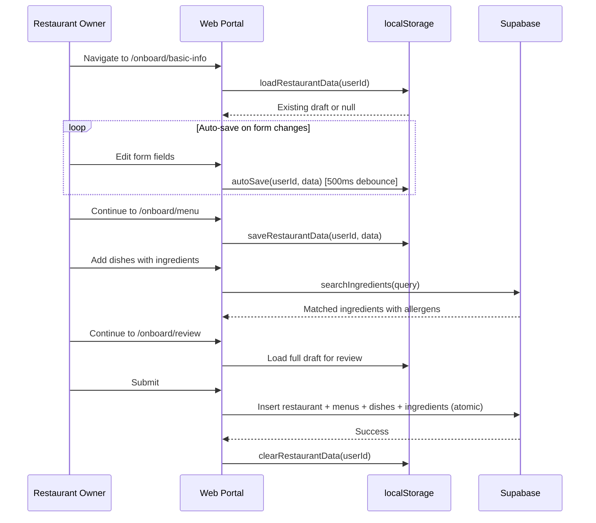
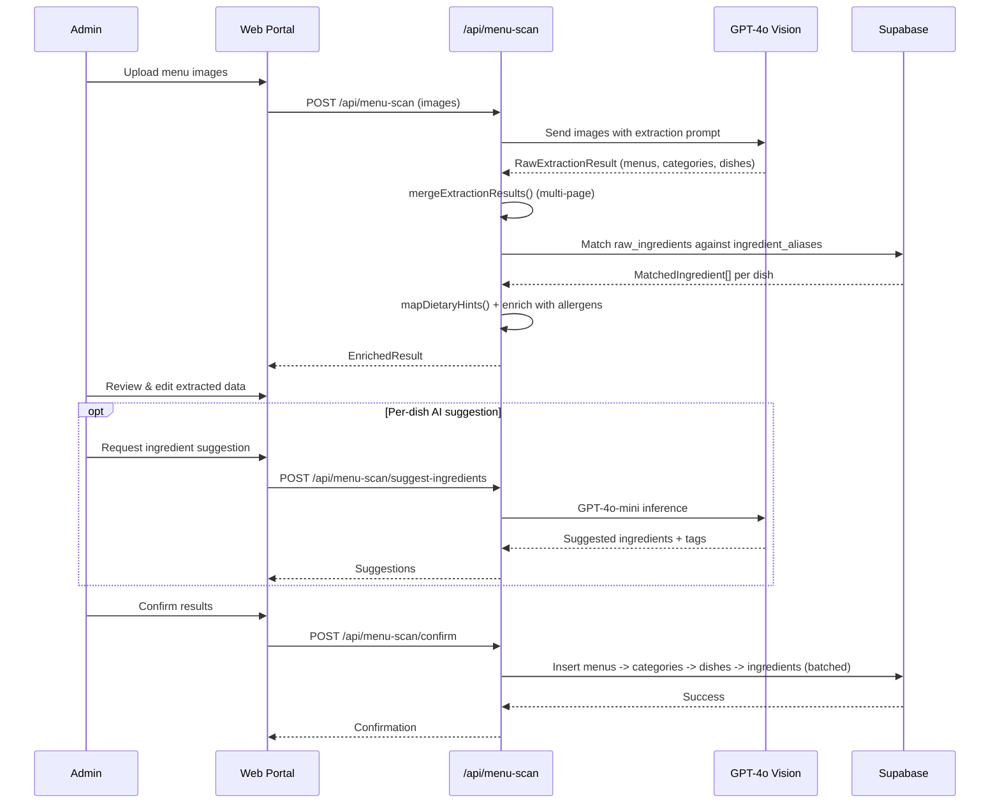

# Web Portal Technical Reference

Complete technical reference for the Next.js web portal (`apps/web-portal/`).

---

## Table of Contents

1. [Overview](#1-overview)
2. [App Router Structure](#2-app-router-structure)
3. [Authentication](#3-authentication)
4. [Components Reference](#4-components-reference)
5. [Services & Libraries](#5-services--libraries)
6. [API Routes Reference](#6-api-routes-reference)
7. [Form Validation](#7-form-validation)
8. [State Management](#8-state-management)
9. [Key Features Detail](#9-key-features-detail)

---

## 1. Overview

The web portal is the restaurant owner and admin interface for the EatMe platform. It provides restaurant onboarding, menu management, and administrative tools.

| Aspect | Detail |
|--------|--------|
| Framework | Next.js 16.0.3 (App Router) |
| UI Library | React 19.2.0 |
| Component Library | shadcn/ui (Radix primitives + Tailwind CSS) |
| Authentication | Supabase Auth with PKCE flow, cookie-based sessions |
| Database | Supabase (PostGIS, RLS) |
| Form Handling | React Hook Form + Zod validation |
| Map | Leaflet with Nominatim reverse geocoding |

---

## 2. App Router Structure

### Public Routes

| Route | File | Purpose |
|-------|------|---------|
| `/auth/login` | `app/auth/login/page.tsx` | Email/password + OAuth sign-in (Google, Facebook) |
| `/auth/signup` | `app/auth/signup/page.tsx` | Registration with restaurant name in user_metadata |
| `/auth/callback` | `app/auth/callback/route.ts` | OAuth PKCE callback handler -- exchanges `?code=` for cookie session |

### Protected Routes (Restaurant Owner)

| Route | File | Purpose |
|-------|------|---------|
| `/` | `app/page.tsx` | Dashboard -- restaurant summary, menu/dish counts, quick actions |
| `/onboard/basic-info` | `app/onboard/basic-info/page.tsx` | Restaurant identity, address, location picker, cuisines, hours, services |
| `/onboard/menu` | `app/onboard/menu/page.tsx` | Menu and dish management during onboarding |
| `/onboard/review` | `app/onboard/review/page.tsx` | Final review before submission |
| `/menu/manage` | `app/menu/manage/page.tsx` | Primary menu management UI (post-onboarding) |
| `/restaurant/edit` | `app/restaurant/edit/page.tsx` | Edit restaurant basic info and hours |

### Admin Routes

| Route | File | Purpose |
|-------|------|---------|
| `/admin` | `app/admin/page.tsx` | Dashboard with platform statistics |
| `/admin/restaurants` | `app/admin/restaurants/page.tsx` | List, search, and filter restaurants |
| `/admin/restaurants/[id]` | `app/admin/restaurants/[id]/page.tsx` | Restaurant detail view |
| `/admin/restaurants/[id]/edit` | `app/admin/restaurants/[id]/edit/page.tsx` | Edit restaurant |
| `/admin/restaurants/[id]/menus` | `app/admin/restaurants/[id]/menus/page.tsx` | Manage restaurant menus |
| `/admin/restaurants/new` | `app/admin/restaurants/new/page.tsx` | Create new restaurant |
| `/admin/ingredients` | `app/admin/ingredients/page.tsx` | Manage canonical ingredients and aliases |
| `/admin/dish-categories` | `app/admin/dish-categories/page.tsx` | Manage dish categories |
| `/admin/menu-scan` | `app/admin/menu-scan/page.tsx` | Review menu scan results |

Admin routes share a layout (`app/admin/layout.tsx`) that wraps all admin pages with `AdminSidebar` and `AdminHeader`.

---

## 3. Authentication

Authentication is implemented via `AuthContext` (`contexts/AuthContext.tsx`) which wraps the entire app through `AuthProvider`.

### Session Lifecycle

1. On mount, `supabase.auth.getSession()` hydrates the initial session state (covers hard-refreshes).
2. `onAuthStateChange` keeps the context in sync with Supabase token refreshes and OAuth callback events.
3. Stale form drafts older than 7 days are cleared on initial load via `clearIfStale()`.

### Auth Methods

| Method | Implementation |
|--------|---------------|
| Email/password sign-in | `signInWithPassword()` |
| Email/password sign-up | `signUp()` with `restaurant_name` in `user_metadata` |
| OAuth (Google, Facebook) | `signInWithOAuth()` with PKCE flow, redirects to `/auth/callback` |
| Sign out | `signOut()` -- clears localStorage draft before signing out |

### PKCE Flow

The browser client (`lib/supabase.ts`) uses `@supabase/ssr`'s `createBrowserClient` which stores the session in cookies (not localStorage) and uses PKCE flow by default. The server client (`lib/supabase-server.ts`) reads/writes cookies for server-side session verification.

### Role-Based Access

| Role | Source | Usage |
|------|--------|-------|
| `consumer` | Default | Mobile app users |
| `restaurant_owner` | Assigned on signup | Restaurant dashboard access |
| `admin` | `app_metadata.role` (service-role-only) | Admin panel access, verified via `verifyAdminRequest()` |

### ProtectedRoute

The `ProtectedRoute` component (`components/ProtectedRoute.tsx`) wraps auth-required pages. It checks `useAuth()` and redirects unauthenticated users to `/auth/login`. Shows a loading spinner while the session check is in flight.

---

## 4. Components Reference

| Component | File Path | Purpose |
|-----------|-----------|---------|
| `ProtectedRoute` | `components/ProtectedRoute.tsx` | Auth wrapper; redirects unauthenticated users to login |
| `DishFormDialog` | `components/forms/DishFormDialog.tsx` | Full dish editor (wizard mode for onboarding, DB mode for live editing) |
| `DishCard` | `components/forms/DishCard.tsx` | Dish display card with edit, delete, and duplicate actions |
| `IngredientAutocomplete` | `components/IngredientAutocomplete.tsx` | Searchable ingredient dropdown with automatic allergen/dietary tag calculation |
| `LocationPicker` | `components/LocationPicker.tsx` | Leaflet map with Nominatim reverse geocoding for address selection |
| `AllergenWarnings` | `components/AllergenWarnings.tsx` | Allergen badge display |
| `DietaryTagBadges` | `components/DietaryTagBadges.tsx` | Dietary tag badge display |
| `AdminSidebar` | `components/admin/AdminSidebar.tsx` | Admin navigation sidebar |
| `AdminHeader` | `components/admin/AdminHeader.tsx` | Admin header with security indicator |
| `NewRestaurantForm` | `components/admin/NewRestaurantForm.tsx` | Admin restaurant creation form |
| `RestaurantTable` | `components/admin/RestaurantTable.tsx` | Restaurant listing table with search/filter |
| `AddIngredientPanel` | `components/admin/AddIngredientPanel.tsx` | Admin ingredient creation panel (used in menu scan review) |
| `InlineIngredientSearch` | `components/admin/InlineIngredientSearch.tsx` | Inline search for matching ingredients during menu scan review |
| `components/ui/*` | `components/ui/` | Full shadcn/ui component library (button, card, dialog, form, input, select, tabs, badge, checkbox, radio-group, alert, alert-dialog, dropdown-menu, label, progress, separator, sonner, textarea) |

---

## 5. Services & Libraries

| Module | File | Key Functions / Purpose |
|--------|------|------------------------|
| `restaurantService` | `lib/restaurantService.ts` | Restaurant, menu, and dish CRUD operations. Page components import from here rather than calling Supabase directly. |
| `ingredients` | `lib/ingredients.ts` | Ingredient search (`searchIngredients`), allergen/dietary tag management, `addDishIngredients()`. Defines `Ingredient`, `CanonicalIngredient`, `IngredientAlias`, `Allergen`, `DietaryTag` types. |
| `menu-scan` | `lib/menu-scan.ts` | Menu scan shared types and pure helpers: `RawExtractedDish`, `EnrichedDish`, `mergeExtractionResults()` for multi-page merge, `mapDietaryHints()` for dietary hint-to-tag mapping. |
| `validation` | `lib/validation.ts` | Zod schemas: `basicInfoSchema`, `operationsSchema`, `dishSchema`, `menuSchema`, `restaurantDataSchema`. Inferred TypeScript types exported for React Hook Form. |
| `storage` | `lib/storage.ts` | localStorage draft persistence with user-scoped keys (`eatme_draft_{userId}`). Auto-save with 500ms debounce (`autoSave()`), stale draft cleanup (`clearIfStale()`, 7-day threshold). |
| `constants` | `lib/constants.ts` | Static UI and business constants (cuisine lists, dietary tag codes, allergen codes). |
| `supabase` | `lib/supabase.ts` | Browser Supabase client using `@supabase/ssr` `createBrowserClient` -- PKCE flow, cookie-based session. Also exports DB type aliases and helper functions (`formatLocationForSupabase`, `formatOperatingHours`). |
| `supabase-server` | `lib/supabase-server.ts` | Server-side clients: `createSupabaseSessionClient()` (cookie-based, for Server Components/Route Handlers), `createMiddlewareClient()` (for proxy.ts), `createServerSupabaseClient()` (service-role admin client), `verifyAdminRequest()` (Bearer token + admin role check). |
| `cuisine-categories` | `lib/cuisine-categories.ts` | Cuisine category definitions and groupings. |
| `dish-categories` | `lib/dish-categories.ts` | Dish category definitions. |
| `parseAddress` | `lib/parseAddress.ts` | Address parsing utilities. |
| `export` | `lib/export.ts` | Data export utilities. |

---

## 6. API Routes Reference

### POST `/api/ingredients`

Creates a new canonical ingredient with optional aliases. Used by `AddIngredientPanel` in the menu scan review UI.

| Field | Detail |
|-------|--------|
| Auth | Admin only (`verifyAdminRequest`) |
| Body | `{ canonical_name, ingredient_family_name, is_vegetarian, is_vegan, allergen_codes: string[], extra_aliases: string[] }` |
| Response | `{ ingredient: { id, canonical_name, ... }, alias: { id, display_name, ... } }` |

### POST `/api/menu-scan`

Uploads menu images and runs GPT-4o Vision extraction with ingredient matching.

| Field | Detail |
|-------|--------|
| Auth | Admin only (`verifyAdminRequest`) |
| AI Model | GPT-4o Vision |
| Pipeline | Image upload -> GPT-4o extraction -> multi-page merge -> ingredient matching against DB -> enriched result |
| Response | `EnrichedResult` with matched ingredients, dietary tags, allergens per dish |

### POST `/api/menu-scan/suggest-ingredients`

AI ingredient suggestion for a single dish using GPT-4o-mini.

| Field | Detail |
|-------|--------|
| Auth | Admin only (`verifyAdminRequest`) |
| Body | `{ dish_name: string, description?: string }` |
| Response | `{ ingredients: MatchedIngredient[], dietary_tags: string[], allergens: string[], spice_level: 0\|1\|3\|null }` |

### POST `/api/menu-scan/confirm`

Commits admin-reviewed extraction results to the database.

| Field | Detail |
|-------|--------|
| Auth | Admin only (`verifyAdminRequest`) |
| Body | `ConfirmPayload { job_id, restaurant_id, menus: [...] }` |
| Operation | Inserts: menus -> menu_categories -> dishes (batched) -> dish_ingredients (batched). `maxDuration = 60` for large menus (300+ dishes). |

---

## 7. Form Validation

All form validation uses Zod schemas defined in `lib/validation.ts`. Inferred TypeScript types are used as React Hook Form data types throughout the onboarding wizard.

| Schema | Scope | Key Rules |
|--------|-------|-----------|
| `basicInfoSchema` | Step 1: restaurant identity | `name` min 2 chars, `address` min 5 chars, `location` lat/lng bounds, `cuisines` min 1, optional `phone` (E.164), optional `website` (URL) |
| `operationsSchema` | Step 1: operating details | Per-weekday `open`/`close` times (HH:MM regex), boolean service flags (`delivery_available`, `takeout_available`, `dine_in_available`, `accepts_reservations`) |
| `dishSchema` | Step 2: single dish | `name` min 2 chars, `price` positive max 10000, optional `calories` 0-5000, `dietary_tags`/`allergens` arrays, `spice_level` enum, `dish_kind` (standard/template/experience), `display_price_prefix`, optional `option_groups` array |
| `menuSchema` | Step 2: full menu | `dishes` array min 1 |
| `restaurantDataSchema` | Review: full submission | Merges `basicInfoSchema` + `operationsSchema` as `restaurant`, plus `dishes` array |

---

## 8. State Management

The web portal uses a localStorage-based draft system for the onboarding wizard, not a global state manager.

### Draft Persistence (`lib/storage.ts`)

| Feature | Implementation |
|---------|---------------|
| Storage key | `eatme_draft_{userId}` (user-scoped isolation) |
| Auto-save | 500ms debounce via `autoSave()` -- call inside `watch()` subscriptions |
| Cleanup | `cancelAutoSave()` in effect cleanup to avoid post-unmount writes |
| Stale draft cleanup | `clearIfStale()` removes drafts older than 7 days, called on login |
| Manual clear | `clearRestaurantData()` on sign-out and onboarding completion |
| Data check | `hasSavedData()` to detect resumable drafts |

### Auth State

Auth state is managed via React Context (`AuthContext`) rather than a dedicated state manager. The `AuthProvider` exposes `user`, `session`, `loading`, `signUp`, `signIn`, `signInWithOAuth`, and `signOut` through the `useAuth()` hook.

---

## 9. Key Features Detail

### Restaurant Onboarding Wizard

Multi-step onboarding flow for restaurant partners:

1. **Basic Info** (`/onboard/basic-info`) -- Restaurant name, description, address (with Leaflet map picker), phone, website, cuisines, operating hours, service flags.
2. **Menu** (`/onboard/menu`) -- Add dishes with full detail: name, price, description, ingredients (autocomplete), dietary tags, allergens, spice level, calories, option groups.
3. **Review** (`/onboard/review`) -- Final review of all data before atomic submission.

Progress is auto-saved to localStorage with 500ms debounce. Stale drafts are cleaned up after 7 days.

### Menu Scanning (GPT-4o Vision Pipeline)

Admin-only feature for digitizing physical restaurant menus:

1. Upload menu images (supports multi-page)
2. GPT-4o Vision extracts structured data (dishes, categories, prices, ingredients, dietary hints, spice levels)
3. Multi-page results are merged via `mergeExtractionResults()`
4. Extracted ingredients are matched against the canonical ingredients database
5. Admin reviews and edits results, can use AI ingredient suggestion per dish
6. Confirmed results are persisted atomically (menus -> categories -> dishes -> ingredients)

### Ingredient Autocomplete with Allergen Calculation

The `IngredientAutocomplete` component searches the `ingredient_aliases` table and automatically calculates allergens and dietary tags based on the canonical ingredient's properties (family, `is_vegetarian`, `is_vegan`, linked allergen codes).

### Admin Dashboard

Platform administration tools including restaurant management (CRUD, search, filter), canonical ingredient management, dish category management, and menu scan review workflow.

---

## Diagrams

### Restaurant Onboarding Data Flow

### Menu Scan Pipeline

---

## Cross-References

- [Database Schema](./06-database-schema.md)
- [Edge Functions](./07-edge-functions.md)
- [Auth Flow](./workflows/auth-flow.md)
- [Restaurant Onboarding](./workflows/restaurant-onboarding.md)
- [Menu Management](./workflows/menu-management.md)
