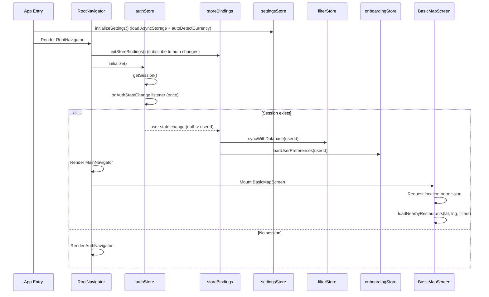
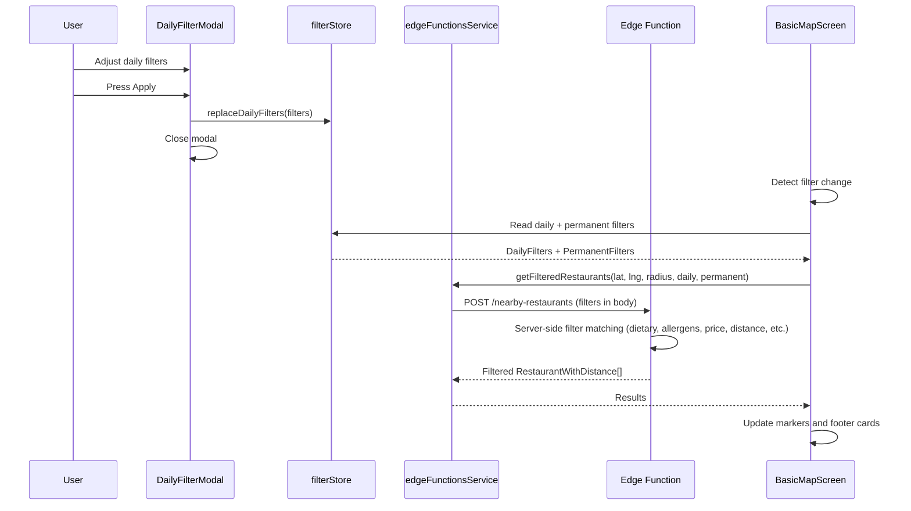

# Mobile App Technical Reference

Complete technical reference for the React Native mobile app (`apps/mobile/`).

---

## Table of Contents

1. [Overview](#1-overview)
2. [Navigation Structure](#2-navigation-structure)
3. [Screens Reference](#3-screens-reference)
4. [State Management (Zustand)](#4-state-management-zustand)
5. [Services Layer](#5-services-layer)
6. [Custom Hooks](#6-custom-hooks)
7. [Components Reference](#7-components-reference)
8. [Internationalization](#8-internationalization)
9. [Configuration](#9-configuration)
10. [Key Features Detail](#10-key-features-detail)

---

## 1. Overview

The mobile app is the consumer-facing food discovery application. Users explore restaurants and dishes on a map, apply dietary filters, participate in group dining sessions, rate experiences, and complete a preference onboarding flow.

| Aspect | Detail |
|--------|--------|
| Framework | React Native 0.81.4 |
| Platform Toolkit | Expo 54 (bare workflow) |
| UI State | Zustand (multiple stores) |
| Map | Mapbox GL |
| Navigation | React Navigation (Stack) |
| i18n | i18next + react-i18next |
| Auth | Supabase Auth (email/password + Google native + Facebook browser OAuth) |
| Backend | Supabase (PostGIS, Edge Functions, Realtime) |

---

## 2. Navigation Structure

Defined in `src/navigation/RootNavigator.tsx`. The root uses conditional rendering based on auth state (session present vs. absent).

```
RootNavigator (Stack, headerShown: false)
|
+-- AuthNavigator (when session === null)
|   +-- Login                   LoginScreen
|   +-- Register                RegisterScreen
|   +-- ForgotPassword          ForgotPasswordScreen
|
+-- MainNavigator (when session !== null)
    +-- Map                     BasicMapScreen              (initialRoute)
    +-- Filters                 FiltersScreen               (transparentModal)
    +-- Favorites               FavoritesScreen             (transparentModal)
    +-- Profile                 ProfileScreen               (transparentModal)
    +-- ProfileEdit             ProfileEditScreen            (modal)
    +-- ViewedHistory           ViewedHistoryScreen          (card, header shown)
    +-- EatTogether             EatTogetherScreen            (transparentModal)
    +-- CreateSession           CreateSessionScreen          (header: "Create Eat Together")
    +-- JoinSession             JoinSessionScreen            (header: "Join Session")
    +-- SessionLobby            SessionLobbyScreen           (header: "Waiting Room")
    +-- Recommendations         RecommendationsScreen        (header: "Restaurant Recommendations")
    +-- VotingResults           VotingResultsScreen          (header: "Voting Results")
    +-- Settings                SettingsScreen               (transparentModal)
    +-- RestaurantDetail        RestaurantDetailScreen       (modal, gesture enabled)
    +-- OnboardingStep1         OnboardingStep1Screen        (header: "Complete Your Profile")
    +-- OnboardingStep2         OnboardingStep2Screen        (header: "Complete Your Profile")
```

Store bindings (`initStoreBindings()`) are wired before `initialize()` in a `useEffect` on the root navigator so that the initial session load triggers filter and onboarding sync.

---

## 3. Screens Reference

### Main Screens

| Screen | File | Purpose | Key Features |
|--------|------|---------|--------------|
| `BasicMapScreen` | `screens/BasicMapScreen.tsx` | Primary map-based feed | Mapbox map, restaurant/dish markers, daily filter modal, view mode toggle, footer with dish cards |
| `FiltersScreen` | `screens/FiltersScreen.tsx` | Permanent filters | 90% height transparent modal, dietary/allergy/exclusion/religious/facility filters, swipe-to-close |
| `FavoritesScreen` | `screens/FavoritesScreen.tsx` | Saved favorites | Transparent modal, placeholder |
| `ProfileScreen` | `screens/ProfileScreen.tsx` | User profile | Stats, dietary summary, profile completion, links to edit/settings/history |
| `ProfileEditScreen` | `screens/ProfileEditScreen.tsx` | Edit profile | Profile name, avatar, dietary preferences |
| `EatTogetherScreen` | `screens/EatTogetherScreen.tsx` | Create/join hub | Entry point for Eat Together flow, transparent modal |
| `SettingsScreen` | `screens/SettingsScreen.tsx` | App settings | Language, currency, notifications, privacy, haptic feedback |
| `RestaurantDetailScreen` | `screens/RestaurantDetailScreen.tsx` | Full restaurant detail | Menu, dishes, ratings, hours, location, contact |
| `ViewedHistoryScreen` | `screens/ViewedHistoryScreen.tsx` | Recently viewed | History of viewed restaurants and dishes |

### Auth Screens

| Screen | File | Purpose |
|--------|------|---------|
| `LoginScreen` | `screens/auth/LoginScreen.tsx` | Email/password + Google/Facebook OAuth |
| `RegisterScreen` | `screens/auth/RegisterScreen.tsx` | Email/password registration with profile name |
| `ForgotPasswordScreen` | `screens/auth/ForgotPasswordScreen.tsx` | Password reset email with `eatme://reset-password` deep link |

### Eat Together Screens

| Screen | File | Purpose |
|--------|------|---------|
| `CreateSessionScreen` | `screens/eatTogether/CreateSessionScreen.tsx` | Create a group dining session |
| `JoinSessionScreen` | `screens/eatTogether/JoinSessionScreen.tsx` | Join via session code |
| `SessionLobbyScreen` | `screens/eatTogether/SessionLobbyScreen.tsx` | Waiting room with member list, realtime updates |
| `RecommendationsScreen` | `screens/eatTogether/RecommendationsScreen.tsx` | View restaurant recommendations with compatibility scores |
| `VotingResultsScreen` | `screens/eatTogether/VotingResultsScreen.tsx` | Final voting results and selected restaurant |

### Onboarding Screens

| Screen | File | Purpose |
|--------|------|---------|
| `OnboardingStep1Screen` | `screens/onboarding/OnboardingStep1Screen.tsx` | Dietary preferences (diet type, proteins, allergies) |
| `OnboardingStep2Screen` | `screens/onboarding/OnboardingStep2Screen.tsx` | Taste preferences (cuisines, dishes, spice tolerance) |

---

## 4. State Management (Zustand)

All stores are in `src/stores/`. Each store is a standalone Zustand `create()` call. Cross-store coordination is handled by `storeBindings.ts`.

### `authStore` (`stores/authStore.ts`)

Manages authentication state and operations.

| Field / Action | Detail |
|----------------|--------|
| `session`, `user` | Current Supabase session and user |
| `isInitialized`, `isLoading` | Initialization and loading flags |
| `initialize()` | Gets existing session, sets up `onAuthStateChange` listener (once) |
| `signIn(email, password)` | Email/password sign-in |
| `signUp(email, password, metadata?)` | Registration with optional `profile_name` in user_metadata |
| `signOut()` | Sign out + native Google SDK sign-out |
| `signInWithOAuth(provider)` | Google: native OS account picker via `signInWithGoogle()`. Facebook: browser-based via `WebBrowser.openAuthSessionAsync()` |
| `resetPassword(email)` | Password reset with `eatme://reset-password` deep link |
| `updateProfile(data)` | Update `profile_name` / `avatar_url` in user_metadata |
| Selector hooks | `useUser()`, `useSession()`, `useIsAuthenticated()`, `useAuthLoading()`, `useAuthError()` |

### `filterStore` (`stores/filterStore.ts`)

Two-tier filter system: daily (session-scoped) + permanent (profile-level, persisted).

| Tier | Scope | Persistence | Key Fields |
|------|-------|-------------|------------|
| **Daily** | Session-only, reset on app restart | Not persisted to AsyncStorage | `priceRange`, `cuisineTypes`, `meals`, `dietPreference`, `proteinTypes`, `meatTypes`, `spiceLevel`, `calorieRange`, `maxDistance`, `openNow`, `sortBy` |
| **Permanent** | Profile-level, rarely changed | AsyncStorage + Supabase `user_preferences` | `dietPreference`, `exclude`, `allergies`, `dietTypes`, `religiousRestrictions`, `facilities`, `ingredientsToAvoid`, `defaultPriceRange`, `cuisinePreferences`, `defaultNutrition`, `notifications` |

- `replaceDailyFilters(filters)` -- atomic replacement used by the daily filter modal Apply button.
- `savePermanentFilters()` -- saves to AsyncStorage AND to Supabase if user is authenticated.
- `syncWithDatabase(userId)` -- loads permanent filters from DB on login.
- `setCurrencyPriceRange(currency)` -- re-initializes price range slider for detected currency.
- Currency-aware defaults via `getDefaultDailyFilters(currency)`.
- Quick filter presets: `nearby`, `cheapEats`, `healthy`, `openNow`.

### `settingsStore` (`stores/settingsStore.ts`)

User preferences persisted via `zustand/middleware` persist to AsyncStorage.

| Field | Detail |
|-------|--------|
| `language` | `'en' \| 'es' \| 'pl'` |
| `currency` | `SupportedCurrency` (auto-detected from device locale) |
| `unitSystem` | `'metric' \| 'imperial'` |
| `detectedCountryCode` | ISO 3166-1 alpha-2 from `RNLocalize.getCountry()` |
| `pushNotifications`, `emailNotifications`, `ratingReminders` | Notification preferences |
| `hapticFeedback`, `autoSaveFilters` | App preferences |
| `analyticsEnabled`, `locationServices` | Privacy settings |
| `autoDetectCurrency()` | Detects country from device locale and updates currency. Called every app launch. |

### `onboardingStore` (`stores/onboardingStore.ts`)

Two-step onboarding flow with profile completion tracking.

| Field / Action | Detail |
|----------------|--------|
| `formData` | `dietType`, `proteinPreferences`, `allergies`, `favoriteCuisines`, `favoriteDishes`, `spiceTolerance` |
| `currentStep`, `totalSteps` | Step navigation (2 steps total) |
| `isCompleted` | Whether onboarding has been completed |
| `profileCompletion` | 0-100 percentage based on form completeness |
| `profilePoints` | Gamification points |
| `completeOnboarding()` | Saves to Supabase `user_preferences` table + AsyncStorage backup |
| `shouldShowPrompt()` | Returns true if not completed and 24h cooldown has elapsed |
| `lastPromptShown` | Stored in AsyncStorage (UI state, not DB) |

### `sessionStore` (`stores/sessionStore.ts`)

Tracks app usage sessions and view history for rating prompts.

| Field / Action | Detail |
|----------------|--------|
| `currentSessionId` | Active `user_sessions` row ID from Supabase |
| `views` | Array of `SessionView` (entity type, ID, timestamp) |
| `recentRestaurants` | Compiled from views with nested `viewedDishes` |
| `startSession()` | Creates or reuses active session in `user_sessions` table |
| `trackView()`, `trackDishView()`, `trackRestaurantView()` | Records views locally and to `session_views` table |
| `getRecentRestaurantsForRating()` | Filters to restaurants viewed within 1-hour session timeout |
| `clearOldSessions()` | Removes views older than 1-hour timeout |

### `viewModeStore` (`stores/viewModeStore.ts`)

Simple toggle between restaurant and dish map view.

| Field | Detail |
|-------|--------|
| `mode` | `'restaurant' \| 'dish'` (default: `'dish'`) |
| `toggleMode()` | Switches between modes |
| `isRestaurantMode()`, `isDishMode()` | Convenience selectors |

### `restaurantStore` (`stores/restaurantStore.ts`)

Restaurant and dish data with two data layers.

| Layer | Source | Usage |
|-------|--------|-------|
| `restaurants` / `dishes` | Direct Supabase queries | Full records with nested menus/categories |
| `nearbyRestaurants` | Feed Edge Function via `geoService` | Geospatially filtered, used by map |
| `searchCenter`, `searchRadius` | Set from last geo query | Map coverage circle display |

- `loadNearbyRestaurants(lat, lng, radiusKm, dailyFilters?, permanentFilters?)` -- calls Edge Function with filters.
- `loadNearbyRestaurantsFromCurrentLocation(getCurrentLocation, ...)` -- decoupled from geolocation API via callback injection.

### `storeBindings` (`stores/storeBindings.ts`)

Reactive cross-store subscriptions. Subscribes to `authStore` and triggers sync on login transitions:

- `filterStore.syncWithDatabase(userId)` -- loads permanent filters from DB
- `onboardingStore.loadUserPreferences(userId)` -- loads onboarding state from DB

Guards against double-firing by tracking `prevUserId`.

---

## 5. Services Layer

All services are in `src/services/`.

| Service | File | Key Functions | Edge Function Calls |
|---------|------|---------------|---------------------|
| `edgeFunctionsService` | `edgeFunctionsService.ts` | `getFeed()`, `getFilteredRestaurants()` | `nearby-restaurants` Edge Function |
| `geoService` | `geoService.ts` | `fetchNearbyRestaurants()`, `fetchNearbyRestaurantsFromCurrentLocation()`, `formatDistance()` | Proxies to `edgeFunctionsService` |
| `ratingService` | `ratingService.ts` | `uploadPhoto()`, `createUserVisit()`, `saveDishOpinions()`, `submitRating()` | Direct Supabase |
| `eatTogetherService` | `eatTogetherService.ts` | Full session lifecycle: create, join, leave, vote, finalize, realtime subscriptions. Types: `EatTogetherSession`, `SessionMember`, `RestaurantRecommendation`. | Supabase Realtime + direct queries |
| `favoritesService` | `favoritesService.ts` | `toggleFavorite()`, `isFavorited()`, `getUserFavorites()` | Direct Supabase |
| `filterService` | `filterService.ts` | `estimateAvgPrice()`, filter matching logic | Local computation |
| `userPreferencesService` | `userPreferencesService.ts` | `loadUserPreferences()`, `saveUserPreferences()`, `permanentFiltersToDb()`, `dbToPermanentFilters()` | Direct Supabase `user_preferences` |
| `interactionService` | `interactionService.ts` | `recordInteraction()` | Direct Supabase |
| `dishRatingService` | `dishRatingService.ts` | `getDishRatingsBatch()` | Direct Supabase |
| `restaurantRatingService` | `restaurantRatingService.ts` | `getRestaurantRating()` | Direct Supabase |
| `viewHistoryService` | `viewHistoryService.ts` | Track recently viewed restaurants and dishes | AsyncStorage + Supabase |
| `ingredientService` | `ingredientService.ts` | Ingredient lookup and mapping | Direct Supabase |
| `dishPhotoService` | `dishPhotoService.ts` | Photo upload management | Supabase Storage |

---

## 6. Custom Hooks

All hooks are in `src/hooks/`.

| Hook | File | Purpose | Details |
|------|------|---------|---------|
| `useUserLocation` | `hooks/useUserLocation.ts` | GPS with 5-min cache, permission handling | Returns `location`, `isLoading`, `error`, `hasPermission`, `cachedLocation`. Uses `expo-location` with `LOCATION_CACHE_DURATION = 5 * 60 * 1000`. |
| `useDish` | `hooks/useDish.ts` | Single dish fetching with joins | Fetches dish with `menu_category` and `restaurant` joined. Returns `dish`, `loading`, `error`, `refetch()`. |
| `useCountryDetection` | `hooks/useCountryDetection.ts` | GPS-based currency detection (two-tier) | Tier 1: `RNLocalize.getCountry()` (instant). Tier 2: `expo-location` reverse geocode (requires permission). Returns `countryCode`, `currency`, `priceRangeDefaults`, `isRefining`, `source`, `refineWithGPS()`. |
| `useSwipeToClose` | `hooks/useSwipeToClose.ts` | Pan gesture for modal dismissal | Returns `translateY` (Animated.Value), `panResponder`, `handleScroll`. Responds only when scrolled to top and dragging down. |

---

## 7. Components Reference

### Map Components (`src/components/map/`)

| Component | File | Purpose |
|-----------|------|---------|
| `DishMarkers` | `map/DishMarkers.tsx` | Dish markers on map |
| `RestaurantMarkers` | `map/RestaurantMarkers.tsx` | Restaurant markers on map |
| `MapControls` | `map/MapControls.tsx` | Map control buttons (zoom, center) |
| `MapFooter` | `map/MapFooter.tsx` | Bottom card carousel for dishes/restaurants |
| `MapHeader` | `map/MapHeader.tsx` | Top bar with search, profile, filters access |
| `ViewModeToggle` | `map/ViewModeToggle.tsx` | Restaurant/dish view toggle |
| `DailyFilterModal` | `map/DailyFilterModal.tsx` | Quick daily filter modal overlay |

### Rating Components (`src/components/rating/`)

| Component | File | Purpose |
|-----------|------|---------|
| `RatingFlowModal` | `rating/RatingFlowModal.tsx` | Main rating flow container modal |
| `SelectRestaurantScreen` | `rating/SelectRestaurantScreen.tsx` | Select restaurant to rate |
| `SelectDishesScreen` | `rating/SelectDishesScreen.tsx` | Select dishes eaten |
| `RestaurantQuestionScreen` | `rating/RestaurantQuestionScreen.tsx` | Restaurant-level questions |
| `RateDishScreen` | `rating/RateDishScreen.tsx` | Per-dish rating with photo upload |
| `RatingCompleteScreen` | `rating/RatingCompleteScreen.tsx` | Completion screen with points summary |
| `RatingBanner` | `rating/RatingBanner.tsx` | Banner prompting user to rate recent visits |

### Common Components (`src/components/common/`)

| Component | File | Purpose |
|-----------|------|---------|
| `ScreenLayout` | `common/ScreenLayout.tsx` | Standard screen wrapper with safe area |
| `ScreenHeader` | `common/ScreenHeader.tsx` | Reusable screen header |
| `EmptyState` | `common/EmptyState.tsx` | Empty state placeholder |
| `ErrorBoundary` | `common/ErrorBoundary.tsx` | React error boundary |
| `SectionContainer` | `common/SectionContainer.tsx` | Section wrapper with title |
| `SettingItem` | `common/SettingItem.tsx` | Settings row item |
| `FeatureList` | `common/FeatureList.tsx` | Feature list display |

### Auth Components (`src/components/auth/`)

| Component | File | Purpose |
|-----------|------|---------|
| `AuthLanguageSelector` | `auth/AuthLanguageSelector.tsx` | Language selector on auth screens |

### Other Components (`src/components/`)

| Component | File | Purpose |
|-----------|------|---------|
| `DishPhotoModal` | `DishPhotoModal.tsx` | Photo viewing modal |
| `DishRatingBadge` | `DishRatingBadge.tsx` | Dish rating display badge |
| `RestaurantRatingBadge` | `RestaurantRatingBadge.tsx` | Restaurant rating display badge |
| `DrawerFilters` | `DrawerFilters.tsx` | Drawer-based filter UI |
| `FilterComponents` | `FilterComponents.tsx` | Shared filter UI building blocks |
| `FilterFAB` | `FilterFAB.tsx` | Floating action button for filters |
| `FloatingMenu` | `FloatingMenu.tsx` | Floating menu overlay |
| `LanguageSelector` | `LanguageSelector.tsx` | In-app language selector |
| `ProfileCompletionBanner` | `ProfileCompletionBanner.tsx` | Onboarding completion prompt banner |
| `ProfileCompletionCard` | `ProfileCompletionCard.tsx` | Profile completion progress card |

---

## 8. Internationalization

Configured in `src/i18n/index.ts` using i18next with react-i18next.

| Aspect | Detail |
|--------|--------|
| Supported languages | English (`en`), Spanish (`es`), Polish (`pl`) |
| Translation files | `src/locales/en.json`, `es.json`, `pl.json` |
| Detection chain | Persisted settingsStore value -> AsyncStorage `userLanguage` key -> device locale (`RNLocalize.getLocales()`) -> English fallback |
| Language change | `changeLanguage(lang)` updates AsyncStorage + i18n + settingsStore |
| Initialization | Synchronous init with `'en'`, then async `loadSavedLanguage()` awaits zustand/persist rehydration before reading the store |

---

## 9. Configuration

### Environment (`src/config/environment.ts`)

Validated at module import time. Throws if required variables are missing.

| Variable | Required | Default | Purpose |
|----------|----------|---------|---------|
| `EXPO_PUBLIC_MAPBOX_ACCESS_TOKEN` | Yes | -- | Mapbox GL token (must start with `pk.`) |
| `EXPO_PUBLIC_API_URL` | No | `http://localhost:3000` | API base URL |
| `EXPO_PUBLIC_DEBUG` | No | `false` | Enable debug logging |
| `EXPO_PUBLIC_DEFAULT_LAT` | No | `19.4326` | Default latitude (Mexico City) |
| `EXPO_PUBLIC_DEFAULT_LNG` | No | `-99.1332` | Default longitude (Mexico City) |
| `EXPO_PUBLIC_DEFAULT_ZOOM` | No | `12` | Default map zoom level |

### Mapbox Config

Default coordinates point to Mexico City (19.4326, -99.1332) at zoom level 12.

### Supabase Config

Configured via `EXPO_PUBLIC_SUPABASE_URL` and `EXPO_PUBLIC_SUPABASE_ANON_KEY` in `src/lib/supabase.ts`.

---

## 10. Key Features Detail

### Map-Based Discovery (Mapbox)

The primary feed (`BasicMapScreen`) displays restaurants and dishes on a Mapbox GL map. Users toggle between restaurant markers and dish markers via `ViewModeToggle`. The `MapFooter` shows a horizontal card carousel. The `MapHeader` provides access to search, profile, and filter screens.

### Two-Tier Filter System (Daily + Permanent)

- **Daily filters**: Quick, session-scoped choices applied via the `DailyFilterModal`. Reset on app restart. Cover price range, cuisine, meals, diet, protein, spice, calories, distance, open now, sort order.
- **Permanent filters**: Profile-level constraints set in the `FiltersScreen`. Persisted to AsyncStorage and synced to Supabase `user_preferences`. Cover dietary restrictions, allergies, exclusions, religious restrictions, facilities, ingredients to avoid.

Both tiers are sent to the Edge Function for server-side filtering.

### Eat Together Group Sessions

Full group dining workflow:
1. Host creates session (`CreateSessionScreen`) -- generates a session code
2. Members join via code (`JoinSessionScreen`)
3. All members wait in lobby (`SessionLobbyScreen`) with realtime Supabase subscriptions
4. System generates restaurant recommendations with compatibility scores
5. Members vote on recommendations (`RecommendationsScreen`)
6. Results displayed (`VotingResultsScreen`) with selected restaurant

### Rating Flow with Photo Uploads and Gamification

Multi-step rating flow via `RatingFlowModal`:
1. Select restaurant from recently viewed
2. Select dishes eaten
3. Answer restaurant-level questions
4. Rate individual dishes with optional photo upload
5. Completion screen with profile points

Rating prompt shown via `RatingBanner` for restaurants viewed within the 1-hour session window.

### Onboarding with Profile Completion Tracking

Two-step onboarding flow triggered by `ProfileCompletionBanner`:
1. **Step 1**: Dietary preferences -- diet type (all/vegetarian/vegan), protein preferences, allergies
2. **Step 2**: Taste preferences -- favorite cuisines, favorite dishes, spice tolerance

Data saved to Supabase `user_preferences` with AsyncStorage backup. Profile completion percentage (0-100) and gamification points calculated locally by `updateProfileStats()`. Prompt cooldown of 24 hours via `shouldShowPrompt()`.

### Currency Auto-Detection (Tier 1 + Tier 2)

- **Tier 1 (locale)**: `settingsStore.autoDetectCurrency()` calls `RNLocalize.getCountry()` on every app launch. Instant, no permissions needed.
- **Tier 2 (GPS)**: `useCountryDetection` hook runs `expo-location` reverse geocode when location permission is already granted. Handles travelers (e.g., US user in Mexico sees MXN prices).

Currency propagates to `filterStore` via `setCurrencyPriceRange()` to update the price range slider defaults.

---

## Diagrams

### App Initialization



### Filter Application Flow



---

## Cross-References

- [Database Schema](./06-database-schema.md)
- [Edge Functions](./07-edge-functions.md)
- [Auth Flow](./workflows/auth-flow.md)
- [Feed & Discovery](./workflows/feed-discovery.md)
- [Eat Together](./workflows/eat-together.md)
- [Preference Learning](./workflows/preference-learning.md)
- [Rating & Review](./workflows/rating-review.md)
