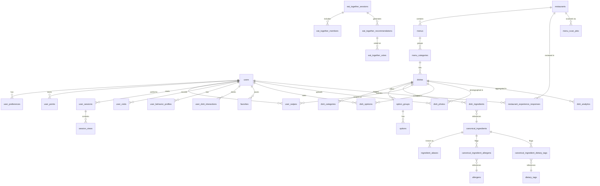
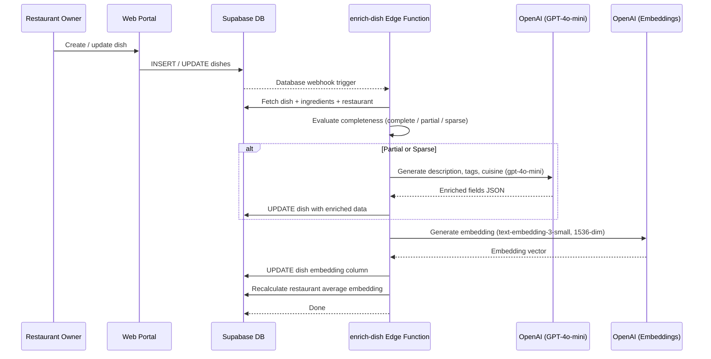

# 06 -- Database Schema

> **Database**: Supabase (PostgreSQL) with pgvector and PostGIS extensions
>
> **Tables**: 36 (including PostGIS system table `spatial_ref_sys`)
>
> **Last updated**: 2026-04-05

---

## Table of Contents

1. [Custom Types & Enums](#custom-types--enums)
2. [Domain: Core Users](#domain-core-users)
   - [users](#users)
   - [user_preferences](#user_preferences)
   - [user_points](#user_points)
3. [Domain: Restaurants & Menus](#domain-restaurants--menus)
   - [restaurants](#restaurants)
   - [menus](#menus)
   - [menu_categories](#menu_categories)
   - [dishes](#dishes)
   - [dish_categories](#dish_categories)
   - [option_groups](#option_groups)
   - [options](#options)
   - [menu_scan_jobs](#menu_scan_jobs)
4. [Domain: Ingredients & Dietary](#domain-ingredients--dietary)
   - [canonical_ingredients](#canonical_ingredients)
   - [ingredient_aliases](#ingredient_aliases)
   - [allergens](#allergens)
   - [dietary_tags](#dietary_tags)
   - [canonical_ingredient_allergens](#canonical_ingredient_allergens)
   - [canonical_ingredient_dietary_tags](#canonical_ingredient_dietary_tags)
   - [dish_ingredients](#dish_ingredients)
5. [Domain: User Interactions & Swipes](#domain-user-interactions--swipes)
   - [user_swipes](#user_swipes)
   - [user_dish_interactions](#user_dish_interactions)
   - [favorites](#favorites)
   - [dish_opinions](#dish_opinions)
   - [dish_photos](#dish_photos)
   - [restaurant_experience_responses](#restaurant_experience_responses)
6. [Domain: Sessions & Analytics](#domain-sessions--analytics)
   - [user_sessions](#user_sessions)
   - [session_views](#session_views)
   - [user_visits](#user_visits)
   - [user_behavior_profiles](#user_behavior_profiles)
   - [dish_analytics](#dish_analytics)
7. [Domain: Eat Together (Group Sessions)](#domain-eat-together-group-sessions)
   - [eat_together_sessions](#eat_together_sessions)
   - [eat_together_members](#eat_together_members)
   - [eat_together_recommendations](#eat_together_recommendations)
   - [eat_together_votes](#eat_together_votes)
8. [Domain: Admin & System](#domain-admin--system)
   - [admin_audit_log](#admin_audit_log)
   - [security_documentation](#security_documentation)
   - [spatial_ref_sys](#spatial_ref_sys)
9. [Materialized Views](#materialized-views)
10. [Key PostgreSQL Functions](#key-postgresql-functions)
11. [Entity Relationship Overview](#entity-relationship-overview)
12. [Dish Enrichment Data Flow](#dish-enrichment-data-flow)
13. [Design Patterns](#design-patterns)
14. [Type Generation](#type-generation)

---

## Entity Relationship Overview

The diagram below shows the major tables and their relationships (simplified — junction tables and system tables omitted for clarity).



---

## Dish Enrichment Data Flow

When a dish is created or updated, the enrichment pipeline evaluates completeness and fills gaps using AI.



---

## Custom Types & Enums

| Type Name        | Values                                                             |
| ---------------- | ------------------------------------------------------------------ |
| `user_roles`     | `consumer` \| `restaurant_owner` \| `admin`                       |
| `session_status` | `waiting` \| `recommending` \| `voting` \| `decided` \| `cancelled` \| `expired` |
| `location_mode`  | `host_location` \| `midpoint` \| `max_radius`                     |
| `subject_type`   | `dish` \| `restaurant`                                             |

---

## Domain: Core Users

### users

Public user profile, linked 1-to-1 with Supabase `auth.users`.

| Name         | Type           | Constraints              | Description                        |
| ------------ | -------------- | ------------------------ | ---------------------------------- |
| id           | uuid           | PK, FK -> `auth.users`   | Mirrors the auth user id           |
| email        | text           |                          | User email (denormalized)          |
| full_name    | text           |                          | Display name                       |
| avatar_url   | text           |                          | Profile image URL                  |
| created_at   | timestamptz    | DEFAULT now()            | Row creation timestamp             |
| updated_at   | timestamptz    | DEFAULT now()            | Last update timestamp              |
| roles        | user_roles[]   | DEFAULT '{consumer}'     | Array of assigned roles            |
| profile_name | text           |                          | Optional public profile name       |

**Foreign Keys**

| Column | References       |
| ------ | ---------------- |
| id     | `auth.users.id`  |

**Usage Notes**
- Every authenticated user has exactly one row here.
- The `roles` array drives authorization (consumer, restaurant_owner, admin).

---

### user_preferences

Per-user onboarding and dietary/lifestyle preferences.

| Name                   | Type        | Constraints                                                      | Description                                      |
| ---------------------- | ----------- | ---------------------------------------------------------------- | ------------------------------------------------ |
| user_id                | uuid        | PK, FK -> `auth.users`                                           | Owning user                                      |
| diet_preference        | text        | DEFAULT 'all', CHECK ('all','vegetarian','vegan')                | High-level diet mode                             |
| default_max_distance   | integer     | DEFAULT 5                                                        | Max search radius in km                          |
| created_at             | timestamptz | DEFAULT now()                                                    | Row creation timestamp                           |
| updated_at             | timestamptz | DEFAULT now()                                                    | Last update timestamp                            |
| protein_preferences    | jsonb       | DEFAULT '[]'                                                     | Preferred protein types                          |
| favorite_cuisines      | jsonb       | DEFAULT '[]'                                                     | Cuisine preferences                              |
| favorite_dishes        | jsonb       | DEFAULT '[]'                                                     | Saved favorite dish types                        |
| spice_tolerance        | text        | DEFAULT 'none', CHECK ('none','mild','hot')                      | Spice level preference                           |
| service_preferences    | jsonb       | DEFAULT '{"dine_in":true,"takeout":true,"delivery":true}'        | Dine-in / takeout / delivery toggles             |
| meal_times             | jsonb       | DEFAULT '[]'                                                     | Preferred meal time windows                      |
| onboarding_completed   | boolean     | DEFAULT false                                                    | Whether onboarding flow is finished              |
| onboarding_completed_at| timestamptz |                                                                  | When onboarding was completed                    |
| ingredients_to_avoid   | jsonb       | NOT NULL, DEFAULT '[]'                                           | Ingredients the user wants to avoid              |
| allergies              | text[]      | DEFAULT '{}'                                                     | Declared allergy codes                           |
| exclude                | text[]      | DEFAULT '{}'                                                     | Explicit exclusion list                          |
| diet_types             | text[]      | DEFAULT '{}'                                                     | Additional diet type tags                        |
| religious_restrictions  | text[]      | DEFAULT '{}'                                                     | Religious dietary restrictions                   |

**Foreign Keys**

| Column  | References      |
| ------- | --------------- |
| user_id | `auth.users.id` |

**Usage Notes**
- One row per user (PK on `user_id`).
- Populated during onboarding; `onboarding_completed` gates the main app experience.

---

### user_points

Gamification ledger -- one row per point-earning action.

| Name        | Type        | Constraints                                                                                                                 | Description                   |
| ----------- | ----------- | --------------------------------------------------------------------------------------------------------------------------- | ----------------------------- |
| id          | uuid        | PK, DEFAULT gen_random_uuid()                                                                                               | Row id                        |
| user_id     | uuid        | NOT NULL, FK -> `auth.users`                                                                                                | Owning user                   |
| points      | integer     | NOT NULL                                                                                                                    | Points awarded (can be negative) |
| action_type | text        | NOT NULL, CHECK ('dish_rating','dish_tags','dish_photo','restaurant_question','first_rating_bonus','weekly_streak_bonus','photo_views_milestone') | What triggered the award      |
| reference_id| uuid        |                                                                                                                             | Related entity id             |
| description | text        |                                                                                                                             | Human-readable reason         |
| created_at  | timestamptz | DEFAULT now()                                                                                                               | When awarded                  |

**Foreign Keys**

| Column  | References      |
| ------- | --------------- |
| user_id | `auth.users.id` |

**Usage Notes**
- Append-only ledger. Total points = `SUM(points)` grouped by user.
- `action_type` determines point value on the application side.

---

## Domain: Restaurants & Menus

### restaurants

Core restaurant entity.

| Name                  | Type                    | Constraints                                          | Description                                    |
| --------------------- | ----------------------- | ---------------------------------------------------- | ---------------------------------------------- |
| id                    | uuid                    | PK, DEFAULT uuid_generate_v4()                       | Restaurant id                                  |
| name                  | text                    | NOT NULL                                             | Restaurant name                                |
| address               | text                    | NOT NULL                                             | Full street address                            |
| created_at            | timestamptz             | DEFAULT now()                                        | Row creation timestamp                         |
| updated_at            | timestamptz             | DEFAULT now()                                        | Last update timestamp                          |
| restaurant_type       | text                    |                                                      | Free-text type label                           |
| country_code          | text                    |                                                      | ISO country code                               |
| city                  | text                    |                                                      | City name                                      |
| postal_code           | text                    |                                                      | Postal / ZIP code                              |
| phone                 | text                    |                                                      | Contact phone                                  |
| website               | text                    |                                                      | Website URL                                    |
| cuisine_types         | text[]                  | DEFAULT '{}'                                         | Array of cuisine labels                        |
| open_hours            | jsonb                   | DEFAULT '{}'                                         | Structured opening hours                       |
| delivery_available    | boolean                 | DEFAULT true                                         | Offers delivery                                |
| takeout_available     | boolean                 | DEFAULT true                                         | Offers takeout                                 |
| dine_in_available     | boolean                 | DEFAULT true                                         | Offers dine-in                                 |
| accepts_reservations  | boolean                 | DEFAULT false                                        | Accepts reservations                           |
| service_speed         | text                    | CHECK ('fast-food','regular')                        | Service speed category                         |
| rating                | numeric                 | DEFAULT 0.00                                         | Aggregate rating                               |
| image_url             | text                    |                                                      | Hero image URL                                 |
| description           | text                    |                                                      | Restaurant description                         |
| owner_id              | uuid                    | FK -> `auth.users`                                   | Owning restaurant_owner user                   |
| location              | jsonb                   | NOT NULL                                             | `{lat, lng}` object                            |
| is_active             | boolean                 | DEFAULT true                                         | Soft-delete flag                               |
| suspended_at          | timestamptz             |                                                      | When suspended by admin                        |
| suspended_by          | uuid                    | FK -> `auth.users`                                   | Admin who suspended                            |
| suspension_reason     | text                    |                                                      | Reason for suspension                          |
| location_point        | geography(Point,4326)   |                                                      | Auto-computed from `location` jsonb for PostGIS |
| neighbourhood         | text                    |                                                      | Neighbourhood name                             |
| state                 | text                    |                                                      | State / province                               |
| payment_methods       | text                    | CHECK ('cash_only','card_only','cash_and_card')      | Accepted payment methods                       |
| restaurant_vector     | vector(1536)            |                                                      | pgvector embedding for similarity search       |

**Foreign Keys**

| Column       | References      |
| ------------ | --------------- |
| owner_id     | `auth.users.id` |
| suspended_by | `auth.users.id` |

**Usage Notes**
- `location_point` is auto-computed from the `location` jsonb column and used for PostGIS spatial queries (`ST_DWithin`, `ST_Distance`).
- `restaurant_vector` enables vector-similarity restaurant recommendations.
- Soft deletes via `is_active`; admin suspension via `suspended_at`.

---

### menus

Time-based menu grouping (e.g. lunch menu, drinks menu).

| Name                 | Type        | Constraints                                  | Description                     |
| -------------------- | ----------- | -------------------------------------------- | ------------------------------- |
| id                   | uuid        | PK, DEFAULT uuid_generate_v4()               | Menu id                         |
| restaurant_id        | uuid        | NOT NULL, FK -> `restaurants`                | Owning restaurant               |
| name                 | text        | NOT NULL                                     | Menu name                       |
| description          | text        |                                              | Optional description            |
| display_order        | integer     | DEFAULT 0                                    | Sort order                      |
| is_active            | boolean     | DEFAULT true                                 | Active flag                     |
| available_start_time | time        |                                              | Daily availability start        |
| available_end_time   | time        |                                              | Daily availability end          |
| available_days       | text[]      |                                              | Days of week the menu is active |
| created_at           | timestamptz | DEFAULT now()                                | Row creation timestamp          |
| updated_at           | timestamptz | DEFAULT now()                                | Last update timestamp           |
| menu_type            | text        | NOT NULL, DEFAULT 'food', CHECK ('food','drink') | Food or drink menu          |

**Foreign Keys**

| Column        | References      |
| ------------- | --------------- |
| restaurant_id | `restaurants.id`|

**Usage Notes**
- A restaurant can have multiple menus (lunch, dinner, drinks, etc.).
- `menu_categories` belong to a menu.

---

### menu_categories

Sections within a menu (e.g. Starters, Mains, Desserts).

| Name          | Type        | Constraints                    | Description                     |
| ------------- | ----------- | ------------------------------ | ------------------------------- |
| id            | uuid        | PK, DEFAULT uuid_generate_v4()| Category id                     |
| restaurant_id | uuid        | FK -> `restaurants`            | Owning restaurant               |
| created_at    | timestamptz | DEFAULT now()                  | Row creation timestamp          |
| updated_at    | timestamptz | DEFAULT now()                  | Last update timestamp           |
| name          | text        | NOT NULL, DEFAULT ''           | Category name                   |
| description   | text        |                                | Optional description            |
| type          | text        |                                | Free-text type label            |
| display_order | integer     | DEFAULT 0                      | Sort order within menu          |
| is_active     | boolean     | DEFAULT true                   | Active flag                     |
| menu_id       | uuid        | FK -> `menus`                  | Parent menu                     |

**Foreign Keys**

| Column        | References       |
| ------------- | ---------------- |
| restaurant_id | `restaurants.id` |
| menu_id       | `menus.id`       |

**Usage Notes**
- Dishes reference their `menu_category_id` for display grouping.

---

### dishes

Central dish entity -- the primary content users swipe on.

| Name                    | Type         | Constraints                                                                 | Description                                           |
| ----------------------- | ------------ | --------------------------------------------------------------------------- | ----------------------------------------------------- |
| id                      | uuid         | PK, DEFAULT uuid_generate_v4()                                             | Dish id                                               |
| restaurant_id           | uuid         | FK -> `restaurants`                                                        | Owning restaurant                                     |
| created_at              | timestamptz  | DEFAULT now()                                                              | Row creation timestamp                                |
| updated_at              | timestamptz  | DEFAULT now()                                                              | Last update timestamp                                 |
| menu_category_id        | uuid         | FK -> `menu_categories`                                                    | Menu section this dish belongs to                     |
| name                    | text         | NOT NULL, DEFAULT ''                                                       | Dish name                                             |
| description             | text         |                                                                            | Dish description                                      |
| price                   | numeric      | NOT NULL, DEFAULT 0                                                        | Price value                                           |
| dietary_tags            | text[]       | DEFAULT '{}'                                                               | Denormalized dietary tag codes                        |
| allergens               | text[]       | DEFAULT '{}'                                                               | Denormalized allergen codes                           |
| calories                | integer      |                                                                            | Calorie count                                         |
| spice_level             | text         | DEFAULT 'none', CHECK (NULL,'none','mild','hot')                           | Spice heat level                                      |
| image_url               | text         |                                                                            | Hero image URL                                        |
| is_available            | boolean      | DEFAULT true                                                               | Currently available for ordering                      |
| dish_category_id        | uuid         | FK -> `dish_categories`                                                    | Global dish category                                  |
| description_visibility  | text         | NOT NULL, DEFAULT 'menu', CHECK ('menu','detail')                          | Where description is shown                            |
| ingredients_visibility  | text         | NOT NULL, DEFAULT 'detail', CHECK ('menu','detail','none')                 | Where ingredients list is shown                       |
| dish_kind               | text         | NOT NULL, DEFAULT 'standard', CHECK ('standard','template','experience')   | Standard dish, template, or experience                |
| display_price_prefix    | text         | NOT NULL, DEFAULT 'exact', CHECK ('exact','from','per_person','market_price','ask_server') | How the price label is displayed   |
| enrichment_status       | text         | NOT NULL, DEFAULT 'none', CHECK ('none','pending','completed','failed')    | AI enrichment pipeline state                          |
| enrichment_source       | text         | NOT NULL, DEFAULT 'none', CHECK ('none','ai','manual')                     | Source of enrichment data                             |
| enrichment_confidence   | text         | CHECK ('high','medium','low')                                              | Confidence of AI enrichment                           |
| enrichment_payload      | jsonb        |                                                                            | Raw enrichment output                                 |
| embedding_input         | text         |                                                                            | Text used to generate the embedding                   |
| embedding               | vector(1536) |                                                                            | pgvector embedding for dish similarity                |
| protein_families        | text[]       | DEFAULT '{}'                                                               | Protein family labels (e.g. poultry, seafood)         |
| protein_canonical_names | text[]       | DEFAULT '{}'                                                               | Canonical protein names (e.g. chicken, salmon)        |

**Foreign Keys**

| Column           | References            |
| ---------------- | --------------------- |
| restaurant_id    | `restaurants.id`      |
| menu_category_id | `menu_categories.id`  |
| dish_category_id | `dish_categories.id`  |

**Usage Notes**
- The `embedding` column powers the vector-ANN recommendation feed via `generate_candidates`.
- `enrichment_status` tracks the AI enrichment pipeline: `none` -> `pending` -> `completed` | `failed`.
- `dietary_tags` and `allergens` are denormalized arrays for fast filtering; canonical data lives in junction tables.

---

### dish_categories

Global taxonomy of dish types (e.g. Burger, Pizza, Sushi). Supports hierarchy via self-referential FK.

| Name               | Type        | Constraints                    | Description                       |
| ------------------ | ----------- | ------------------------------ | --------------------------------- |
| id                 | uuid        | PK, DEFAULT uuid_generate_v4()| Category id                       |
| name               | text        | NOT NULL, UNIQUE               | Category name                     |
| parent_category_id | uuid        | FK -> `dish_categories`        | Parent for hierarchy (nullable)   |
| is_drink           | boolean     | NOT NULL, DEFAULT false        | Whether this is a drink category  |
| is_active          | boolean     | NOT NULL, DEFAULT true         | Active flag                       |
| created_at         | timestamptz | DEFAULT now()                  | Row creation timestamp            |
| updated_at         | timestamptz | DEFAULT now()                  | Last update timestamp             |

**Foreign Keys**

| Column             | References           |
| ------------------ | -------------------- |
| parent_category_id | `dish_categories.id` |

**Usage Notes**
- Self-referential hierarchy allows e.g. "Pasta" -> "Carbonara".
- `is_drink` separates food and drink categories.

---

### option_groups

Customization groups for a dish or menu category (e.g. "Choose your size", "Add toppings").

| Name              | Type        | Constraints                                          | Description                          |
| ----------------- | ----------- | ---------------------------------------------------- | ------------------------------------ |
| id                | uuid        | PK, DEFAULT gen_random_uuid()                        | Group id                             |
| restaurant_id     | uuid        | NOT NULL, FK -> `restaurants`                        | Owning restaurant                    |
| dish_id           | uuid        | FK -> `dishes`                                       | Specific dish (nullable)             |
| menu_category_id  | uuid        | FK -> `menu_categories`                              | Or applies to entire category        |
| name              | text        | NOT NULL                                             | Group name (e.g. "Size")            |
| description       | text        |                                                      | Optional description                 |
| selection_type    | text        | NOT NULL, CHECK ('single','multiple','quantity')     | How user selects options             |
| min_selections    | integer     | NOT NULL, DEFAULT 0                                  | Minimum required selections          |
| max_selections    | integer     |                                                      | Maximum allowed selections           |
| display_order     | integer     | NOT NULL, DEFAULT 0                                  | Sort order                           |
| is_active         | boolean     | NOT NULL, DEFAULT true                               | Active flag                          |
| created_at        | timestamptz | DEFAULT now()                                        | Row creation timestamp               |
| updated_at        | timestamptz | DEFAULT now()                                        | Last update timestamp                |

**Foreign Keys**

| Column           | References           |
| ---------------- | -------------------- |
| restaurant_id    | `restaurants.id`     |
| dish_id          | `dishes.id`          |
| menu_category_id | `menu_categories.id` |

**Usage Notes**
- Can be scoped to a single dish (`dish_id`) or an entire menu category (`menu_category_id`).
- `selection_type` controls UI behavior: radio, checkbox, or quantity stepper.

---

### options

Individual options within an option group.

| Name                    | Type        | Constraints                    | Description                              |
| ----------------------- | ----------- | ------------------------------ | ---------------------------------------- |
| id                      | uuid        | PK, DEFAULT gen_random_uuid() | Option id                                |
| option_group_id         | uuid        | NOT NULL, FK -> `option_groups`| Parent group                             |
| name                    | text        | NOT NULL                       | Option label (e.g. "Extra cheese")      |
| description             | text        |                                | Optional description                     |
| price_delta             | numeric     | NOT NULL, DEFAULT 0            | Price adjustment (positive or negative)  |
| calories_delta          | integer     |                                | Calorie adjustment                       |
| canonical_ingredient_id | uuid        | FK -> `canonical_ingredients`  | Links option to canonical ingredient     |
| is_available            | boolean     | NOT NULL, DEFAULT true         | Availability flag                        |
| display_order           | integer     | NOT NULL, DEFAULT 0            | Sort order                               |
| created_at              | timestamptz | DEFAULT now()                  | Row creation timestamp                   |
| updated_at              | timestamptz | DEFAULT now()                  | Last update timestamp                    |

**Foreign Keys**

| Column                  | References                 |
| ----------------------- | -------------------------- |
| option_group_id         | `option_groups.id`         |
| canonical_ingredient_id | `canonical_ingredients.id` |

**Usage Notes**
- `price_delta` is added to the base dish price.
- Linking to `canonical_ingredients` allows allergen/dietary checks on customizations.

---

### menu_scan_jobs

Tracks AI-powered menu image scanning jobs.

| Name                | Type        | Constraints                                                        | Description                             |
| ------------------- | ----------- | ------------------------------------------------------------------ | --------------------------------------- |
| id                  | uuid        | PK, DEFAULT uuid_generate_v4()                                    | Job id                                  |
| restaurant_id       | uuid        | NOT NULL, FK -> `restaurants`                                     | Target restaurant                       |
| created_by          | uuid        | FK -> `auth.users`                                                | User who initiated the scan             |
| image_count         | smallint    | NOT NULL, DEFAULT 1                                                | Number of images uploaded               |
| image_filenames     | text[]      | DEFAULT '{}'                                                       | Original filenames                      |
| image_storage_paths | text[]      | DEFAULT '{}'                                                       | Supabase Storage paths                  |
| status              | text        | NOT NULL, DEFAULT 'processing', CHECK ('processing','needs_review','completed','failed') | Pipeline status        |
| result_json         | jsonb       |                                                                    | Parsed menu data                        |
| error_message       | text        |                                                                    | Error details on failure                |
| dishes_found        | integer     | DEFAULT 0                                                          | Dishes detected by AI                   |
| dishes_saved        | integer     | DEFAULT 0                                                          | Dishes saved to DB                      |
| processing_ms       | integer     |                                                                    | Processing duration in milliseconds     |
| created_at          | timestamptz | DEFAULT now()                                                      | Row creation timestamp                  |
| updated_at          | timestamptz | DEFAULT now()                                                      | Last update timestamp                   |

**Foreign Keys**

| Column        | References       |
| ------------- | ---------------- |
| restaurant_id | `restaurants.id` |
| created_by    | `auth.users.id`  |

**Usage Notes**
- Supports multi-image uploads for scanning full menu booklets.
- Status pipeline: `processing` -> `needs_review` | `completed` | `failed`.

---

## Domain: Ingredients & Dietary

### canonical_ingredients

Normalized ingredient master list. All ingredient references resolve here.

| Name                   | Type        | Constraints                    | Description                           |
| ---------------------- | ----------- | ------------------------------ | ------------------------------------- |
| id                     | uuid        | PK, DEFAULT uuid_generate_v4()| Ingredient id                         |
| canonical_name         | text        | NOT NULL, UNIQUE               | Authoritative ingredient name         |
| is_vegetarian          | boolean     | DEFAULT true                   | Safe for vegetarians                  |
| is_vegan               | boolean     | DEFAULT false                  | Safe for vegans                       |
| created_at             | timestamptz | DEFAULT now()                  | Row creation timestamp                |
| updated_at             | timestamptz | DEFAULT now()                  | Last update timestamp                 |
| ingredient_family_name | text        | NOT NULL, DEFAULT 'other'      | Family grouping (e.g. dairy, grain)   |

**Foreign Keys** -- None.

**Usage Notes**
- Central reference for the ingredient system.
- Aliases, allergen links, and dietary tag links all point here.

---

### ingredient_aliases

Multilingual display names that map to canonical ingredients. Supports full-text search.

| Name                    | Type        | Constraints                         | Description                              |
| ----------------------- | ----------- | ----------------------------------- | ---------------------------------------- |
| id                      | uuid        | PK, DEFAULT uuid_generate_v4()     | Alias id                                 |
| display_name            | text        | NOT NULL, UNIQUE                    | Human-readable alias                     |
| canonical_ingredient_id | uuid        | NOT NULL, FK -> `canonical_ingredients` | Resolved canonical ingredient        |
| search_vector           | tsvector    |                                     | Full-text search index                   |
| created_at              | timestamptz | DEFAULT now()                       | Row creation timestamp                   |
| updated_at              | timestamptz | DEFAULT now()                       | Last update timestamp                    |
| language                | text        | NOT NULL, DEFAULT 'en'             | ISO language code                        |

**Foreign Keys**

| Column                  | References                 |
| ----------------------- | -------------------------- |
| canonical_ingredient_id | `canonical_ingredients.id` |

**Usage Notes**
- Enables ingredient search in multiple languages.
- `search_vector` is used for `@@` full-text queries.

---

### allergens

Reference table of known allergens.

| Name        | Type        | Constraints                           | Description               |
| ----------- | ----------- | ------------------------------------- | ------------------------- |
| id          | uuid        | PK, DEFAULT uuid_generate_v4()       | Allergen id               |
| code        | text        | NOT NULL, UNIQUE                      | Short code (e.g. "gluten")|
| name        | text        | NOT NULL                              | Display name              |
| severity    | text        | CHECK ('major','minor')               | Severity classification   |
| description | text        |                                       | Detailed description      |
| created_at  | timestamptz | DEFAULT now()                         | Row creation timestamp    |
| updated_at  | timestamptz | DEFAULT now()                         | Last update timestamp     |

**Foreign Keys** -- None.

**Usage Notes**
- `major` allergens are the EU-14 mandatory disclosure set; `minor` are additional.

---

### dietary_tags

Reference table of dietary classifications.

| Name        | Type        | Constraints                                         | Description               |
| ----------- | ----------- | --------------------------------------------------- | ------------------------- |
| id          | uuid        | PK, DEFAULT uuid_generate_v4()                     | Tag id                    |
| code        | text        | NOT NULL, UNIQUE                                    | Short code (e.g. "halal") |
| name        | text        | NOT NULL                                            | Display name              |
| category    | text        | CHECK ('diet','religious','lifestyle','health')     | Tag category              |
| description | text        |                                                     | Detailed description      |
| created_at  | timestamptz | DEFAULT now()                                       | Row creation timestamp    |
| updated_at  | timestamptz | DEFAULT now()                                       | Last update timestamp     |

**Foreign Keys** -- None.

**Usage Notes**
- Categories distinguish diet-based, religious, lifestyle, and health-related tags.

---

### canonical_ingredient_allergens

Junction table linking canonical ingredients to their allergens.

| Name                    | Type | Constraints                                  | Description         |
| ----------------------- | ---- | -------------------------------------------- | ------------------- |
| canonical_ingredient_id | uuid | PK, FK -> `canonical_ingredients`            | Ingredient          |
| allergen_id             | uuid | PK, FK -> `allergens`                        | Associated allergen |

**Foreign Keys**

| Column                  | References                 |
| ----------------------- | -------------------------- |
| canonical_ingredient_id | `canonical_ingredients.id` |
| allergen_id             | `allergens.id`             |

**Usage Notes**
- Composite PK prevents duplicates.
- Used to resolve dish-level allergens from ingredients.

---

### canonical_ingredient_dietary_tags

Junction table linking canonical ingredients to dietary tags.

| Name                    | Type | Constraints                                  | Description            |
| ----------------------- | ---- | -------------------------------------------- | ---------------------- |
| canonical_ingredient_id | uuid | PK, FK -> `canonical_ingredients`            | Ingredient             |
| dietary_tag_id          | uuid | PK, FK -> `dietary_tags`                     | Associated dietary tag |

**Foreign Keys**

| Column                  | References                 |
| ----------------------- | -------------------------- |
| canonical_ingredient_id | `canonical_ingredients.id` |
| dietary_tag_id          | `dietary_tags.id`          |

**Usage Notes**
- Composite PK prevents duplicates.

---

### dish_ingredients

Junction table linking dishes to their canonical ingredients.

| Name          | Type        | Constraints                         | Description             |
| ------------- | ----------- | ----------------------------------- | ----------------------- |
| dish_id       | uuid        | PK, FK -> `dishes`                 | Dish                    |
| ingredient_id | uuid        | PK, FK -> `canonical_ingredients`  | Canonical ingredient    |
| quantity      | text        |                                     | Free-text quantity      |
| created_at    | timestamptz | DEFAULT now()                       | Row creation timestamp  |

**Foreign Keys**

| Column        | References                 |
| ------------- | -------------------------- |
| dish_id       | `dishes.id`                |
| ingredient_id | `canonical_ingredients.id` |

**Usage Notes**
- `quantity` is free-text (e.g. "200g", "a pinch") since menus rarely use structured quantities.

---

## Domain: User Interactions & Swipes

### user_swipes

Records every swipe action in the dish recommendation feed.

| Name             | Type        | Constraints                                  | Description                       |
| ---------------- | ----------- | -------------------------------------------- | --------------------------------- |
| id               | uuid        | PK, DEFAULT uuid_generate_v4()              | Swipe id                          |
| user_id          | uuid        | NOT NULL, FK -> `auth.users`                | Swiping user                      |
| dish_id          | uuid        | NOT NULL, FK -> `dishes`                    | Swiped dish                       |
| action           | text        | NOT NULL, CHECK ('left','right','super')    | Swipe direction                   |
| view_duration    | integer     |                                              | Seconds the card was visible      |
| position_in_feed | integer     |                                              | Card position in feed             |
| session_id       | text        |                                              | Client-side session identifier    |
| context          | jsonb       | DEFAULT '{}'                                | Additional context metadata       |
| created_at       | timestamptz | DEFAULT now()                                | When the swipe occurred           |

**Foreign Keys**

| Column  | References      |
| ------- | --------------- |
| user_id | `auth.users.id` |
| dish_id | `dishes.id`     |

**Usage Notes**
- Core interaction data for the recommendation engine.
- `super` swipes indicate strong interest (equivalent to "super like").

---

### user_dish_interactions

General-purpose interaction log (broader than swipes).

| Name             | Type        | Constraints                                                       | Description                |
| ---------------- | ----------- | ----------------------------------------------------------------- | -------------------------- |
| id               | uuid        | PK, DEFAULT gen_random_uuid()                                    | Interaction id             |
| user_id          | uuid        | NOT NULL, FK -> `auth.users`                                     | User                       |
| dish_id          | uuid        | NOT NULL, FK -> `dishes`                                         | Dish                       |
| interaction_type | text        | NOT NULL, CHECK ('viewed','liked','disliked','ordered','saved')  | Type of interaction        |
| session_id       | text        |                                                                   | Client-side session id     |
| created_at       | timestamptz | DEFAULT now()                                                     | When interaction occurred  |

**Foreign Keys**

| Column  | References      |
| ------- | --------------- |
| user_id | `auth.users.id` |
| dish_id | `dishes.id`     |

**Usage Notes**
- Captures interactions beyond swipes (e.g. viewing details, ordering).
- Fed into `recalculate_user_profile` for behavior profiling.

---

### favorites

Polymorphic favorites for dishes and restaurants.

| Name         | Type         | Constraints                                 | Description                    |
| ------------ | ------------ | ------------------------------------------- | ------------------------------ |
| id           | uuid         | PK, DEFAULT gen_random_uuid()              | Favorite id                    |
| user_id      | uuid         | NOT NULL, FK -> `auth.users`               | User                           |
| subject_type | subject_type | NOT NULL (dish \| restaurant)              | Type of favorited entity       |
| subject_id   | uuid         | NOT NULL                                    | ID of favorited dish or restaurant |
| created_at   | timestamptz  | DEFAULT now()                               | When favorited                 |

**Foreign Keys**

| Column  | References      |
| ------- | --------------- |
| user_id | `auth.users.id` |

**Usage Notes**
- `subject_id` is a polymorphic FK -- references either `dishes.id` or `restaurants.id` depending on `subject_type`.
- No database-level FK on `subject_id`; enforced at application level.

---

### dish_opinions

Post-visit dish ratings with tags and optional photo.

| Name       | Type        | Constraints                                       | Description                       |
| ---------- | ----------- | ------------------------------------------------- | --------------------------------- |
| id         | uuid        | PK, DEFAULT gen_random_uuid()                    | Opinion id                        |
| user_id    | uuid        | NOT NULL, FK -> `auth.users`                     | Rating user                       |
| dish_id    | uuid        | NOT NULL, FK -> `dishes`                         | Rated dish                        |
| visit_id   | uuid        | FK -> `user_visits`                              | Associated visit (optional)       |
| opinion    | text        | NOT NULL, CHECK ('liked','okay','disliked')      | Rating value                      |
| tags       | text[]      | DEFAULT '{}'                                     | Descriptive tags (e.g. "spicy")   |
| photo_id   | uuid        | FK -> `dish_photos`                              | Optional photo reference          |
| created_at | timestamptz | DEFAULT now()                                     | Row creation timestamp            |
| updated_at | timestamptz | DEFAULT now()                                     | Last update timestamp             |

**Foreign Keys**

| Column   | References        |
| -------- | ----------------- |
| user_id  | `auth.users.id`   |
| dish_id  | `dishes.id`       |
| visit_id | `user_visits.id`  |
| photo_id | `dish_photos.id`  |

**Usage Notes**
- Three-tier rating system (liked / okay / disliked) rather than numeric stars.
- Tags provide qualitative feedback; aggregated in the `dish_ratings_summary` materialized view.

---

### dish_photos

User-submitted dish photos.

| Name       | Type        | Constraints                      | Description               |
| ---------- | ----------- | -------------------------------- | ------------------------- |
| id         | uuid        | PK, DEFAULT gen_random_uuid()   | Photo id                  |
| dish_id    | uuid        | NOT NULL, FK -> `dishes`        | Associated dish           |
| user_id    | uuid        | NOT NULL, FK -> `auth.users`    | Uploading user            |
| photo_url  | text        | NOT NULL                         | Supabase Storage URL      |
| created_at | timestamptz | DEFAULT now()                    | Row creation timestamp    |
| updated_at | timestamptz | DEFAULT now()                    | Last update timestamp     |

**Foreign Keys**

| Column  | References      |
| ------- | --------------- |
| dish_id | `dishes.id`     |
| user_id | `auth.users.id` |

**Usage Notes**
- Photos are stored in Supabase Storage; this table tracks metadata.
- Referenced by `dish_opinions.photo_id`.

---

### restaurant_experience_responses

Post-visit yes/no questions about the restaurant experience.

| Name            | Type        | Constraints                                                                                 | Description                       |
| --------------- | ----------- | ------------------------------------------------------------------------------------------- | --------------------------------- |
| id              | uuid        | PK, DEFAULT gen_random_uuid()                                                              | Response id                       |
| user_id         | uuid        | NOT NULL, FK -> `auth.users`                                                               | Responding user                   |
| restaurant_id   | uuid        | NOT NULL, FK -> `restaurants`                                                              | Reviewed restaurant               |
| visit_id        | uuid        | FK -> `user_visits`                                                                        | Associated visit (optional)       |
| question_type   | text        | NOT NULL, CHECK ('service_friendly','clean','wait_time_reasonable','would_recommend','good_value') | Question being answered   |
| response        | boolean     | NOT NULL                                                                                    | Yes / No answer                   |
| created_at      | timestamptz | DEFAULT now()                                                                               | Row creation timestamp            |

**Foreign Keys**

| Column        | References       |
| ------------- | ---------------- |
| user_id       | `auth.users.id`  |
| restaurant_id | `restaurants.id` |
| visit_id      | `user_visits.id` |

**Usage Notes**
- Five fixed question types; each stored as a separate row.
- Aggregated in the `restaurant_ratings_summary` materialized view.

---

## Domain: Sessions & Analytics

### user_sessions

Tracks app usage sessions.

| Name       | Type        | Constraints                      | Description                  |
| ---------- | ----------- | -------------------------------- | ---------------------------- |
| id         | uuid        | PK, DEFAULT gen_random_uuid()   | Session id                   |
| user_id    | uuid        | NOT NULL, FK -> `auth.users`    | Session owner                |
| started_at | timestamptz | DEFAULT now()                    | Session start                |
| ended_at   | timestamptz |                                  | Session end (null if active) |
| is_active  | boolean     | DEFAULT true                     | Currently active             |
| created_at | timestamptz | DEFAULT now()                    | Row creation timestamp       |

**Foreign Keys**

| Column  | References      |
| ------- | --------------- |
| user_id | `auth.users.id` |

**Usage Notes**
- `is_active` is set to false when the session ends.
- Referenced by `session_views` and `user_visits`.

---

### session_views

Tracks individual entity views within a session.

| Name             | Type        | Constraints                                         | Description                     |
| ---------------- | ----------- | --------------------------------------------------- | ------------------------------- |
| id               | uuid        | PK, DEFAULT gen_random_uuid()                      | View id                         |
| session_id       | uuid        | NOT NULL, FK -> `user_sessions`                    | Parent session                  |
| user_id          | uuid        | NOT NULL, FK -> `auth.users`                       | Viewing user                    |
| entity_type      | text        | NOT NULL, CHECK ('restaurant','dish','menu')       | Type of entity viewed           |
| entity_id        | uuid        | NOT NULL                                            | ID of entity viewed             |
| viewed_at        | timestamptz | DEFAULT now()                                       | When viewed                     |
| duration_seconds | integer     | DEFAULT 0                                           | Time spent viewing              |
| created_at       | timestamptz | DEFAULT now()                                       | Row creation timestamp          |

**Foreign Keys**

| Column     | References         |
| ---------- | ------------------ |
| session_id | `user_sessions.id` |
| user_id    | `auth.users.id`    |

**Usage Notes**
- `entity_id` is polymorphic -- references dishes, restaurants, or menus depending on `entity_type`.

---

### user_visits

Records confirmed restaurant visits.

| Name          | Type        | Constraints                      | Description                    |
| ------------- | ----------- | -------------------------------- | ------------------------------ |
| id            | uuid        | PK, DEFAULT gen_random_uuid()   | Visit id                       |
| user_id       | uuid        | NOT NULL, FK -> `auth.users`    | Visiting user                  |
| restaurant_id | uuid        | NOT NULL, FK -> `restaurants`   | Visited restaurant             |
| session_id    | uuid        | FK -> `user_sessions`           | Associated app session         |
| visited_at    | timestamptz | DEFAULT now()                    | Visit timestamp                |
| confirmed_at  | timestamptz | DEFAULT now()                    | When user confirmed the visit  |
| created_at    | timestamptz | DEFAULT now()                    | Row creation timestamp         |

**Foreign Keys**

| Column        | References         |
| ------------- | ------------------ |
| user_id       | `auth.users.id`    |
| restaurant_id | `restaurants.id`   |
| session_id    | `user_sessions.id` |

**Usage Notes**
- Visit confirmation triggers the post-visit rating flow (dish opinions + experience responses).

---

### user_behavior_profiles

Computed behavioral profile for each user, used by the recommendation engine.

| Name                          | Type         | Constraints                    | Description                                   |
| ----------------------------- | ------------ | ------------------------------ | --------------------------------------------- |
| user_id                       | uuid         | PK, FK -> `auth.users`        | Profile owner                                 |
| total_swipes                  | integer      | DEFAULT 0                      | Lifetime swipe count                          |
| right_swipes                  | integer      | DEFAULT 0                      | Lifetime right swipes                         |
| left_swipes                   | integer      | DEFAULT 0                      | Lifetime left swipes                          |
| super_swipes                  | integer      | DEFAULT 0                      | Lifetime super swipes                         |
| right_swipe_rate              | double precision |                             | Computed: right_swipes / total_swipes         |
| preferred_cuisines            | text[]       | DEFAULT '{}'                   | Top cuisine types from interactions           |
| preferred_dish_types          | text[]       | DEFAULT '{}'                   | Top dish categories from interactions         |
| preferred_price_range         | numeric[]    |                                | [min, max] preferred price                    |
| avg_calories_viewed           | integer      |                                | Average calories of viewed dishes             |
| preferred_dietary_tags        | text[]       | DEFAULT '{}'                   | Frequently matching dietary tags              |
| avg_view_duration             | integer      |                                | Average view duration in seconds              |
| most_active_time_of_day       | text         |                                | Peak activity time bucket                     |
| favorite_dish_ids             | uuid[]       | DEFAULT '{}'                   | Most-interacted dish ids                      |
| last_active_at                | timestamptz  | DEFAULT now()                  | Last activity timestamp                       |
| profile_updated_at            | timestamptz  | DEFAULT now()                  | When profile was last recomputed              |
| profile_version               | integer      | DEFAULT 1                      | Schema version for migration                  |
| preference_vector             | vector(1536) |                                | pgvector embedding of user preferences        |
| preference_vector_updated_at  | timestamptz  |                                | When the vector was last refreshed            |

**Foreign Keys**

| Column  | References      |
| ------- | --------------- |
| user_id | `auth.users.id` |

**Usage Notes**
- Recomputed by `recalculate_user_profile` and `recalculate_all_profiles` functions.
- `preference_vector` enables ANN similarity matching against dish embeddings.

---

### dish_analytics

Aggregated engagement metrics per dish.

| Name               | Type             | Constraints                    | Description                          |
| ------------------ | ---------------- | ------------------------------ | ------------------------------------ |
| dish_id            | uuid             | PK, FK -> `dishes`            | Tracked dish                         |
| view_count         | integer          | DEFAULT 0                      | Total views                          |
| right_swipe_count  | integer          | DEFAULT 0                      | Total right swipes                   |
| left_swipe_count   | integer          | DEFAULT 0                      | Total left swipes                    |
| super_like_count   | integer          | DEFAULT 0                      | Total super likes                    |
| favorite_count     | integer          | DEFAULT 0                      | Total favorites                      |
| order_count        | integer          | DEFAULT 0                      | Total orders                         |
| engagement_rate    | double precision |                                | Computed engagement ratio            |
| popularity_score   | double precision |                                | Composite popularity metric          |
| recent_views_24h   | integer          | DEFAULT 0                      | Views in last 24 hours              |
| recent_swipes_24h  | integer          | DEFAULT 0                      | Swipes in last 24 hours            |
| is_trending        | boolean          | DEFAULT false                  | Whether dish is currently trending   |
| last_updated_at    | timestamptz      | DEFAULT now()                  | Last recalculation timestamp         |
| first_tracked_at   | timestamptz      | DEFAULT now()                  | When tracking began                  |

**Foreign Keys**

| Column  | References  |
| ------- | ----------- |
| dish_id | `dishes.id` |

**Usage Notes**
- One row per dish; updated periodically.
- `is_trending` is derived from recent activity relative to historical averages.

---

## Domain: Eat Together (Group Sessions)

### eat_together_sessions

Group dining session orchestrating restaurant selection among friends.

| Name                    | Type           | Constraints                                             | Description                                 |
| ----------------------- | -------------- | ------------------------------------------------------- | ------------------------------------------- |
| id                      | uuid           | PK, DEFAULT gen_random_uuid()                          | Session id                                  |
| host_id                 | uuid           | NOT NULL, FK -> `auth.users`                           | User who created the session                |
| session_code            | text           | NOT NULL, UNIQUE, CHECK length=6                       | 6-character join code                       |
| status                  | session_status | DEFAULT 'waiting'                                      | Current session state                       |
| location_mode           | location_mode  | DEFAULT 'host_location'                                | How meeting location is determined          |
| selected_restaurant_id  | uuid           | FK -> `restaurants`                                    | Final chosen restaurant (after voting)      |
| created_at              | timestamptz    | DEFAULT now()                                          | Row creation timestamp                      |
| expires_at              | timestamptz    | DEFAULT now() + 3 hours                                | Auto-expiry timestamp                       |
| closed_at               | timestamptz    |                                                         | When session was closed                     |

**Foreign Keys**

| Column                  | References       |
| ----------------------- | ---------------- |
| host_id                 | `auth.users.id`  |
| selected_restaurant_id  | `restaurants.id` |

**Usage Notes**
- Lifecycle: `waiting` -> `recommending` -> `voting` -> `decided` | `cancelled` | `expired`.
- Sessions auto-expire after 3 hours.
- `session_code` is generated by the `generate_session_code` function.

---

### eat_together_members

Members participating in a group dining session.

| Name             | Type                    | Constraints                      | Description                        |
| ---------------- | ----------------------- | -------------------------------- | ---------------------------------- |
| id               | uuid                    | PK, DEFAULT gen_random_uuid()   | Membership id                      |
| session_id       | uuid                    | NOT NULL, FK -> `eat_together_sessions` | Parent session            |
| user_id          | uuid                    | NOT NULL, FK -> `auth.users`    | Participating user                 |
| is_host          | boolean                 | DEFAULT false                    | Whether this member is the host    |
| current_location | geography(Point,4326)   |                                  | Member's current location          |
| joined_at        | timestamptz             | DEFAULT now()                    | When they joined                   |
| left_at          | timestamptz             |                                  | When they left (null if still in)  |

**Foreign Keys**

| Column     | References                  |
| ---------- | --------------------------- |
| session_id | `eat_together_sessions.id`  |
| user_id    | `auth.users.id`             |

**Usage Notes**
- `current_location` is used when `location_mode` is `midpoint` to compute the geographic center.
- `left_at` being null indicates the member is still active in the session.

---

### eat_together_recommendations

AI-generated restaurant recommendations for a group session.

| Name                   | Type        | Constraints                             | Description                               |
| ---------------------- | ----------- | --------------------------------------- | ----------------------------------------- |
| id                     | uuid        | PK, DEFAULT gen_random_uuid()          | Recommendation id                         |
| session_id             | uuid        | NOT NULL, FK -> `eat_together_sessions`| Parent session                            |
| restaurant_id          | uuid        | NOT NULL, FK -> `restaurants`          | Recommended restaurant                    |
| compatibility_score    | integer     | NOT NULL                                | Group compatibility score (0-100)         |
| distance_from_center   | double precision |                                    | Distance from group center in meters      |
| members_satisfied      | integer     | NOT NULL                                | Members whose preferences are met         |
| total_members          | integer     | NOT NULL                                | Total members in session                  |
| dietary_compatibility  | jsonb       | DEFAULT '{}'                           | Per-member dietary compatibility breakdown|
| created_at             | timestamptz | DEFAULT now()                           | Row creation timestamp                    |

**Foreign Keys**

| Column        | References                 |
| ------------- | -------------------------- |
| session_id    | `eat_together_sessions.id` |
| restaurant_id | `restaurants.id`           |

**Usage Notes**
- Generated by the `get_group_candidates` function.
- `members_satisfied / total_members` indicates what fraction of the group is accommodated.

---

### eat_together_votes

Votes cast by members on recommended restaurants.

| Name          | Type        | Constraints                              | Description                |
| ------------- | ----------- | ---------------------------------------- | -------------------------- |
| id            | uuid        | PK, DEFAULT gen_random_uuid()           | Vote id                    |
| session_id    | uuid        | NOT NULL, FK -> `eat_together_sessions` | Parent session             |
| user_id       | uuid        | NOT NULL, FK -> `auth.users`            | Voting user                |
| restaurant_id | uuid        | NOT NULL, FK -> `restaurants`           | Voted-for restaurant       |
| created_at    | timestamptz | DEFAULT now()                            | When the vote was cast     |

**Foreign Keys**

| Column        | References                 |
| ------------- | -------------------------- |
| session_id    | `eat_together_sessions.id` |
| user_id       | `auth.users.id`            |
| restaurant_id | `restaurants.id`           |

**Usage Notes**
- Results tallied by the `get_vote_results` function.
- The winning restaurant is written to `eat_together_sessions.selected_restaurant_id`.

---

## Domain: Admin & System

### admin_audit_log

Immutable audit trail for all admin actions.

| Name          | Type        | Constraints                      | Description                         |
| ------------- | ----------- | -------------------------------- | ----------------------------------- |
| id            | uuid        | PK, DEFAULT gen_random_uuid()   | Log entry id                        |
| admin_id      | uuid        | NOT NULL, FK -> `auth.users`    | Admin who performed the action      |
| admin_email   | text        | NOT NULL                         | Admin email (denormalized)          |
| action        | text        | NOT NULL                         | Action name (e.g. "suspend_restaurant") |
| resource_type | text        | NOT NULL                         | Entity type affected                |
| resource_id   | uuid        |                                  | Entity id affected                  |
| old_data      | jsonb       |                                  | State before change                 |
| new_data      | jsonb       |                                  | State after change                  |
| ip_address    | inet        |                                  | Request IP address                  |
| user_agent    | text        |                                  | Request user agent                  |
| created_at    | timestamptz | NOT NULL, DEFAULT now()          | When the action occurred            |

**Foreign Keys**

| Column   | References      |
| -------- | --------------- |
| admin_id | `auth.users.id` |

**Usage Notes**
- Append-only; rows should never be updated or deleted.
- Written by the `log_admin_action` function.

---

### security_documentation

Internal security policy and compliance notes.

| Name        | Type        | Constraints            | Description                   |
| ----------- | ----------- | ---------------------- | ----------------------------- |
| id          | integer     | PK (serial)            | Auto-incrementing id          |
| category    | text        | NOT NULL               | Security category             |
| description | text        | NOT NULL               | Policy or compliance note     |
| created_at  | timestamptz | DEFAULT now()          | Row creation timestamp        |

**Foreign Keys** -- None.

**Usage Notes**
- Reference table for storing security documentation records within the database.

---

### spatial_ref_sys

PostGIS system table. Stores spatial reference system definitions used by the `geography` and `geometry` column types.

> This is a PostGIS-managed system table and is not application-managed. No column documentation provided.

---

## Materialized Views

### admin_dashboard_stats

Aggregate counts for the admin dashboard: total restaurants, dishes, users, and related summary metrics.

<!-- TODO: Document exact columns for materialized views -->

### dish_ratings_summary

Aggregated dish ratings with tag breakdowns. Combines data from `dish_opinions` to produce per-dish liked/okay/disliked counts and tag frequencies.

<!-- TODO: Document exact columns for materialized views -->

### restaurant_ratings_summary

Experience rating percentages per restaurant. Aggregates `restaurant_experience_responses` to produce per-question yes/no percentages.

<!-- TODO: Document exact columns for materialized views -->

---

## Key PostgreSQL Functions

### Recommendation

| Function               | Description                                                                                  |
| ---------------------- | -------------------------------------------------------------------------------------------- |
| `generate_candidates`  | Core feed generation using PostGIS distance filtering + pgvector ANN similarity (11 params)   |
| `get_group_candidates` | Group session restaurant recommendations considering all members' preferences and locations   |

### Analytics

| Function                      | Description                                            |
| ----------------------------- | ------------------------------------------------------ |
| `recalculate_user_profile`    | Recomputes a single user's `user_behavior_profiles` row |
| `recalculate_all_profiles`    | Batch recomputation of all user behavior profiles       |
| `refresh_materialized_views`  | Refreshes all materialized views                        |

### Restaurant / Dish

| Function                    | Description                                       |
| --------------------------- | ------------------------------------------------- |
| `get_nearest_restaurants`   | Returns restaurants nearest to a given point       |
| `restaurants_within_radius` | Returns restaurants within a specified radius      |

### Group Sessions

| Function                | Description                                  |
| ----------------------- | -------------------------------------------- |
| `generate_session_code` | Creates a unique 6-character session code     |
| `get_vote_results`      | Tallies votes for a group session             |

### Admin

| Function           | Description                                     |
| ------------------ | ----------------------------------------------- |
| `is_admin`         | Checks if a user has the admin role              |
| `log_admin_action` | Writes a row to `admin_audit_log`                |
| `add_user_role`    | Appends a role to a user's `roles` array         |

---

## Design Patterns

| Pattern | Details |
| ------- | ------- |
| **Vector embeddings** | pgvector with 1536-dimensional vectors on `dishes.embedding`, `restaurants.restaurant_vector`, and `user_behavior_profiles.preference_vector`. Enables ANN (Approximate Nearest Neighbor) similarity search for the recommendation feed. |
| **PostGIS geography** | `geography(Point,4326)` columns on `restaurants.location_point` and `eat_together_members.current_location`. Queried with `ST_DWithin` and `ST_Distance` for radius-based filtering. |
| **Soft deletes** | `is_active` boolean flags on `restaurants`, `dishes`, `menus`, `menu_categories`, `dish_categories`, `option_groups`, and `options`. Rows are never hard-deleted. |
| **Enrichment pipeline** | `dishes.enrichment_status` tracks the lifecycle: `none` -> `pending` -> `completed` \| `failed`. Source tracked via `enrichment_source` (ai/manual) with confidence level. |
| **Dietary / allergen resolution** | Denormalized arrays on `dishes` (`dietary_tags`, `allergens`) for fast reads. Canonical data maintained through junction tables (`dish_ingredients` -> `canonical_ingredient_allergens`, `canonical_ingredient_dietary_tags`). |
| **Gamification** | `user_points` append-only ledger with action types including milestone bonuses (`first_rating_bonus`, `weekly_streak_bonus`, `photo_views_milestone`). |
| **Polymorphic references** | `favorites.subject_type` + `subject_id` and `session_views.entity_type` + `entity_id` allow a single table to reference multiple entity types. |

---

## Type Generation

Generate TypeScript types from the live Supabase schema:

```bash
cd packages/database
pnpm gen:types
```

This produces typed table definitions consumed by both the web portal and mobile app.
