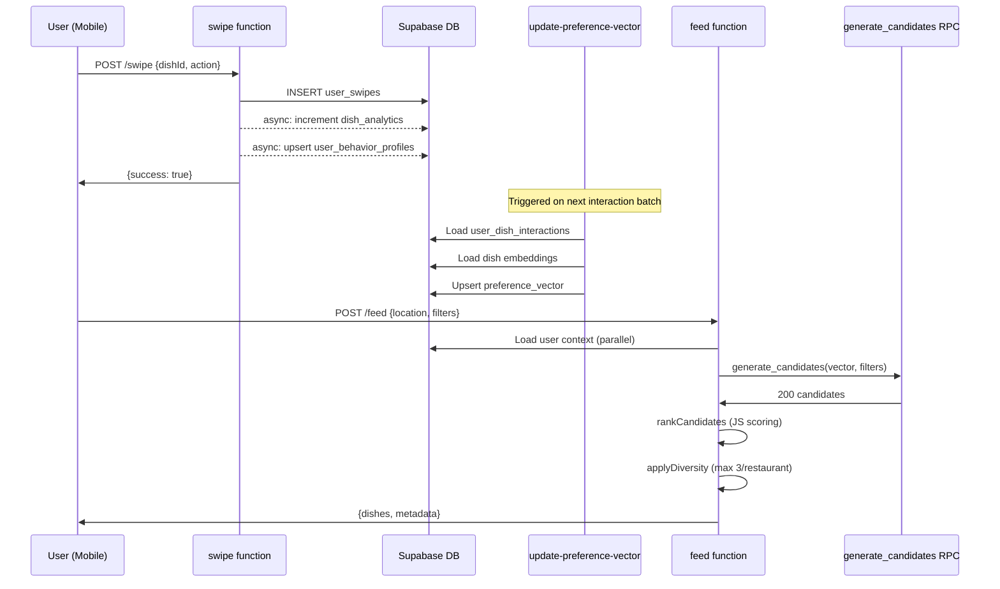
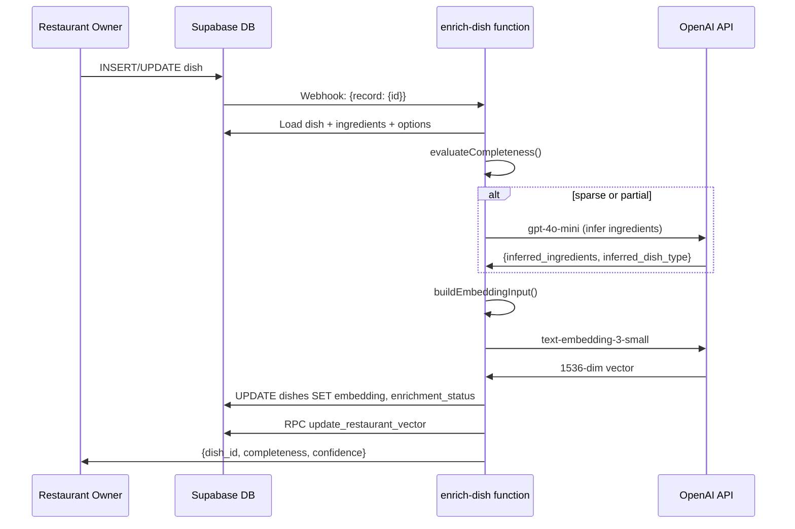
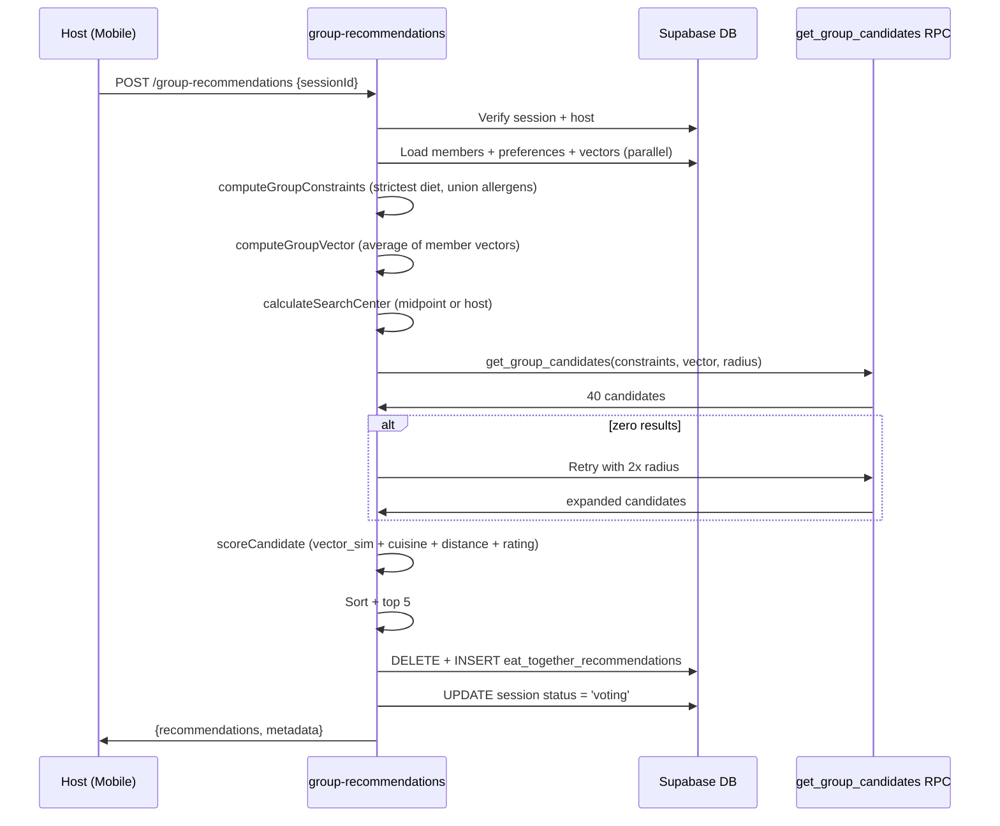

# 07 — Supabase Edge Functions

> All seven serverless functions powering EatMe v1.
> Each runs on Deno Deploy behind `POST /functions/v1/<name>`.

Cross-reference: [Database Schema](./06-database-schema.md)

---

## Table of Contents

1. [feed](#1-feed)
2. [nearby-restaurants](#2-nearby-restaurants)
3. [enrich-dish](#3-enrich-dish)
4. [group-recommendations](#4-group-recommendations)
5. [swipe](#5-swipe)
6. [update-preference-vector](#6-update-preference-vector)
7. [batch-update-preference-vectors](#7-batch-update-preference-vectors)
8. [Data Flow Pipelines](#data-flow-pipelines)
9. [Vector & Embedding System](#vector--embedding-system)
10. [Deployment](#deployment)

---

## 1. feed

**Purpose:** Two-stage personalized dish (or restaurant) recommendations.
Stage 1 generates candidates via a Postgres RPC; Stage 2 ranks them in JS.

| Detail | Value |
|---|---|
| HTTP Method | `POST` |
| URL | `/functions/v1/feed` |
| Auth | `Authorization: Bearer <JWT>` (optional; anonymous access supported) |

### Request

```typescript
interface FeedRequest {
  location: { lat: number; lng: number };
  radius?: number;                        // km, default 10
  mode?: 'dishes' | 'restaurants';        // default 'dishes'
  filters: {
    priceRange?: [number, number];
    dietPreference?: string;              // permanent hard filter
    preferredDiet?: string;               // daily soft boost ('vegetarian' | 'vegan' | 'all')
    calorieRange?: { min: number; max: number };
    allergens?: string[];
    religiousRestrictions?: string[];
    cuisines?: string[];
    spiceLevel?: string;                  // 'noSpicy' | 'iLikeSpicy' | 'eitherWay'
    spiceTolerance?: string;
    favoriteCuisines?: string[];
    sortBy?: 'closest' | 'bestMatch' | 'highestRated';
    openNow?: boolean;
    flagIngredients?: string[];
    dishNames?: string[];                 // craving keywords (e.g. "Pizza", "Burger")
    proteinTypes?: string[];              // e.g. ['meat', 'fish', 'seafood', 'egg']
    meatTypes?: string[];                 // e.g. ['chicken', 'beef', 'pork']
    excludeFamilies?: string[];           // permanent hard-exclude families
    excludeSpicy?: boolean;               // permanent noSpicy hard filter
  };
  userId?: string;
  limit?: number;                         // default 20
}
```

| Parameter | Type | Required | Default | Description |
|---|---|---|---|---|
| `location` | `{lat, lng}` | Yes | -- | User GPS coordinates |
| `radius` | `number` | No | `10` | Search radius in km |
| `mode` | `string` | No | `'dishes'` | Return dishes or restaurants |
| `filters` | `object` | Yes | -- | Daily + permanent filters (see interface) |
| `userId` | `string` | No | -- | Authenticated user ID for personalization |
| `limit` | `number` | No | `20` | Max results returned |

### Response (dishes mode)

```typescript
interface FeedResponse {
  dishes: Array<{
    id: string;
    restaurant_id: string;
    name: string;
    description: string | null;
    price: number;
    calories: number | null;
    image_url: string | null;
    spice_level: string | null;
    is_available: boolean;
    allergens: string[];
    dietary_tags: string[];
    dish_kind: string;
    restaurant: {
      id: string;
      name: string;
      cuisine_types: string[];
      rating: number;
    };
    distance_km: number;
    score: number;
    flagged_ingredients: string[];
  }>;
  metadata: {
    totalAvailable: number;
    returned: number;
    cached: boolean;
    processingTime: number;
    personalized: boolean;
    stage1Candidates: number;
    userInteractions: number;
  };
}
```

### Response (restaurants mode)

```typescript
interface FeedRestaurantResponse {
  restaurants: Array<{
    id: string;
    name: string;
    cuisine_types: string[];
    rating: number;
    distance_km: number;
    score: number;
    location: { lat: number; lng: number } | null;
    is_open: boolean;
  }>;
  metadata: {
    totalAvailable: number;
    returned: number;
    cached: boolean;
    processingTime: number;
    personalized: boolean;
    stage1Candidates: number;
  };
}
```

### Example Request

```json
{
  "location": { "lat": 52.52, "lng": 13.405 },
  "radius": 5,
  "mode": "dishes",
  "filters": {
    "cuisines": ["italian"],
    "preferredDiet": "vegetarian",
    "priceRange": [10, 30],
    "allergens": ["peanuts"],
    "dishNames": ["Pizza"]
  },
  "userId": "a1b2c3d4-e5f6-7890-abcd-ef1234567890",
  "limit": 10
}
```

### Example Response

```json
{
  "dishes": [
    {
      "id": "d001",
      "restaurant_id": "r001",
      "name": "Margherita Pizza",
      "description": "Classic Neapolitan pizza with San Marzano tomatoes",
      "price": 14.50,
      "calories": 820,
      "image_url": "https://cdn.example.com/margherita.jpg",
      "spice_level": "none",
      "is_available": true,
      "allergens": ["gluten", "dairy"],
      "dietary_tags": ["vegetarian"],
      "dish_kind": "standard",
      "restaurant": {
        "id": "r001",
        "name": "Trattoria Roma",
        "cuisine_types": ["italian"],
        "rating": 4.5
      },
      "distance_km": 1.2,
      "score": 1.38,
      "flagged_ingredients": []
    }
  ],
  "metadata": {
    "totalAvailable": 142,
    "returned": 10,
    "cached": false,
    "processingTime": 312,
    "personalized": true,
    "stage1Candidates": 142,
    "userInteractions": 5
  }
}
```

### Algorithm

1. **Cache check** -- Build a key from `userId + location (3 dp) + filters`. If Redis hit, return cached response.
2. **Load user context** (parallel) -- `user_dish_interactions`, `user_preferences`, `user_behavior_profiles`, `favorites` (restaurants).
3. **Stage 1 -- `generate_candidates` RPC** -- PostGIS radius filter + permanent hard filters (allergens, diet, religious, excluded families, exclude spicy) + vector ANN ordering. Returns up to 200 candidates.
4. **Ingredient flag annotation** -- If `flagIngredients` is set, query `dish_ingredients` to annotate each dish with flagged ingredient names.
5. **Stage 2 -- `rankCandidates`** -- Compute a weighted score per dish (see scoring weights below). Sort descending.
6. **Diversity cap** -- Max 3 dishes per restaurant.
7. **Slice to `limit`** and return.

### Scoring Weights

**Core signals** (0-1 each, weighted):

| Signal | Weight | Notes |
|---|---|---|
| `similarity` | 0.40 | `1 - vector_distance` (preference vector vs dish embedding) |
| `rating` | 0.20 | `restaurant_rating / 5` |
| `popularity` | 0.15 | `popularity_score` (0-1) |
| `distance` | 0.15 | `1 - (distance_km / radius_km)` |
| `quality` | 0.10 | image (0.5) + description > 20 chars (0.3) + enrichment completed (0.2) |

**Soft boosts** (additive):

| Boost | Max | Trigger |
|---|---|---|
| Diet match | +0.50 | `preferredDiet` matches dish `dietary_tags` |
| Craving (dishNames) | +0.25 | Dish name contains one of the craving keywords |
| Cuisine (daily) | +0.20 | Restaurant cuisine in `filters.cuisines` |
| Protein type | +0.20 | Dish protein family matches `proteinTypes` |
| Favourited restaurant | +0.15 | Restaurant is in user's favourites |
| Meat subtype | +0.10 | Dish canonical name matches `meatTypes` |
| Favourite cuisines (permanent) | +0.10 | Restaurant cuisine in user saved favourites |
| Liked cuisines (history) | +0.10 | Restaurant cuisine in historically liked cuisines |
| Spice level match | +0.10 | Dish spice level matches daily spice preference |
| Price proximity | +0.08 | Dish price near midpoint of `priceRange` |
| Spice tolerance (permanent) | +0.08 | Dish spice within user tolerance |
| Learned price range | +0.06 | Dish price within `preferred_price_range` from behavior profile |
| Calorie proximity | +0.05 | Dish calories near midpoint of `calorieRange` |

**Cold-start behavior:** When the user has no `preference_vector`, the similarity weight (0.40) is redistributed: half to rating, half to popularity.

### Error Responses

| Status | Body | Condition |
|---|---|---|
| 400 | `{"error": "Invalid location"}` | Missing or invalid `location.lat`/`location.lng` |
| 500 | `{"error": "<message>"}` | `generate_candidates` RPC failure or unhandled exception |

### Database Tables Accessed

- `user_dish_interactions` (read)
- `user_preferences` (read)
- `user_behavior_profiles` (read)
- `favorites` (read)
- `restaurants` (read -- cuisine types for favourites, open_hours for restaurant mode)
- `ingredient_aliases` (read -- flag ingredient display names)
- `dish_ingredients` (read -- flag ingredient lookup)
- `dishes` via `generate_candidates` RPC (read)
- `dish_analytics` via `generate_candidates` RPC (read)

### Caching

- **Redis** (Upstash): 300-second TTL per cache key.
- Key format: `feed:<userId>:<lat(3dp)>:<lng(3dp)>:<filters JSON>`
- Graceful degradation: if Redis is unavailable the function continues without cache.

---

## 2. nearby-restaurants

**Purpose:** Geospatial restaurant search with Haversine distance calculation and
nested menu/dish filtering. Sorted by distance (nearest first).

| Detail | Value |
|---|---|
| HTTP Method | `POST` |
| URL | `/functions/v1/nearby-restaurants` |
| Auth | `Authorization: Bearer <JWT>` |

### Request

```typescript
interface NearbyRestaurantsRequest {
  latitude: number;
  longitude: number;
  radiusKm?: number;   // default 5
  limit?: number;       // default 50
  filters?: {
    cuisines?: string[];
    priceMin?: number;
    priceMax?: number;
    minRating?: number;
    dietaryTags?: string[];        // filter dishes, not restaurants
    excludeAllergens?: string[];
    serviceTypes?: string[];       // ['delivery', 'takeout', 'dine_in']
  };
}
```

| Parameter | Type | Required | Default | Description |
|---|---|---|---|---|
| `latitude` | `number` | Yes | -- | User latitude |
| `longitude` | `number` | Yes | -- | User longitude |
| `radiusKm` | `number` | No | `5` | Search radius in km |
| `limit` | `number` | No | `50` | Max restaurants returned |
| `filters.cuisines` | `string[]` | No | -- | Filter by cuisine type (overlaps) |
| `filters.priceMin` | `number` | No | -- | Min dish price |
| `filters.priceMax` | `number` | No | -- | Max dish price |
| `filters.minRating` | `number` | No | -- | Minimum restaurant rating |
| `filters.dietaryTags` | `string[]` | No | -- | Dishes must have ALL listed tags |
| `filters.excludeAllergens` | `string[]` | No | -- | Dishes must not contain these allergens |
| `filters.serviceTypes` | `string[]` | No | -- | Restaurant must support at least one |

### Response

```typescript
interface NearbyRestaurantsResponse {
  restaurants: Array<{
    id: string;
    name: string;
    location: { lat: number; lng: number };
    address: string;
    city?: string;
    country_code?: string;
    cuisine_types: string[];
    restaurant_type: string;
    rating: number;
    phone?: string;
    website?: string;
    delivery_available: boolean;
    takeout_available: boolean;
    dine_in_available: boolean;
    service_speed?: string;
    distance: number;              // km
    menus?: Array<{
      id: string;
      name: string;
      is_active: boolean;
      dishes?: Array<{
        id: string;
        name: string;
        price: number;
        dietary_tags?: string[];
        allergens?: string[];
        spice_level?: 'none' | 'mild' | 'hot';
        is_available: boolean;
      }>;
    }>;
  }>;
  totalCount: number;
  searchRadius: number;
  centerPoint: { latitude: number; longitude: number };
  appliedFilters: object;
}
```

### Example Request

```json
{
  "latitude": 52.52,
  "longitude": 13.405,
  "radiusKm": 3,
  "limit": 10,
  "filters": {
    "cuisines": ["italian", "japanese"],
    "minRating": 4.0,
    "serviceTypes": ["delivery"]
  }
}
```

### Example Response

```json
{
  "restaurants": [
    {
      "id": "r001",
      "name": "Trattoria Roma",
      "location": { "lat": 52.521, "lng": 13.408 },
      "address": "Friedrichstr. 42, 10117 Berlin",
      "cuisine_types": ["italian"],
      "restaurant_type": "casual_dining",
      "rating": 4.5,
      "delivery_available": true,
      "takeout_available": true,
      "dine_in_available": true,
      "distance": 0.35,
      "menus": [
        {
          "id": "m001",
          "name": "Main Menu",
          "is_active": true,
          "dishes": [
            {
              "id": "d001",
              "name": "Margherita Pizza",
              "price": 14.50,
              "dietary_tags": ["vegetarian"],
              "allergens": ["gluten", "dairy"],
              "spice_level": "none",
              "is_available": true
            }
          ]
        }
      ]
    }
  ],
  "totalCount": 1,
  "searchRadius": 3,
  "centerPoint": { "latitude": 52.52, "longitude": 13.405 },
  "appliedFilters": { "cuisines": ["italian", "japanese"], "minRating": 4.0, "serviceTypes": ["delivery"] }
}
```

### Algorithm

1. Query `restaurants` with joined `menus` and `dishes`.
2. Apply cuisine overlap filter (`overlaps`) and minimum rating (`gte`) at the DB level.
3. For each restaurant, compute Haversine distance from the user's coordinates.
4. Filter dishes by `dietaryTags` (must have ALL) and `excludeAllergens` (must have NONE).
5. Remove restaurants outside `radiusKm`, not matching `serviceTypes`, or with zero matching dishes when dietary/allergen filters are active.
6. Sort by distance ascending, slice to `limit`.

### Error Responses

| Status | Body | Condition |
|---|---|---|
| 400 | `{"error": "Invalid request: latitude and longitude are required"}` | Missing or non-numeric coords |
| 500 | `{"error": "Failed to fetch restaurants"}` | Database query failure |
| 500 | `{"error": "Internal server error", "details": "..."}` | Unhandled exception |

### Database Tables Accessed

- `restaurants` (read)
- `menus` (read, joined)
- `dishes` (read, joined)

---

## 3. enrich-dish

**Purpose:** AI-powered dish enrichment pipeline. Evaluates ingredient
completeness, optionally calls GPT-4o-mini for sparse/partial dishes, generates
a text-embedding-3-small vector, and updates the restaurant centroid vector.

| Detail | Value |
|---|---|
| HTTP Method | `POST` |
| URL | `/functions/v1/enrich-dish` |
| Auth | `Authorization: Bearer <JWT>` (or DB webhook internal call) |

### Request

The function accepts two envelope formats:

```typescript
// Direct call
interface EnrichDishDirectRequest {
  dish_id: string;
}

// Database webhook envelope (INSERT/UPDATE on dishes)
interface EnrichDishWebhookRequest {
  type: 'INSERT' | 'UPDATE';
  table: 'dishes';
  record: { id: string; [key: string]: unknown };
}
```

| Parameter | Type | Required | Description |
|---|---|---|---|
| `dish_id` | `string` | Yes (direct) | UUID of the dish to enrich |
| `record.id` | `string` | Yes (webhook) | UUID from webhook payload |

### Response

```typescript
interface EnrichDishResponse {
  dish_id: string;
  enrichment_source: 'none' | 'ai' | 'manual';
  enrichment_confidence: 'high' | 'medium' | 'low';
  embedding_input: string;
  completeness: 'complete' | 'partial' | 'sparse';
}
```

### Example Request (direct)

```json
{
  "dish_id": "d001-uuid-here"
}
```

### Example Response

```json
{
  "dish_id": "d001-uuid-here",
  "enrichment_source": "ai",
  "enrichment_confidence": "medium",
  "embedding_input": "Margherita Pizza; pasta; Classic Neapolitan pizza with San Marzano; mozzarella, tomato, basil",
  "completeness": "partial"
}
```

### Algorithm

1. Parse `dish_id` from direct body or webhook `record.id`.
2. Load the dish row from `dishes`.
3. **Debounce:** If `enrichment_status = 'completed'` and `updated_at` is less than 8 seconds ago, skip (returns `{ skipped: true, reason: "recently_completed" }`).
4. Set `enrichment_status = 'pending'`.
5. Load canonical ingredient names from `dish_ingredients` + `canonical_ingredients`.
6. Load option names from `options` + `option_groups` for the dish.
7. **Evaluate completeness:**
   - `complete`: >= 3 canonical ingredients
   - `partial`: 1-2 ingredients OR has a description
   - `sparse`: 0 ingredients and no description
8. **AI enrichment** (sparse/partial only): Call `gpt-4o-mini` to infer up to 8 ingredients, dish type, and notes. Stored in `enrichment_payload` only (never written to `allergens` or `dietary_tags`).
9. **Build embedding input string:** `name; [dish_type]; [description (120 chars)]; [ingredients]; [options]`.
10. **Generate embedding:** Call OpenAI `text-embedding-3-small` (1536 dimensions).
11. **Persist:** Update `dishes` with `embedding`, `embedding_input`, `enrichment_status = 'completed'`, `enrichment_source`, `enrichment_confidence`, `enrichment_payload`.
12. **Update restaurant vector:** Call `update_restaurant_vector` RPC (recomputes centroid of all dish embeddings for the restaurant). Non-fatal on failure.

### Completeness/Confidence Matrix

| Completeness | Ingredients | AI Enriched | Confidence |
|---|---|---|---|
| `complete` | >= 3 | No | `high` |
| `partial` | 1-2 or has description | Yes | `medium` |
| `partial` | 1-2 or has description | No (AI failed) | `low` |
| `sparse` | 0, no description | Yes | `low` |
| `sparse` | 0, no description | No (AI failed) | `low` |

### Error Responses

| Status | Body | Condition |
|---|---|---|
| 400 | `{"error": "Missing dish_id"}` | Neither `dish_id` nor `record.id` present |
| 404 | `{"error": "Dish not found"}` | Dish UUID does not exist |
| 500 | `{"error": "Failed to save embedding"}` | DB update failure (sets status to `failed`) |
| 500 | `{"error": "<message>"}` | Unhandled error |

### Database Tables Accessed

- `dishes` (read + write)
- `dish_ingredients` (read)
- `canonical_ingredients` (read, joined)
- `options` (read)
- `option_groups` (read, joined)
- `restaurants` via `update_restaurant_vector` RPC (write)

### External APIs

- OpenAI `text-embedding-3-small` -- embedding generation
- OpenAI `gpt-4o-mini` -- ingredient/dish-type inference (sparse/partial only)

---

## 4. group-recommendations

**Purpose:** Generate restaurant recommendations for an Eat Together group
session. Computes group constraints (strictest diet, union of allergens/religious),
averages member preference vectors, scores candidates, persists results, and
advances the session to the `voting` phase.

| Detail | Value |
|---|---|
| HTTP Method | `POST` |
| URL | `/functions/v1/group-recommendations` |
| Auth | `Authorization: Bearer <JWT>` (must be session host) |

### Request

```typescript
interface GroupRecommendationsRequest {
  sessionId: string;
  locationMode?: 'midpoint' | 'host_location';  // default 'midpoint'
  radiusKm?: number;                              // default 5
}
```

| Parameter | Type | Required | Default | Description |
|---|---|---|---|---|
| `sessionId` | `string` | Yes | -- | Eat Together session UUID |
| `locationMode` | `string` | No | `'midpoint'` | How to compute search center |
| `radiusKm` | `number` | No | `5` | Search radius in km |

### Response

```typescript
interface GroupRecommendationsResponse {
  recommendations: Array<{
    id: string;
    name: string;
    cuisine_types: string[];
    rating: number;
    address: string;
    phone: string;
    location: Record<string, unknown>;
    distance_m: number;
    score: number;
    compatibilityScore: number;           // score * 100, rounded
    vectorSimilarity: number | null;
    breakdown: {
      vectorSimilarity: number;
      cuisineCompatibility: number;
      distanceScore: number;
      ratingScore: number;
    };
  }>;
  metadata: {
    searchCenter: { lat: number; lng: number };
    radiusKm: number;
    totalMembers: number;
    vectorMemberCount: number;
    personalized: boolean;
    totalCandidates: number;
    returned: number;
    groupConstraints: {
      diet: 'all' | 'vegetarian' | 'vegan';
      allergens: string[];
      religious: string[];
    };
  };
}
```

### Example Request

```json
{
  "sessionId": "sess-abc-123",
  "locationMode": "midpoint",
  "radiusKm": 5
}
```

### Example Response

```json
{
  "recommendations": [
    {
      "id": "r042",
      "name": "Green Garden Bistro",
      "cuisine_types": ["mediterranean", "vegetarian"],
      "rating": 4.3,
      "address": "Kastanienallee 12, Berlin",
      "phone": "+49301234567",
      "location": { "lat": 52.535, "lng": 13.41 },
      "distance_m": 1200,
      "score": 0.72,
      "compatibilityScore": 72,
      "vectorSimilarity": 0.65,
      "breakdown": {
        "vectorSimilarity": 65,
        "cuisineCompatibility": 50,
        "distanceScore": 76,
        "ratingScore": 86
      }
    }
  ],
  "metadata": {
    "searchCenter": { "lat": 52.525, "lng": 13.408 },
    "radiusKm": 5,
    "totalMembers": 3,
    "vectorMemberCount": 2,
    "personalized": true,
    "totalCandidates": 28,
    "returned": 1,
    "groupConstraints": {
      "diet": "vegetarian",
      "allergens": ["peanuts", "shellfish"],
      "religious": []
    }
  }
}
```

### Algorithm

1. **Authenticate** the calling user and verify they are the session host.
2. **Load session members** from `eat_together_members` (excluding those who left).
3. **Load preferences** (`user_preferences`) and **behavior profiles** (`user_behavior_profiles`) for all members in parallel.
4. **Build `GroupMember` array** with parsed locations, preferences, and preference vectors.
5. **Compute search center:** midpoint of all members' locations (or host's location if `locationMode = 'host_location'`).
6. **Compute group constraints:**
   - **Diet:** strictest across all members (`vegan > vegetarian > all`).
   - **Allergens:** union of all members' allergies.
   - **Religious:** union of all members' religious restrictions.
7. **Compute group vector:** unweighted average of all non-null member `preference_vector`s (members without vectors are excluded, not diluted with zeros).
8. **Stage 1 -- `get_group_candidates` RPC:** PostGIS radius + hard constraint filters + optional ANN ordering by group vector. Returns up to 40 candidates.
9. **Auto-expand:** If zero results, retry with `2x radiusKm`.
10. **Stage 2 -- scoring** (per restaurant):
    - See scoring weights below.
    - Sort descending, take top 5.
11. **Persist:** Delete old `eat_together_recommendations` for the session, insert new ones, update session `status` to `'voting'`.

### Scoring Weights

| Signal | Weight (vector available) | Weight (cold start) |
|---|---|---|
| Vector similarity | 0.40 | -- |
| Cuisine compatibility | 0.30 | 0.40 |
| Distance | 0.20 | 0.25 |
| Rating | 0.10 | 0.35 |

### Error Responses

| Status | Body | Condition |
|---|---|---|
| 400 | `{"error": "sessionId is required"}` | Missing sessionId |
| 400 | `{"error": "Need at least 2 active members..."}` | Fewer than 2 members |
| 400 | `{"error": "Unable to determine search location..."}` | No member has shared location |
| 401 | `{"error": "Unauthorized"}` | Invalid or missing JWT |
| 404 | `{"error": "Session not found or unauthorized"}` | Session does not exist or caller is not host |
| 500 | `{"error": "<message>"}` | RPC or unhandled exception |

### Database Tables Accessed

- `eat_together_sessions` (read + write status)
- `eat_together_members` (read)
- `users` (read, joined from members)
- `user_preferences` (read)
- `user_behavior_profiles` (read)
- `eat_together_recommendations` (delete + insert)
- `restaurants` via `get_group_candidates` RPC (read)
- `dishes` via `get_group_candidates` RPC (read)

---

## 5. swipe

**Purpose:** Record a user's swipe action (left/right/super) on a dish. The
insert is synchronous; analytics and behavior profile updates are fire-and-forget.

| Detail | Value |
|---|---|
| HTTP Method | `POST` |
| URL | `/functions/v1/swipe` |
| Auth | `Authorization: Bearer <JWT>` |

### Request

```typescript
interface SwipeRequest {
  userId: string;
  dishId: string;
  action: 'left' | 'right' | 'super';
  viewDuration?: number;   // milliseconds
  position?: number;       // 1-based position in feed
  sessionId?: string;
  context?: any;           // optional context data
}
```

| Parameter | Type | Required | Description |
|---|---|---|---|
| `userId` | `string` | Yes | User UUID |
| `dishId` | `string` | Yes | Dish UUID |
| `action` | `string` | Yes | `'left'`, `'right'`, or `'super'` |
| `viewDuration` | `number` | No | Time the card was visible (ms) |
| `position` | `number` | No | Card position in the feed |
| `sessionId` | `string` | No | Feed session identifier |
| `context` | `any` | No | Arbitrary metadata |

### Response

```typescript
interface SwipeResponse {
  success: boolean;
  message: string;
}
```

### Example Request

```json
{
  "userId": "a1b2c3d4-e5f6-7890-abcd-ef1234567890",
  "dishId": "d001-uuid-here",
  "action": "right",
  "viewDuration": 2400,
  "position": 3
}
```

### Example Response

```json
{
  "success": true,
  "message": "Swipe recorded"
}
```

### Algorithm

1. Validate `userId`, `dishId`, and `action`.
2. **Sync:** Insert into `user_swipes` (blocking -- failure returns 500).
3. **Async (fire-and-forget):**
   - `updateDishAnalytics`: Increment `view_count` on `dish_analytics`; additionally increment `right_swipe_count`, `left_swipe_count`, or `super_like_count` depending on action.
   - `updateUserBehavior`: Upsert `user_behavior_profiles` -- increment `total_swipes`, `right_swipes` or `left_swipes`, update `last_active_at`.

### Error Responses

| Status | Body | Condition |
|---|---|---|
| 400 | `{"error": "Missing required fields: userId, dishId, action"}` | Any required field missing |
| 400 | `{"error": "Invalid action. Must be: left, right, or super"}` | Invalid action value |
| 500 | `{"error": "<message>"}` | DB insert failure or unhandled error |

### Database Tables Accessed

- `user_swipes` (insert)
- `dish_analytics` (update via `increment` RPC)
- `user_behavior_profiles` (read + upsert)

---

## 6. update-preference-vector

**Purpose:** Compute a personalized preference vector from a user's interaction
history using time-decayed weighted averaging of dish embeddings. Also derives
`preferred_cuisines` (top 5) and `preferred_price_range`.

| Detail | Value |
|---|---|
| HTTP Method | `POST` |
| URL | `/functions/v1/update-preference-vector` |
| Auth | `Authorization: Bearer <JWT>` |

### Request

```typescript
interface UpdatePreferenceVectorRequest {
  user_id: string;
}
```

| Parameter | Type | Required | Description |
|---|---|---|---|
| `user_id` | `string` | Yes | User UUID |

### Response

```typescript
// Success
interface UpdatePreferenceVectorResponse {
  ok: true;
  dishes_used: number;
  total_interactions: number;
  preferred_cuisines: string[];
  preferred_price_range: [number, number] | null;
}

// Skipped
interface UpdatePreferenceVectorSkipped {
  skipped: true;
  reason: 'debounce' | 'no_interactions' | 'no_embeddings' | 'zero_weight';
  updated_at?: string;  // present when reason = 'debounce'
}
```

### Example Request

```json
{
  "user_id": "a1b2c3d4-e5f6-7890-abcd-ef1234567890"
}
```

### Example Response

```json
{
  "ok": true,
  "dishes_used": 34,
  "total_interactions": 87,
  "preferred_cuisines": ["italian", "japanese", "thai", "mexican", "indian"],
  "preferred_price_range": [11.50, 22.30]
}
```

### Algorithm

1. **Debounce:** If `preference_vector_updated_at` is less than 5 minutes ago, skip.
2. **Load interactions:** Last 500 entries from `user_dish_interactions` for the user.
3. **Load dish embeddings + restaurant cuisine types** for all interacted dishes (excluding those with null embeddings).
4. **Weighted average:**
   - For each interaction, compute `weight = base_weight * e^(-0.01 * days_since_interaction)`.
   - Accumulate `embedding * weight` into a Float64Array accumulator.
5. **Normalize** the accumulator to a unit vector (1536 dimensions).
6. **Compute `preferred_cuisines`:** Top 5 cuisine types by weighted frequency across positive interactions.
7. **Compute `preferred_price_range`:** `[median - 0.5*std, median + 0.5*std]` of liked/saved dish prices (requires >= 3 data points).
8. **Upsert** `user_behavior_profiles` with the new vector and aggregate fields.

### Interaction Base Weights

| Interaction Type | Base Weight | Rationale |
|---|---|---|
| `saved` | 3.0 | Strongest positive signal |
| `liked` | 1.5 | Moderate positive signal |
| `viewed` | 0.5 | Weak implicit signal |
| `disliked` | -- (excluded) | Reflects execution quality, not category preference |

### Time Decay Formula

```
weight = base_weight * e^(-0.01 * days)
```

- Half-life: approximately 69 days
- After 100 days, weight decays to ~37% of base
- After 230 days, weight decays to ~10% of base

### Error Responses

| Status | Body | Condition |
|---|---|---|
| 400 | `{"error": "user_id required"}` | Missing `user_id` |
| 500 | `{"error": "<message>"}` | DB or computation failure |

### Database Tables Accessed

- `user_behavior_profiles` (read + upsert)
- `user_dish_interactions` (read)
- `dishes` (read -- embeddings, prices)
- `restaurants` (read, joined -- cuisine types)

---

## 7. batch-update-preference-vectors

**Purpose:** Nightly cron job fallback that recomputes stale preference vectors.
Ensures no user is permanently stuck on an outdated vector if the real-time
trigger was missed (e.g., device offline).

| Detail | Value |
|---|---|
| HTTP Method | `POST` |
| URL | `/functions/v1/batch-update-preference-vectors` |
| Auth | Internal (pg_cron / service role -- not publicly exposed) |

### Request

No body required. The function accepts empty POST requests from pg_cron.

### Response

```typescript
interface BatchUpdateResponse {
  ok: true;
  processed: number;
  skipped: number;
  errors: number;
  total: number;
}
```

### Example Response

```json
{
  "ok": true,
  "processed": 42,
  "skipped": 8,
  "errors": 1,
  "total": 51
}
```

### Algorithm

1. Call `get_users_needing_vector_update` RPC to find users whose `preference_vector_updated_at` is older than 24 hours (or NULL) and who have at least one interaction newer than the last update. Capped at 200 users.
2. For each user, call `update-preference-vector` edge function via HTTP with service role auth.
3. Wait 200ms between calls to avoid overwhelming the database.
4. Aggregate results: count of processed, skipped, and errored users.

### Constraints

| Parameter | Value |
|---|---|
| Batch limit | 200 users per run |
| Call delay | 200ms between sequential calls |
| Stale threshold | > 24 hours since last update |

### Error Responses

| Status | Body | Condition |
|---|---|---|
| 500 | `{"error": "<message>"}` | RPC failure or fatal error |

### Database Tables Accessed

- Via `get_users_needing_vector_update` RPC:
  - `user_behavior_profiles` (read)
  - `user_dish_interactions` (read)
- Delegates to `update-preference-vector` for actual computation (see [Section 6](#6-update-preference-vector))

---

## Data Flow Pipelines

### Feed Pipeline

```
swipe --> user_swipes + dish_analytics --> update-preference-vector --> feed
```

User swipes are recorded, analytics are updated asynchronously, the preference
vector is recomputed on the next trigger, and the feed uses the updated vector
for Stage 1 ANN ordering and Stage 2 similarity scoring.



### Enrichment Pipeline

```
dish create/update --> DB webhook --> enrich-dish --> OpenAI --> DB update
```

When a dish is inserted or updated, the database trigger fires the enrich-dish
function. It evaluates completeness, optionally calls GPT-4o-mini for inference,
generates an embedding, and recomputes the restaurant centroid vector.



### Group Recommendations Pipeline

```
host triggers --> group-recommendations --> constraint union --> get_group_candidates --> scoring --> voting
```

The session host triggers recommendation generation. The function computes group
constraints, averages preference vectors, fetches candidates via RPC, scores
them, persists results, and moves the session to the voting phase.



---

## Vector & Embedding System

| Property | Value |
|---|---|
| Model | `text-embedding-3-small` (OpenAI) |
| Dimensions | 1536 |
| Distance metric | Cosine distance (pgvector `<=>` operator) |

### Where vectors live

| Table | Column | What it represents |
|---|---|---|
| `dishes` | `embedding` | Dish content vector (from name + description + ingredients + options) |
| `restaurants` | `restaurant_vector` | Centroid of all dish embeddings for that restaurant |
| `user_behavior_profiles` | `preference_vector` | Time-decayed weighted average of positively-interacted dish embeddings |

### How vectors are used

- **Feed Stage 1:** `generate_candidates` RPC uses the user's `preference_vector` for ANN ordering against `dishes.embedding`.
- **Feed Stage 2:** `1 - vector_distance` is the similarity signal (weight 0.40).
- **Group recommendations:** `get_group_candidates` RPC uses the averaged group vector against `restaurants.restaurant_vector`.
- **Enrichment:** Each dish gets an embedding on create/update; the restaurant centroid is recomputed via `update_restaurant_vector` RPC.

---

## Deployment

### Deploy a single function

```bash
supabase functions deploy <function-name>
```

### Deploy all functions

```bash
supabase functions deploy
```

### Local development

```bash
supabase functions serve
```

### Environment variables

Required secrets (set via Supabase Dashboard or CLI):

```bash
supabase secrets set OPENAI_API_KEY=sk-...
```

| Variable | Auto-injected | Required by |
|---|---|---|
| `SUPABASE_URL` | Yes | All functions |
| `SUPABASE_ANON_KEY` | Yes | nearby-restaurants, batch-update-preference-vectors |
| `SUPABASE_SERVICE_ROLE_KEY` | Yes | All functions (bypasses RLS) |
| `OPENAI_API_KEY` | No | enrich-dish |
| `UPSTASH_REDIS_REST_URL` | No | feed (optional -- caching) |
| `UPSTASH_REDIS_REST_TOKEN` | No | feed (optional -- caching) |

---

Cross-reference: [Database Schema](./06-database-schema.md)
