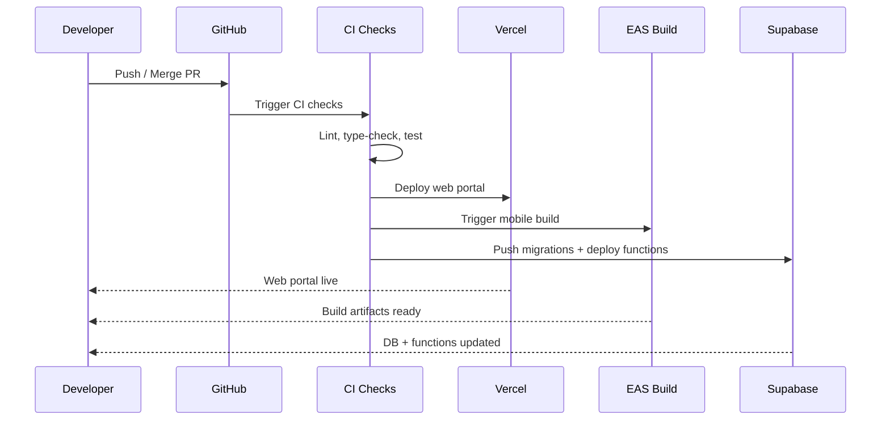

# Deployment

## Table of Contents

- [Overview](#overview)
- [Web Portal (Next.js)](#web-portal-nextjs)
- [Mobile App (Expo/EAS)](#mobile-app-expoeas)
- [Supabase Database](#supabase-database)
- [Supabase Edge Functions](#supabase-edge-functions)
- [CI/CD Pipeline](#cicd-pipeline)
- [Deployment Pipeline Diagram](#deployment-pipeline-diagram)

## Overview

CI/CD is planned but **not yet implemented**. All deployments are currently performed manually via CLI tools. This document covers the manual deployment steps for each component of the monorepo.

## Web Portal (Next.js)

Build the web portal for production:

```bash
cd apps/web-portal
pnpm build
```

**Target platform:** Vercel (planned)

<!-- TODO: Vercel project setup steps when deployment is configured -->

## Mobile App (Expo/EAS)

### Prebuild

Before building, run the Expo prebuild step to generate native projects:

```bash
npx expo prebuild
```

### Build Profiles

Three build profiles are configured in `eas.json`:

| Profile       | Type        | Description                              |
|---------------|-------------|------------------------------------------|
| `development` | Debug APK   | Development client for local debugging   |
| `preview`     | Release APK | Release APK for internal testing         |
| `production`  | AAB         | Android App Bundle with auto-incrementing version |

### Build Commands

```bash
# Development build (debug APK with dev client)
eas build --profile development --platform android

# Preview build (release APK for testing)
eas build --profile preview --platform android

# Production build (AAB with auto-incrementing version)
eas build --profile production --platform android
```

> **Note:** iOS builds are available but require Apple Developer account configuration before use.

## Supabase Database

### Push Migrations

Apply local migrations to the remote Supabase project:

```bash
supabase db push --project-ref <REF>
```

Migration files are located in `infra/supabase/migrations/`.

### Generate Types

After applying migrations, regenerate TypeScript types:

```bash
cd packages/database && pnpm gen:types
```

## Supabase Edge Functions

### Deploy a Single Function

```bash
supabase functions deploy <name>
```

### Deploy All Functions

```bash
supabase functions deploy
```

### Set Secrets

```bash
supabase secrets set OPENAI_API_KEY=<key>
```

### Available Functions

The following 7 edge functions are deployed:

1. `feed` — Personalized dish feed
2. `nearby-restaurants` — Location-based restaurant discovery
3. `enrich-dish` — AI-powered dish enrichment via GPT-4o Vision
4. `group-recommendations` — Group dining recommendations
5. `swipe` — Swipe action processing
6. `update-preference-vector` — User preference vector updates
7. `batch-update-preference-vectors` — Batch preference vector recalculation

See [Edge Functions](./07-edge-functions.md) for implementation details.

## CI/CD Pipeline

**Status:** Planned, not implemented.

**Planned architecture:** GitHub Actions will orchestrate deployments to three targets:

- **Vercel** — Web portal deployment
- **EAS** — Mobile app builds
- **Supabase CLI** — Database migrations and edge function deployment

<!-- TODO: CI/CD implementation details when GitHub Actions workflows are created -->

## Deployment Pipeline Diagram



---

**See also:** [CLI Commands](./03-cli-commands.md) | [Environment Setup](./08-environment-setup.md) | [Edge Functions](./07-edge-functions.md)
