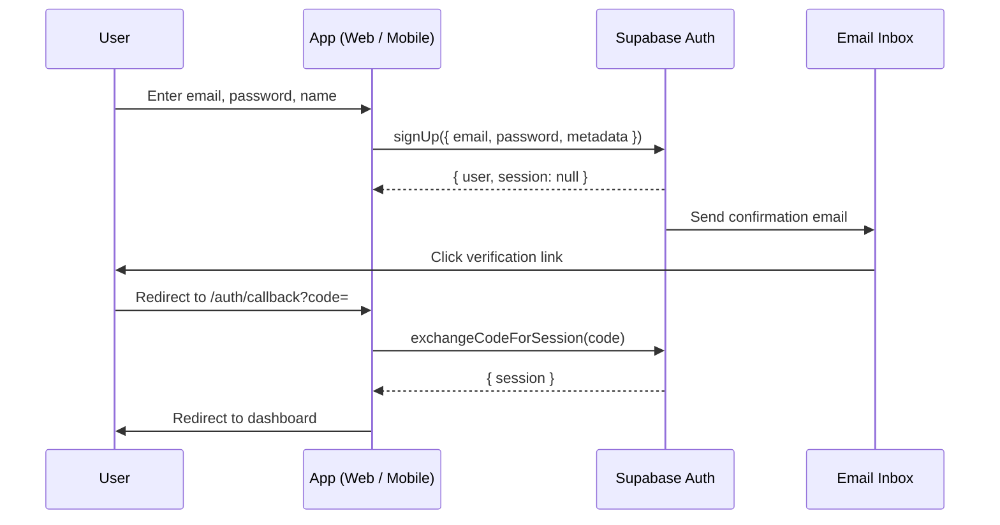
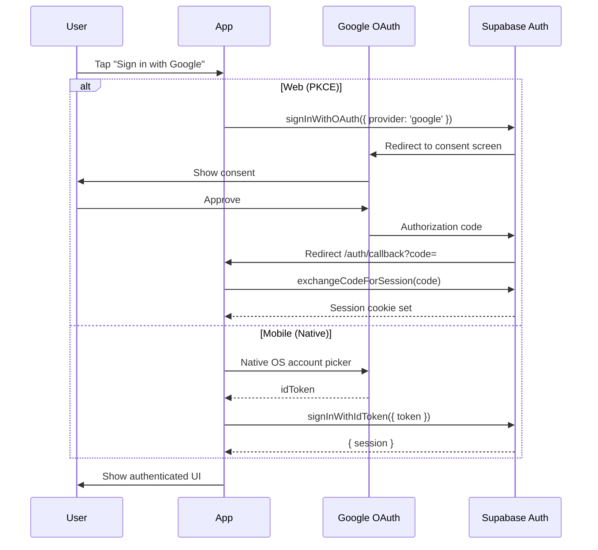
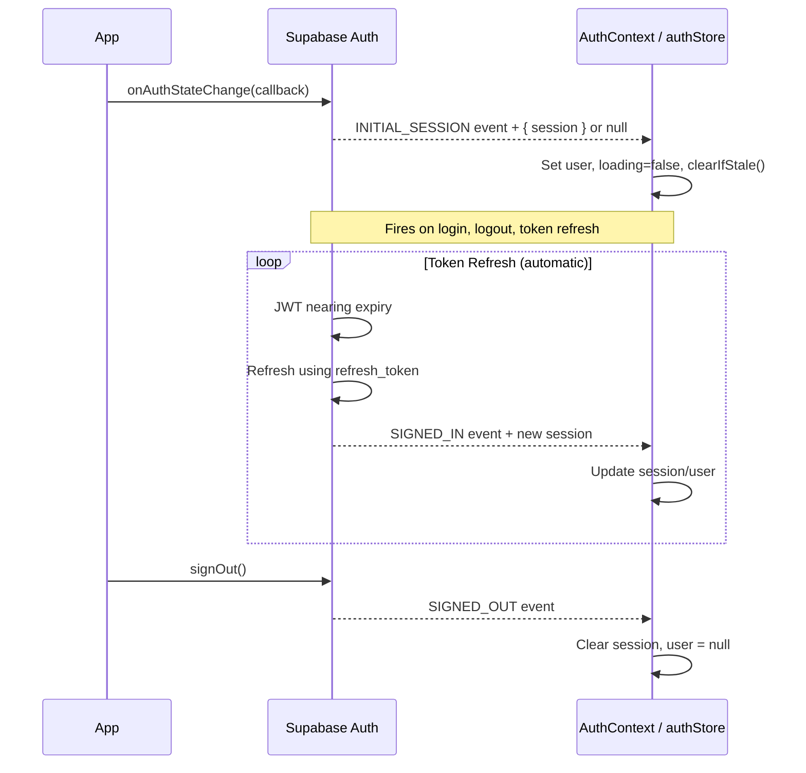

# Authentication Flow

## 1. Overview

Authentication gates access to both the consumer mobile app and the restaurant-owner/admin web portal. Supabase Auth provides the identity layer. The web portal uses a PKCE OAuth flow with cookie-based sessions; the mobile app uses native Google Sign-In or email/password with token-based sessions managed by Zustand.

## 2. Actors

| Actor | Description |
|-------|-------------|
| **User** | Consumer (mobile) or restaurant owner / admin (web) |
| **Mobile App** | React Native / Expo app with Zustand `authStore` |
| **Web Browser** | Next.js web portal with React `AuthContext` |
| **Supabase Auth** | Hosted auth service (email, OAuth, token refresh) |
| **Google OAuth** | Identity provider for social sign-in |

## 3. Preconditions

- Supabase project is configured with Email and Google providers enabled.
- Web portal has `NEXT_PUBLIC_SUPABASE_URL` and `NEXT_PUBLIC_SUPABASE_ANON_KEY` set.
- Mobile app has `SUPABASE_URL`, `SUPABASE_ANON_KEY`, and Google OAuth client IDs configured per platform.
- The web Route Handler at `/auth/callback` is deployed to exchange PKCE codes.
- `eatme://auth/callback` is registered in Supabase's Redirect URL allowlist (required for mobile email verification and any future mobile OAuth flows).
- DB triggers `on_auth_user_created_preferences`, `on_auth_user_created_profile`, and `on_auth_user_created_behavior` are applied via migrations 081–083.

## 4. Flow Steps

### Email/Password Signup (Web)

1. User fills in email, password, and restaurant name on `/auth/signup`.
2. `signUp()` calls `supabase.auth.signUp()` with `restaurant_name` in `user_metadata` and `emailRedirectTo` set to `/auth/callback`.
3. If email confirmation is required (`needsEmailVerification: true`), Supabase sends a confirmation email and the user is redirected to `/auth/login` with a "check your email" message.
4. If email confirmation is off (`needsEmailVerification: false`), the user is auto-logged in and redirected to `/`.
5. When the user clicks the verification link, they are redirected to `/auth/callback?code=<pkce_code>`.
6. The Route Handler exchanges the code for a session cookie via `exchangeCodeForSession()`.
7. User is redirected to `/` (or `/admin` if `app_metadata.role === 'admin'`).

### Email/Password Signup (Mobile)

1. User enters email, password, and optional `profile_name`.
2. `authStore.signUp()` calls `supabase.auth.signUp()` with metadata and `emailRedirectTo: 'eatme://auth/callback'`.
3. If `data.session` is null but `data.user` exists, `needsEmailVerification` is true.
4. User taps the verification email link → app opens via deep link (`eatme://auth/callback`).
5. User signs in normally after verification.

### OAuth Login (Web)

1. User clicks "Sign in with Google" or "Sign in with Facebook".
2. `signInWithOAuth(provider)` calls `supabase.auth.signInWithOAuth()` with `redirectTo` set to `/auth/callback`.
3. User completes consent in the provider's OAuth screen.
4. Provider redirects to Supabase, which redirects to `/auth/callback?code=<pkce_code>`.
5. The Route Handler exchanges the code for a cookie-based session.
6. User is redirected to the appropriate page based on role.

Note: Facebook OAuth requires separate App ID + Secret setup in the Supabase dashboard (Auth → Providers → Facebook).

### OAuth Login (Mobile - Google)

1. User taps "Sign in with Google".
2. `authStore.signInWithOAuth('google')` delegates to `signInWithGoogle()` (native OS account picker via `@react-native-google-signin`).
3. The native SDK returns an `idToken`.
4. `signInWithGoogle()` calls `supabase.auth.signInWithIdToken({ provider: 'google', token: idToken })`.
5. Supabase validates the token and creates/returns a session.
6. `onAuthStateChange` fires and updates the Zustand store reactively.

### OAuth Login (Mobile - Facebook / Other)

1. `authStore.signInWithOAuth('facebook')` calls `supabase.auth.signInWithOAuth()` with `skipBrowserRedirect: true`.
2. The returned `data.url` is opened via `expo-web-browser`'s `openAuthSessionAsync`.
3. On success, access and refresh tokens are extracted from the redirect URL hash.
4. `supabase.auth.setSession()` establishes the session locally.
5. The store is updated with the new session and user.

### Session Lifecycle

1. On app mount (web `AuthProvider`), `supabase.auth.onAuthStateChange` fires with `INITIAL_SESSION`, hydrating the initial state from cookies. This replaces the previous dual `getSession()` + `onAuthStateChange` pattern.
2. On mobile (`authStore.initialize()`), `supabase.auth.getSession()` hydrates the initial state.
3. `onAuthStateChange` is registered once to keep state in sync with Supabase's internal token refresh and callback events.
4. Supabase automatically refreshes the JWT before expiry (default 1 hour).
5. On web, stale drafts older than 7 days are cleared via `clearIfStale()` on the `INITIAL_SESSION` event.
6. Sign-out clears local state; mobile also calls `signOutFromGoogle()` to clear the native Google session.

### Post-Login Redirect (Web)

1. The middleware sets `?redirect=<path>` on the login URL when redirecting unauthenticated users.
2. After successful email/password sign-in, the login page reads the `?redirect` param via `useSearchParams()` and navigates there.
3. Only relative redirects (starting with `/`) are followed to prevent open redirect attacks.
4. OAuth login leaves the page via browser redirect so `?redirect` is not consumed — the callback Route Handler accepts a `?next=` param for OAuth round-trips (future enhancement).

## 5. Sequence Diagrams

### Email/Password Signup

### OAuth Login

### Session Lifecycle

## 6. Key Files

| File | Purpose |
|------|---------|
| `apps/web-portal/middleware.ts` | Edge middleware: session refresh, route protection, admin role enforcement |
| `apps/web-portal/contexts/AuthContext.tsx` | Web auth context (session, signIn, signUp, signInWithOAuth, signOut) |
| `apps/web-portal/app/auth/callback/route.ts` | PKCE code exchange Route Handler |
| `apps/web-portal/app/auth/login/page.tsx` | Web login page (honours `?redirect` param after sign-in) |
| `apps/web-portal/app/auth/signup/page.tsx` | Web signup page |
| `apps/web-portal/components/ProtectedRoute.tsx` | Redirects unauthenticated users to `/auth/login` |
| `apps/web-portal/components/AdminRoute.tsx` | Client-side admin role guard (checks `app_metadata.role`) |
| `apps/web-portal/lib/supabase.ts` | Browser-side Supabase client |
| `apps/web-portal/lib/supabase-server.ts` | Server-side Supabase client (cookie session) |
| `apps/web-portal/lib/storage.ts` | Draft persistence and `clearIfStale()` |
| `apps/mobile/src/stores/authStore.ts` | Zustand auth store (initialize, signIn, signUp, signInWithOAuth, signOut) |
| `apps/mobile/src/lib/supabase.ts` | Mobile Supabase client with `getOAuthRedirectUrl()` |
| `apps/mobile/src/lib/googleAuth.ts` | Native Google Sign-In (`signInWithGoogle`, `signOutFromGoogle`) |
| `infra/supabase/migrations/082_wire_signup_triggers.sql` | Binds user_preferences trigger |
| `infra/supabase/migrations/083_signup_user_profile_trigger.sql` | Auto-creates public.users and user_behavior_profiles on signup |

## 7. Error Handling

| Failure Mode | Handling |
|-------------|----------|
| Invalid credentials | Supabase returns error; displayed to user via `error` state |
| Email already registered | Supabase error; signUp returns `{ error }` |
| PKCE code missing/expired | Route Handler redirects to `/auth/login?error=missing_code` or `callback_failed` |
| OAuth cancelled by user | Mobile: error message `'OAuth cancelled'` is not persisted to error state; loading cleared |
| Token refresh failure | `onAuthStateChange` fires with null session; user is effectively signed out |
| Network error during auth | Caught in try/catch; error message set on store/context |
| Missing Google OAuth client ID | Native sign-in throws; caught and surfaced to user |
| Signup trigger failure | Trigger swallows error (`RAISE WARNING`); user can log in but may have missing preferences — monitor Supabase logs |
| Admin self-promotion via updateUser | Blocked — admin checks use `app_metadata`, not `user_metadata` |

## 8. Notes

- **Role-based access**: Admin checks use `app_metadata.role` (writable only by the service role). `user_metadata.role` is user-editable and must not be used for access control. The DB `is_admin()` function and `public.users.roles[]` are a separate system not currently used by the application layer — these should be reconciled or removed.
- **New user creation**: Three DB triggers fire on `AFTER INSERT ON auth.users`: `public.users` profile row (`on_auth_user_created_profile`), `user_preferences` defaults row (`on_auth_user_created_preferences`), and `user_behavior_profiles` row (`on_auth_user_created_behavior`). All use `ON CONFLICT DO NOTHING` for idempotency.
- **Duplicate listener prevention**: Mobile `authStore` tracks `authListenerSubscription` globally to avoid registering multiple `onAuthStateChange` listeners.
- **PKCE vs Implicit**: The web portal uses PKCE flow exclusively. The old implicit flow (hash-based tokens) has been replaced.
- **Draft cleanup**: On web login, `clearIfStale()` removes onboarding drafts older than 7 days. On sign-out, the user-specific draft key is explicitly removed from localStorage.
- **Password reset**: Mobile supports password reset via `resetPasswordForEmail` with deep link `eatme://reset-password`.

See also: [Database Schema](../06-database-schema.md) for `users`, `user_preferences`, and `user_behavior_profiles` tables.
