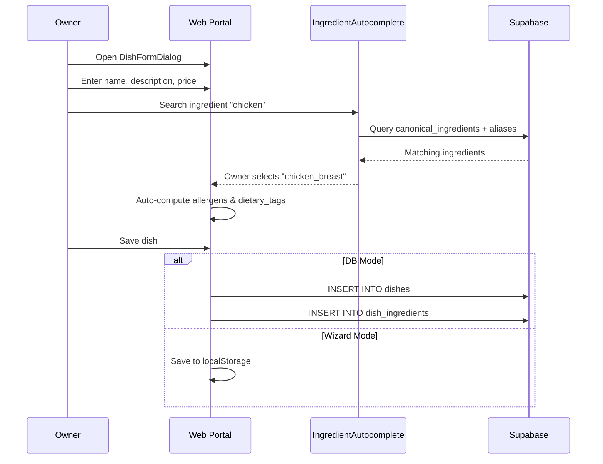
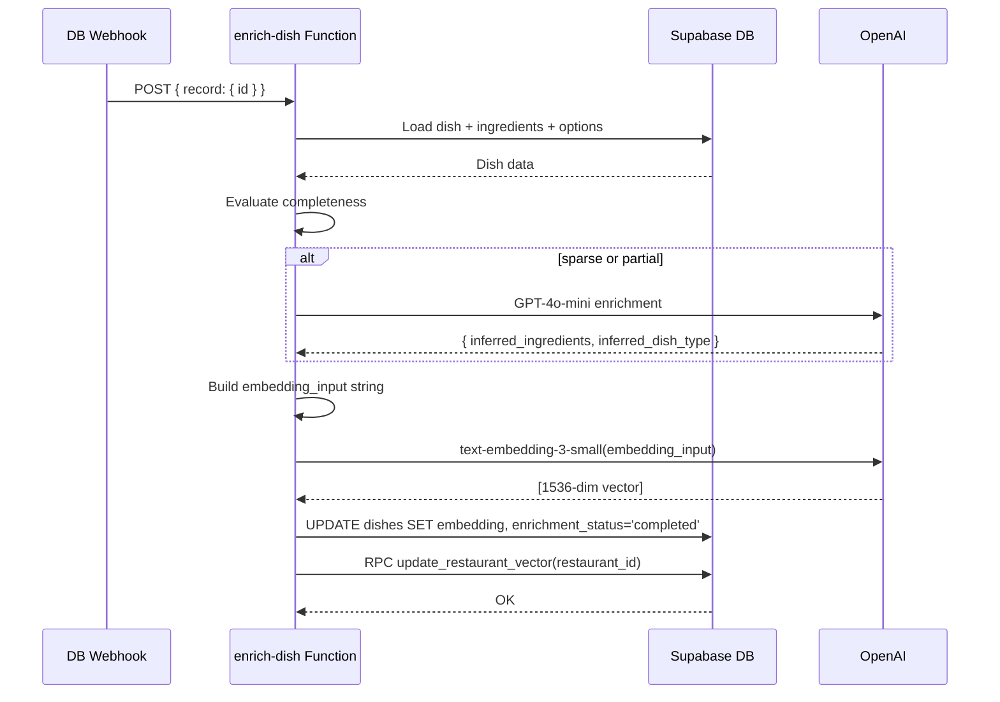

# Dish Creation & AI Enrichment

## 1. Overview

Dishes are created by restaurant owners either during onboarding (wizard mode, localStorage) or via the menu management page (DB mode, direct Supabase writes). After a dish is saved to the database, a Supabase Database Webhook triggers the `enrich-dish` Edge Function, which evaluates completeness, optionally enriches sparse dishes with GPT-4o-mini, generates an embedding via `text-embedding-3-small`, and updates the restaurant's aggregate vector.

## 2. Actors

| Actor | Description |
|-------|-------------|
| **Restaurant Owner / Admin** | Creates or edits dishes |
| **Web Portal** | Next.js app with `DishFormDialog` and `IngredientAutocomplete` |
| **Supabase** | Database, webhook trigger, Edge Function runtime |
| **enrich-dish Edge Function** | Enrichment and embedding pipeline |
| **OpenAI** | GPT-4o-mini (enrichment) and text-embedding-3-small (embedding) |

## 3. Preconditions

- Restaurant and at least one menu/category exist in the database.
- `canonical_ingredients` table is populated.
- `OPENAI_API_KEY` is set in Supabase Edge Function secrets.
- Database webhook is configured to call `enrich-dish` on `INSERT`/`UPDATE` of `dishes`.
- The `update_restaurant_vector` RPC function exists.

## 4. Flow Steps

### Dish Creation

1. Owner opens `DishFormDialog` (from onboarding wizard or menu management page).
2. Owner enters dish name, description, price, dish kind, optional calories and spice level.
3. Owner uses `IngredientAutocomplete` to search and link canonical ingredients:
   - Searches by `canonical_name` and `ingredient_aliases.display_name`.
   - Each linked ingredient brings its `allergens` and `dietary_tags`.
4. Allergens and dietary tags are auto-computed as the union of all linked ingredients' properties.
5. Owner saves the dish:
   - **Wizard mode**: Data stored in localStorage draft (persisted to DB on final submission).
   - **DB mode**: `INSERT` or `UPDATE` to `dishes` table, plus `dish_ingredients` associations.

### AI Enrichment Pipeline

6. Database webhook fires on dish `INSERT`/`UPDATE`, calling `enrich-dish` with the webhook envelope.
7. The function loads the dish row, its canonical ingredients, and option group/option names.
8. **Debounce check**: If the dish was already `completed` less than 8 seconds ago, the call is skipped to avoid redundant OpenAI charges from rapid saves.
9. **Completeness evaluation**:
   - `complete`: 3 or more linked canonical ingredients.
   - `partial`: 1-2 ingredients, or has a description but no ingredients.
   - `sparse`: 0 ingredients and no description.
10. **AI enrichment** (sparse/partial only):
    - Calls GPT-4o-mini with the dish name and description.
    - Returns inferred ingredients (max 8), inferred dish type, and notes.
    - Stored in `enrichment_payload` (audit column only -- never written to `allergens`/`dietary_tags`).
11. **Embedding input construction**:
    - Concatenates: dish name, dish type, description (first 120 chars), ingredients (DB + AI-inferred if not complete), option names (up to 20).
    - For complete dishes, only DB ingredients are used. For partial/sparse, AI-inferred ingredients supplement up to the threshold of 3.
12. **Embedding generation**: Calls OpenAI `text-embedding-3-small` with 1536 dimensions.
13. **Persistence**: Updates the dish with `embedding`, `embedding_input`, `enrichment_status='completed'`, `enrichment_source` (none/ai), `enrichment_confidence` (high/medium/low).
14. **Restaurant vector update**: Calls `update_restaurant_vector` RPC, which averages all dish embeddings for the restaurant into `restaurants.restaurant_vector`.

## 5. Sequence Diagrams

### Dish Creation

### AI Enrichment

## 6. Key Files

| File | Purpose |
|------|---------|
| `apps/web-portal/components/DishFormDialog.tsx` | Dish creation/edit UI (wizard + DB modes) |
| `apps/web-portal/components/IngredientAutocomplete.tsx` | Canonical ingredient search and selection |
| `supabase/functions/enrich-dish/index.ts` | Enrichment pipeline: completeness, GPT-4o-mini, embedding, restaurant vector |

## 7. Error Handling

| Failure Mode | Handling |
|-------------|----------|
| OpenAI API error (enrichment) | `enrichWithAI` returns null; enrichment is skipped but embedding still generated from available data |
| OpenAI API error (embedding) | Exception thrown; dish status set to `'failed'`; can be retried via direct call |
| Dish not found | Returns 404; no side effects |
| Debounce triggered | Returns `{ skipped: true, reason: 'recently_completed' }`; no API calls made |
| `update_restaurant_vector` RPC failure | Logged as non-fatal warning; dish enrichment still succeeds |
| Invalid JSON from GPT | `JSON.parse` caught; `enrichmentPayload` remains null |

## 8. Notes

- **Enrichment payload is audit-only**: AI-inferred ingredients are stored in `enrichment_payload` for transparency but are never written to the dish's `allergens` or `dietary_tags` columns. Those are computed solely from manually linked canonical ingredients.
- **Embedding input composition**: The structured text format (name; type; description; ingredients; options) is designed for semantic coherence in the embedding space.
- **Confidence levels**: `high` = complete (3+ ingredients), `medium` = partial + AI enriched, `low` = sparse or partial without AI.
- **8-second debounce**: Prevents redundant OpenAI calls when a dish record is updated multiple times in quick succession (e.g., saving ingredients one at a time).
- **Direct invocation**: The function also accepts `{ dish_id }` for manual re-enrichment or batch reprocessing, not just webhook envelopes.
- **Embedding dimensions**: 1536 dimensions from `text-embedding-3-small`, stored as a pgvector column.

See also: [Database Schema](../06-database-schema.md) for `dishes`, `dish_ingredients`, `canonical_ingredients`, and `restaurants` tables.
