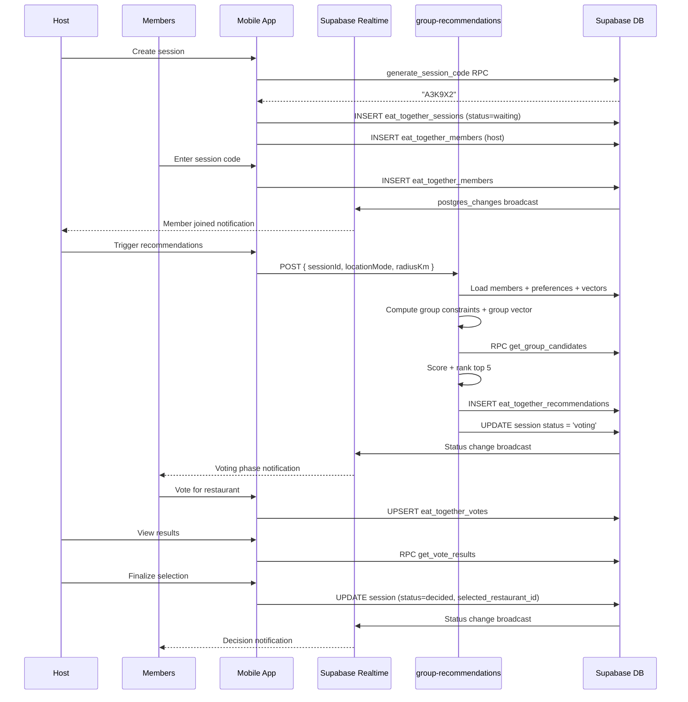
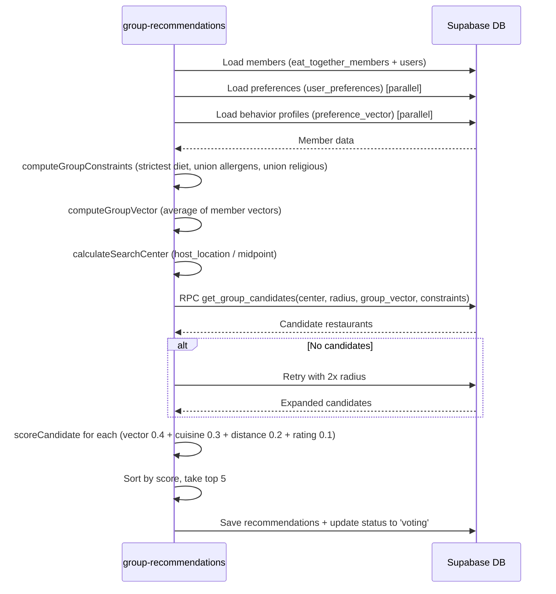

# Eat Together Group Dining

## 1. Overview

Eat Together enables a group of friends to collaboratively find a restaurant that satisfies everyone's dietary requirements and taste preferences. A host creates a session, members join via a 6-character code, the host triggers group recommendations (vector-based scoring with union constraints), the group votes on the top restaurants, and the host finalizes the selection. Sessions expire after 3 hours.

## 2. Actors

| Actor | Description |
|-------|-------------|
| **Host** | Creates the session, triggers recommendations, finalizes selection |
| **Members** | Join via code/link, share location, vote on restaurants |
| **Mobile App** | React Native app with Eat Together screens and `eatTogetherService` |
| **Supabase (Realtime)** | Postgres Changes subscriptions for live member/session updates |
| **group-recommendations Edge Function** | Computes group-aware restaurant recommendations |

## 3. Preconditions

- All participants are authenticated in the mobile app.
- At least 2 active members are required before recommendations can be generated.
- Members should share their location for distance-based ranking (midpoint/max_radius modes require it).
- The `get_group_candidates` RPC function and `eat_together_*` tables are deployed.

## 4. Flow Steps

### Session Creation

1. Host opens the Eat Together screen and taps "Create Session".
2. `createSession(userId, locationMode)` calls `generate_session_code` RPC to produce a unique 6-character alphanumeric code.
3. A session row is inserted into `eat_together_sessions` with `status='waiting'`.
4. Host is automatically added as the first member in `eat_together_members` with `is_host=true`.
5. Host selects a location mode: `host_location`, `midpoint`, or `max_radius`.

### Join Flow

6. Members can join via:
   - Scanning a QR code containing the session code.
   - Tapping a share link.
   - Manually entering the 6-character code.
7. `joinSession(userId, sessionCode, location)` looks up the session by code (must be `status='waiting'`), checks for duplicate membership, and inserts a member row.
8. Member's location is stored as a PostGIS `POINT` geometry.

### Realtime Sync

9. `subscribeToSession(sessionId, onSessionChange, onMembersChange)` opens two Supabase Realtime channels:
   - `postgres_changes` on `eat_together_sessions` (filter: `id=eq.{sessionId}`).
   - `postgres_changes` on `eat_together_members` (filter: `session_id=eq.{sessionId}`).
10. When a member joins/leaves, all connected clients see the update in real time.
11. Session status changes (waiting -> recommending -> voting -> decided) are also broadcast.

### Recommendations

12. Host taps "Get Recommendations", triggering the `group-recommendations` Edge Function.
13. The function verifies the caller is the host and the session exists.
14. Member data is loaded, including preferences (`diet_preference`, `allergies`, `religious_restrictions`) and `preference_vector` from `user_behavior_profiles`.
15. **Group constraints** are computed (union logic):
    - Diet: strictest preference wins (vegan > vegetarian > all).
    - Allergens: union of all members' allergen lists.
    - Religious restrictions: union of all members' religious restriction lists.
16. **Group vector**: Unweighted average of all members' `preference_vector` values. Members without a vector are excluded (not diluted with zeros).
17. **Search center** is computed based on `locationMode`:
    - `host_location`: Host's location.
    - `midpoint`: Average lat/lng of all located members.
    - `max_radius`: Same as midpoint (radius covers all members).
18. **Stage 1 -- `get_group_candidates` RPC**: Hard filters (PostGIS radius, allergens, diet tag, religious tags) + ANN ordering by group vector. Returns up to 40 restaurant candidates.
19. **Auto-radius expansion**: If no results, the function retries with 2x radius.
20. **Stage 2 -- Scoring**: Each candidate is scored:
    - `vector_similarity` (0.40): `1 - vector_distance` from group vector.
    - `cuisine_compatibility` (0.30): Neutral 0.5 (per-member cuisine matching is a future enhancement).
    - `distance` (0.20): `1 - distance_km / radius_km`.
    - `rating` (0.10): `restaurant_rating / 5`.
    - Cold-start fallback (no group vector): 0.40 cuisine + 0.35 rating + 0.25 distance.
21. Top 5 restaurants are saved to `eat_together_recommendations` and session status is updated to `'voting'`.

### Voting

22. Each member sees the recommended restaurants and votes for one.
23. `submitVote(sessionId, userId, restaurantId)` upserts into `eat_together_votes` (one vote per member per session).
24. Votes are visible to all members via Realtime.

### Finalization

25. Host views vote results via `getVoteResults(sessionId)` (calls `get_vote_results` RPC).
26. Host selects the winning restaurant and calls `finalizeSelection(sessionId, restaurantId)`.
27. Session status is updated to `'decided'` with `selected_restaurant_id` set.

## 5. Sequence Diagrams

### Session Lifecycle

### Recommendation Algorithm

## 6. Key Files

| File | Purpose |
|------|---------|
| `supabase/functions/group-recommendations/index.ts` | Group-aware recommendation engine |
| `apps/mobile/src/services/eatTogetherService.ts` | Session CRUD, join, vote, subscribe, finalize |
| Eat Together screens (`apps/mobile/src/screens/`) | Create, Join, Lobby, Vote, Results screens |
| `get_group_candidates` SQL function | Stage 1: PostGIS + hard filters + ANN (Supabase migration) |
| `generate_session_code` SQL function | Unique 6-char code generation |
| `get_vote_results` SQL function | Aggregated vote counts per restaurant |

## 7. Error Handling

| Failure Mode | Handling |
|-------------|----------|
| Session not found or unauthorized | Returns 404 |
| Fewer than 2 active members | Returns 400: "Need at least 2 active members" |
| No members have shared location | Returns 400: "Unable to determine search location" |
| No candidates within radius | Auto-expands to 2x radius; if still empty, returns empty with `conflicts` analysis |
| Conflicting constraints (e.g., halal + kosher) | `analyzeConflicts` generates warning messages returned to the client |
| Vegan filter active | Conflict warning: "All-vegan filter active -- limited restaurant options" |
| 4+ allergens | Conflict warning: complex filter notification |
| Realtime subscription failure | App can poll manually; gracefully degrades |

## 8. Notes

- **3-hour session expiry**: Sessions have an `expires_at` timestamp set at creation. Expired sessions cannot accept new members or votes.
- **Location modes**: `host_location` uses only the host's position; `midpoint` averages all members' positions; `max_radius` uses midpoint with the radius expanded to cover all members.
- **Vector exclusion**: Members without a `preference_vector` are excluded from the group vector average (not diluted with zeros), so new users do not weaken the group signal.
- **One vote per member**: The `eat_together_votes` table has a unique constraint on `(session_id, user_id)`, enforced via upsert.
- **Cuisine compatibility placeholder**: The current implementation uses a neutral 0.5 for cuisine compatibility. Per-member cuisine preference matching is planned for a future iteration.
- **Session statuses**: `waiting` -> `recommending` -> `voting` -> `decided` / `cancelled` / `expired`.

See also: [Database Schema](../06-database-schema.md) for `eat_together_sessions`, `eat_together_members`, `eat_together_recommendations`, and `eat_together_votes` tables.
