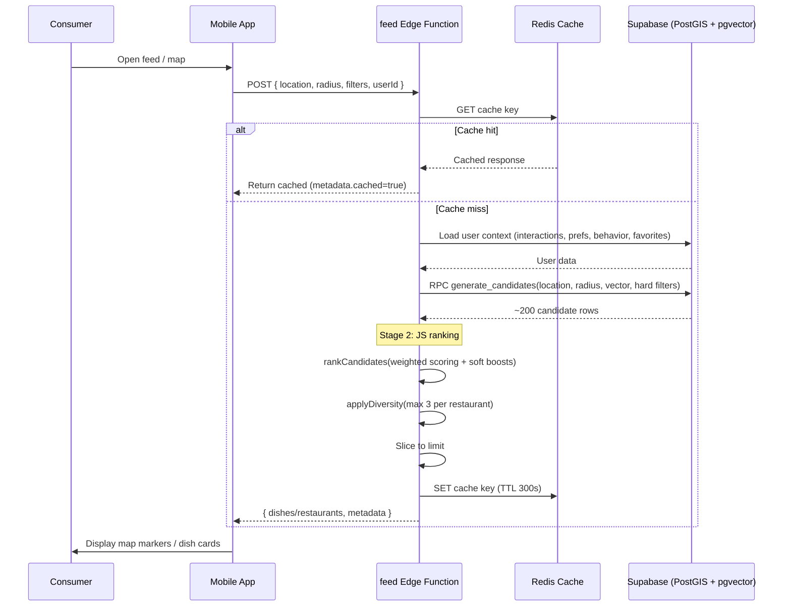

# Feed & Discovery

## 1. Overview

The feed is the primary discovery surface for consumers in the mobile app. It uses a two-stage pipeline: Stage 1 runs a SQL-level `generate_candidates` RPC that applies PostGIS radius filtering, pgvector ANN similarity, and hard dietary/allergen filters to produce ~200 candidates. Stage 2 ranks those candidates in JavaScript with weighted scoring, soft boosts, and a diversity cap (max 3 dishes per restaurant). Results are cached in Upstash Redis for 300 seconds.

## 2. Actors

| Actor | Description |
|-------|-------------|
| **Consumer** | Mobile app user browsing for food |
| **Mobile App** | React Native app calling the feed Edge Function |
| **feed Edge Function** | Two-stage ranking pipeline |
| **Supabase (PostGIS + pgvector)** | `generate_candidates` RPC for spatial and vector filtering |
| **Upstash Redis** | Response cache (300s TTL) |

## 3. Preconditions

- Consumer has granted location permission (lat/lng available).
- Restaurants with enriched dishes (embeddings generated) exist within the search radius.
- `generate_candidates` SQL function is deployed.
- Optionally: consumer has a `preference_vector` in `user_behavior_profiles` (for personalized ranking).

## 4. Flow Steps

1. Consumer opens the feed/map screen in the mobile app.
2. The app collects the current location and active filters, then calls the `feed` Edge Function via `edgeFunctionsService`.
3. **Cache check**: The function builds a cache key from userId, location (3 decimal places), and filters. If a Redis hit is found, it is returned immediately.
4. **User context loading** (parallel queries):
   - `user_dish_interactions` for disliked dish IDs and liked cuisines.
   - `user_preferences` for spice tolerance, favourite cuisines, religious restrictions.
   - `user_behavior_profiles` for `preference_vector`, `preferred_cuisines`, `preferred_price_range`.
   - `favorites` for favourited restaurant IDs (cuisine boost extraction).
5. **Stage 1 -- `generate_candidates` RPC**:
   - `ST_DWithin` PostGIS filter (radius in metres).
   - pgvector ANN ordering by `preference_vector` (if available).
   - Hard filters: disliked dish exclusion, allergen exclusion, dietary tag requirement, religious tag requirement, `excludeFamilies` (ingredient family exclusion), `excludeSpicy`.
   - Returns up to 200 candidate rows with dish data, restaurant info, distance, and vector distance.
6. **Ingredient flag annotation**: If `flagIngredients` filter is set, dish-ingredient associations are queried and matching ingredients are annotated on each candidate.
7. **Stage 2 -- JS ranking** (`rankCandidates`):
   - **Base score** (weighted sum):
     - `similarity` (0.40): `1 - vector_distance` (0 if no preference vector).
     - `rating` (0.20): `restaurant_rating / 5`.
     - `popularity` (0.15): `popularity_score` (capped at 1.0).
     - `distance` (0.15): `1 - distance_km / radius_km`.
     - `quality` (0.10): presence of image (0.5) + long description (0.3) + enriched (0.2).
   - **Cold-start redistribution**: When no preference vector exists, the similarity weight is redistributed to rating and popularity.
   - **Soft boosts** (additive):
     - Diet match: +0.50 (daily filter).
     - Craving/dish name match: +0.25 (daily filter).
     - Cuisine match: +0.20 (daily filter).
     - Protein type match: +0.20 (daily filter).
     - Favourited restaurant: +0.15.
     - Meat subtype match: +0.10 (daily filter).
     - Favourite cuisines (permanent): +0.10.
     - Historical liked cuisines: +0.10.
     - Spice preference: +0.10/-0.08 (daily filter).
     - Price proximity: +0.08 max (daily filter).
     - Learned price range: +0.06 max (permanent, from behavior profile).
     - Calorie proximity: +0.05 max (daily filter).
8. **Diversity cap**: `applyDiversity` enforces a maximum of 3 dishes per restaurant.
9. **Mode handling**:
   - **Dishes mode** (default): Returns top N dishes with scores.
   - **Restaurants mode**: Aggregates dishes by restaurant, annotates `is_open` using `open_hours`, supports `openNow` hard filter and sort options (closest, bestMatch, highestRated).
10. **Cache write**: Response is cached in Redis with 300s TTL.
11. Response returned to mobile app with metadata (totalAvailable, returned, cached, processingTime, personalized, stage1Candidates).

## 5. Sequence Diagram

## 6. Key Files

| File | Purpose |
|------|---------|
| `supabase/functions/feed/index.ts` | Two-stage feed pipeline (candidates + ranking + diversity) |
| `apps/mobile/src/services/edgeFunctionsService.ts` | Mobile service calling feed Edge Function |
| `generate_candidates` SQL function | Stage 1: PostGIS + pgvector + hard filters (in Supabase migrations) |

## 7. Error Handling

| Failure Mode | Handling |
|-------------|----------|
| Invalid location | Returns 400 with `"Invalid location"` |
| `generate_candidates` RPC failure | Exception thrown; returns 500 |
| Redis read/write failure | Non-fatal; logged and skipped; feed still works without cache |
| No candidates found | Returns empty `{ dishes: [], metadata: { totalAvailable: 0 } }` |
| User context query failure | Individual failures are non-fatal; feed degrades gracefully (e.g., no personalization) |
| Flag ingredient lookup failure | Non-fatal; flagged_ingredients will be empty |

## 8. Notes

- **Daily vs permanent filters**: Daily filters (price range, calories, cuisine, spice, diet toggle, protein type, meat subtype, dish names) are session-scoped and apply as soft boosts. Permanent filters (allergens, religious restrictions, dietary preference, exclude families, exclude spicy, spice tolerance, favourite cuisines) are stored in `user_preferences` and apply as hard filters in Stage 1 or permanent soft boosts in Stage 2.
- **Cold-start handling**: For new users without a `preference_vector`, the similarity weight (0.40) is redistributed: half to rating, half to popularity, ensuring reasonable results from day one.
- **Diversity cap**: Max 3 dishes per restaurant prevents any single restaurant from dominating the feed.
- **Open hours**: `isOpenNow` logic handles overnight spans (e.g., 22:00-02:00). It is applied as a hard filter only in restaurants mode when `openNow=true`.
- **Protein annotations**: `protein_families` and `protein_canonical_names` are precomputed columns on dishes (migration 070), so no extra DB query is needed during ranking.
- **Cache key granularity**: Location is rounded to 3 decimal places (~111m precision) to increase cache hit rate without sacrificing relevance.

See also: [Database Schema](../06-database-schema.md) for `dishes`, `restaurants`, `user_preferences`, `user_behavior_profiles`, and `dish_analytics` tables.
