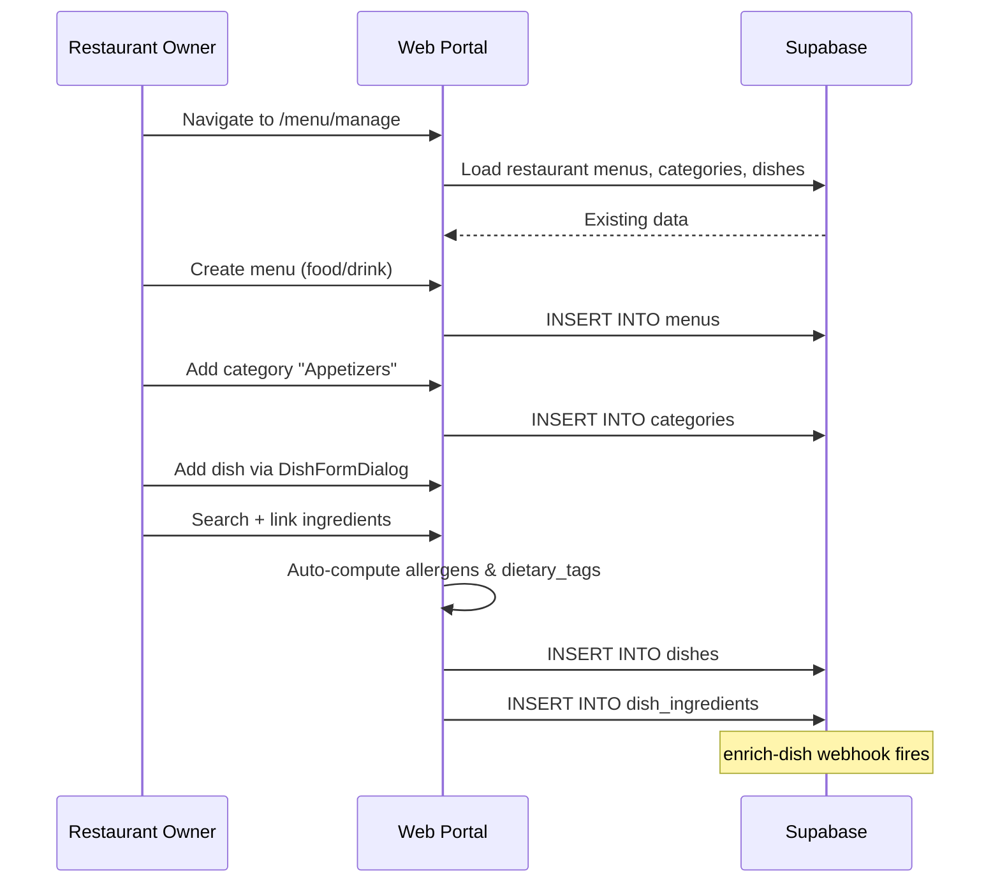
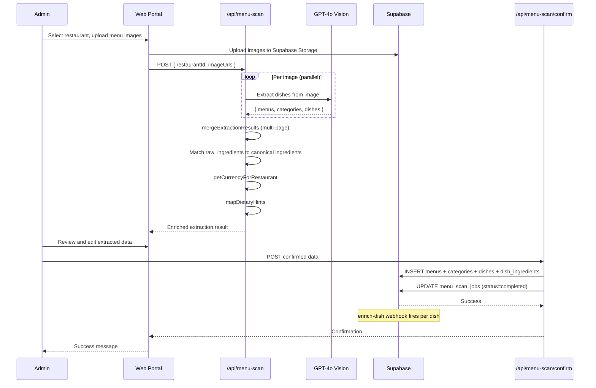

# Menu Management & Scanning

## 1. Overview

Restaurant menus can be managed manually through the web portal's menu management page, or bulk-imported via the admin menu scan feature. Manual management provides full CRUD for menus, categories, and dishes with ingredient autocomplete. Menu scanning uses GPT-4o Vision to extract structured dish data from uploaded menu images, matches ingredients to the canonical database, and allows the admin to review and confirm before persisting.

## 2. Actors

| Actor | Description |
|-------|-------------|
| **Restaurant Owner** | Manages menus via `/menu/manage` |
| **Admin** | Scans menus via `/admin/menu-scan` |
| **Web Portal** | Next.js app with menu management and scan UI |
| **Next.js API** | `/api/menu-scan` and `/api/menu-scan/confirm` route handlers |
| **GPT-4o Vision** | Extracts dishes from menu images |
| **Supabase** | Database for persistence, Storage for images |

## 3. Preconditions

- Restaurant exists in the database (either from onboarding or admin creation).
- For manual management: restaurant owner is authenticated and authorized.
- For menu scan: admin user is authenticated with admin role.
- `OPENAI_API_KEY` is set in the Next.js environment.
- `canonical_ingredients` and `ingredient_aliases` tables are populated.

## 4. Flow Steps

### Manual Menu Management

1. Owner navigates to `/menu/manage` for their restaurant.
2. Owner creates a menu (specifying name, `menu_type` as food/drink, and optional availability).
3. Owner adds categories within the menu (e.g., "Appetizers", "Mains").
4. Owner adds dishes within each category via `DishFormDialog` in DB mode:
   - Name, description, price, dish kind.
   - Ingredient linking via `IngredientAutocomplete`.
   - Auto-computed allergens and dietary tags from linked ingredients.
5. All changes are saved directly to Supabase (no localStorage intermediate).
6. The `enrich-dish` webhook fires for each new/updated dish (see [dish-creation-enrichment.md](./dish-creation-enrichment.md)).

### Menu Scan Pipeline

7. Admin navigates to `/admin/menu-scan` and selects a restaurant.
8. Admin uploads one or more menu images (photos or scans).
9. Images are uploaded to Supabase Storage.
10. The `/api/menu-scan` route processes each image:
    - Sends each image to GPT-4o Vision in parallel with a structured extraction prompt.
    - The prompt instructs the model to extract menus, categories, and dishes with: name, price, description, raw_ingredients, dietary_hints, spice_level, calories, and confidence score.
    - Time-of-day labels (Breakfast, Lunch, Dinner) and course headers (Entradas, Sopas, etc.) become category names, not separate menus.
    - Only explicitly separate titled menus (e.g., "Kids Menu", "Seasonal Menu") create additional menu entries.
11. **Multi-page merge**: If multiple images are uploaded, extraction results are merged using `mergeExtractionResults`, which combines categories and deduplicates dishes across pages.
12. **Ingredient matching**: For each extracted dish, `raw_ingredients` are matched to canonical ingredients:
    - Exact name match on `canonical_name`.
    - Partial/fuzzy match on `ingredient_aliases.display_name`.
    - AI translation for non-English ingredient names via `/api/menu-scan/suggest-ingredients`.
13. **Currency inference**: `getCurrencyForRestaurant` determines the currency based on the restaurant's country.
14. **Dietary mapping**: `mapDietaryHints` converts extracted hints (V, VG, GF, H, K) to standardized dietary tags.
15. The enriched extraction result is returned to the admin UI for review.
16. Admin reviews and edits: corrects dish names, prices, ingredient matches, and dietary info.
17. Admin clicks "Confirm" which calls `/api/menu-scan/confirm`:
    - Menus, categories, and dishes are inserted into the database.
    - Dish-ingredient associations are created.
    - The scan job record in `menu_scan_jobs` is updated to `'completed'`.
18. The `enrich-dish` webhook fires for each newly created dish.

## 5. Sequence Diagrams

### Manual Menu Management

### Menu Scan

## 6. Key Files

| File | Purpose |
|------|---------|
| `apps/web-portal/app/menu/manage/page.tsx` | Manual menu management page (owner) |
| `apps/web-portal/app/admin/menu-scan/page.tsx` | Admin menu scan UI (upload, review, confirm) |
| `apps/web-portal/app/api/menu-scan/route.ts` | Image extraction via GPT-4o Vision + ingredient matching |
| `apps/web-portal/app/api/menu-scan/confirm/route.ts` | Persist confirmed scan results to database |
| `apps/web-portal/app/api/menu-scan/suggest-ingredients/route.ts` | AI ingredient translation/suggestion |
| `apps/web-portal/lib/menu-scan.ts` | Merge algorithm, dietary mapping, currency inference, types |
| `apps/web-portal/components/DishFormDialog.tsx` | Dish creation/edit dialog |
| `apps/web-portal/components/IngredientAutocomplete.tsx` | Canonical ingredient search |

## 7. Error Handling

| Failure Mode | Handling |
|-------------|----------|
| GPT-4o Vision extraction failure | Per-image error; other images still processed; admin sees partial results |
| Invalid JSON from GPT | Caught and logged; image marked as failed in the extraction result |
| Ingredient matching failure | Unmatched ingredients shown in review UI for manual correction |
| Supabase Storage upload failure | Error surfaced to admin; scan cannot proceed without images |
| Confirmation persistence failure | Error returned to admin; scan job status remains `'processing'` |
| Missing `OPENAI_API_KEY` | Route throws at initialization; returns 500 |
| Non-admin access to scan | `verifyAdminRequest` rejects with 403 |

## 8. Notes

- **Scan job tracking**: The `menu_scan_jobs` table tracks scan progress with statuses: `pending`, `processing`, `completed`, `failed`. This allows admins to see historical scans and retry failed ones.
- **Multi-language support**: The extraction prompt handles menus in Spanish and English, preserving original-language dish names. Ingredient matching uses `ingredient_aliases` for multi-language lookups.
- **Confidence scores**: Each extracted dish has a confidence score (0.0-1.0) indicating extraction quality. Low-confidence dishes are highlighted in the review UI.
- **Menu type heuristics**: The GPT prompt includes detailed rules for distinguishing food vs drink menus and preventing over-segmentation (e.g., time-of-day labels become categories, not separate menus).
- **Dietary symbol detection**: The prompt recognizes V, VG, GF, H, K symbols and their textual equivalents in multiple languages.
- **Currency inference**: Prices are stored as numbers; the currency is inferred from the restaurant's country rather than extracted from the menu image.

See also: [Database Schema](../06-database-schema.md) for `menus`, `categories`, `dishes`, `dish_ingredients`, and `menu_scan_jobs` tables. See also: [Dish Creation & Enrichment](./dish-creation-enrichment.md) for the post-save enrichment pipeline.
