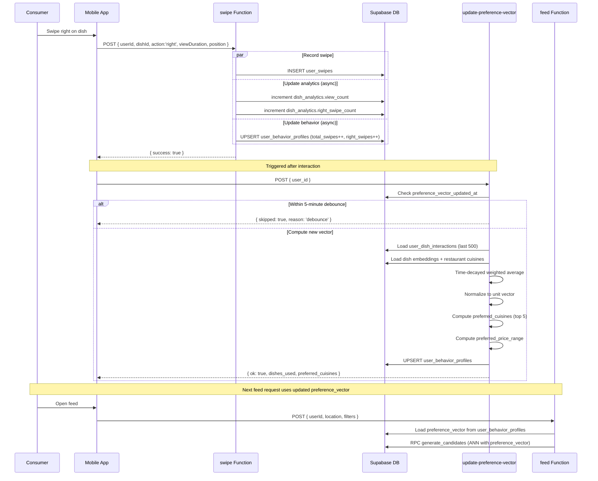

# Preference Learning Pipeline

## 1. Overview

The preference learning pipeline converts user interactions (swipes, saves, views) into a 1536-dimensional preference vector that powers personalized feed ranking. Swipes are recorded by the `swipe` Edge Function, which also updates dish analytics and user behavior profiles. The `update-preference-vector` Edge Function computes a time-decayed weighted average of dish embeddings from the user's interaction history. A nightly `batch-update-preference-vectors` cron job ensures no user is stuck on a stale vector.

## 2. Actors

| Actor | Description |
|-------|-------------|
| **Consumer** | Swipes on dishes in the mobile app feed |
| **Mobile App** | Sends swipe events to the Edge Function |
| **swipe Edge Function** | Records swipes, updates analytics and behavior counters |
| **update-preference-vector Edge Function** | Computes the preference vector from interaction history |
| **Supabase** | Database (user_swipes, dish_analytics, user_behavior_profiles, user_dish_interactions) |
| **pg_cron** | Triggers nightly batch vector updates |

## 3. Preconditions

- Consumer is authenticated and has a valid session.
- Dishes in the feed have embeddings generated by the `enrich-dish` pipeline (see [dish-creation-enrichment.md](./dish-creation-enrichment.md)).
- The `update-preference-vector` function is deployed and accessible.
- The `batch-update-preference-vectors` function is configured as a pg_cron job (migration 058).

## 4. Flow Steps

### Swipe Recording

1. Consumer swipes left (reject), right (like), or super-like on a dish card in the feed.
2. The mobile app calls the `swipe` Edge Function with `{ userId, dishId, action, viewDuration, position, sessionId, context }`.
3. The function inserts a row into `user_swipes` with full context.
4. **Async analytics update** (fire-and-forget):
   - Increments `view_count` on `dish_analytics` via `increment` RPC.
   - Increments action-specific counter: `right_swipe_count`, `left_swipe_count`, or `super_like_count`.
5. **Async behavior profile update** (fire-and-forget):
   - Loads or creates a `user_behavior_profiles` row.
   - Increments `total_swipes`, `right_swipes` (for right/super), or `left_swipes` (for left).
   - Updates `last_active_at`.
6. The function returns `{ success: true }` immediately (does not wait for async updates).

### Real-time Vector Update

7. After a swipe (or other interaction like save/view), the `update-preference-vector` function is triggered.
8. **Debounce check**: If `preference_vector_updated_at` is less than 5 minutes old, the call is skipped to avoid thrashing from rapid interactions.
9. The function loads the last 500 `user_dish_interactions` for the user.
10. Unique dish IDs from positive-signal interactions (saved, liked, viewed) are collected.
11. Dish embeddings and restaurant cuisine types are loaded from the database.
12. **Time-decayed weighted average**:
    - For each interaction: `weight = base_weight * e^(-0.01 * days_since_interaction)`.
    - Base weights: `saved=3.0`, `liked=1.5`, `viewed=0.5`.
    - `disliked` is deliberately excluded: disliking a dish at one restaurant reflects execution quality, not category preference.
    - Each dish embedding is multiplied by its weight and accumulated.
13. The accumulated vector is normalized to a unit vector (1536 dimensions).
14. **Aggregate fields computed**:
    - `preferred_cuisines`: Top 5 cuisines by weighted frequency from liked/saved dishes.
    - `preferred_price_range`: `[median - 0.5*std, median + 0.5*std]` of prices from liked/saved dishes (requires 3+ data points).
15. The result is upserted to `user_behavior_profiles` with `preference_vector`, `preference_vector_updated_at`, `preferred_cuisines`, and `preferred_price_range`.

### Batch Fallback (Nightly Cron)

16. A pg_cron job (migration 058) calls `batch-update-preference-vectors` once per day.
17. The function calls `get_users_needing_vector_update` RPC to find users whose:
    - `preference_vector_updated_at` is older than 24 hours or NULL, AND
    - They have at least one interaction newer than `preference_vector_updated_at`.
18. For each eligible user (up to 200 per run), it calls the `update-preference-vector` function sequentially with a 200ms delay between calls.
19. Results are logged: processed, skipped (debounced), and errors.

## 5. Sequence Diagram

## 6. Key Files

| File | Purpose |
|------|---------|
| `supabase/functions/swipe/index.ts` | Swipe recording, dish analytics, behavior profile counters |
| `supabase/functions/update-preference-vector/index.ts` | Time-decayed vector computation, cuisine/price aggregation |
| `supabase/functions/batch-update-preference-vectors/index.ts` | Nightly cron: recomputes stale vectors for up to 200 users |
| `apps/mobile/src/services/edgeFunctionsService.ts` | Mobile service calling swipe and feed functions |

## 7. Error Handling

| Failure Mode | Handling |
|-------------|----------|
| Missing required fields (userId, dishId, action) | Returns 400 with error message |
| Invalid action type | Returns 400: "Must be: left, right, or super" |
| Swipe insert failure | Throws; returns 500 |
| Analytics/behavior update failure | Logged but non-blocking (async fire-and-forget); swipe still succeeds |
| No interactions found | Returns `{ skipped: true, reason: 'no_interactions' }` |
| No dish embeddings available | Returns `{ skipped: true, reason: 'no_embeddings' }` |
| Zero total weight | Returns `{ skipped: true, reason: 'zero_weight' }` |
| Debounce triggered | Returns `{ skipped: true, reason: 'debounce' }` with `updated_at` timestamp |
| Batch function: individual user failure | Logged and counted in `errors`; batch continues with next user |
| Batch function: RPC failure | Fatal error; returns 500 |

## 8. Notes

- **Disliked dishes excluded from vector**: The `INTERACTION_WEIGHT` map deliberately omits `disliked`. Disliking a dish at one restaurant reflects preparation quality, not the user's dislike of that food category. Disliked dishes are excluded from the feed via `generate_candidates` hard filter instead.
- **Time decay**: `e^(-0.01 * days)` means a 30-day-old interaction retains ~74% of its weight; a 100-day-old interaction retains ~37%. This balances recency with long-term preferences.
- **5-minute debounce**: Prevents vector thrashing when a user rapidly swipes multiple dishes. The vector is recomputed at most once every 5 minutes.
- **Batch fallback**: Processes up to 200 users per nightly run with 200ms delay between calls. This ensures users who were offline or whose real-time triggers were skipped still get updated vectors.
- **500 interaction cap**: Only the last 500 interactions are loaded for vector computation, balancing accuracy with performance.
- **Preferred price range**: Requires at least 3 liked/saved dishes with prices to compute. Uses `[median - 0.5*std, median + 0.5*std]` to capture the central tendency.
- **Unit vector normalization**: The preference vector is normalized to unit length for cosine distance comparisons in the feed's pgvector ANN queries.

See also: [Database Schema](../06-database-schema.md) for `user_swipes`, `user_dish_interactions`, `dish_analytics`, and `user_behavior_profiles` tables. See also: [Feed & Discovery](./feed-discovery.md) for how the preference vector is used in ranking.
