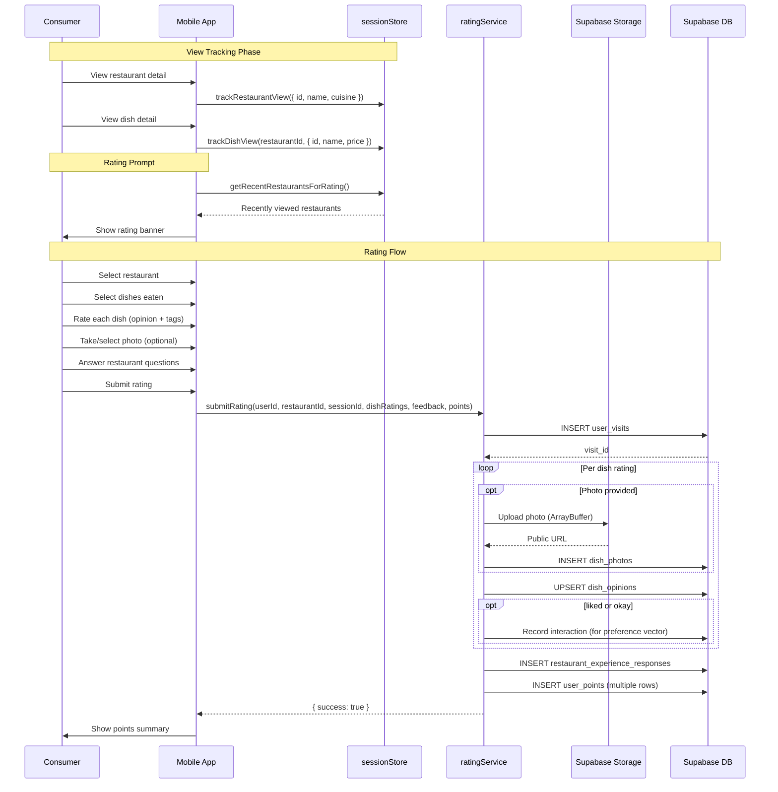

# Rating & Review Flow

## 1. Overview

The rating system allows consumers to rate dishes and provide restaurant experience feedback after visiting a restaurant. The flow is session-aware: the mobile app tracks which restaurants and dishes the user has viewed during their current session, then prompts them to rate. The multi-step rating process captures dish opinions (liked/okay/disliked + tags), optional photos, and restaurant experience questions. Points are awarded for each contribution to incentivize participation.

## 2. Actors

| Actor | Description |
|-------|-------------|
| **Consumer** | Rates dishes and provides restaurant feedback |
| **Mobile App** | React Native app with session tracking and rating UI |
| **Supabase Storage** | Stores uploaded dish and restaurant photos |
| **Supabase DB** | Persists visits, opinions, feedback, photos, and points |

## 3. Preconditions

- Consumer is authenticated.
- Consumer has viewed at least one restaurant during their current app session.
- The restaurant and its dishes exist in the database.
- Supabase Storage bucket `photos` is configured with `dish_photos/` and `restaurant_photos/` paths.

## 4. Flow Steps

### Session-Based View Tracking

1. The `sessionStore` (Zustand + AsyncStorage) tracks entities viewed during the current app session.
2. When the consumer views a restaurant detail page, `trackRestaurantView()` records `{ id, name, cuisine, imageUrl }`.
3. When the consumer views a dish, `trackDishView()` records `{ restaurantId, dish: { id, name, price, imageUrl } }`.
4. Sessions timeout after 1 hour of inactivity (`SESSION_TIMEOUT_MS = 3,600,000`).
5. `getRecentRestaurantsForRating()` compiles viewed restaurants for the rating prompt.

### Rating Prompt

6. After the consumer has browsed restaurants/dishes, a rating banner appears.
7. The banner shows recently viewed restaurants and invites the consumer to rate their experience.

### Multi-Step Rating Flow

8. **Step 1 -- Select Restaurant**: Consumer selects from recently viewed restaurants.
9. **Step 2 -- Select Dishes**: Consumer selects which dishes they ate at that restaurant.
10. **Step 3 -- Rate Each Dish**:
    - Opinion: `liked`, `okay`, or `disliked`.
    - Tags: descriptive tags (e.g., "generous portions", "great flavor", "too salty").
    - Optional photo: taken or selected from gallery.
11. **Step 4 -- Upload Photos** (if any):
    - Photo is read as `ArrayBuffer` and uploaded to Supabase Storage at `photos/dish_photos/{type}_{userId}_{timestamp}.{ext}`.
    - Public URL is obtained and stored in the `dish_photos` table.
12. **Step 5 -- Restaurant Experience Questions**:
    - `service_friendly`: Was the service friendly? (boolean)
    - `clean`: Was the restaurant clean? (boolean)
    - `wait_time_reasonable`: Was the wait time reasonable? (boolean)
    - `would_recommend`: Would you recommend this restaurant? (boolean)
    - `good_value`: Was it good value for money? (boolean)
13. **Step 6 -- Points Awarded**:
    - `dish_rating`: 10 points per dish rated.
    - `dish_tags`: 5 points per dish with tags added.
    - `dish_photo`: 15 points per dish photo uploaded.
    - `restaurant_question`: 5 points per restaurant feedback response.
    - `first_rating_bonus`: 20 points for first-ever rating at this restaurant.
    - Additional point types (tracked but awarded contextually): `weekly_streak_bonus`, `photo_views_milestone`.

### Submission Pipeline (`submitRating`)

14. `createUserVisit()` inserts a `user_visits` row linking user, restaurant, and session.
15. `saveDishOpinions()` iterates over each dish rating:
    - Uploads photo if present, creates `dish_photos` row.
    - Upserts `dish_opinions` row with opinion, tags, visit_id, and photo_id.
    - Records a `liked` interaction via `interactionService.recordInteraction()` for `liked`/`okay` opinions (feeds into preference vector computation).
    - `disliked` opinions are NOT recorded as interactions (disliking at one restaurant does not reflect category preference).
16. `saveRestaurantFeedback()` inserts `restaurant_experience_responses` rows with `question_type` and `response`.
17. `awardPoints()` inserts multiple `user_points` rows for each point-earning action.
18. On success, the rating flow completes and the consumer sees a summary of points earned.

## 5. Sequence Diagram

## 6. Key Files

| File | Purpose |
|------|---------|
| `apps/mobile/src/services/ratingService.ts` | Core rating logic: submit, save opinions, upload photos, award points |
| `apps/mobile/src/stores/sessionStore.ts` | Session-based view tracking (trackView, trackDishView, trackRestaurantView) |
| `apps/mobile/src/services/interactionService.ts` | Records interactions for preference vector pipeline |
| `apps/mobile/src/types/rating.ts` | `DishRatingInput`, `RestaurantFeedbackInput`, `PointsEarned` types |
| `apps/mobile/src/components/rating/` | Rating UI components (dish rating cards, restaurant questions, points summary) |
| `apps/mobile/src/services/dishPhotoService.ts` | Additional photo management utilities |

## 7. Error Handling

| Failure Mode | Handling |
|-------------|----------|
| Photo upload failure | Returns null; dish opinion is saved without photo reference |
| Visit creation failure | Returns `{ success: false, error }` -- aborts entire submission |
| Dish opinion save failure | Logged; other dish opinions continue processing |
| Restaurant feedback save failure | Non-fatal warning; does not block submission |
| Points award failure | Non-fatal warning; rating still saved successfully |
| Interaction recording failure | Non-fatal; does not block the rating flow |
| Storage bucket not found | Upload throws; caught and returns null |
| Duplicate opinion (same user+dish+visit) | Handled via upsert on `(user_id, dish_id, visit_id)` |

## 8. Notes

- **Data persistence tables**:
  - `user_visits`: Links a user to a restaurant visit with timestamps and session reference.
  - `dish_opinions`: Per-dish ratings with opinion (liked/okay/disliked), descriptive tags, and optional photo reference.
  - `dish_photos`: Uploaded photos with public URLs, linked to dish and user.
  - `restaurant_experience_responses`: Boolean survey answers per question type per visit.
  - `user_points`: Itemized point awards with action type, reference ID, and description.
- **Materialized view refresh**: Aggregated rating summaries (`dish_ratings_summary`, `restaurant_ratings_summary`) are materialized views refreshed periodically to provide fast read access for display.
- **Interaction recording selectivity**: Only `liked` and `okay` opinions record a positive interaction. `disliked` is intentionally excluded to avoid corrupting the preference vector -- a bad experience at one restaurant does not mean the user dislikes that dish category.
- **Session timeout**: The 1-hour inactivity timeout prevents stale view data from accumulating indefinitely. `clearOldSessions()` is called on app foreground to clean up.
- **First visit detection**: `isFirstVisitToRestaurant()` checks `user_visits` for prior records. The 20-point bonus incentivizes rating new restaurants.
- **Photo format**: Photos are uploaded as JPEG with content type `image/jpeg`. The filename includes type, userId, and timestamp for uniqueness.
- **Points system**: Designed to incentivize high-quality contributions (photos worth more than tags, first visits rewarded). Points can be used for future gamification features.

See also: [Database Schema](../06-database-schema.md) for `user_visits`, `dish_opinions`, `dish_photos`, `restaurant_experience_responses`, and `user_points` tables. See also: [Preference Learning](./preference-learning.md) for how interactions feed into the preference vector.
