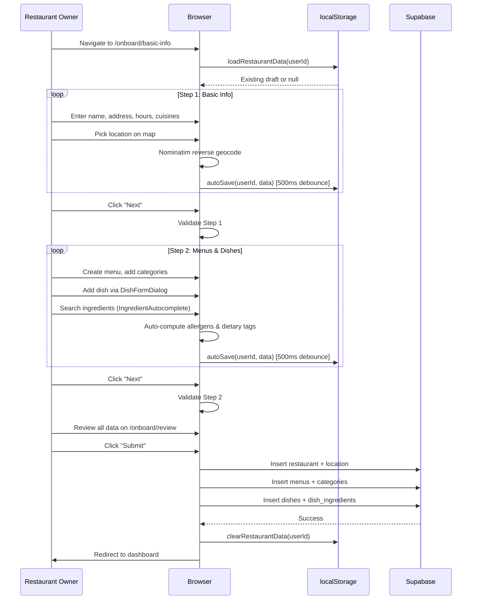

# Restaurant Onboarding

## 1. Overview

Restaurant onboarding is a three-step wizard in the web portal that guides a restaurant owner from initial registration through to a fully configured restaurant with menus and dishes in the database. Progress is auto-saved to localStorage with a 500ms debounce so the owner can leave and resume at any time.

## 2. Actors

| Actor | Description |
|-------|-------------|
| **Restaurant Owner** | Authenticated user completing onboarding |
| **Web Browser** | Next.js web portal running the onboarding wizard |
| **Next.js Server** | Serves pages and handles API routes |
| **Supabase** | Database and storage backend |

## 3. Preconditions

- The restaurant owner has signed up and verified their email (see [auth-flow.md](./auth-flow.md)).
- The owner is authenticated and has a valid session.
- The `canonical_ingredients` table is populated (for ingredient autocomplete in Step 2).

## 4. Flow Steps

### Step 1: Basic Info (`/onboard/basic-info`)

1. Owner enters restaurant name, address, and phone number.
2. Owner selects cuisine types from a predefined list.
3. Owner sets operating hours per day of the week.
4. Owner selects service types (dine-in, takeout, delivery).
5. Owner picks the restaurant location on an interactive map (Leaflet + OpenStreetMap).
   - Clicking the map performs Nominatim reverse geocoding to fill the address field.
   - Alternatively, searching an address forward-geocodes and moves the map marker.
6. All fields are auto-saved to `localStorage` via `autoSave()` with a 500ms debounce.
7. Owner clicks "Next" to proceed to Step 2.

### Step 2: Menus & Dishes (`/onboard/menu`)

1. Owner creates one or more menus (food or drink type, with optional availability schedule).
2. Within each menu, owner creates categories (e.g., "Appetizers", "Mains", "Desserts").
3. Within each category, owner adds dishes via `DishFormDialog`:
   - Name, description, price, dish kind (standard, template, experience).
   - Ingredient linking: `IngredientAutocomplete` searches canonical ingredients by name/alias.
   - Allergens and dietary tags are auto-computed from linked canonical ingredients.
   - Optional: calories, spice level, image upload.
4. All data is auto-saved to localStorage on every change.
5. Owner clicks "Next" to proceed to Step 3.

### Step 3: Review (`/onboard/review`)

1. Owner reviews all entered data: restaurant info, location, menus, and dishes.
2. Validation runs across all steps; errors are highlighted with links back to the relevant step.
3. Owner clicks "Submit" to persist everything to Supabase:
   - Restaurant record is created/updated.
   - Menus, categories, and dishes are inserted.
   - Dish-ingredient associations are created.
   - Location is stored as a PostGIS geography point.
4. On success, the localStorage draft is cleared.
5. Owner is redirected to their restaurant dashboard.

## 5. Sequence Diagram

## 6. Key Files

| File | Purpose |
|------|---------|
| `apps/web-portal/app/onboard/basic-info/page.tsx` | Step 1: restaurant info, location, hours |
| `apps/web-portal/app/onboard/menu/page.tsx` | Step 2: menus, categories, dishes |
| `apps/web-portal/app/onboard/review/page.tsx` | Step 3: review and submit |
| `apps/web-portal/lib/storage.ts` | localStorage draft persistence (`saveRestaurantData`, `loadRestaurantData`, `autoSave`, `clearIfStale`) |
| `apps/web-portal/components/LocationPicker.tsx` | Leaflet map with Nominatim geocoding |
| `apps/web-portal/components/DishFormDialog.tsx` | Dish creation/edit dialog with ingredient linking |
| `apps/web-portal/components/IngredientAutocomplete.tsx` | Searchable canonical ingredient picker |
| `apps/web-portal/lib/validation.ts` | Cross-step form validation |
| `apps/web-portal/types/restaurant.ts` | `FormProgress` type definition |

## 7. Error Handling

| Failure Mode | Handling |
|-------------|----------|
| localStorage full | `saveRestaurantData` catches the error and throws a user-facing message |
| Draft older than 7 days | `clearIfStale()` removes it on next login (called from `AuthContext`) |
| Validation failure at review | Errors displayed inline with links to the offending step |
| Supabase insert failure | Submission catches the error; draft is NOT cleared so the owner can retry |
| Geocoding API failure | Map still works; address must be entered manually |
| Missing required fields | Validated before navigation to next step; "Next" button disabled |

## 8. Notes

- **User-scoped storage**: Drafts are keyed by `eatme_draft_${userId}`, so multiple owners on the same browser do not overwrite each other.
- **Auto-save debounce**: 500ms delay prevents excessive writes during rapid typing.
- **Ingredient autocomplete**: Searches the `canonical_ingredients` table plus `ingredient_aliases` for multi-language support. Allergens and dietary tags are computed client-side from the canonical ingredient data, not entered manually.
- **Location picker**: Uses Leaflet with OpenStreetMap tiles (no Google Maps dependency). Nominatim handles geocoding.
- **Wizard vs DB mode**: `DishFormDialog` operates in "wizard mode" during onboarding (data stored in localStorage) and "DB mode" in the menu management page (data saved directly to Supabase).

See also: [Database Schema](../06-database-schema.md) for `restaurants`, `menus`, `categories`, `dishes`, and `dish_ingredients` tables.
