# Restaurant Portal Database Schema Diagram

## Entity Relationship Diagram (ERD)


## Data Flow Diagram


## Data Transformation Flow

```mermaid
flowchart LR
    subgraph Portal["Web Portal Data"]
        A1[basicInfo.name]
        A2[basicInfo.location<br/>{lat lng}]
        A3[basicInfo.cuisines<br/>Array]
        A4[operations.operating_hours<br/>{day: {open close closed}}]
    end

    subgraph Transform["Transformation Layer"]
        B1[Direct Copy]
        B2[formatLocationForSupabase]
        B3[Array Passthrough]
        B4[formatOperatingHours]
    end

    subgraph Supabase["Supabase Format"]
        C1[name: TEXT]
        C2[location: GEOGRAPHY<br/>POINT lng lat]
        C3[cuisine_types: TEXT]
        C4[open_hours: JSONB<br/>{day: {open close}}]
    end

    A1 --> B1 --> C1
    A2 --> B2 --> C2
    A3 --> B3 --> C3
    A4 --> B4 --> C4
```

## Table Structure with Indexes

```mermaid
graph TB
    subgraph "Restaurants Table"
        TABLE[restaurants]

        subgraph "Primary Key"
            PK[id UUID]
        end

        subgraph "Required Fields"
            R1[name TEXT]
            R2[location GEOGRAPHY]
            R3[address TEXT]
        end

        subgraph "Optional Fields"
            O1[restaurant_type]
            O2[country_code]
            O3[phone website]
            O4[cuisine_types]
            O5[open_hours]
            O6[service options]
        end

        subgraph "Metadata"
            M1[created_at]
            M2[updated_at]
        end
    end

    subgraph "Indexes"
        I1[🗺️ GIST location_idx]
        I2[🏷️ GIN cuisine_types_idx]
        I3[🌍 BTREE country_code_idx]
        I4[🏙️ BTREE city_idx]
        I5[🏪 BTREE restaurant_type_idx]
        I6[📊 BTREE rating_idx]
    end

    TABLE --> PK
    TABLE --> R1
    TABLE --> R2
    TABLE --> R3
    TABLE --> O1
    TABLE --> O2
    TABLE --> O3
    TABLE --> O4
    TABLE --> O5
    TABLE --> O6
    TABLE --> M1
    TABLE --> M2

    R2 -.->|Spatial Query| I1
    O4 -.->|Array Query| I2
    O2 -.->|Filter| I3
    R3 -.->|Filter| I4
    O1 -.->|Filter| I5
```



## Row Level Security (RLS) Policies


## Trigger Workflow


## Data Types Overview

```mermaid
mindmap
  root((Restaurants))
    Identification
      UUID id
      TEXT name
    Location
      GEOGRAPHY PostGIS
      TEXT address
      TEXT country_code
      TEXT city
    Classification
      TEXT restaurant_type
      TEXT[] cuisine_types
      SMALLINT price_level
    Contact
      TEXT phone
      TEXT website
    Operations
      JSONB open_hours
      BOOLEAN delivery
      BOOLEAN takeout
      BOOLEAN dine_in
      BOOLEAN reservations
      INTEGER prep_time
    Metrics
      NUMERIC rating
      TEXT image_url
      TEXT description
    Timestamps
      TIMESTAMPTZ created
      TIMESTAMPTZ updated
```

## Complete System Architecture


---

## Schema Statistics

- **Total Columns**: 21
- **Required Columns**: 3 (name, location, address)
- **Optional Columns**: 18
- **Indexes**: 7 (1 spatial, 1 GIN, 5 BTREE)
- **RLS Policies**: 3 (SELECT, INSERT, UPDATE)
- **Triggers**: 1 (auto-update timestamp)
- **Constraints**: 1 (price_level range check)

---

## Query Examples

### Spatial Query (Find Nearby Restaurants)

```sql
SELECT * FROM restaurants
WHERE ST_DWithin(
  location,
  ST_GeogFromText('POINT(-74.0060 40.7128)'),
  5000  -- 5km radius
);
```

### Filter by Cuisine

```sql
SELECT * FROM restaurants
WHERE 'Italian' = ANY(cuisine_types);
```

### Filter by Service Options

```sql
SELECT * FROM restaurants
WHERE delivery_available = true
  AND dine_in_available = true;
```

### Get Operating Hours for Monday

```sql
SELECT name, open_hours->'monday' as monday_hours
FROM restaurants
WHERE open_hours ? 'monday';
```
