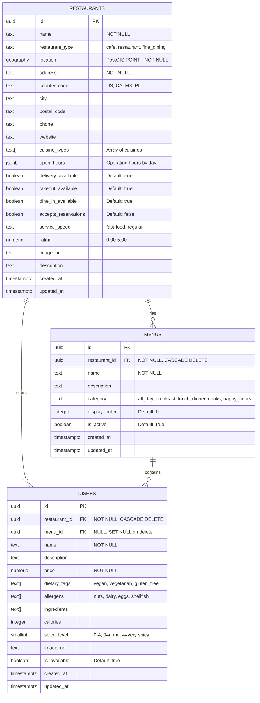
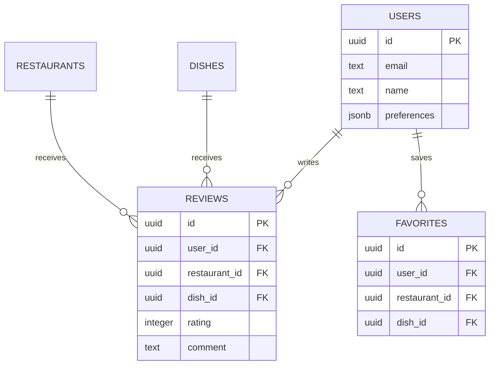

# Restaurant Database Schema - Complete ERD

Entity Relationship Diagram showing the complete database schema with restaurants, menus, and dishes.

## Complete Schema with Relationships

---

## Relationship Details

### **RESTAURANTS → MENUS** (One-to-Many)

- One restaurant can have multiple menus (e.g., "Breakfast Menu", "Dinner Menu", "Drinks")
- **Cascade Delete**: Deleting a restaurant deletes all its menus
- Foreign Key: `menus.restaurant_id → restaurants.id`

### **RESTAURANTS → DISHES** (One-to-Many)

- One restaurant can offer multiple dishes
- **Cascade Delete**: Deleting a restaurant deletes all its dishes
- Foreign Key: `dishes.restaurant_id → restaurants.id`

### **MENUS → DISHES** (One-to-Many)

- One menu can contain multiple dishes
- **Set NULL on Delete**: Deleting a menu sets `dishes.menu_id` to NULL (dish remains, just unlinked)
- Foreign Key: `dishes.menu_id → menus.id`

---

## Implementation Status

### ✅ **Fully Implemented**

- ✅ All 3 tables created with complete schema
- ✅ Foreign key relationships with proper constraints
- ✅ PostGIS extension for geospatial queries
- ✅ Row Level Security (RLS) on all tables
- ✅ 16 indexes for optimal query performance
- ✅ Auto-update timestamps on all tables
- ✅ Cascade deletes configured
- ✅ Array fields for flexible data (cuisines, tags, allergens)

### 🎯 **Key Features**

**Indexes Created:**

- 7 indexes on `restaurants` (spatial, cuisine types, country, city, type, delivery, rating)
- 3 indexes on `menus` (restaurant_id, category, display_order)
- 6 indexes on `dishes` (restaurant_id, menu_id, dietary_tags, allergens, spice_level, price, availability)

**Data Types:**

- `GEOGRAPHY(POINT, 4326)` - PostGIS spatial type for location queries
- `TEXT[]` - PostgreSQL arrays for flexible multi-value fields
- `JSONB` - Structured JSON data for operating hours
- `NUMERIC(10,2)` - Precise decimal for prices
- `TIMESTAMPTZ` - Timezone-aware timestamps

---

## Future Extensions (Phase 3+)

**Planned Features:**

- ⏳ User authentication and profiles
- ⏳ Restaurant and dish reviews/ratings
- ⏳ User favorites system
- ⏳ Search history and recommendations
