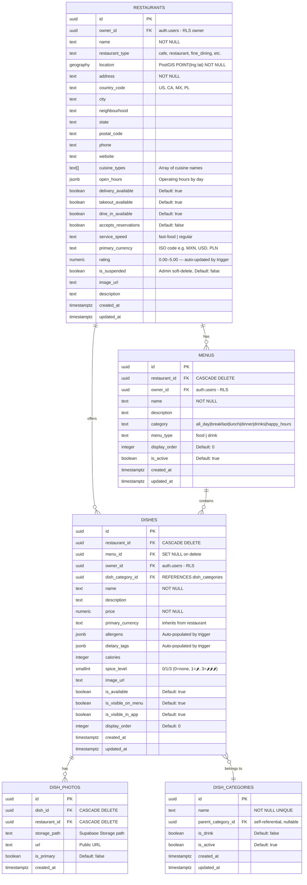
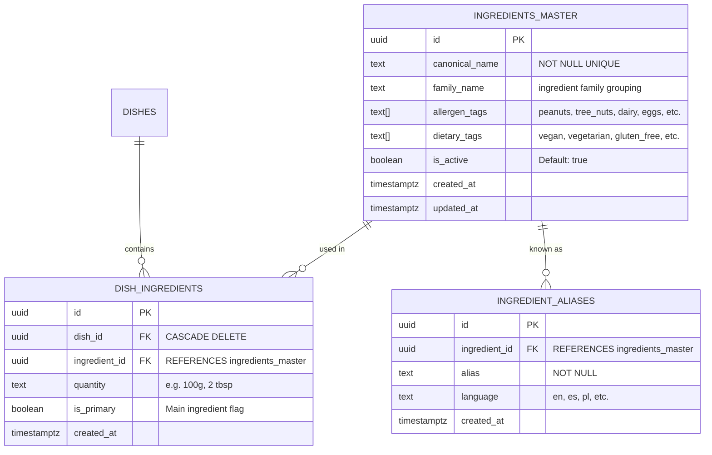
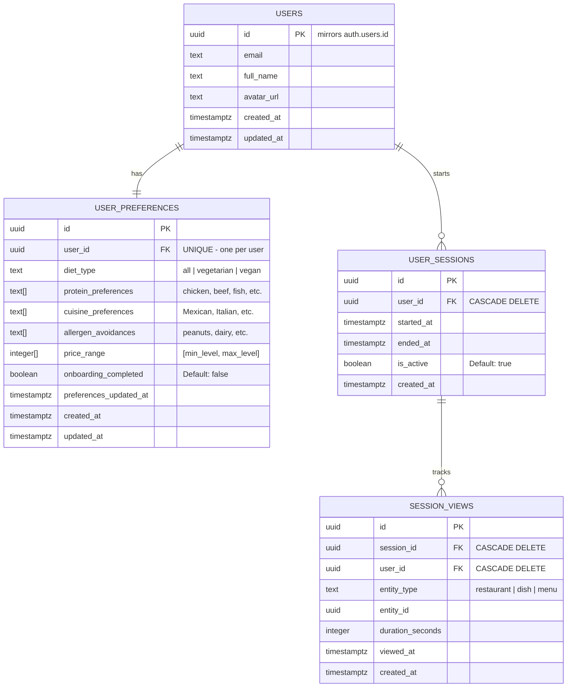
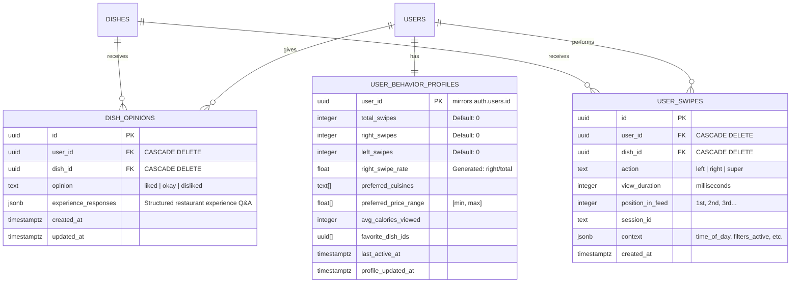
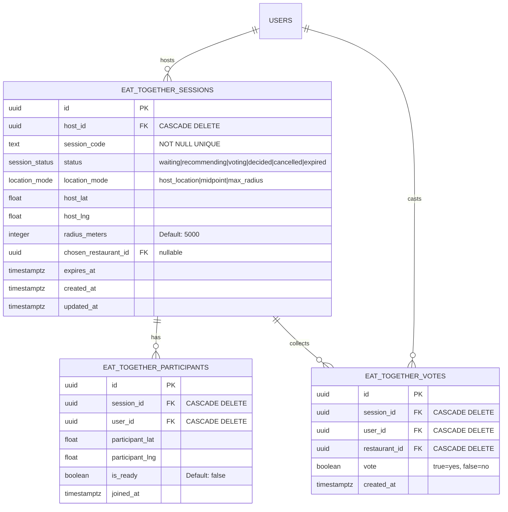
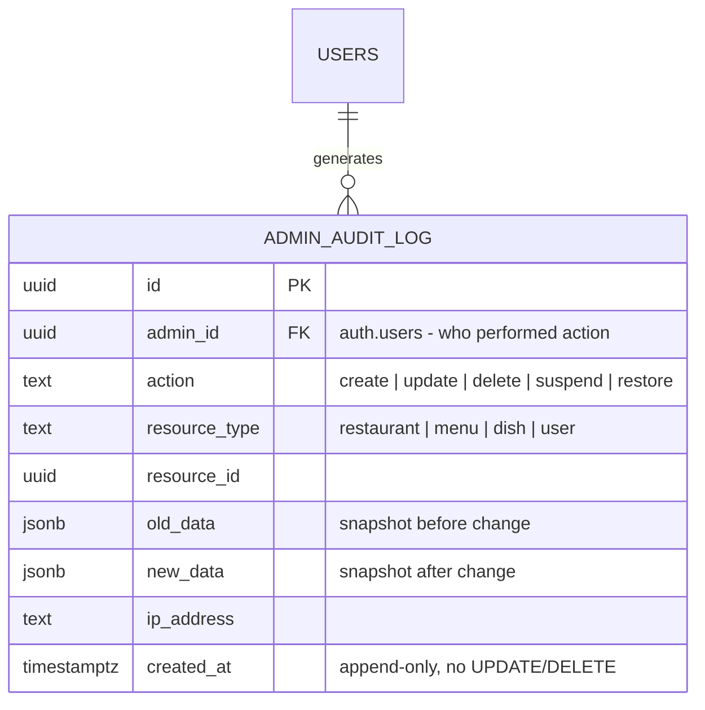
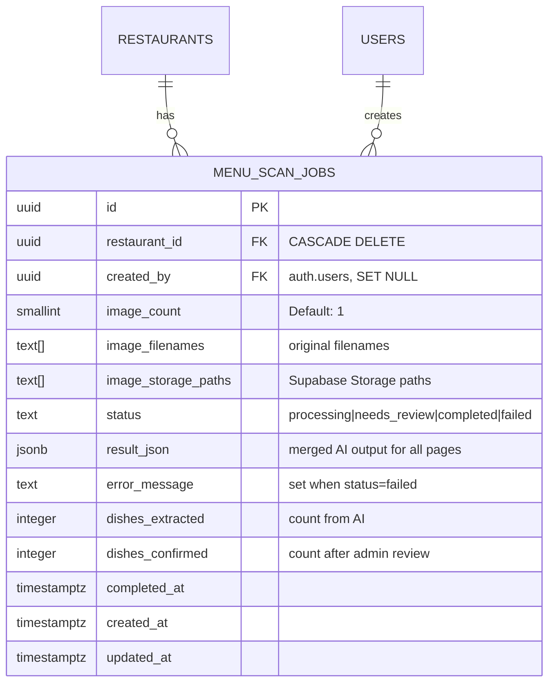
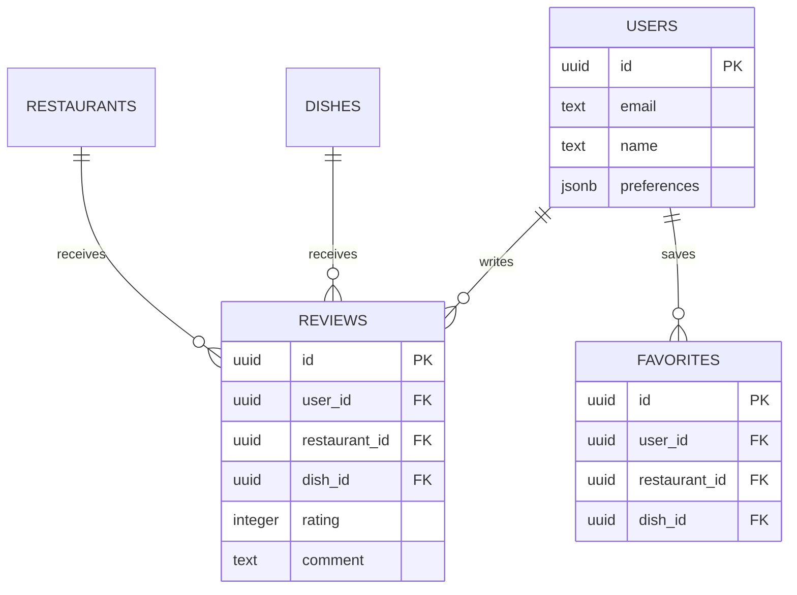

# EatMe — Database Schema (ERD)

_Last updated: March 3, 2026 — reflects migrations 001–040_

> **PostGIS reminder:** All `location` columns use `POINT(lng lat)` — **longitude first**.  
> Helper: `formatLocationForSupabase(lat, lng)` in `apps/web-portal/lib/supabase.ts`.

---

## Core Restaurant & Menu Tables

```mermaid
erDiagram
    RESTAURANTS ||--o{ MENUS : "has"
    RESTAURANTS ||--o{ DISHES : "offers"
    MENUS ||--o{ DISHES : "contains"
    DISHES ||--o{ DISH_PHOTOS : "has"
    DISHES }o--|| DISH_CATEGORIES : "belongs to"

    RESTAURANTS {
        uuid id PK
        uuid owner_id FK "auth.users - RLS owner"
        text name "NOT NULL"
        text restaurant_type "cafe, restaurant, fine_dining, etc."
        geography location "PostGIS POINT(lng lat) NOT NULL"
        text address "NOT NULL"
        text country_code "US, CA, MX, PL"
        text city
        text neighbourhood
        text state
        text postal_code
        text phone
        text website
        text[] cuisine_types "Array of cuisine names"
        jsonb open_hours "Operating hours by day"
        boolean delivery_available "Default: true"
        boolean takeout_available "Default: true"
        boolean dine_in_available "Default: true"
        boolean accepts_reservations "Default: false"
        text service_speed "fast-food | regular"
        text primary_currency "ISO code e.g. MXN, USD, PLN"
        numeric rating "0.00–5.00 — auto-updated by trigger"
        boolean is_suspended "Admin soft-delete, Default: false"
        text image_url
        text description
        timestamptz created_at
        timestamptz updated_at
    }

    MENUS {
        uuid id PK
        uuid restaurant_id FK "CASCADE DELETE"
        uuid owner_id FK "auth.users - RLS"
        text name "NOT NULL"
        text description
        text category "all_day|breakfast|lunch|dinner|drinks|happy_hours"
        text menu_type "food | drink"
        integer display_order "Default: 0"
        boolean is_active "Default: true"
        timestamptz created_at
        timestamptz updated_at
    }

    DISHES {
        uuid id PK
        uuid restaurant_id FK "CASCADE DELETE"
        uuid menu_id FK "SET NULL on delete"
        uuid owner_id FK "auth.users - RLS"
        uuid dish_category_id FK "REFERENCES dish_categories"
        text name "NOT NULL"
        text description
        numeric price "NOT NULL"
        text primary_currency "inherits from restaurant"
        jsonb allergens "Auto-populated by trigger"
        jsonb dietary_tags "Auto-populated by trigger"
        integer calories
        smallint spice_level "0/1/3 (0=none, 1=🌶️, 3=🌶️🌶️🌶️)"
        text image_url
        boolean is_available "Default: true"
        boolean is_visible_on_menu "Default: true"
        boolean is_visible_in_app "Default: true"
        integer display_order "Default: 0"
        timestamptz created_at
        timestamptz updated_at
    }

    DISH_PHOTOS {
        uuid id PK
        uuid dish_id FK "CASCADE DELETE"
        uuid restaurant_id FK "CASCADE DELETE"
        text storage_path "Supabase Storage path"
        text url "Public URL"
        boolean is_primary "Default: false"
        timestamptz created_at
    }

    DISH_CATEGORIES {
        uuid id PK
        text name "NOT NULL UNIQUE"
        uuid parent_category_id FK "self-referential, nullable"
        boolean is_drink "Default: false"
        boolean is_active "Default: true"
        timestamptz created_at
        timestamptz updated_at
    }
```

---

## Ingredient System

```mermaid
erDiagram
    DISHES ||--o{ DISH_INGREDIENTS : "contains"
    INGREDIENTS_MASTER ||--o{ DISH_INGREDIENTS : "used in"
    INGREDIENTS_MASTER ||--o{ INGREDIENT_ALIASES : "known as"

    INGREDIENTS_MASTER {
        uuid id PK
        text canonical_name "NOT NULL UNIQUE"
        text family_name "ingredient family grouping"
        text[] allergen_tags "peanuts, tree_nuts, dairy, eggs, etc."
        text[] dietary_tags "vegan, vegetarian, gluten_free, etc."
        boolean is_active "Default: true"
        timestamptz created_at
        timestamptz updated_at
    }

    INGREDIENT_ALIASES {
        uuid id PK
        uuid ingredient_id FK "REFERENCES ingredients_master"
        text alias "NOT NULL"
        text language "en, es, pl, etc."
        timestamptz created_at
    }

    DISH_INGREDIENTS {
        uuid id PK
        uuid dish_id FK "CASCADE DELETE"
        uuid ingredient_id FK "REFERENCES ingredients_master"
        text quantity "e.g. 100g, 2 tbsp"
        boolean is_primary "Main ingredient flag"
        timestamptz created_at
    }
```

> **Allergen/dietary trigger**: On `dish_ingredients` INSERT/UPDATE/DELETE a Postgres trigger recalculates `dishes.allergens` and `dishes.dietary_tags` from linked ingredient data.

---

## User & Preferences

```mermaid
erDiagram
    USERS ||--|| USER_PREFERENCES : "has"
    USERS ||--o{ USER_SESSIONS : "starts"
    USER_SESSIONS ||--o{ SESSION_VIEWS : "tracks"

    USERS {
        uuid id PK "mirrors auth.users.id"
        text email
        text full_name
        text avatar_url
        timestamptz created_at
        timestamptz updated_at
    }

    USER_PREFERENCES {
        uuid id PK
        uuid user_id FK "UNIQUE - one per user"
        text diet_type "all | vegetarian | vegan"
        text[] protein_preferences "chicken, beef, fish, etc."
        text[] cuisine_preferences "Mexican, Italian, etc."
        text[] allergen_avoidances "peanuts, dairy, etc."
        integer[] price_range "[min_level, max_level]"
        boolean onboarding_completed "Default: false"
        timestamptz preferences_updated_at
        timestamptz created_at
        timestamptz updated_at
    }

    USER_SESSIONS {
        uuid id PK
        uuid user_id FK "CASCADE DELETE"
        timestamptz started_at
        timestamptz ended_at
        boolean is_active "Default: true"
        timestamptz created_at
    }

    SESSION_VIEWS {
        uuid id PK
        uuid session_id FK "CASCADE DELETE"
        uuid user_id FK "CASCADE DELETE"
        text entity_type "restaurant | dish | menu"
        uuid entity_id
        integer duration_seconds
        timestamptz viewed_at
        timestamptz created_at
    }
```

---

## Rating & Opinion System

```mermaid
erDiagram
    USERS ||--o{ DISH_OPINIONS : "gives"
    DISHES ||--o{ DISH_OPINIONS : "receives"
    USERS ||--o{ USER_SWIPES : "performs"
    DISHES ||--o{ USER_SWIPES : "receives"
    USERS ||--|| USER_BEHAVIOR_PROFILES : "has"

    DISH_OPINIONS {
        uuid id PK
        uuid user_id FK "CASCADE DELETE"
        uuid dish_id FK "CASCADE DELETE"
        text opinion "liked | okay | disliked"
        jsonb experience_responses "Structured restaurant experience Q&A"
        timestamptz created_at
        timestamptz updated_at
    }

    USER_SWIPES {
        uuid id PK
        uuid user_id FK "CASCADE DELETE"
        uuid dish_id FK "CASCADE DELETE"
        text action "left | right | super"
        integer view_duration "milliseconds"
        integer position_in_feed "1st, 2nd, 3rd..."
        text session_id
        jsonb context "time_of_day, filters_active, etc."
        timestamptz created_at
    }

    USER_BEHAVIOR_PROFILES {
        uuid user_id PK "mirrors auth.users.id"
        integer total_swipes "Default: 0"
        integer right_swipes "Default: 0"
        integer left_swipes "Default: 0"
        float right_swipe_rate "Generated: right/total"
        text[] preferred_cuisines
        float[] preferred_price_range "[min, max]"
        integer avg_calories_viewed
        uuid[] favorite_dish_ids
        timestamptz last_active_at
        timestamptz profile_updated_at
    }
```

> **Rating trigger**: On `dish_opinions` INSERT/UPDATE/DELETE a trigger recalculates `restaurants.rating` (0.0–5.0). Formula: `AVG(liked=1.0, okay=0.5, disliked=0.0) × 5`. A restaurant with no opinions keeps `rating = 0.00`.

---

## Eat Together (Group Dining)

```mermaid
erDiagram
    USERS ||--o{ EAT_TOGETHER_SESSIONS : "hosts"
    EAT_TOGETHER_SESSIONS ||--o{ EAT_TOGETHER_PARTICIPANTS : "has"
    EAT_TOGETHER_SESSIONS ||--o{ EAT_TOGETHER_VOTES : "collects"
    USERS ||--o{ EAT_TOGETHER_VOTES : "casts"

    EAT_TOGETHER_SESSIONS {
        uuid id PK
        uuid host_id FK "CASCADE DELETE"
        text session_code "NOT NULL UNIQUE"
        session_status status "waiting|recommending|voting|decided|cancelled|expired"
        location_mode location_mode "host_location|midpoint|max_radius"
        float host_lat
        float host_lng
        integer radius_meters "Default: 5000"
        uuid chosen_restaurant_id FK "nullable"
        timestamptz expires_at
        timestamptz created_at
        timestamptz updated_at
    }

    EAT_TOGETHER_PARTICIPANTS {
        uuid id PK
        uuid session_id FK "CASCADE DELETE"
        uuid user_id FK "CASCADE DELETE"
        float participant_lat
        float participant_lng
        boolean is_ready "Default: false"
        timestamptz joined_at
    }

    EAT_TOGETHER_VOTES {
        uuid id PK
        uuid session_id FK "CASCADE DELETE"
        uuid user_id FK "CASCADE DELETE"
        uuid restaurant_id FK "CASCADE DELETE"
        boolean vote "true=yes, false=no"
        timestamptz created_at
    }
```

---

## Admin & Audit

```mermaid
erDiagram
    USERS ||--o{ ADMIN_AUDIT_LOG : "generates"

    ADMIN_AUDIT_LOG {
        uuid id PK
        uuid admin_id FK "auth.users - who performed action"
        text action "create | update | delete | suspend | restore"
        text resource_type "restaurant | menu | dish | user"
        uuid resource_id
        jsonb old_data "snapshot before change"
        jsonb new_data "snapshot after change"
        text ip_address
        timestamptz created_at "append-only, no UPDATE/DELETE"
    }
```

> **Admin role**: Stored in `auth.users.raw_user_meta_data->>'role' = 'admin'`. Cannot be self-assigned. Checked by `is_admin()` helper function used in all admin RLS policies.

---

## AI Menu Scanning

```mermaid
erDiagram
    RESTAURANTS ||--o{ MENU_SCAN_JOBS : "has"
    USERS ||--o{ MENU_SCAN_JOBS : "creates"

    MENU_SCAN_JOBS {
        uuid id PK
        uuid restaurant_id FK "CASCADE DELETE"
        uuid created_by FK "auth.users, SET NULL"
        smallint image_count "Default: 1"
        text[] image_filenames "original filenames"
        text[] image_storage_paths "Supabase Storage paths"
        text status "processing|needs_review|completed|failed"
        jsonb result_json "merged AI output for all pages"
        text error_message "set when status=failed"
        integer dishes_extracted "count from AI"
        integer dishes_confirmed "count after admin review"
        timestamptz completed_at
        timestamptz created_at
        timestamptz updated_at
    }
```

> Images stored in Supabase Storage bucket `menu-scans`. AI uses GPT-4o Vision. See [menu-scan-ai-design.md](./menu-scan-ai-design.md) for full design.

---

## Relationship Summary

| Relationship                                | Type          | Cascade                            |
| ------------------------------------------- | ------------- | ---------------------------------- |
| `restaurants` → `menus`                     | 1:many        | DELETE restaurant → delete menus   |
| `restaurants` → `dishes`                    | 1:many        | DELETE restaurant → delete dishes  |
| `menus` → `dishes`                          | 1:many        | DELETE menu → SET NULL on dishes   |
| `dishes` → `dish_photos`                    | 1:many        | DELETE dish → delete photos        |
| `dishes` → `dish_ingredients`               | 1:many        | DELETE dish → delete links         |
| `ingredients_master` → `ingredient_aliases` | 1:many        | DELETE ingredient → delete aliases |
| `users` → `user_preferences`                | 1:1           | DELETE user → delete prefs         |
| `users` → `dish_opinions`                   | 1:many        | DELETE user → delete opinions      |
| `users` → `eat_together_sessions`           | 1:many (host) | DELETE user → delete sessions      |

---

## Materialized Views

| View                         | Purpose                                          |
| ---------------------------- | ------------------------------------------------ |
| `restaurant_ratings_summary` | Aggregated food/experience scores per restaurant |
| `dish_ratings_summary`       | Aggregated opinion counts per dish               |

---

## Relationship Details

### **RESTAURANTS → MENUS** (One-to-Many)

- One restaurant can have multiple menus (e.g., "Breakfast Menu", "Dinner Menu", "Drinks")
- **Cascade Delete**: Deleting a restaurant deletes all its menus
- Foreign Key: `menus.restaurant_id → restaurants.id`

### **RESTAURANTS → DISHES** (One-to-Many)

- One restaurant can offer multiple dishes
- **Cascade Delete**: Deleting a restaurant deletes all its dishes
- Foreign Key: `dishes.restaurant_id → restaurants.id`

### **MENUS → DISHES** (One-to-Many)

- One menu can contain multiple dishes
- **Set NULL on Delete**: Deleting a menu sets `dishes.menu_id` to NULL (dish remains, just unlinked)
- Foreign Key: `dishes.menu_id → menus.id`

---

## Implementation Status

### ✅ **Fully Implemented**

- ✅ All 3 tables created with complete schema
- ✅ Foreign key relationships with proper constraints
- ✅ PostGIS extension for geospatial queries
- ✅ Row Level Security (RLS) on all tables
- ✅ 16 indexes for optimal query performance
- ✅ Auto-update timestamps on all tables
- ✅ Cascade deletes configured
- ✅ Array fields for flexible data (cuisines, tags, allergens)

### 🎯 **Key Features**

**Indexes Created:**

- 7 indexes on `restaurants` (spatial, cuisine types, country, city, type, delivery, rating)
- 3 indexes on `menus` (restaurant_id, category, display_order)
- 6 indexes on `dishes` (restaurant_id, menu_id, dietary_tags, allergens, spice_level, price, availability)

**Data Types:**

- `GEOGRAPHY(POINT, 4326)` - PostGIS spatial type for location queries
- `TEXT[]` - PostgreSQL arrays for flexible multi-value fields
- `JSONB` - Structured JSON data for operating hours
- `NUMERIC(10,2)` - Precise decimal for prices
- `TIMESTAMPTZ` - Timezone-aware timestamps

---

## Future Extensions (Phase 3+)

```mermaid
erDiagram
    RESTAURANTS ||--o{ REVIEWS : "receives"
    DISHES ||--o{ REVIEWS : "receives"
    USERS ||--o{ REVIEWS : "writes"
    USERS ||--o{ FAVORITES : "saves"

    USERS {
        uuid id PK
        text email
        text name
        jsonb preferences
    }

    REVIEWS {
        uuid id PK
        uuid user_id FK
        uuid restaurant_id FK
        uuid dish_id FK
        integer rating
        text comment
    }

    FAVORITES {
        uuid id PK
        uuid user_id FK
        uuid restaurant_id FK
        uuid dish_id FK
    }
```

**Planned Features:**

- ⏳ User authentication and profiles
- ⏳ Restaurant and dish reviews/ratings
- ⏳ User favorites system
- ⏳ Search history and recommendations
